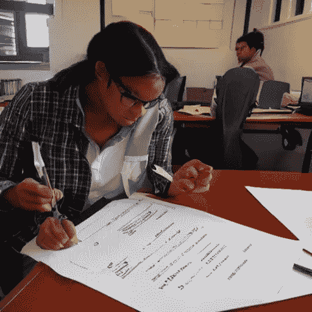
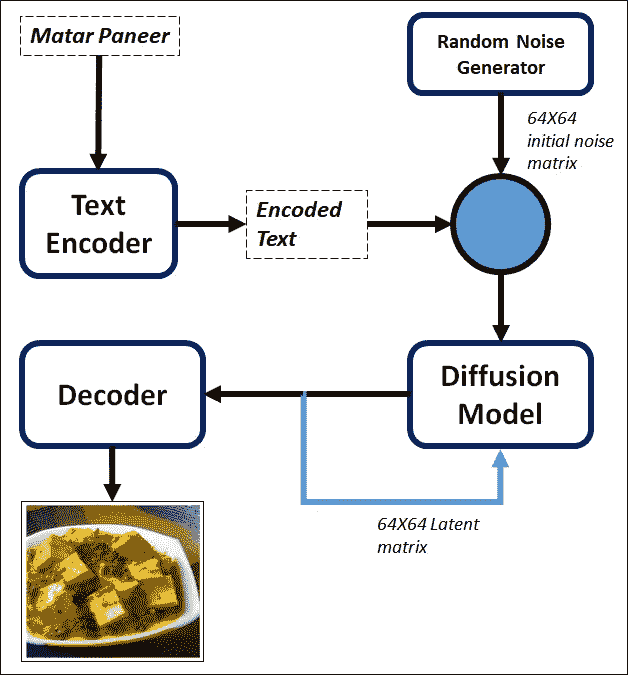
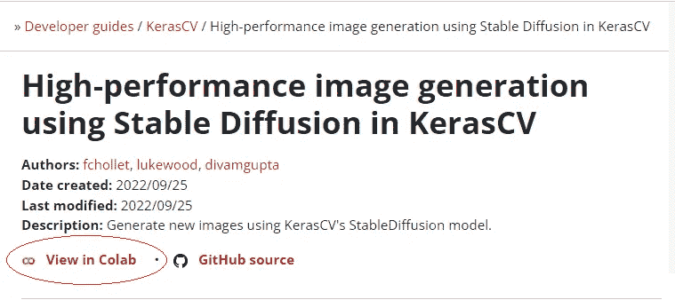
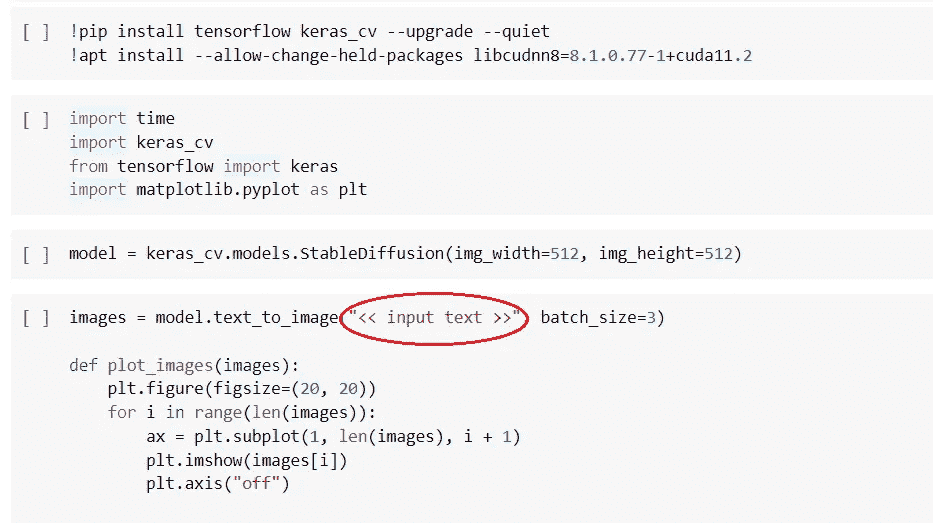
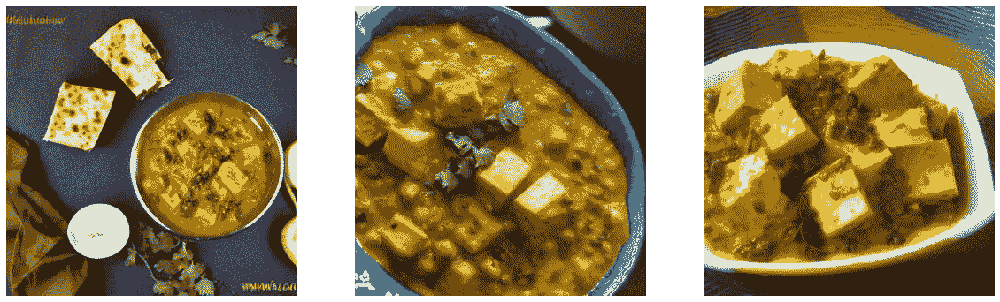
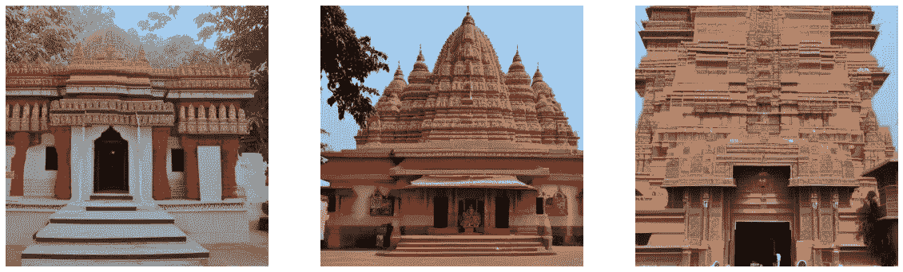
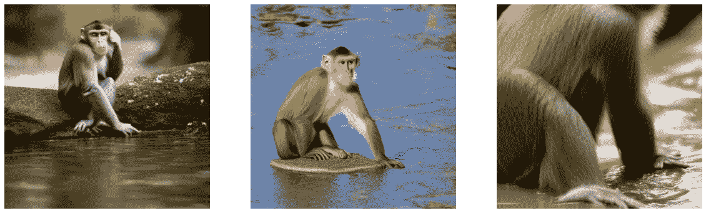
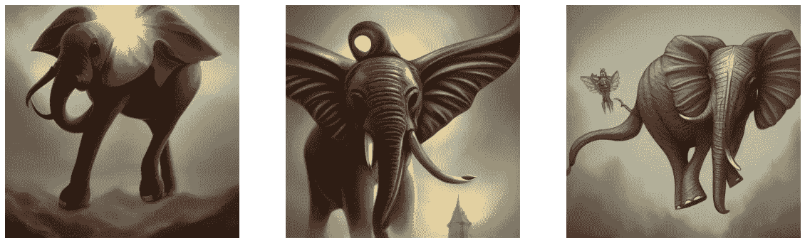

# 稳定扩散:从描述到可视化

> 原文：<https://medium.com/mlearning-ai/stable-diffusion-from-description-to-visualization-381113890b7?source=collection_archive---------2----------------------->

Image of Ph.D. student generated from Stable Diffusion.

Namaste，欢迎来到另一个简短但内容丰富的帖子。这里，我们将简单介绍一下稳定扩散。我们不会深入数学和详细的建筑。即使你对深度学习一无所知，也会很有用，很享受。你最终会有稳定扩散的实际例子。我们开始吧。

# 简介:

稳定扩散是基于“超分辨率”的概念。在超分辨率的帮助下，我们训练了一个深度学习模型，该模型可以对输入图像(有噪声的图像)进行去噪，并在输出端生成高分辨率的图像。深度学习模型使用其训练数据的分布来模拟最有可能作为输入提供的视觉细节。

如果我们简单地在噪音上运行这样一个模型会发生什么？该模型将开始“消除噪音”，并开始产生全新的视觉幻觉。通过反复做该技术，可以将一小块区域的噪声制作成分辨率越来越高的人造图像。[1]这是潜在扩散的核心思想。

# **稳定扩散:**

我们将从潜在扩散转移到文本到图像的系统(稳定扩散)。在稳定扩散中，我们在输入处有自然语言文本而不是嘈杂的图像。仍然缺少一个基本要素:使用输入文本管理生成的视觉输出的能力。因此，我们将噪声块连接到表示输入文本的向量，然后在图像字幕数据集上训练模型。

图 1 显示了稳定扩散模型的概况。

a)文本编码器:它获取用户输入的文本，并将其转换为矢量形式。这里，我们将“matar paneer”作为输入进行传递。

b)随机噪声生成器:RNG 帮助生成大小为 N*N 的噪声。我们将该噪声与输入文本的矢量表示混合。

Fig. 01: Flow of Text-to-Image generation

c)扩散模型:它在循环(循环计数设置为 50)中执行 N*N 图像矩阵的去噪，如图 1 所示。

d)解码器:它将 N*N 的最终潜像块转换成尺寸为 M*M 的高分辨率输出图像，其中 M > N

这里，N = 64，M = 512。

# **执行详情:**

你不需要训练一个稳定的扩散模型。有这么多预先训练好的模型可以直接使用。出于示范的目的，我们将看到其中的一个。我们使用 Keras 视觉库来执行稳定扩散演示。

步骤 01:进入[https://keras . io/guides/keras _ cv/generate _ images _ with _ stable _ diffusion/](https://keras.io/guides/keras_cv/generate_images_with_stable_diffusion/)

步骤 2:点击“在 colab 中查看”链接。

步骤 03:点击 colab 链接后，您将进入 Google 联合实验室平台。接下来，你只需要逐一执行下面的四个单元格。

注意:不要忘记用实际的文本输入替换<< input text >>比如:“一个人坐在鱼上”。试试看，看看神奇之处。

我已经用一些有趣的文本输入执行了上面的代码。我在这里分享同样的。

1.  输入文本:“matar paneer”

2.输入文本:“Shri Ram Mandir”

3.输入文本:“河里的猴子”

4.一个更复杂的问题:在第五个代码单元格中试试这个。

输入文字:“可爱神奇的飞象，幻想艺术，”金色，高品质，高度详细，优雅，尖锐的焦点，“概念艺术，锐利的边缘，数字绘画，神秘，恐怖”

如果你已经到达这里，那么感谢你阅读这篇短文。如果你想使用基于图形用户界面的工具，请访问:[https://huggingface.co/spaces/stabilityai/stable-diffusion](https://huggingface.co/spaces/stabilityai/stable-diffusion)链接，尝试一些有趣和复杂的输入文本。再次感谢…

[1][https://keras . io/guides/keras _ cv/generate _ images _ with _ stable _ diffusion](https://keras.io/guides/keras_cv/generate_images_with_stable_diffusion/)

 [## Mlearning.ai 提交建议

### 如何成为 Mlearning.ai 上的作家

medium.com](/mlearning-ai/mlearning-ai-submission-suggestions-b51e2b130bfb)