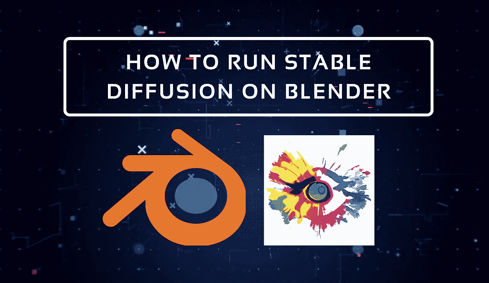

# 人工智能渲染——搅拌机的稳定扩散插件

> 原文：<https://medium.com/mlearning-ai/stable-diffusion-in-blender-heres-how-9ba665f81e71?source=collection_archive---------1----------------------->

Image by [Jim Clyde Monge](https://medium.com/u/819323b399ac?source=post_page-----9ba665f81e71--------------------------------)

自从两个月前公开发布以来，稳定扩散已经被集成到许多程序中，如 [Photoshop](/codex/stable-diffusion-arrives-in-photoshop-heres-how-to-install-3db277491023) 、 [Figma](https://www.figma.com/community/plugin/1156545761250320022/Stable-Pixel-AI) 和 [Canva](/mlearning-ai/stable-diffusion-arrives-in-canva-da109f6c9c02) 。

如果你是第一次听说稳定扩散，这是一个开源的 AI 模型，它可以从一个简单的文本提示中生成图像。

几天前，开发者 Ben Rugg 在 Reddit 上分享了一个新的 AI 渲染插件…