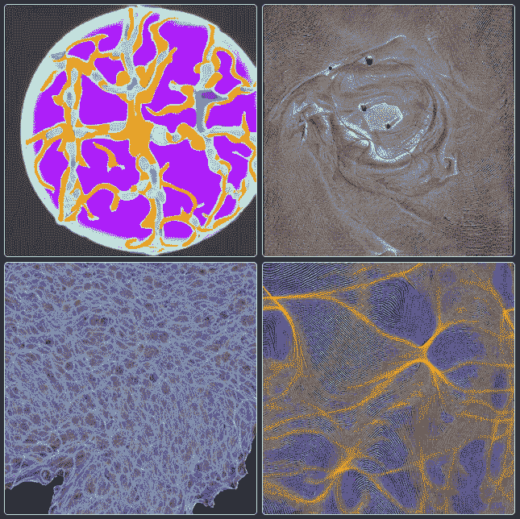
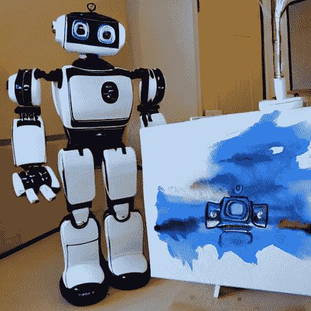

# 稳定扩散——新的热门人工智能模型

> 原文：<https://medium.com/mlearning-ai/stable-diffusion-the-new-hot-ai-model-aa3e38bb3596?source=collection_archive---------2----------------------->

## 这个图像生成模型与 DALL-E 2 紧密相连

“Self portraits” by Stable Diffusion (Images generated by the model using the prompt “An image of Stable Diffusion” — commercial use is explicitly allowed under the [The CreativeML OpenRAIL M license](https://github.com/CompVis/stable-diffusion/blob/main/LICENSE))

# 这是怎么回事？

你有时有吗？当你发现镇上最热门的模特来自你的母校时，那种完全荒谬、不理智、自我陶醉的感觉——好像你与此有关😂(是的，我们在这里谈论人工智能模型，你认为呢？🤔)

听着，接下来的 3 分钟我会在这里极客，但最后还是有一线希望的，我保证(是的，你是对的——我不能阻止你直接跳到最后)🤓

# 文本到图像模块的新成员

所以，这一切都是为了𝗦𝘁𝗮𝗯𝗹𝗲 𝗗𝗶𝗳𝗳𝘂𝘀𝗶𝗼𝗻！你说，听起来不性感？让你想起了 A 级数学？我明白你的意思，但这和数学无关(其实和数学有很大关系)。这是 Stability AI 的开源竞争对手 DALL-E 2，自 2022 年 8 月 10 日推出以来，在过去两周内席卷了世界。这是一个文本到图像的模型，也就是说，它会根据用户提供的提示生成图像。不，它不只是把它们从互联网上拉出来——每张图片都是由人工智能创造的原创艺术品🤯

Image by author — created with Stable Diffusion model (prompt: “A robot who paints on canvas with water colours”)

# 有趣的事实

该模型的创建是由路德维希-马克西米利安-慕尼黑大学(我的母校)的机器视觉和学习研究小组共同领导的🚀)以及来自 Eleuther AI & LAION 社区的支持。而且，我的天啊，这个人工智能模型创造的图像是不是太惊艳了！在我们开始之前，还有一些极客的事实:

👉𝗦𝘁𝗮𝗯𝗹𝗲 𝗗𝗶𝗳𝗳𝘂𝘀𝗶𝗼𝗻在消费级 GPU 上运行不到 10 GB 的 VRAM，在几秒钟内生成 512x512 像素的图像😲
👉让苹果的 M1 芯片兼容 MacBooks 的工作正在进行中🤯(尽管在这些设备上生成图像可能需要几分钟)
👉它在运行于亚马逊网络服务(AWS)
的 4000 个 Nvidia A100 GPUs 集群上接受了训练👉它已经在超过 10，000 名测试人员中进行了大规模测试， 每天创建 170 万张图像
👉它是在 CreativeML OpenRAIL M 许可证下许可的，改编自 BigScience 和 RAIL Initiative 在负责任的 AI 许可领域联合开展的工作

Image by author — created with Stable Diffusion model (prompt: “A robot working out in the gym”)

# 演示

你(几乎)坚持到了最后，祝贺你！🎉现在是时候放下这篇博文，开始制作你自己的图片了。前往拥抱脸的网站，体验𝗦𝘁𝗮𝗯𝗹𝗲 𝗗𝗶𝗳𝗳𝘂𝘀𝗶𝗼𝗻的演示。尽情享受吧！🎨🖼🖌

# 链接

🔗[发布公告](https://stability.ai/blog/stable-diffusion-announcement)
🔗[型号卡](https://huggingface.co/CompVis/stable-diffusion)
🔗[GitHub](https://github.com/CompVis/stable-diffusion)🔗 [Arxiv 论文](https://arxiv.org/abs/2112.10752)🔗研究小组的[项目页面](https://ommer-lab.com/research/latent-diffusion-models/)(他们确实提供全额资助的博士和博士后职位——是的，我很感兴趣😏)
🔗我知道你没有要求过，但不管怎样，给你，我的(稍微有点过时) [LMU 页](https://www.theorie.physik.uni-muenchen.de/lsfrey/members/former_mem/master_students/heiko_hotz/index.html)

 [## Mlearning.ai 提交建议

### 如何成为 Mlearning.ai 上的作家

medium.com](/mlearning-ai/mlearning-ai-submission-suggestions-b51e2b130bfb)