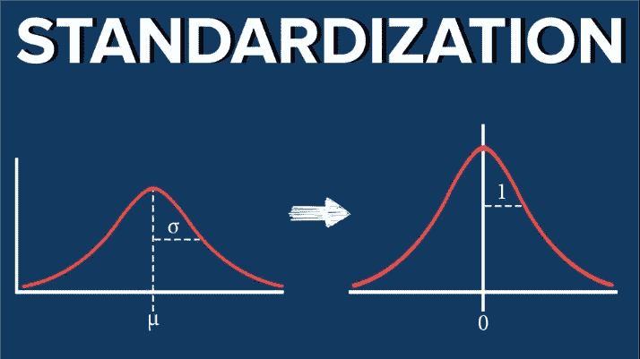
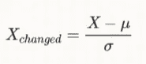
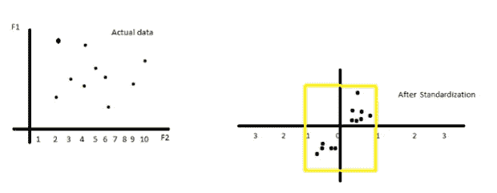
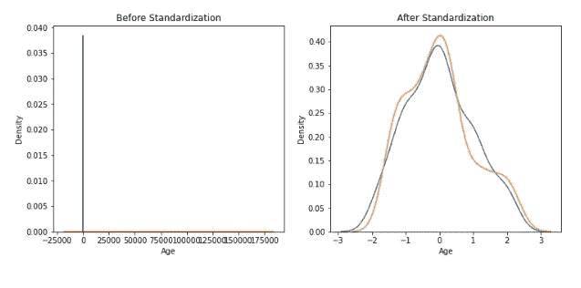
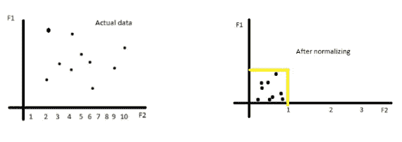
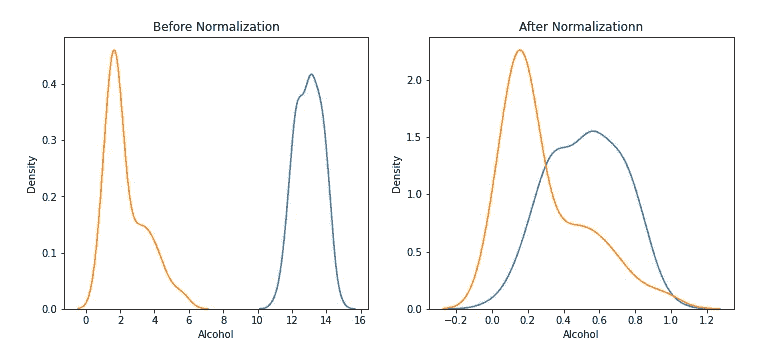
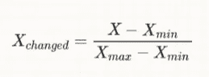
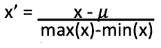
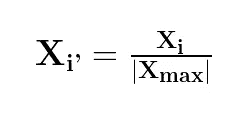
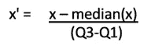

# 标准化与规范化

> 原文：<https://medium.com/mlearning-ai/standardization-vs-normalization-907bb0f3c74a?source=collection_archive---------3----------------------->

**特征缩放**:一种用于将数据中存在的独立特征带入固定范围的技术。

它是我们在进行特征变换、构造、选择和提取之后在特征工程中做的最后一件事。然后我们衡量价值。

## 为什么需要扩展的示例:

考虑一个例子，一个人的身高和体重，其中身高以米为单位，如 1 米、2 米等。重量单位是 50 公斤、65 公斤等。因此，在计算距离值时，由于较大的值，权重特征将在不同的算法中占主导地位，如果您直接将这些值提供给算法而不进行缩放，则模型往往会有偏差。

## 类型:

特征缩放分为两种。

1.  标准化
2.  正常化



[Understanding Standard Normal Distribution | 365 Data Science](https://365datascience.com/tutorials/statistics-tutorials/standardization/)

# **标准化:**

当数据遵循正态分布时，这很有用。从几何角度来看，它将数据转换(移位)为原始数据的平均值到原点( *μ* =o)，并将这些点分别压缩或扩展到单位标准偏差(σ=1)，而不会影响分布的形状。

> 当数据采用不同的比例/单位或范围差异较大，并且不受异常值的影响时，可使用该方法，因为没有预定义的变换要素范围。



**Standardization Formula**

> *也就是说，通过标准化这些值，我们得到了以下关于数据分布的统计数据:*
> 
> *均值= 0(均值居中)*
> 
> *标准偏差= 1(比例值可以是+ve 和-ve)*



[**Before and After standardization - Geometric Intuition**](https://stackoverflow.com/questions/50007810/principle-component-analysis)



**Before and After standardization- KDE Plot**

## 代码直觉:

```
*#from sklearn module we are importing standard scalar* **from sklearn.preprocessing import StandardScaler***#creating a standard scalar object as scalar* **scaler=StandardScaler()***#fit the data into scaler it will learn parameters* **scaler.fit(x_train)***#transform train and test split into requirement for standardization* **x_train_scaled=scaler.transform(x_train)
x_test_scaled=scaler.transform(x_test)**
```

## 何时使用标准化:

缩放时，某些算法中模型的精确度会提高。

1.  *梯度下降:θ*计算会变得更快，随机梯度下降中的学习速率对每个参数都是一样的。
2.  *人工神经网络:应用梯度下降。*
3.  *前 K 近邻:测量样本对之间的距离，它们的距离受测量单位的影响。*
4.  *在 K-均值聚类之前:*由于欧几里德距离测量
5.  *在 SVM 之前:*由于欧几里得距离的测量。
6.  *套索和岭回归*:它将每个变量的系数大小限制在 w.r.t .的量级上，不会有截距。
7.  *主成分分析(PCA)前:*尽量得到方差最大的特征。
8.  *变量重要性度量之前*:具体在回归模型中。

## 当没有必要应用时:

1.  决策树，XG-Boost，梯度提升:对准确率没有影响。
2.  随机森林、装袋技术(基于树的算法对特征的比例相当不敏感)。

# **正常化**:

这是在 ML 中的数据准备期间经常应用的技术。目标是更改数值列的值以使用通用的刻度，而不会扭曲不同范围的值或丢失信息。



[**Before and After normalization - Geometric Intuition**](https://stackoverflow.com/questions/50007810/principle-component-analysis)



**Before and After normalization- KDE Plot**

1.  最小最大标量
2.  均值归一化
3.  最大绝对值
4.  鲁棒标量

**1。最小最大标量:**该估计器单独缩放和翻译每个特征，使得它在训练集的给定范围内，例如，在零和一之间。它可以作为标准标量的替代品。

> 异常值也被压缩到 0 到 1 的范围内，所以影响也是存在的。



**Min-max scalar Formula**

## 代码直觉:

```
*#from sklearn module we are importing minmax-scalar*
**from sklearn.preprocessing import MinMaxScaler***#creating a minmax-scalar object as scalar* **scaler=MinMaxScaler()***#fit the data into scaler it will learn parameters*
**scaler.fit(x_train)***#transform train and test split into requirement for standardization*
**x_train_scaled=scaler.transform(x_train)
x_test_scaled=scaler.transform(x_test)**
```

**2。** **均值归一化:**当我们需要在 0 和 1 之间缩放每个特征，并且需要居中的数据(均值居中)时，我们使用均值归一化。scikit-learn 中没有代码；我们需要硬编码，所以通常我们使用标准标量。



**Mean normalization scalar Formula**

**3。最大绝对值:**根据绝对最大值缩放每个特征。该估计器单独缩放和转换每个特征，使得训练集中每个特征的最大绝对值为 1。

> 它不会移动/居中数据，因此不会破坏任何稀疏性。因此用于稀疏数据。



**Max absolute scalar Formula**

## 代码直觉:

```
*#from sklearn module we are importing* MaxAbsoluteScaler
**from sklearn.preprocessing import MaxAbsScaler***#creating a* MaxAbsoluteScaler *object as scalar* **scaler=MaxAbsScaler()***#fit the data into scaler it will learn parameters*
**scaler.fit(x_train)***#transform train and test split into requirement for standardization*
**x_train_scaled=scaler.transform(x_train)
x_test_scaled=scaler.transform(x_test)**
```

4.**稳健标量:**此标量移除中值，并根据分位数范围(默认为 IQR:四分位数范围)缩放数据。 [IQR 是第一个四分位数(第 25 个四分位数)和第三个四分位数(第 75 个四分位数)之间的范围。](/@mahendragundeti/five-point-summary-boxplot-explained-a3629e3712f7)

> 由于使用了中值和单位方差的标度，它对异常值是稳健的。



**Robust scalar Formula**

## 代码直觉:

```
*#from sklearn module we are importing* RobustScaler
**from sklearn.preprocessing import RobustScaler***#creating a* RobustScaler *object as scalar* **scaler=RobustScaler()***#fit the data into scaler it will learn parameters*
**scaler.fit(x_train)***#transform train and test split into requirement for standardization*
**x_train_scaled=scaler.transform(x_train)
x_test_scaled=scaler.transform(x_test)**
```

## 结论:

*   了解数据并查看是否需要进行要素缩放。
*   当您知道数据的分布不符合高斯分布时，可以使用归一化。标准化，反之亦然。
*   然而，这并不一定是真的。此外，与标准化不同，标准化没有边界范围。因此，即使您的数据中有异常值，它们也不会受到标准化的影响。
*   如果异常值使用稳健标量，如果稀疏数据使用最大绝对标量，如果我们知道数据的最小值和最大值，则使用最小最大标量
*   总是从将模型与原始的、规范化的和标准化的数据进行拟合开始，并比较性能以获得最佳结果。
*   让定标器适合训练数据，然后用它来转换测试数据，这是一个很好的做法。这将避免模型测试过程中的任何数据泄漏。此外，通常不需要目标值的缩放。

感谢阅读！

关注我了解更多关于 DS 和 ML 的内容。

[](/mlearning-ai/mlearning-ai-submission-suggestions-b51e2b130bfb) [## Mlearning.ai 提交建议

### 如何成为 Mlearning.ai 上的作家

medium.com](/mlearning-ai/mlearning-ai-submission-suggestions-b51e2b130bfb)