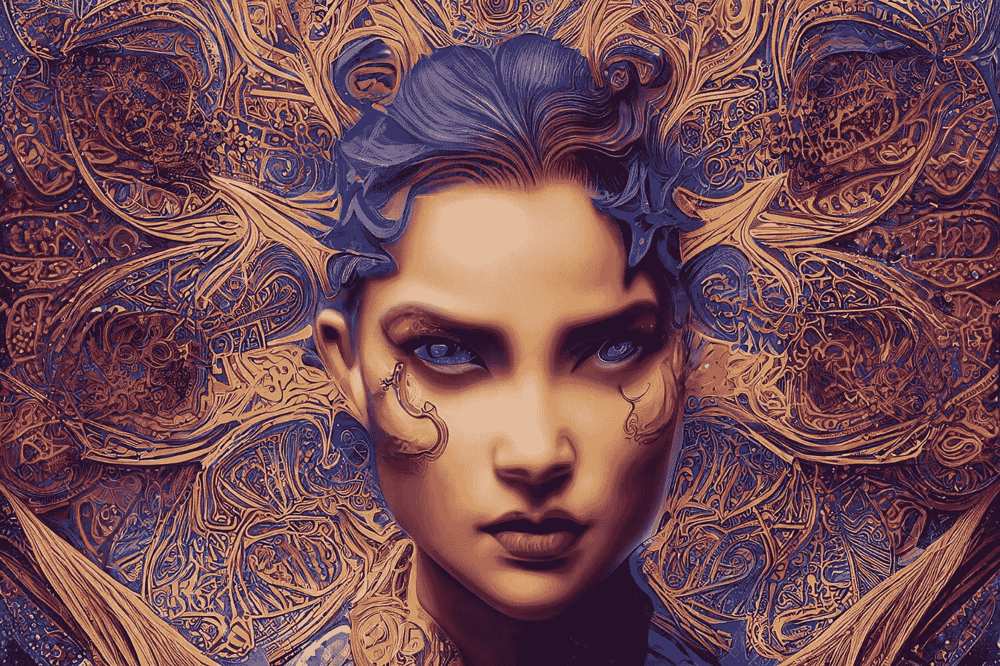

# Starryai 有了新算法！现在比中途好吗？

> 原文：<https://medium.com/mlearning-ai/starryai-has-a-new-algorithm-is-it-better-than-midjourney-now-26ebd39a44ce?source=collection_archive---------0----------------------->

## Argo 是一种基于稳定扩散的新算法，可以生成漂亮的图像。我会停止使用 Midjourney 而开始使用 Starryai 吗？

Image by [Stella Sky](/@StellaSky)

经过

[斯特拉的天空](https://5starsdesigner.com/blog/author/Stella%20Sky)