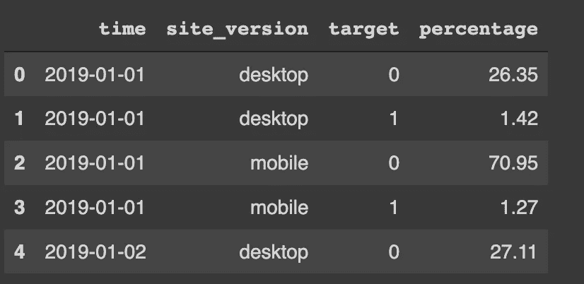
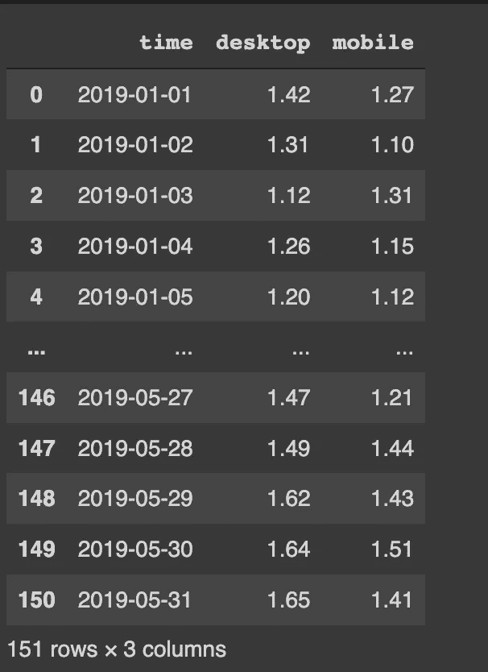
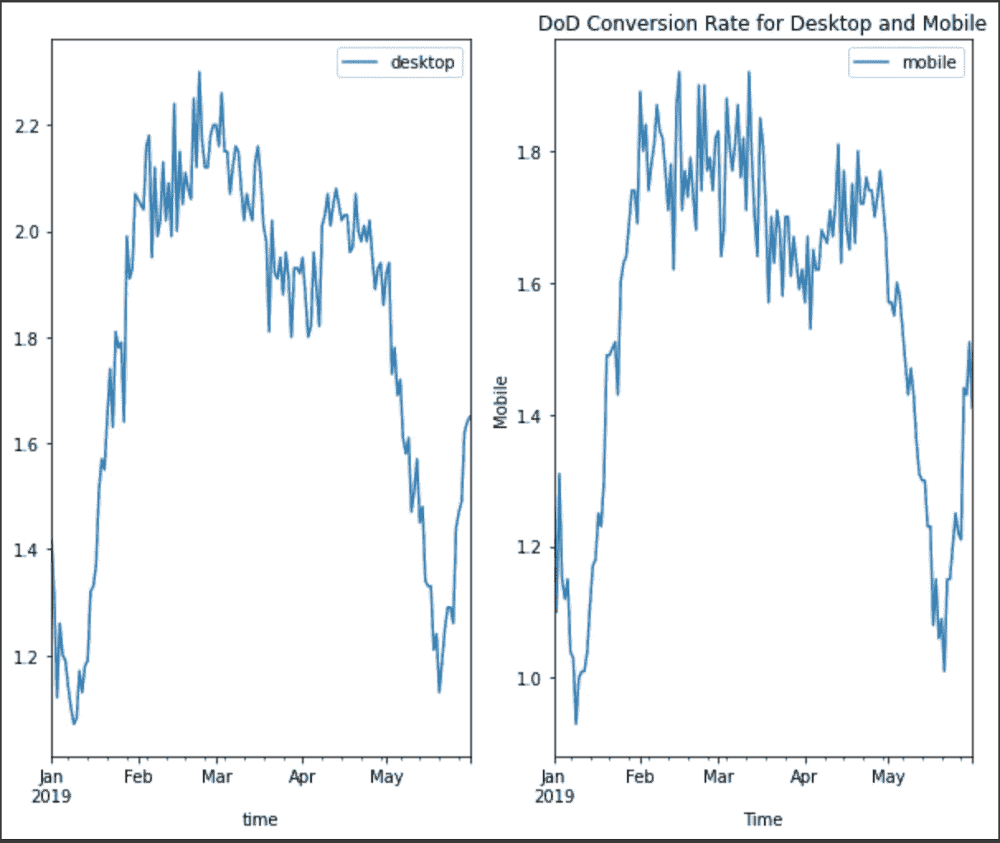
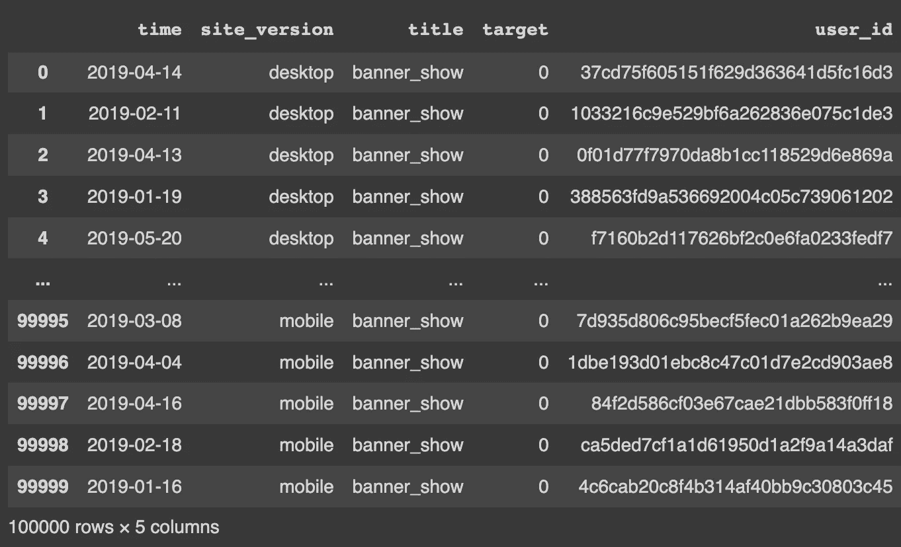
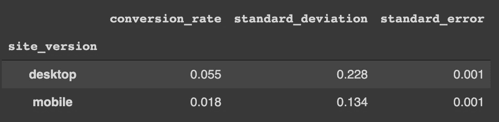
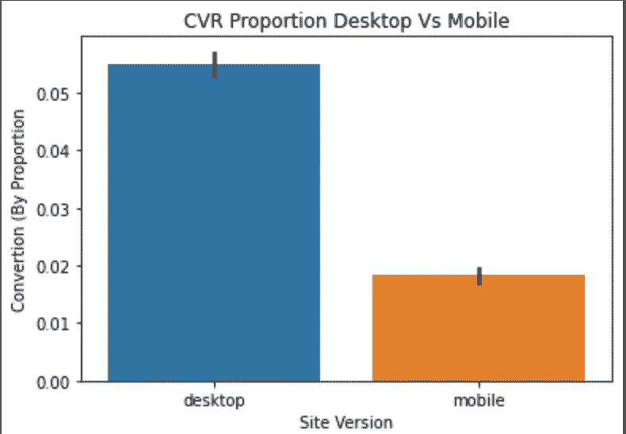
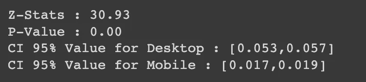

# 统计 AB 测试—用户分析

> 原文：<https://medium.com/mlearning-ai/statistical-ab-testing-user-analytics-1ef046dfa68a?source=collection_archive---------1----------------------->


Image by [pixabay](https://pixabay.com/photos/scale-question-importance-balance-2635397/)

如果我从来没有发表过任何关于 AB 测试的东西，那会很奇怪，因为它已经在大多数公司(尤其是电子商务行业)广泛用于测试新产品/功能或营销活动。

所以，我决定用统计方法(Z-test)来演示一下我们如何实现 AB 测试。

如果你们一直关注我的页面，我相信你们熟悉我的数据检查和清理过程，从这篇文章开始，我将更多地关注解释用例的代码。

指导方针:

1.  探索性数据分析
2.  数据采样
3.  统计 AB 测试
4.  **探索性数据分析**

```
df.head() #Preview the dataset
```


现在，该分析的主要目标是比较哪一个 site_version 具有更好的转化率(桌面与移动)。

因此，让我们深入研究数据告诉我们什么。

```
ab_df = df[['time','site_version','target','user_id']]ab_df['target'] = ab_df['target'].astype(str)grouping = ab_df.groupby(['time','site_version','target']).agg({'user_id' : 'nunique'}).reset_index()ab_final_day = grouping.groupby(['time','site_version','target'])['user_id'].sum().rename('percentage').groupby(level=0).transform(lambda x : 100*x/x.sum())ab_final_day = ab_final_day.reset_index()ab_final_day['percentage'] = round(ab_final_day['percentage'],2)ab_final_day.head()
```



简而言之，上述代码用于以下目的:

1.  为 AB 测试选择必要的特征
2.  对我们选择的功能进行分组，以计算唯一用户总数
3.  基于时间、站点版本和目标功能生成百分比。

生成百分比后，我们可以将注意力集中在 target = 1 标签上，该标签表示我们转换的客户。

```
ab_final_day_c = ab_final_day[ab_final_day['target'] == '1'][['time','site_version','percentage']]ab_final_day_c = ab_final_day_c.groupby(['time','site_version'])['percentage'].aggregate('first').unstack()ab_final_day_c = ab_final_day_c.rename_axis(None, axis=1).reset_index()ab_final_day_c
```



为了使我们生成的数据框具有更好的可读性，我们将使用上述数据来可视化结果。

```
#Visualize Conversion Rate for Desktop and Mobile DoDfig,ax = plt.subplots(1,2,figsize = (10,8))n=0for a in ab_final_day_c.columns : if a == 'time' : pass else : ab_final_day_c.plot(x='time', y=a, ax=ax[n]) plt.xlabel('Time') plt.ylabel(a.title()) n += 1 plt.title('DoD Conversion Rate for Desktop and Mobile')plt.show()
```



基于两个平台的转换，模式是相似的，但是在日常生活中，桌面平台的 CVR 高于移动平台。

接下来，我们将进行统计 AB 测试，以衡量两种平台在转化率方面的性能。

**2。数据采样**

```
#Selecting Columns for AB Testingimport scipy.stats as statsimport statsmodels.stats.api as smsab = df[['time','site_version','title','target','user_id']] #Calculating Sample Sizefrom math import ceileffect_size = sms.proportion_effectsize(0.05,0.1)required_n = sms.NormalIndPower().solve_power(effect_size,power = 1,alpha = 0.05,ratio = 1)required_n = ceil(required_n)print(required_n) #Total Sample Size Needed
```


上面的代码意味着我们想要为我们的数据集实现 10%的目标(来自 effect_size 变量),那么上面的功能是告诉代码，如果 effect_size 中有差异(5%对 10%),那么有 100%的可能性将其检测为**统计显著性**。

```
desktop = ab[ab['site_version'] == 'desktop'].sample(n=required_n, random_state = 22)mobile = ab[ab['site_version'] == 'mobile'].sample(n=required_n, random_state = 22)ab_test = pd.concat([desktop,mobile], axis = 0)ab_test.reset_index(drop=True, inplace=True)ab_test
```



现在我们有了每个站点版本的相同的总数据点，我们可以开始计算两个站点的转换率。

**3。统计 AB 测试**

```
cvr = ab_test.groupby('site_version')['target'] std = lambda x : np.std(x,ddof=0) #Standard Deviationse = lambda x : stats.sem(x,ddof=0) #Standard Errorcvr = cvr.agg([np.mean,std,se]) #Generating Table Summarycvr.columns = ['conversion_rate','standard_deviation','standard_error']cvr.style.format('{:.3f}')
```



我们可以看到，与移动设备相比，桌面设备具有更高的 CVR，差距相当大 **5.5%比 1.8%**

这是上表摘要的可视化。



对于本文的最后一部分，下面的代码用于测试我们的假设(是否桌面=移动)，如果 P 值结果< alpha(在这种情况下，我们将设置为 0.05)，那么我们可以从统计上得出结论，两个站点在统计上是不同的。

```
from statsmodels.stats.proportion import proportions_ztest, proportion_confintd_results = ab_test[ab_test['site_version'] == 'desktop']['target'] m_results = ab_test[ab_test['site_version'] == 'mobile']['target']n_d = d_results.count() #Calculate total n for Desktopn_m = m_results.count() #Calculate total n for Mobilesuccesses = [d_results.sum(), m_results.sum()] #Totaling 1 Label for both Mobile and Desktopnobs = [n_d,n_m] #Total Samples for Each Sites z_stat, p_val = proportions_ztest(successes, nobs = nobs)(low_d, low_m), (up_d,up_m) = proportion_confint(successes, nobs=nobs, alpha = 0.05)print(f'Z-Stats : {z_stat:.2f}')print(f'P-Value : {p_val:.2f}')print(f'CI 95% Value for Desktop : [{low_d:.3f},{up_d:.3f}]')print(f'CI 95% Value for Mobile : [{low_m:.3f},{up_m:.3f}]')
```



由此得出结论，我们可以拒绝零假设，这意味着移动设备和桌面设备有很大的不同。(P 值< 0.05)。

对于台式机，置信区间 95%在 0.053 到 0.057 之间，这表明基准 CVR 约为 5%。

对于移动电话，置信区间 95%在 0.017 到 0.019 之间，这表明基线 CVR 约为 1.8%

此外，这两个平台都没有达到我们估计的 effect_size 目标，即 10%。

这是这篇文章的结尾，我真的相信 AB 测试应该是灵活的，基于你的公司所拥有的紧迫性和数据。统计 AB 测试只是最常用的方法之一，但是如果你想开发你自己的，请随意试验(使用不同的库或开发你自己的代码)。

非常感谢您的关注，如果您对数据有任何想了解的话题，请随时联系我。

干杯！

参考资料:

[](https://towardsdatascience.com/ab-testing-with-python-e5964dd66143) [## 用 Python 进行 AB 测试

### 从实验设计到假设检验

towardsdatascience.com](https://towardsdatascience.com/ab-testing-with-python-e5964dd66143) [](https://www.kaggle.com/code/kelvinprawtama/ab-testing) [## AB 测试

### 使用 Kaggle 笔记本探索和运行机器学习代码|使用来自如何进行产品分析的数据？

www.kaggle.com](https://www.kaggle.com/code/kelvinprawtama/ab-testing) [](/mlearning-ai/mlearning-ai-submission-suggestions-b51e2b130bfb) [## Mlearning.ai 提交建议

### 如何成为 Mlearning.ai 上的作家

medium.com](/mlearning-ai/mlearning-ai-submission-suggestions-b51e2b130bfb) [](https://www.kaggle.com/datasets/podsyp/how-to-do-product-analytics) [## 如何做产品分析？

### 营销、AB 测试、聚类等...

www.kaggle.com](https://www.kaggle.com/datasets/podsyp/how-to-do-product-analytics)