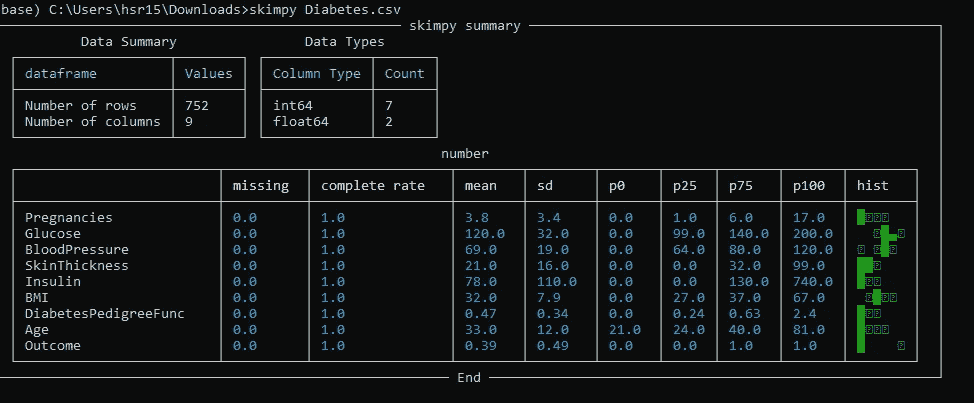

# Python 中的统计分析

> 原文：<https://medium.com/mlearning-ai/statistical-analysis-in-python-9a04cf7705b7?source=collection_archive---------1----------------------->

## 使用 Skimpy 进行数据帧的统计汇总

Source: By Author

数据集的统计分析有助于识别定量数据的不同数据点之间的趋势、模式和关系。它有助于揭示隐藏在数据中、肉眼看不到的隐藏模式。一般包含偏度、四分位数、均值等。