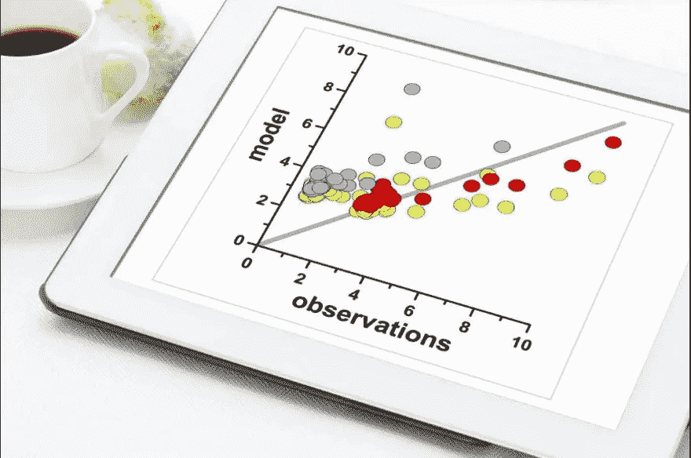
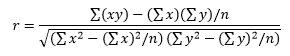

# 统计学和人工智能

> 原文：<https://medium.com/mlearning-ai/statistics-and-artificial-intelligence-e23aa8022b3?source=collection_archive---------6----------------------->

*“数据只是知识的原材料。”统计学是我们将信息用于有意义的目的的最有力的工具。*

Photo by [Jason Leung](https://unsplash.com/@ninjason?utm_source=medium&utm_medium=referral) on [Unsplash](https://unsplash.com?utm_source=medium&utm_medium=referral)

**使用统计的例子:**

🔸*我们如何发现学校在标准化考试中作弊？*

🔸网飞怎么知道你喜欢哪些电影？

🔸*不在人体上进行致癌实验，如何发现哪些物质或行为致癌？*

🔸拥有一个非常著名的大学学位有经济效益吗？

🔸统计帮助我们找到这些问题的答案。世界正以越来越快的速度产生越来越多的数据。

**我们为什么要学习统计学？**

🔸来总结大量的数据。

🔸做出更好的决定。

🔸寻找重要社会问题的解决方案。

🔸抓骗子和起诉罪犯。

**推论**

伊斯坦布尔街头有多少无家可归的人？已婚人士多久打一次架？这些问题可能看起来彼此完全不同；实际上，这两个问题都可以用基本的统计工具来回答，尽管并不完美。我们使用统计数据来预测我们不完全了解的更大的问题。简而言之，我们可以利用“已知世界”的数据对“未知世界”做出明智的推断。

例如，它是政治调查中抽样的一个变种。一个研究机构试图建立一个代表大部分人口的家庭样本，并找出他们对政治观点或候选人的看法。这当然比联系该城市或国家的所有选民要便宜和快捷得多。一项对 1，000 人进行的明确的方法调查将产生与评估土耳其每一个家庭相同的结果。

**什么是相关性，它有什么作用？**

Correlation Chart

> 网飞怎么知道我喜欢哪些电影？

网飞怎么知道我会喜欢和不喜欢哪些电影？公司总部有一大群实习生，他们在谷歌上搜索我的家人和朋友，以决定我是否喜欢电影《指环王》？当然不是。只是网飞掌握了一些相当复杂的统计数据。网飞不认识我。但是，他知道我以前看过喜欢的电影。网飞将其他顾客的评分和评论添加到这些数据中，并在强大的计算机上进行处理，从而对我的口味做出惊人准确的预测。

相关性衡量两种现象相互关联的程度。例如，夏季气温和冰淇淋销量之间存在相关性。一个崛起，另一个崛起。如果一个变量的值的增加以相同的方向影响另一个变量，那么这两个变量之间的相关性是正的。高个子(平均来说)更重，矮个子更轻。如果一个变量的正变化与另一个变量的负变化相关，则存在负相关性；**比如做运动和体重之间。**

相关性作为一种统计工具的优势来自于它可以将两个变量聚合成一个描述性统计量:**相关系数。**

相关系数有两个极好的性质。首先；它是范围从-1 到 1 的单个数字。如果存在完美的相关性(系数= 1)，则一个变量的值的每次变化都会导致另一个变量的值在相同方向上发生等效的变化。

完全负相关(系数= -1)意味着一个变量的每一个变化都对应于另一个变量的相反但相当的变化。
相关值越接近 1 或-1，关系越强。相关性为 0 或接近 0 意味着变量彼此之间没有显著关系；就像鞋码和 SAT 考试分数之间的关系一样。

关联的第二个吸引人的特性是它没有任何附加单元。虽然身高以厘米为单位，体重以公斤为单位，但我们可以计算出身高和体重之间的相关性。我们可以计算大学生家中电视机的数量与他们从 SAT 考试中获得的分数之间的相关性。相关系数创造了奇迹:它把许多用不同单位测量的数据变成了一个优雅的描述性统计。

Correlation Coefficient Calculation Formula

当一个变量到均值的距离与另一个变量到均值的距离大体一致时，我们可以预期有很强的相关性。

 [## Mlearning.ai 提交建议

### 如何成为 Mlearning.ai 上的作家

medium.com](/mlearning-ai/mlearning-ai-submission-suggestions-b51e2b130bfb) 

🟠 [**成为作家**](/mlearning-ai/mlearning-ai-submission-suggestions-b51e2b130bfb)