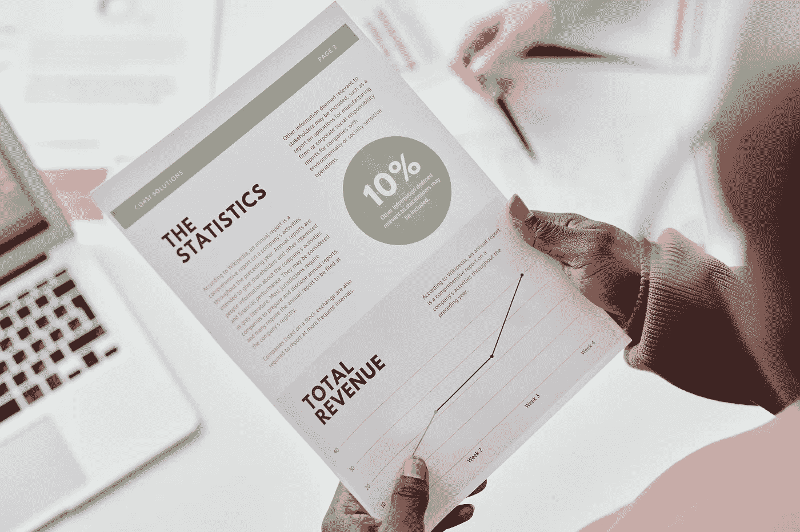
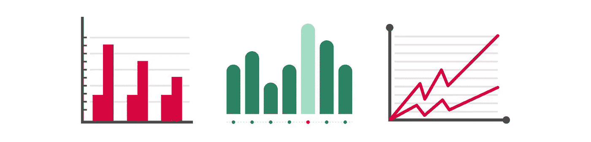
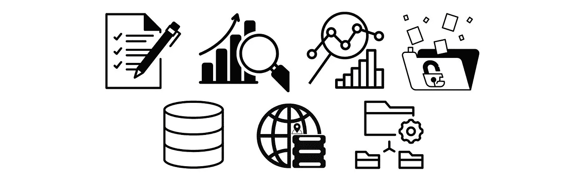
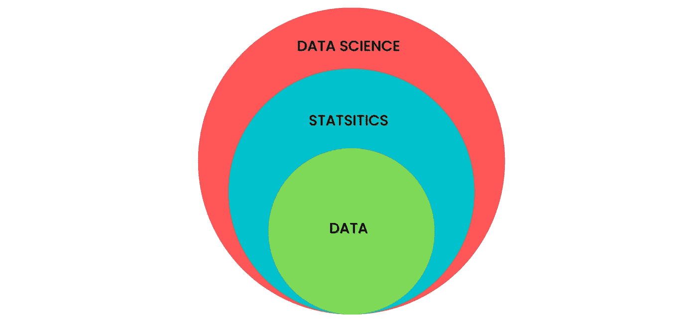
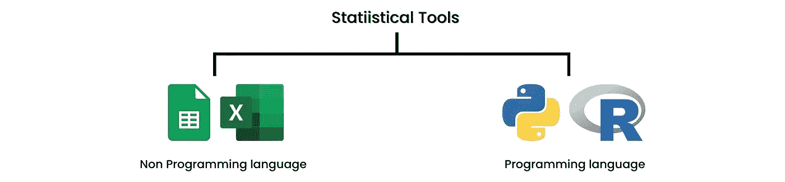
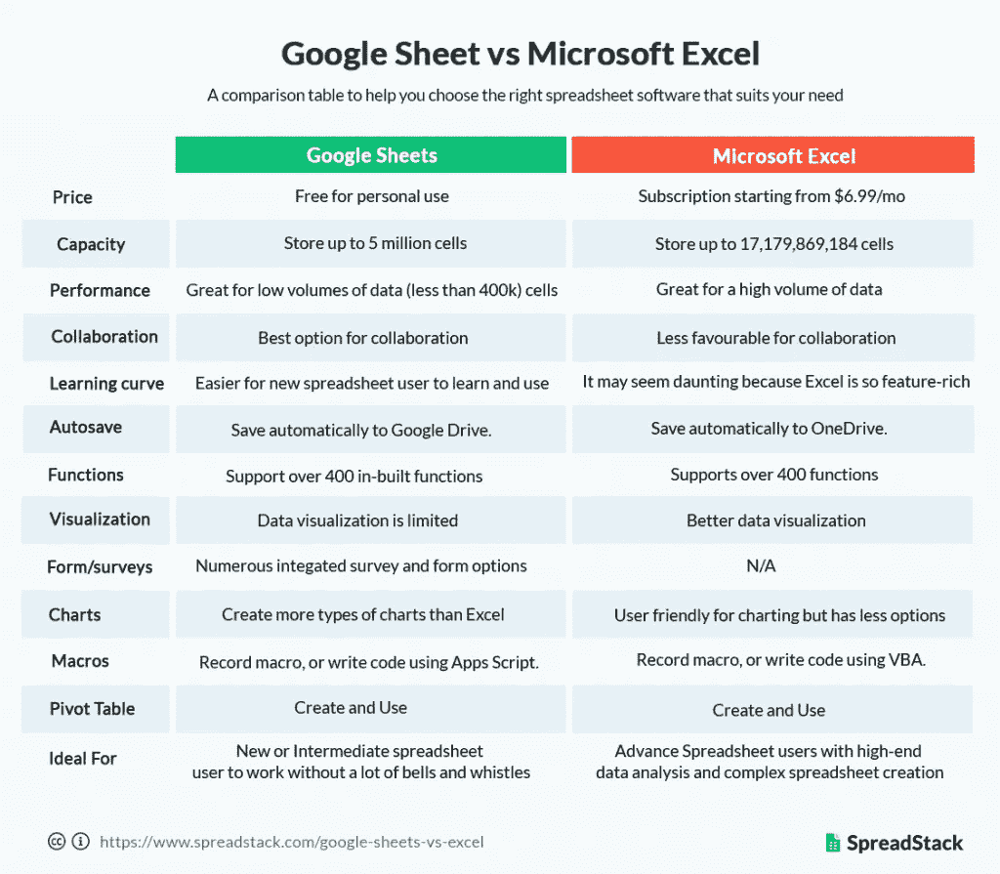
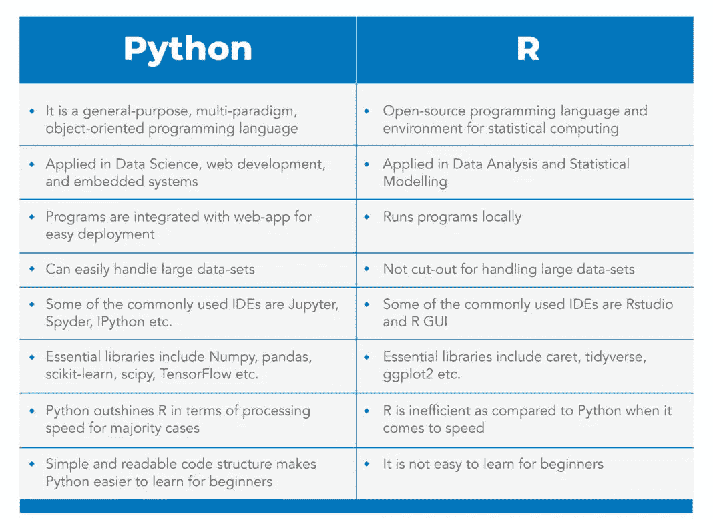
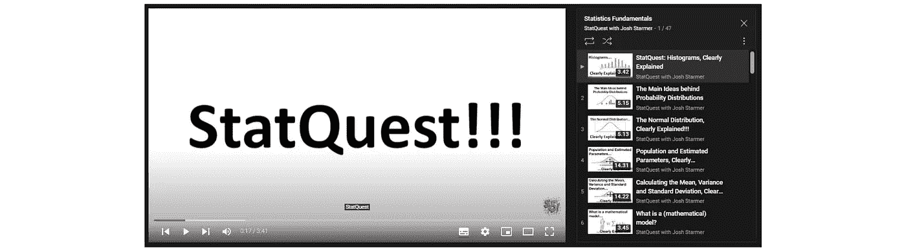

# 统计学是数据科学的基础

> 原文：<https://medium.com/mlearning-ai/statistics-as-the-foundation-of-data-science-9b42ab6a50e7?source=collection_archive---------2----------------------->

## 介绍统计、统计的核心、统计工具和统计资源

Photo by Tiger Lily from [Pexels](https://www.pexels.com/photo/a-person-holding-a-business-report-7109313/)

讲统计学，就是讲人类早期文明史在收集数据找出信息。统计学不是一门新学科，用了很久了。最初，统计用于行政目的，如人口数据收集、简化税收制度和武装部队的人口组织。然后，统计学开始应用于各个领域，如商业、金融、工业、天文学、科学、语言学等。这就产生了综合学科，如生物统计学、心理计量学和计量经济学。然而，统计究竟是什么？

# 统计的定义

Image by the author

Kendal 和 Stuart (1977)解释说，统计学是科学方法的一个分支，它通过计算或测量人口特征来收集数据。与此同时，根据韦伯斯特的新大学词典，统计学被定义为一个数学分支，涉及大量数字数据的收集、分析、解释和呈现。

因此，统计学是一门学科或科学方法，目的是从人群中收集、组织、总结、呈现和分析数据，包括得出有效的结论并根据某些分析做出合理的决策。

统计学被广泛用于帮助我们做决定。在数据和统计分析的支持下，我们可以通过最小化错误风险来做出决策。统计数据指导我们凭经验客观地做出决策。统计学本身是独一无二的，因为它具有精确计算不确定性的能力。在这种情况下，概率在统计学中往往起着很大的作用。

统计学有两个子领域，描述性统计和推断性统计。

# 描述和推断统计

描述统计学研究数据收集、数据处理(汇总和呈现)、描述和分析所有数据而不得出结论。我们可以用数字和图表快速总结数据，这使得描述性统计特别有用[2]。一般来说，描述性统计的主题包括计算集中趋势(包括平均值、中值和众数)、频率分布、数据分布值和图形形式的数据可视化。

Descriptive vs. inferential statistics (Image by author)

然后，统计推断学习如何基于现有数据做出结论或决定的过程。推断统计学最重要的是一种分析观察数据(样本)得出关于整个数据(总体)的结论的方法[2]。统计推断的主题是假设检验、数字特征的估计、数据内关系的相关性等等[1]。

两类统计的一般区别是，描述性统计只对数据进行总结而不得出结论，而推断性统计得出结论。

# 数据是统计的核心

Illustration of data (image by author)

Nield (2022)描述了诸如提供故事快照的照片之类的数据。持续的现实和背景没有被完全捕捉到，推动故事发展的无数变量也没有被完全捕捉到[2]。所以，可以解释为数据是从所有可以作为信息的事件中获得的信息。数据可以是数字或类别的形式(如好的、坏的、高的、低的等等)。好数据有几个特征，如客观、有代表性、最新、相关和可靠。

数据与所有统计活动密切相关。数据和统计不能分开。我们知道，数据就是信息，有了统计数据，我们就可以从这些信息中总结和洞察。

# 为什么统计学作为数据科学的基础可以是必要的？

数据科学是一门关于使用数据寻找问题答案的学科(当然是与数据相关的)。数据科学阶段包括问题定义、数据收集、数据探索、数据分析和用数据讲故事。数据科学的终极目标是从数据中发现洞见。为了实现这个最终目标，我们需要统计数据。

Relationship between data, statistics, and data science (Image by author).

因此，统计学可以成为数据科学的基础之一有各种各样的原因。首先，统计学让你有能力决定手头的问题是否可以只用数据来回答。它还为量化不确定性创建了一个精确的框架。最后，统计学提供了清晰表达分析结果的方法。因此，当数据科学家以模型的形式测试洞察力时，也需要统计数据来衡量模型的真实程度或比较获得的各种模型以选择最佳模型。

# 统计应该选择哪些工具？

Image by the author.

当我们处理统计数据时，我们肯定需要工具来简化我们的工作。我们有几个推荐的工具可以使用。第一，如果不熟悉编程语言，可以使用 [**Google Sheets**](https://docs.google.com/spreadsheets/) 或者 **Microsoft Excel** 。要使用 Microsoft Excel，您必须先安装并购买许可证，而要使用 Google Sheets，您只需要一个用于 Google Drive 的 Gmail 帐户和一个互联网连接。我们建议使用 Google Sheets，而不是 Microsoft Excel。如果你仍然不确定使用 Google Sheets，那么你可以阅读这篇[文章](https://www.blog.google/products/g-suite/easy-formula-5-reasons-use-google-sheets/)。

以下是谷歌电子表格和微软 Excel 的对比表:

Source: [https://www.spreadstack.com/google-sheets-vs-excel/](https://www.spreadstack.com/google-sheets-vs-excel/)

那么，如果你熟悉编程语言，我们推荐使用 **Python** 或者 **R** 。Python 实际上是一种通用编程语言，但大多数 python 用于数据科学(包括统计学)。这是因为它受到许多图书馆和大型社区的支持。那么，R 本身就是一种局限于统计学领域的语言。基于此，我们建议使用 python 而不是 r。

下面是 Python 和 R 的对比表:

Source: [https://www.mygreatlearning.com/blog/python-tutorial-for-beginners-a-complete-guide/#rvspython](https://www.mygreatlearning.com/blog/python-tutorial-for-beginners-a-complete-guide/#rvspython)

# 学习统计的资源

如果你刚开始学统计学，我们有一些推荐的资源(课程)，你可以免费获取。首先，我们推荐 YouTube 频道 [**与 Josh Starmer**](https://www.youtube.com/c/joshstarmer) 的 StatQuest。StatQuest 提供了许多关于统计的视频，带有有趣的动画和解释，非常容易理解。

Source: [https://www.youtube.com/c/joshstarmer](https://www.youtube.com/c/joshstarmer)

然后推荐**可汗学院**网站。可汗学院提供了很多可以免费获取的课程，其中之一就是统计与概率。可汗学院以视频、文本和测验的形式提供解释。

 [## 统计和概率|可汗学院

### 如果您看到此消息，这意味着我们在网站上加载外部资源时遇到了问题。如果你是…

www.khanacademy.org](https://www.khanacademy.org/math/statistics-probability) 

最后推荐斯坦福大学在 Coursera 开设的统计学课程。课程由斯坦福大学统计学教授[**Guenther Walter**](https://www.coursera.org/instructor/~33497310)指导。

 [## 统计学导论

### 斯坦福大学的“统计学导论”教你统计思维的概念，是必不可少的学习从…

www.coursera.org](https://www.coursera.org/learn/stanford-statistics) 

# 参考资料:

[1]丹格蒂，P. (2017)。*机器学习的统计学:用 Python 和 R 探索监督、非监督和强化学习模型的技术*(第 1 版。).包装出版公司。

[2]t .尼尔德(2022 年)。*数据科学的基本数学:用基本的线性代数、概率和统计学控制你的数据*(第一版。).奥莱利媒体。

 [## 描述性统计:集中趋势、变化和位置的测量

### 描述性统计中的测量以及如何使用 Python 进行计算

medium.com](/mlearning-ai/descriptive-statistics-measure-of-central-tendency-variation-and-position-fc4681a54f7c)