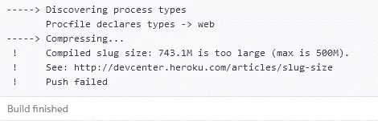
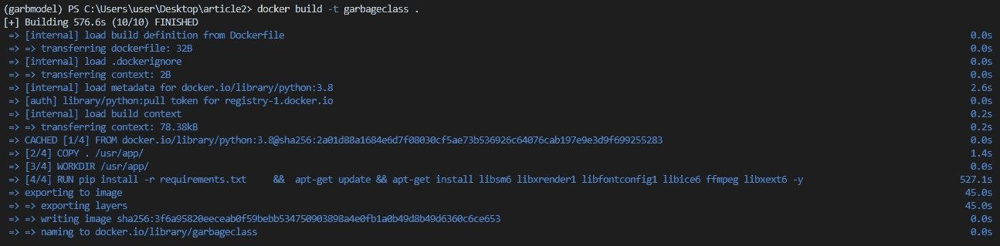
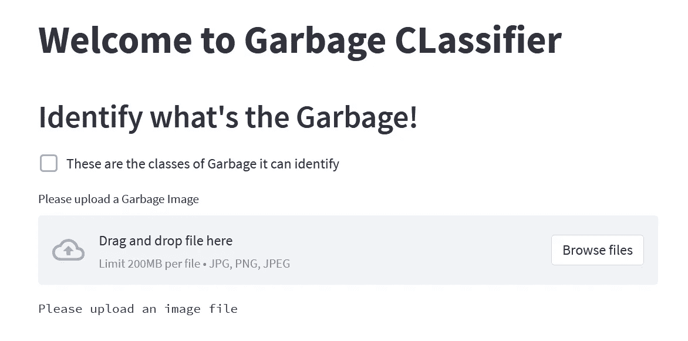

# 免费为您的 DL 模型构建和部署容器的分步指南(使用 Heroku)

> 原文：<https://medium.com/mlearning-ai/step-by-step-guide-to-build-and-deploy-container-for-your-dl-model-for-free-using-heroku-68fd74de8ff4?source=collection_archive---------4----------------------->

## 数据科学/部署

## 容器尺寸:4.46GB


在上一篇文章中，我们部署了一个容器化的 ML 模型。现在让我们向前迈进一步，部署一个 DL 模型。



**Deploy Fail due to Large Slug size**

我们将会解决这个弹头大小的问题。它是一个使用 Streamlit 制作的垃圾分类 web app。所涉及的步骤与部署 ML 模型相同，唯一的区别是 Dockerfile 和 requirements.txt 文件。

> 提示:对于每个新的基于 Python 的项目，有一个新的虚拟环境通常是好的。所以每个项目的依赖关系都是相互隔离的。

由于步骤 1、3、4、5、6 是相同的，可以参考我以前的文章。

> **垃圾分类 Github 链接:**
> https://Github . com/MSufiyanAG/contained-Garbage-classifier
> 
> **往期文章**:[https://medium . com/@ MSufiyanGhori/a-初学者指南-构建和部署-a-container-for-your-ml-model-3c BC 45d 16 e 9 f](/@MSufiyanGhori/a-beginners-guide-to-building-and-deploying-a-container-for-your-ml-model-3cbc45d16e9f)

# Dockerfile:

```
FROM python:3.8 COPY . /usr/app/ WORKDIR /usr/app/ RUN pip install -r requirements.txt \                                 &&  apt-get update && apt-get install libsm6 libxrender1 libfontconfig1 libice6 ffmpeg libxext6 -y CMD sh setup.sh \                              
    && streamlit run app.py
```

RUN 命令中包含的附加库是 OpenCV 库所需的依赖项。

requirement.txt 会有额外的需求，像 TensorFlow，OpenCV 等。，可以在 Github 链接中参考。

> *进一步参考:*[*https://docs.docker.com/engine/reference/builder/*](https://docs.docker.com/engine/reference/builder/)

剩余的过程将是相同的

1.**建筑形象**

```
$ docker build -t garbageclass .
```



> 要了解更多命令，如运行、标记，..
> [https://docs . docker . com/engine/reference/command line/docker/](https://docs.docker.com/engine/reference/commandline/docker/)

**2。创建 Heroku 网络应用**

```
$ heroku login
$ heroku container:login
$ heroku create app-name
```

> 有关命令的详细信息:
> [https://dev center . heroku . com/articles/container-registry-and-runtime](https://devcenter.heroku.com/articles/container-registry-and-runtime)

**3。将图像推送到 Heroku 上的容器注册表**

```
$ docker tag garbageclass:latest registry.heroku.com/<app-name>/web:latest$ docker push registry.heroku.com/<app-name>/web:latest
```


**4。展开集装箱**

```
$ heroku container:release web --app app-name
```

然后打开 Heroku，打开 app。



Web App

利用 Heroku 日志找出错误(如果有的话)。

我们成功地在 Heroku 上免费部署了一个 DL 模型。我们将在结论文章中讨论弃用如何影响 web 应用的部署。

在接下来的文章中，我们将尝试在一个 web 应用程序中部署 **6 个深度学习模型**。

**敬请期待。**

**快乐学习**

[](/mlearning-ai/mlearning-ai-submission-suggestions-b51e2b130bfb) [## Mlearning.ai 提交建议

### 如何成为 Mlearning.ai 上的作家

medium.com](/mlearning-ai/mlearning-ai-submission-suggestions-b51e2b130bfb)