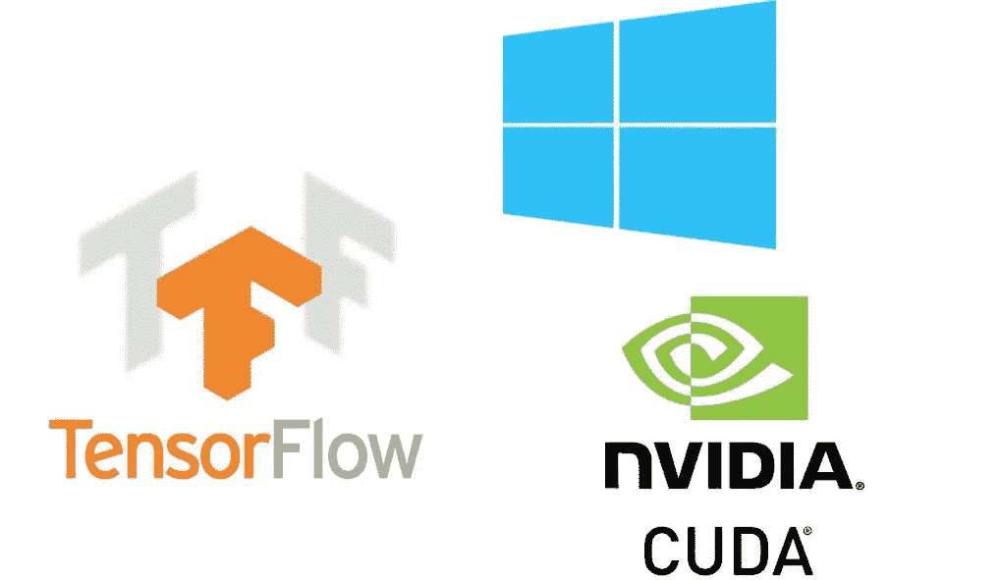
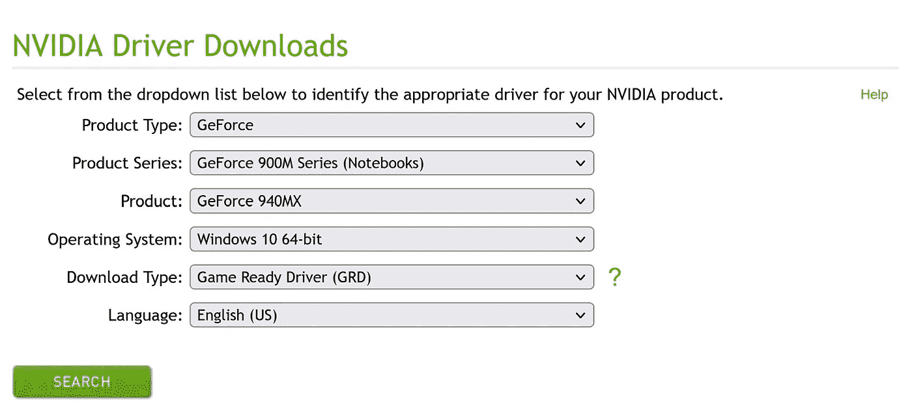
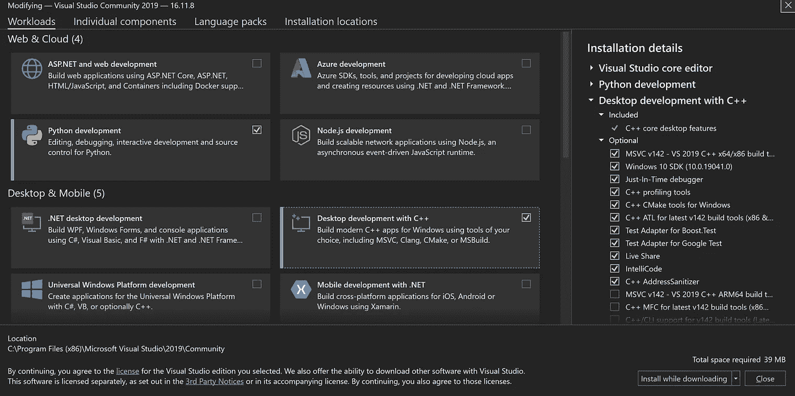
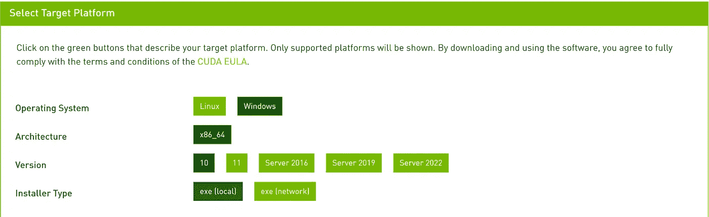
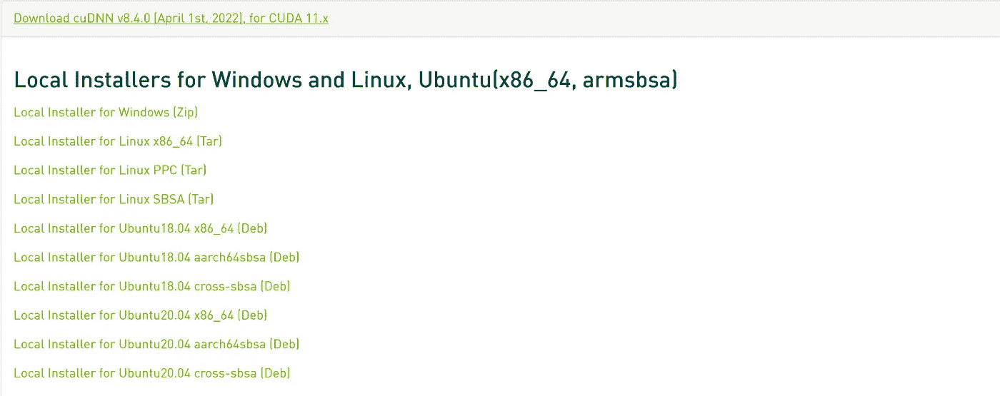
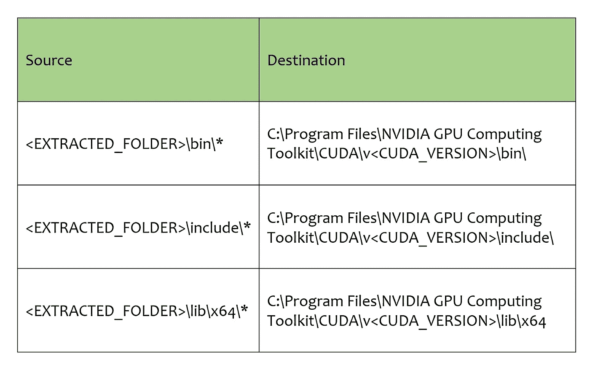
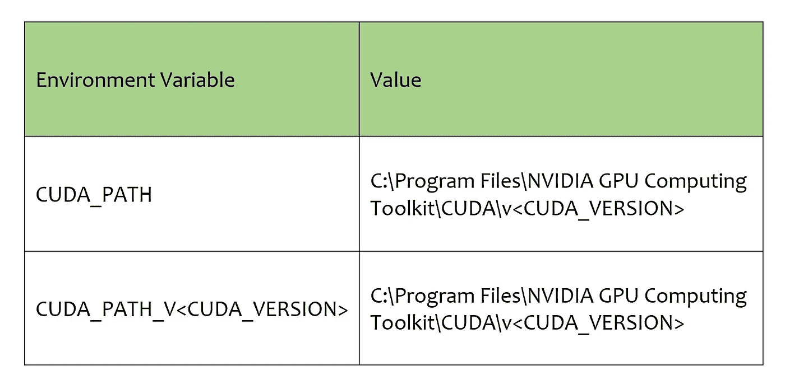
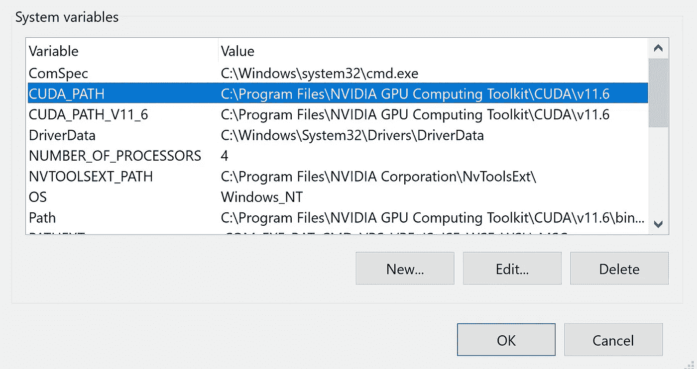

# 在 windows 10 上设置支持 GPU 的 Tensorflow 的分步指南

> 原文：<https://medium.com/mlearning-ai/step-by-step-guide-to-setup-tensorflow-with-gpu-support-on-windows-10-ad3a492ac67f?source=collection_archive---------3----------------------->

你好！希望你今天心情好。在本文中，我们将使用 TensorFlow 2.8 建立一个新的 anaconda 环境，使用 NVIDIA CUDA 11.6 和 CUDNN 8.3 以及 Python 3.8 提供 GPU 支持



我知道在 TensorFlow 上获得 CUDA 支持是一个棘手的问题，这就是为什么在不同的平台上有关于如何正确完成的帖子和视频，这篇文章是另一种方法。希望你能按照指南一步一步来，并享受结果！

**深呼吸，让我们开始吧！**

# **步骤:**

让我们简单看一下所有步骤

1.  **NVIDIA 显卡驱动**:你可以从这个[链接](https://www.nvidia.com/download/index.aspx)下载与你的 GPU 匹配的驱动。您需要选择您的显卡和操作系统，以便能够下载正确的驱动程序
2.  **Visual Studio 2019 社区版—针对 C++运行时**:这里可以从官网[下载。](https://visualstudio.microsoft.com/downloads/)
3.  **蟒蛇**:你可以在这里从[获得最新版本的蟒蛇。](https://www.anaconda.com/)
4.  **Windows 10 的 CUDA 工具包**:你可以从这个[链接](https://developer.nvidia.com/cuda-toolkit-archive)下载 CUDA 工具包。请注意，在决定下载的版本之前，请查看此表以了解支持您的驱动程序版本的 CUDA 版本
5.  **CUDNN** : CUDNN 是一组 C/C++库，在 CUDA 之上公开了深度神经网络功能。所有深度学习框架都使用 CUDNN 来使用 NVIDIA GPU——包括 TensorFlow。你可以从[这个](https://developer.nvidia.com/cuda-toolkit-archive)下载你的 CUDNN。
6.  新的 conda 环境:安装好以上所有东西后，我们创建一个新的环境，然后变魔术

## 我的设置:

操作系统:Windows 10 企业版

显卡:NVIDIA GeForce 940MX

图形驱动程序版本:511.23

# 步骤 1: NVIDIA 显卡驱动程序安装

这是从 https://www.nvidia.com/download/index.aspx 下载的我的设置示例:



一旦您找到并下载了适合您机器的安装二进制文件，只需双击该文件即可运行它。根据提示多次单击“下一步”,恭喜您已经完成了第 1 步。

# 步骤 2: Visual Studio 2019 安装

我使用的是社区版，这是一个完整的开发环境，而且完全免费！如果你有任何其他执照(专业或企业)也很好。从[https://visualstudio.microsoft.com/downloads/](https://visualstudio.microsoft.com/downloads/)下载 visual studio 安装程序，双击该文件，确保已经安装了突出显示的(“使用 C++”的桌面开发)工作负载。这将安装所需的 C++工具链。



这将需要一段时间来安装，等待它完成。**在进入下一步**之前重启电脑。

# 步骤 3: Anaconda 安装

Anaconda 是一个 python 发行版，允许您在一台机器上拥有多个 python 环境。这使您可以自由地使用多个独立的 python 版本，而不依赖于可能存在包冲突的全局环境。从 https://www.anaconda.com/[下载安装程序，完成常规选项的步骤。](https://www.anaconda.com/)

# 步骤 4: CUDA 工具包

从[https://developer.nvidia.com/cuda-toolkit-archive](https://developer.nvidia.com/cuda-toolkit-archive)选择适合你机器的 CUDA 工具包版本。下载安装程序，然后点击下一步，直到完成。我为我的 windows 10 下载了 CUDA toolkit 版本 11.6。



# 第五步:CUDNN 库

现在您应该安装 CUDNN 库，tensorflow 使用它来使用 CUDA 在 GPU 上创建深度神经网络。访问页面[https://developer.nvidia.com/rdp/cudnn-download](https://developer.nvidia.com/rdp/cudnn-download)并下载适用于您的 CUDA 版本的 CUDNN。请注意，为了访问下载页面，您需要有一个 NVIDIA 开发者帐户(可以免费创建)



下载如上所示的 zip 文件，并将内容解压缩到您想要的任何目录中。打开解压后的文件夹，同时打开另一个 explorer 窗口，路径如下:**C:\ Program Files \ NVIDIA GPU Computing Toolkit \ CUDA**。在这个文件夹里，你会找到一个文件夹，里面是你当前的 CUDA 工具包版本，比如对我来说是 ***v11.6*** 。像这样从解压缩的文件夹中复制文件。在下表中，ALL_CAPS 值指的是特定于您的环境的特定参数。例如 CUDA_VERSION 指的是你下载的 CUDA 版本，同样 EXTRACTED_FOLDER 指的是你解压 CUDNN 库 zip 文件的路径。



请注意，您需要复制上述文件夹的文件**，而不是文件夹本身**。

现在，让我们验证您已经在机器上创建了下面列出的环境变量。



这是我的:



如果你需要知道如何在 Windows 10 上访问和设置环境变量，请阅读[这篇](/@melika.sce/how-to-add-a-new-path-to-environment-variables-in-windows-10-af1d5197ac2e)小文章来帮助你。

# 第六步:创造康达环境

我们到了！还剩下一些小碎步，你可以做到！

为了用 Python 版创建 conda 环境，在开始菜单中键入 Anaconda 提示符并打开它。

现在用下面的命令创建一个任意名称的环境，我的环境名称是 gpu

```
conda create --name gpu python=3.8
```

激活您的环境

```
conda activate gpu
```

然后我们可以安装 TensorFlow

```
pip install --upgrade tensorflow-gpu
```

开放 vs 代码

```
code
```

现在检查是否一切正常:

```
import sys
import tensorflow.keras
import tensorflow as tf
import numpy as npprint(f"Tensor Flow Version: {tf.__version__}")
print(f"Keras Version: {tensorflow.keras.__version__}")
print()
print(f"Python {sys.version}")
print("GPUs Available: ", len(tf.config.experimental.list_physical_devices('GPU')))
tf.test.is_built_with_cuda()
tf.test.is_gpu_available(cuda_only=False, min_cuda_compute_capability=None)
```

恭喜你！

你做到了:)

评论，如果你面临任何问题。

[](/mlearning-ai/mlearning-ai-submission-suggestions-b51e2b130bfb) [## Mlearning.ai 提交建议

### 如何成为 Mlearning.ai 上的作家

medium.com](/mlearning-ai/mlearning-ai-submission-suggestions-b51e2b130bfb)