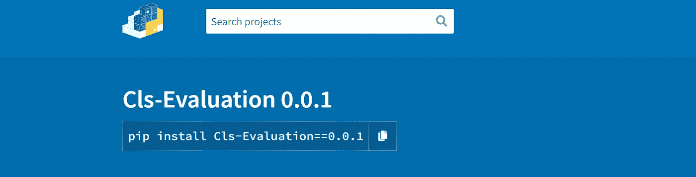

# 将您自己的 Python 包发布到 Python 包索引(PyPI)的步骤

> 原文：<https://medium.com/mlearning-ai/steps-to-publish-your-own-python-package-to-the-python-package-index-pypi-23710fe1bedc?source=collection_archive---------13----------------------->



Ref: [https://pypi.org/project/Cls-Evaluation/0.0.1/](https://pypi.org/project/Cls-Evaluation/0.0.1/)

通常，我们导入多个库或函数来解决一个特定的问题。我们可以将所有这些功能结合起来，让事情变得更简单。多亏了 Python，创建和发布自己的包已经变得非常简单了。

在这篇文章中，我将解释以下几点:

> *将自己的 python 包发布到 PyPI 的步骤。*
> 
> *解决发布时的几个常见错误。*
> 
> *安装并评估 python 包的结果。*

我们开始吧！

为您的包创建一个包含下列文件的目录:

这里 Cls_evaluation 是我的模块名，它包含了 __init__ 中的一堆函数。py 文件。

CHANGELOG.txt 文件:写下每个版本的所有修改。

MANIFEST.in 文件:提及文件的类型

比如。txt，。巴拉圭

README.txt 文件:软件包摘要

LICENSE.txt:添加许可证的副本。

检查此链接中的不同分类器([https://pypi.org/classifiers/](https://pypi.org/classifiers/))

创建完所有文件后，现在让我们使用 Windows Powershell 发布。

# **解决发布时的一些常见错误**

1.  捆绳错误:确保使用此命令安装捆绳

## pip 安装捆绳

2.找不到 SSL 错误:查看本教程([https://www.youtube.com/watch?v=mN8SLBsvSCU](https://www.youtube.com/watch?v=mN8SLBsvSCU))

3.分类器错误:从该站点复制分类器([https://pypi.org/classifiers/](https://pypi.org/classifiers/))

# **安装并评估 python 包的结果**

# 装置

从 setup.py 安装依赖项。

```
pip install Cls-Evaluation==0.0.1
```

# 简单演示

```
from setuptools import setup, find_packages
import Cls_evaluation as cl
conf_matrix = cl.confusion_matrix([1,0,0,1,1,0],[0,1,0,1,1,1])print("Accuracy", cl.acc(conf_matrix))
print("Precision",cl.precision(conf_matrix))
print("Recall",cl.recall(conf_matrix))
print("F1 score", cl.F1(conf_matrix))
print("FDR",cl.FDR(conf_matrix))Accuracy 0.5
Precision 0.5
Recall 0.6666666666666666
F1 score 0.5714285714285714
FDR 0.5
```

我个人参考了这个视频教程([https://www.youtube.com/watch?v=zhpI6Yhz9_4](https://www.youtube.com/watch?v=zhpI6Yhz9_4))，请做检查。

**参考文献**

[1][https://www.python.org/](https://www.python.org/)

[https://pypi.org/](https://pypi.org/)

[https://pypi.org/project/twine/](https://pypi.org/project/twine/)

[https://code.visualstudio.com/download](https://code.visualstudio.com/download)

[5][https://docs . Microsoft . com/en-us/powershell/scripting/overview？view=powershell-7.2](https://docs.microsoft.com/en-us/powershell/scripting/overview?view=powershell-7.2)

[6][https://dev blogs . Microsoft . com/scripting/table-of-basic-powershell-commands/](https://devblogs.microsoft.com/scripting/table-of-basic-powershell-commands/)

[7]https://opensource.org/licenses/MIT

[](/mlearning-ai/mlearning-ai-submission-suggestions-b51e2b130bfb) [## Mlearning.ai 提交建议

### 如何成为 Mlearning.ai 上的作家

medium.com](/mlearning-ai/mlearning-ai-submission-suggestions-b51e2b130bfb)