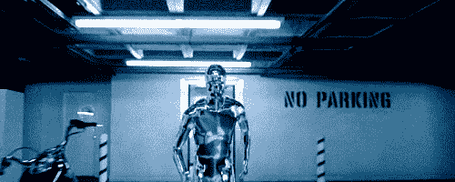
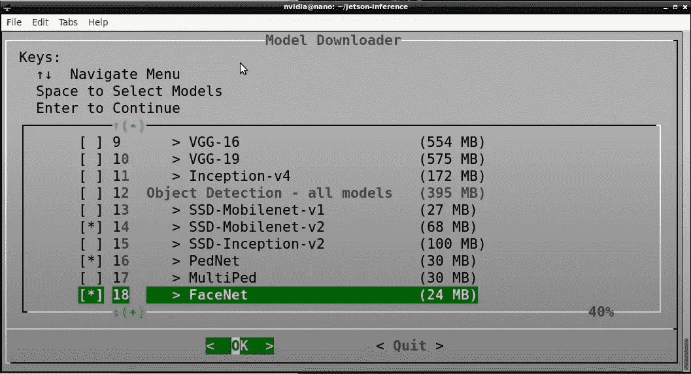
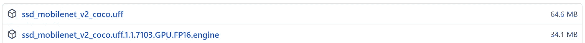

# 立体视觉:将物体检测添加到我们的深度图中！

> 原文：<https://medium.com/mlearning-ai/stereo-vision-adding-object-detection-to-our-depth-map-2bce3b45181d?source=collection_archive---------2----------------------->



Source: Gifer

到目前为止，我们的相机能够创建一个深度图，并在单击鼠标时确定像素的距离。

但那只是半个终结者。我们需要我们的‘终结者’能够说:“有一个人站在那里。人在 *x* 米外。进攻！”

如果您还没有通读本系列的[第 1 部分](https://aryanvij02.medium.com/stereo-vision-how-do-terminators-see-the-world-5a70f3a1f4d1)和[第 2 部分](https://aryanvij02.medium.com/stereo-vision-making-a-depth-map-from-scratch-6cd25c82897a)，请通读一下，以便更好地理解这一部分！

# 这将如何工作

1.  使用 TensorRT 运行 SSD-Mobilenet-v2 对象检测模型。
2.  结合物体检测和我们的深度图。
3.  确定对象检测边界框的质心。
4.  将质心的(x，y)坐标映射到深度图，从深度图的 2D 矩阵获得深度值。
5.  显示距离。

# 加载对象检测模型

为了在这个系列中进行物体检测，我们将使用 Nvidia 的 [jetson 推理库](https://github.com/dusty-nv/jetson-inference)，这是他们的 Hello AI World 教程系列的一部分。

> Hello AI World 教程是在 Jetson 产品上开始 AI 和深度学习项目的好方法。去[检查一下](https://www.youtube.com/watch?v=QXIwdsyK7Rw&list=PL5B692fm6--uQRRDTPsJDp4o0xbzkoyf8&index=9)！

我们将从源代码构建 Nvidia 的 jetson-inference 项目。这可能需要一些时间，并且会让您完成某些安装，所以请耐心等待！

访问[本网站](https://github.com/dusty-nv/jetson-inference/blob/master/docs/building-repo-2.md)并按照步骤或在您的终端中键入以下命令。

```
$ sudo apt-get update
$ sudo apt-get install git cmake libpython3-dev python3-numpy
$ git clone --recursive https://github.com/dusty-nv/jetson-inference
$ cd jetson-inference
$ mkdir build
$ cd build
$ cmake ../
$ make -j$(nproc)
$ sudo make install
$ sudo ldconfig
```

所有这些命令都取自 Nvidia 的教程。如果您遇到任何错误，确保检查他们的[位置](https://github.com/dusty-nv/jetson-inference/blob/master/docs/building-repo-2.md)，以防安装过程发生某些变化。

## 在安装过程中…



你会看到这个屏幕来下载一些深度学习模型。除了 **SSD-Mobilenet-v2** 之外，您可以选择取消选择所有选项，因为这是我们将用于本项目的选项。

# 测试安装

在我们进入下一步之前，让我们检查一下我们的安装是否成功。打开您的终端并键入:

```
$ python3
>>> import jetson.utils
>>> import jetson.inference
```

如果您能够成功导入两个模块，这意味着我们可以开始了！如果您遇到任何关于 ***杰特森*** 模块丢失的错误，请再次检查[杰特森-推断安装现场](https://github.com/dusty-nv/jetson-inference/blob/master/docs/building-repo-2.md)并确保遵循所有步骤。

# 测试对象检测模型

好吧！现在我们已经安装了所有的东西，让我们运行对象检测模型。

导航至`/home/jetson-inference/python/examples/`

然后运行`python3 my-detection.py`

第一次运行该模型大约需要**5-8 分钟**。

如果图像倒置，请使用:

```
python3 my-detection.py --flip-method=rotate-180 csi://0
```

如需了解更多详情，请查看该视频:

# 那个人站在多远的地方？

我们已经运行了目标检测模型。我们也有深度图。现在是时候把两者结合起来了！

如果您之前已经克隆了我的 [StereoVision repo](https://github.com/aryanvij02/StereoVision) ，您会在 ***main_scripts*** 文件夹中找到一个 **6_depthwithdistance.py** 文件。这就是你所需要的！

导航到`/home/StereoVision/main_scripts/`目录并运行:

`python3 6_depthwithdistance.py`。

End result!

这是你应该看到的。我修改了 Python 脚本，使模型只检测人，以避免周围其他物体的干扰。

如果您希望检测其他物体，请修改 **6_depthwithdistance.py** 中的*物体检测*功能。

您可以从[这里](https://github.com/dusty-nv/jetson-inference/blob/master/data/networks/ssd_coco_labels.txt)了解 COCO 数据集中对象的不同 ***item_class*** 。只要记住 ***item_class*** 是索引，因此从 0 开始，因此*未标记=0，person=1，bicycle=2，等等*。

为了更好地理解 detectNet 包，请查看这个页面。从这里你可以了解到[*jetson . inference . detect net . detection*](https://github.com/dusty-nv/jetson-inference/blob/master/examples/detectnet/detectnet.cpp#LC140:~:text=detectNet%3A%3ADetection*%20detections)返回的是什么。

# 想要删除 jetson-inference 文件夹吗？

我们不得不按照 jetson-inference 的指导将 **jetson** 模块安装到我们的机器上。但是，我们不希望整个文件夹不必要地占用我们的 Jetson Nano 的存储空间。

目前，我们无法删除 jetson-inference 文件夹，因为其中安装了对象检测模型。因此，让我们将模型移动到我们的立体视觉目录！

## 下载模型

您可以导航到`/home/jetson-inference/data/networks/`并将 SSD-Mobilenet-v2 文件夹复制到`StereoVision`目录。

或者…

前往[发布页面](https://github.com/aryanvij02/StereoVision/releases/tag/ssd)，下载两个文件到`/home/StereoVision/SSD-Mobilenet-v2/`。



Files to download

**修改 6_depthwithdistance.py**

我们需要改变加载 ssd-mobilenet-v2 的路径。

如上所示，注释正在加载 ssd-mobilenet-v2 模型的当前行，并取消注释以下 3 行。

一定要把`--model=/home/aryan/StereoVision/SSD-Mobilenet-v2/ssd_mobilenet_v2_coco.uff`换成自己的路径。

现在我们终于可以删除 jetson-inference 文件夹了。

> 我们也可以用这个方法加载不同的深度学习模型。只要确保相应地改变不同的参数。

试着再次运行 **6_depthwithdistance.py** ，应该可以！

# 恭喜你！

我们已经完成了本教程，并学到了这么多！尝试立体视觉和物体检测(深度学习)是一个很好的开始方式！

请留下评论，如果你扩展这个项目或有任何反馈！感谢阅读！

# 重要来源

1.  我的[立体视觉储存库](https://github.com/aryanvij02/StereoVision)
2.  [杰特森-推理知识库](https://github.com/dusty-nv/jetson-inference)
3.  [你好 AI 世界 YouTube 教程](https://www.youtube.com/watch?v=QXIwdsyK7Rw&list=PL5B692fm6--uQRRDTPsJDp4o0xbzkoyf8&index=9)
4.  [已定义的检测网络属性](https://rawgit.com/dusty-nv/jetson-inference/python/docs/html/python/jetson.inference.html#:~:text=Detection%20%3D%20%3Ctype)