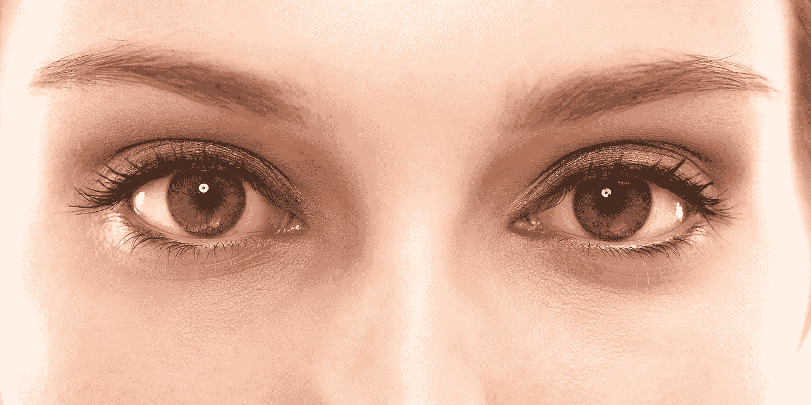
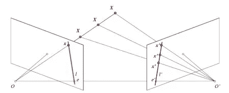
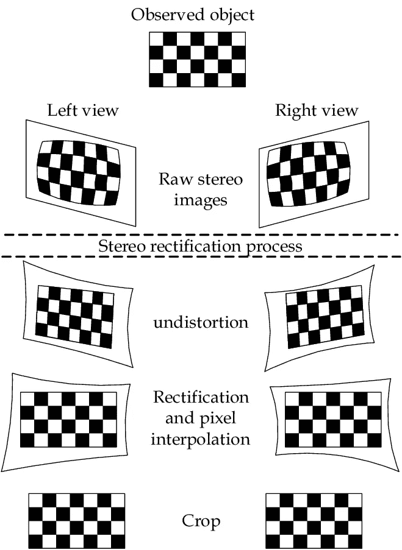
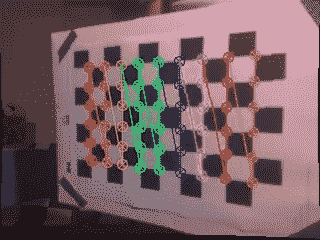

# 立体视觉:“终结者”如何看待这个世界？

> 原文：<https://medium.com/mlearning-ai/stereo-vision-how-do-terminators-see-the-world-5a70f3a1f4d1?source=collection_archive---------2----------------------->

你有没有想过终结者机器人到底是怎么看世界的？他们如何判断敌人是否正在逼近？

答案就在你在上图中看到的两只红色恶魔般的眼睛里。终结者有两个摄像头能够面向同一个方向，这使得[双目视觉](https://en.wikipedia.org/wiki/Binocular_vision)。

事实上，詹姆斯·卡梅隆有史以来的电影中的这些科幻机器人几乎完全是以人体为基础的…这也包括眼睛。

我们的每一只眼睛都捕捉到自己在 2D 的影像。深度感知(3D)的魔力实际上来自大脑，它可以推断两个“图像”的异同。

简单的[针孔摄像头](https://en.wikipedia.org/wiki/Pinhole_camera)实际上是基于人眼，与人眼类似，由于一个叫做[透视投影](https://en.wikipedia.org/wiki/3D_projection#Perspective_projection)的过程，它会丢失所有深度信息。

那么，我们如何使用相机感知深度呢？我们用了两个！

# 为什么这很重要？

在进入“如何”之前，让我们先了解“为什么”。

想象一下，你需要创造一个环境垃圾收集机器人。但是，您不希望在激光雷达技术上投入大量资金来确定垃圾有多远。这就是立体视觉发挥作用的地方。使用两个常规针孔相机不仅可以检测深度，还可以将同一相机用于其他机器学习任务(如物体检测)，这可以是一个巨大的成本节约因素。

此外，与其他深度感测方法相比，这种技术即使不能获得更好的结果，也可以获得类似的结果。

这在很大程度上是真实的，甚至像特斯拉这样价值数十亿美元的组织也对在他们的自动驾驶汽车中使用激光雷达说“不”，而是依赖立体视觉和雷达的概念！

看看这个来自 Twitter 的特斯拉技术的酷视频:

显然，特斯拉正在使用 8 个摄像头而不是 2 个，以及雷达等其他传感器。

然而，涉足立体视觉领域是开始计算机视觉和图像相关项目的一个很好的方式。所以让我们继续，了解更多关于什么是立体视觉！

# 多视图几何的基础

**极线几何。**

OpenCV

把 O and O 想象成两台针孔摄像机。每个摄像机只能在二维平面(x，y)上“看”。如果我们聚焦于摄像机 O，点 *x* 仅投射到图像平面上的一点。然而，在摄像机 O’中，我们看到不同的 *x* 点如何对应于 O’的图像平面上的*x’*点。通过这种设置，我们可以通过左右光度校准三角测量正确的 3D 数据点，并获得感知深度的能力！

要深入了解极线几何，请查看多伦多大学的这篇论文。

# "那么立体视觉的步骤是什么？"

立体视觉主要涉及四个阶段。

> *1。失真校正:这包括消除图像因相机镜头而遭受的径向和切向失真。*
> 
> *2。两个相机的校正:这是一个将两个图像投影到一个公共平面的变换过程。*

*Rodriguez Florez, Sergio. (2010). Contributions by Vision Systems to Multi-sensor Object Localization and Tracking for Intelligent Vehicles.*

> *3。点匹配过程:这里，我们搜索左右摄像机之间的对应点，校正左右图像。为此，我们通常使用棋盘。*

Point Matching

> *4。深度图的创建！*

# “我们能自己做一个吗？”

是啊！我们绝对可以！

为了开始这个项目，我们需要一些必需品。

1.  Jetson Nano 开发者套件 B01(带两个 CSI 摄像头插槽)。
2.  两台树莓 Pi 相机。
3.  兴趣！

这个项目对于初学者来说是一个很好的方式，不仅可以进入计算机视觉领域，还可以作为一个整体进入计算机科学领域，学习 Python 和 OpenCV 的技能。

> 我在新加坡政府技术局(GovTech)实习期间参与了这个项目，作为一项实验，为几个项目中使用的英特尔 Realsense 摄像头创建一个内部替代方案。
> 
> 我意识到没有很多关于这个话题的教程。因此，我创建了这个系列，与像我一样的初学者和爱好者分享，以帮助他们加快项目和学习之旅。

# 开始创建你的深度贴图机器…

点击这里查看[第 2 部分](https://aryanvij02.medium.com/stereo-vision-making-a-depth-map-from-scratch-6cd25c82897a)！