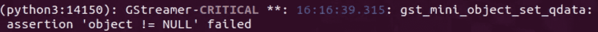
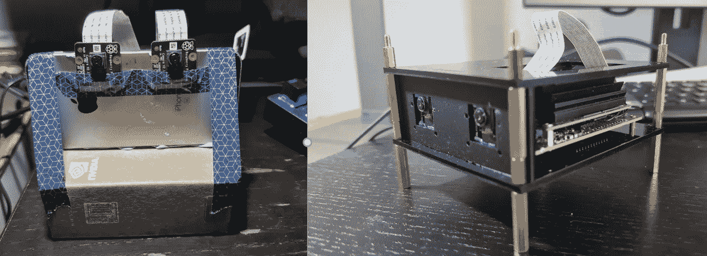
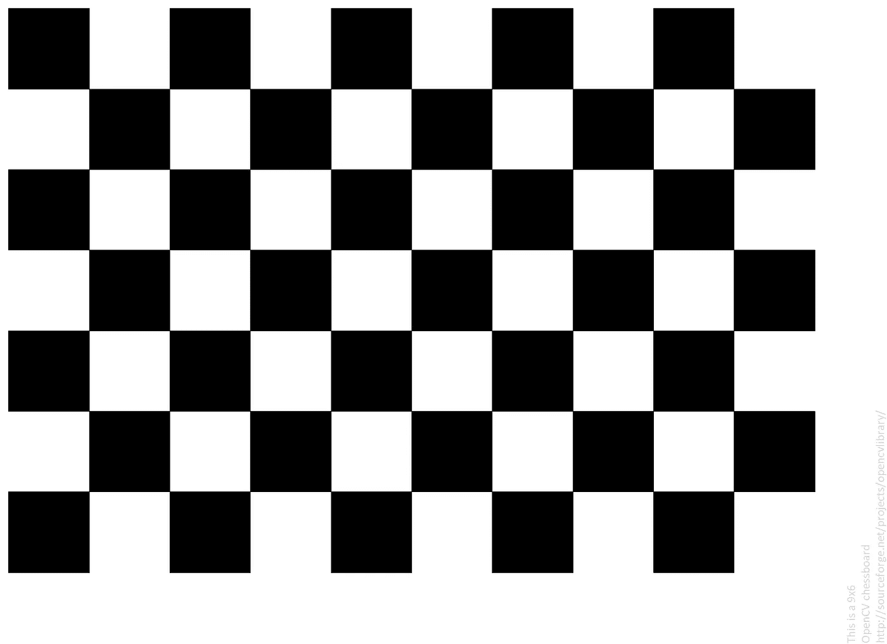
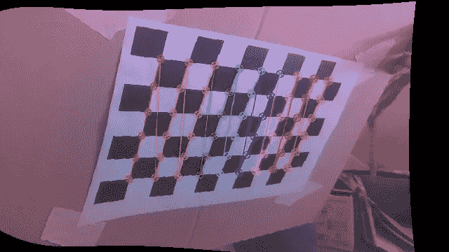
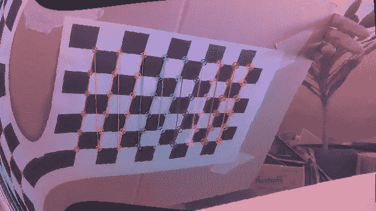
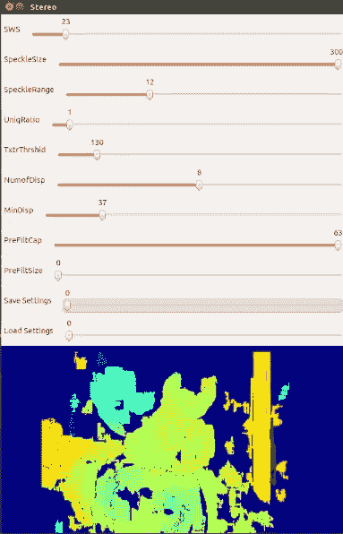
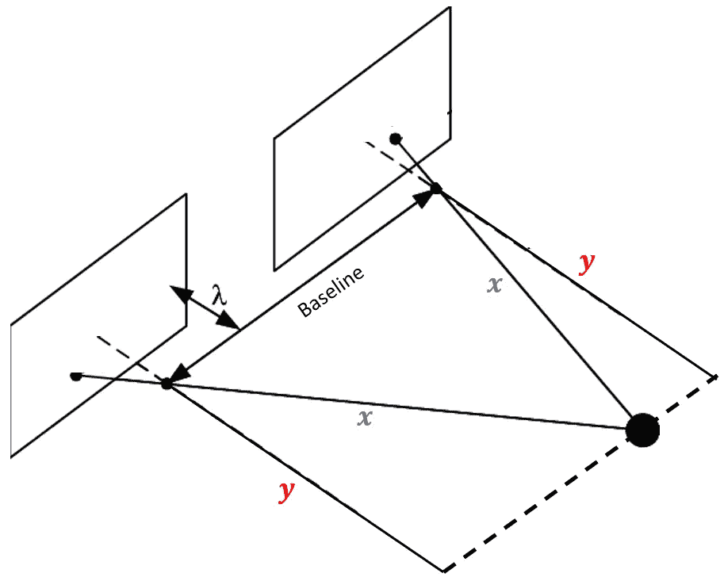

# 立体视觉:从零开始制作深度图！

> 原文：<https://medium.com/mlearning-ai/stereo-vision-making-a-depth-map-from-scratch-6cd25c82897a?source=collection_archive---------0----------------------->


End product!

欢迎阅读本系列的第 2 部分！现在我们理解了立体视觉的[概念(第一部分)](https://aryanvij02.medium.com/stereo-vision-how-do-terminators-see-the-world-5a70f3a1f4d1)，让我们最终继续创建我们的深度图。

# 让我们启动这台相机吧！

我们将在本教程中使用的所有脚本都是用 Python 编写的。

首先，克隆我的 [**立体视觉**库](https://github.com/aryanvij02/StereoVision.git)。

# 要求

如果您尚未设置您的 Jetson Nano，请访问[该网站](https://developer.nvidia.com/embedded/learn/get-started-jetson-nano-devkit)。

假设您已经安装并运行了 Jetson Nano，让我们安装这个项目的所有需求。

因为我们将在 Python3.6 上工作，所以让我们安装

Python3 的 pip:`sudo apt-get install python3-pip`

Python3.6 开发包:`sudo apt-get install libpython3-dev`

**然后安装**所有其他要求:`pip3 install -r requirements.txt`

*如果您希望手动安装需求，您可以键入:*

```
**Install cython:** pip3 install cython **Install numpy:** pip3 install numpy **Install StereoVision library:** pip3 install StereoVision
```

> 旁注:如果你在这个项目中遇到任何错误，请前往我的回购的 [**故障排除**部分。](https://github.com/aryanvij02/StereoVision/blob/master/TROUBLESHOOT.md)

# 测试摄像机

在为我们的立体摄像机创建合适的外壳或临时支架之前，让我们测试一下摄像机是否打开。

现在，您可以插入两个 Raspberry Pi 摄像机，并测试它们在输入以下终端命令后是否运行:

```
# sensor_id selects the camera: 0 or 1 on Jetson Nano B01
$ gst-launch-1.0 nvarguscamerasrc sensor_id=0 ! nvoverlaysink
```

对 sensor_id= 0 和 1 尝试此操作，以测试两台摄像机是否都工作。

如果您遇到这样的 GStreamer 错误:



在您的终端中键入`sudo service nvargus-daemon restart`，然后重试。

> 有时，在退出程序时，Gstreamer 管道可能没有正确关闭。因此，这个命令非常方便(你应该记住)*😃*！

如果问题仍然存在，请确保摄像机已正确插入，并重新启动 Jetson Nano。

# 修复粉色色调

如果你意识到你的相机有轻微的粉红色，请遵循谢霆锋的这些步骤。

# 准备好硬件设置

在我们进一步移动之前，我们必须有一个稳定的立体相机，两个树莓 Pi 镜头相隔固定距离放置(这是**基线**)。

> 始终保持基线固定是很重要的。**我发现 5 厘米的基线是最佳的**，但你可以尝试不同的分隔距离，并对你的结果发表评论！

有很多方法可以做到这一点，所以发挥你的想象力吧！



My enclosure — Before and After

最初，我使用 BluTac 将相机贴在一部旧 iPhone 和 Jetson Nano 盒子上。

我决定使用 onShape 设计一个简单的 3D CAD 模型。然后，我用激光切割机从丙烯酸树脂上切下碎片，产生了你在右边看到的像狗一样的外壳😜！

有兴趣看模型的可以查看我的 [CAD 设计](https://cad.onshape.com/documents/7aeddf5889fd6bfdc7079b51/w/1a42e3836ac1d3923a56fadd/e/36f50dd4d2464144682a21eb)！

如果你想设计自己的 CAD 模型，你可以从[这里](https://developer.nvidia.com/jetson-nano-developer-kit-b01-3d-cad-step-model)下载 3D STEP 模型。

# 启动摄像机

既然我们已经确保摄像机连接正确，让我们开始吧。

要运行 Python 脚本，请在终端中导航到`/StereoVision/main_scripts/`目录。

运行**start _ camera . py**脚本:`python3 start_cameras.py`

您应该可以同时看到两台摄像机的实时视频。

> 如果您在启动相机时遇到任何错误，[请访问此页面](https://github.com/aryanvij02/StereoVision/blob/master/TROUBLESHOOT.md)。

# 让我们准备好棋盘！

我将为这个项目使用 6x9(行 x 列)棋盘。你可以从我的 [GitHub 库](https://github.com/aryanvij02/StereoVision)中获得图像，或者如果你已经克隆了它，那么你就有了文件！



Chessboard. Source: OpenCV

打印出图片(确保不适合页面或改变缩放比例)并将图像粘贴到坚硬的表面上(如剪贴板或盒子)。

最简单的方法是使用我提供的这张棋盘图片。但是，如果您希望使用自己的棋盘，请更改第 16 行和第 19 行的 **3_calibration.py** 。

# 拍照

我们将每隔 5 秒拍摄 30 张照片。

## 建议

1.  不要站得太远。确保棋盘覆盖了相机框架的大部分。
2.  确保盖住框架的所有角落。
3.  确保在图像之间移动和旋转棋盘，以获得不同角度的图片。

在每张图片之间稍微移动棋盘，但确保不要切掉图像的一部分。来自两台相机的图像将被拼接在一起，并保存为一个文件。

要拍照，输入`python3 1_taking_pictures.py`

> **如果您在尝试启动摄像机时遇到错误**，提示: ***未能加载模块“Canberra-GTK-module”…***
> 
> 试试这个:`sudo apt-get install libcanberra-gtk-module`

如果您希望增加图片之间的**时间间隔**或拍摄的**图片总数**，请修改 1_taking_pictures.py 脚本。拍照预设就在顶部。

Modify this!

> **如果您想停止本系列中的任何 Python 程序，请按键盘上的 Q。**

你现在应该有一个名为“图像”的新文件夹，里面保存了你刚刚拍摄的所有照片！

# 接受/拒绝和分割图片。

确保我们不使用质量差的图像(棋盘的缺失部分，模糊等)。)为了校准，我们将仔细检查拍摄的每张照片，并接受或拒绝它。

为此，让我们运行`python3 2_image_selection.py`

浏览所有图像。按' **Y** 保存图像，按' **N** 跳过。

现在，左摄像机和右摄像机图像将分别保存在名为“**对**的文件夹中。

# 校准时间！

这是这一系列中极其重要的一步。对于我们来说，校正和校准我们的相机以获得理想的视差图是必不可少的。

> [阅读更多关于相机矫正的内容。](https://en.wikipedia.org/wiki/Image_rectification)

多亏了李仁港的[立体视觉库](https://github.com/erget/StereoVision)，我们在代码方面不用做太多！

为了进行校准，我们将遍历您在上一步中保存的所有棋盘图像，并计算校正矩阵。

该计划将做点匹配过程，并试图找到棋盘的角落。如果你觉得结果不准确，试着重新拍照。


Point-Matching process

为此，让我们运行:`python3 calibration.py`

运行完所有图像对后，给程序一些时间来校准结果(大约 1-2 分钟)。

一旦完成，您将看到校准结果——校正后的**图像**和**图像**。



rectified_left.png & rectified_right.png

如果您的校准结果看起来有点不可靠(如上)，您可以尝试重复步骤 1-3。

你整改后的图像永远不会看起来完美，所以不要害怕结果，继续下一步！

你随时可以回来！

# 调整视差图！



Tuning GUI

现在我们的相机已经准备好了，让我们开始**调整**视差图本身！

运行**4 _ tuning _ depth map . py:**`python3 4_tuning_depthmap.py`

要了解这些变量，请查看我的 [GitHub repo](https://github.com/aryanvij02/StereoVision.git) 上的自述文件。

调谐杆上的范围可能与说明中列出的范围略有不同。这是因为由于 OpenCV 的轨迹栏的限制，我不得不修改 GUI 上显示的参数。

通过调整窗口，您还可以看到左右两侧经过调整的灰度图像。这是让你比较你的深度图，知道会发生什么。

# 最后…深度图！

所有步骤都完成了！

我们终于可以运行 **5_depthmap.py** : `python3 5_depthmap.py`

Depth map!

现在我们有了它，一个我们从头开始创建的全功能深度图！

# 确定与物体的实际距离

你在上面的( **5_depthmap.py** )中看到的深度图是一个二维矩阵。所以为什么不从中获取实际的深度信息呢！

要确定到框架中特定对象的距离，点击它以**厘米**打印到终端的相对距离。通过这样做，您实际上是在确定特定像素离相机有多远。

## *这个距离到底意味着什么*

现在需要理解的一件事是，测量的距离不是从相机系统中心到系统的精确距离，而是从 Z 轴到系统的距离。



因此，我们实际测量的距离是 ***y*** 而不是

# *这还没有结束*

*深度图很酷。但是终结者也需要能够在攻击人之前发现他们。*

*查看[第 3 部分](https://aryanvij02.medium.com/stereo-vision-adding-object-detection-to-our-depth-map-2bce3b45181d)为该深度图添加物体检测功能，允许我们确定一个人与相机的相对距离！*

# *来源和参考*

1.  *[StereoPi 制作深度图教程。](https://stereopi.com/blog/opencv-and-depth-map-stereopi-tutorial)*
2.  *[JetsonHacks 启动树莓 Pi 相机教程。](https://www.jetsonhacks.com/2020/04/08/jetson-nano-b01-dual-raspberry-pi-cameras/)*