# Python 中的股票数据可视化

> 原文：<https://medium.com/mlearning-ai/stock-data-visualization-in-python-700c24f43e6b?source=collection_archive---------6----------------------->

在本文中，我们将通过一个简单的例子来演示如何用 Python 来分析和可视化股票。在我们的例子中，我们将使用 GitLab 的股票标签，即 GTLB。每一个的代码都可以在下面的 GitLab 或 GitHub 中找到。

git lab—[https://gitlab.com/rshowrav/data-visualization-stock](https://gitlab.com/rshowrav/data-visualization-stock)

GitHub—【https://github.com/rshowrav/data-visualization-stock 

## 安装软件包

第一步是安装必要的包，如果 python 包中还没有安装的话。假设你正在使用 Jupyter 笔记本，代码如下。

```
!pip install yfinance
!pip install seaborn
!pip install matplotlib
```

我们将使用的软件包有:

**雅虎财经—** 这将允许我们收集我们感兴趣的必要股票数据。

**Matplotlib —** 一个绘图工具，可以用 Python 轻松创建令人惊叹的可视化数据框和数组。

**Seaborn —** 类似于 Matplotlib，但主要用于数据帧。

**Pandas—** 允许我们与列表、数组和数据框进行交互。

## 为股票分析收集数据

我们的首要任务是收集进行股票分析所需的数据，这可以通过运行以下代码来完成。

```
# Import yfinance package
import yfinance as yf# Set the start and end date
start_date = '2022-01-01'
end_date = '2022-07-01'# Set the ticker
ticker = 'GTLB'# Get the data from yahoo finance
data = yf.download(ticker, start_date, end_date)
```

代码的第一步是导入 yahoo finance 包。下一部分是为我们的目标设定起止日期，我们将着眼于 2022 年的前六个月。然后，我们设置我们有兴趣收集数据的 ticker。最后，我们通过提供从 yahoo finance 下载的股票代码、开始日期和结束日期来下载这些数据。

## 理解数据

现在我们有了数据，看看我们下载了什么。首先，为了验证数据质量，让我们使用下面的代码查看最后五条记录，以确保我们得到了感兴趣的日期。

```
data.tail()
```

输出应该如下所示:

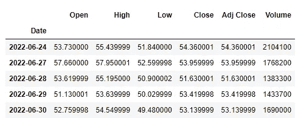

类似地，让我们使用下面的代码对前五条记录执行此操作。

```
data.head()
```

输出应该如下所示:

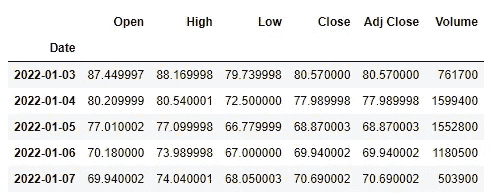

现在我们已经分析了数据，并且可以清楚地看到它在我们指定的日期范围内，让我们理解我们拥有的数据。

**日期—** 股票记录的日期。

**开盘—** 给定日期的开盘价。

**高—** 给定日期的最高股价。

**低—** 给定日期的最低股价。

**收盘—** 给定日期结束时的收盘价。

**Adj Close—** 类似于 Close，除了还包括股息、股票分割和新股发行(如果有)。

**成交量—** 给定日期交易的股票的实际数量。

## **创建可视化效果**

对于此分析，我们将使用以下代码查看 GitLab 的容量趋势。

```
# Import matplotlib to plot the dataimport matplotlib.pyplot as plt
%matplotlib inline# Plot the volume data
data['Volume'].plot(figsize=(20, 14), color='orange')
# Give a title
plt.title("Volume of %s" % ticker, fontsize=16)
# Define the labels for x-axis and y-axis
plt.ylabel('Volume', fontsize=14)
plt.xlabel('Month', fontsize=14)
plt.show()
```

代码的第一步是引入 matplotlib 包的 pyplot 库(注意:使用%matplotlib 内联函数可以在使用 matplotlib 时更容易在 Jupyter Notebook 中正确地可视化代码)。接下来，我们创建一个体积数据的绘图，图形大小为 20x14 英寸，绘图颜色为橙色。接下来的步骤提供了标题、x 和 y 轴标签以及字体大小。输出如下所示。

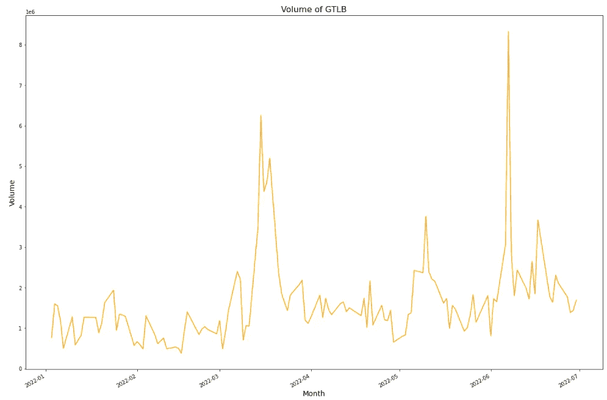

## 针对竞争对手进行分析

GitLab 看着上面的可视化得到一个很好的成交量走势给自己；然而，竞争对手分析是关键。下一步，我们将与 Atlassian(股票代码:TEAM)进行比较。首先，我们使用下面的代码收集数据。

```
# Import Pandas 
import pandas as pd# Define the ticker list
tickers_list = ['GTLB', 'TEAM']# Create placeholder for data
data = pd.DataFrame(columns=tickers_list)# Fetch the data
for ticker in tickers_list:
    data[ticker] = yf.download(ticker, 
                               start_date,
                               end_date)['Volume']

# Print first 5 rows of the data
data.head()
```

这段代码的第一部分是导入 pandas，因为我们需要数据作为数据帧。接下来，我们创建一个我们希望分析的报价器列表。然后，创建一个空数据帧，列名是各自的 ticker。最后，我们创建了一个循环，遍历我们的股票列表，并从 yahoo finance 下载量数据以添加到我们的数据框架中。前五条记录应该如下所示。

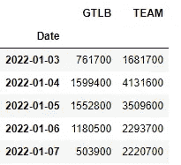

收集数据后，我们使用 matplotlib 和下面的代码再次创建一个可视化。

```
# Plot all the volume data
data.plot(figsize=(20, 14), color=["orange", "blue"])# Show the legend
plt.legend()# Define the label for the title of the figure
plt.title("Volume", fontsize=16)# Define the labels for x-axis and y-axis
plt.ylabel('Volume', fontsize=14)
plt.xlabel('Month', fontsize=14)plt.show()
```

请注意，这与我们之前的可视化代码相比没有显著变化。额外的部分是颜色现在有两个输入，并且有一个图例部分将被添加到绘图中以区分跑马灯。输出应该如下所示。

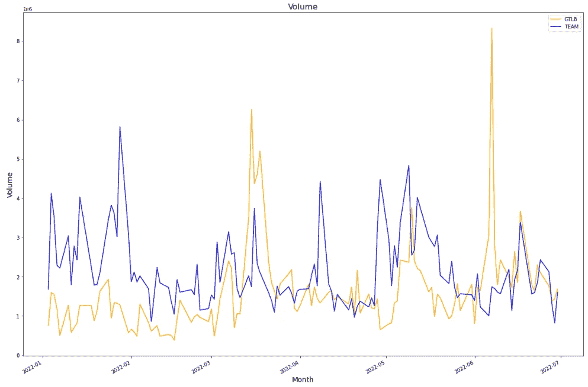

## 分析财务状况

分析股票的最后一步应该是查看财务状况(损益表、资产负债表和现金流量表)。对于 GitLab，分析将针对损益表中的毛利、资产负债表中的股东权益以及现金流量表中的总经营现金流。

为损益表收集数据很简单，如下所示。

```
# Set the ticker as GTLB
gtlb = yf.Ticker("GTLB")# Income Statement
gtlb.financials
```

下面应该是输出。

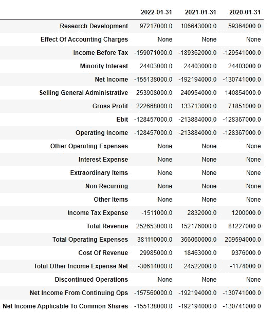

我们将使用下面的代码来收集毛利。

```
# Gathering Gross Profit Data and putting into a dataframegp = gtlb.financials.loc['Gross Profit']
gp_df = pd.DataFrame(columns=["Year", "Gross Profit"])
gp_df["Year"] = gp.index
gp_df["Year"] = pd.DatetimeIndex(gp_df["Year"]).year
gp_df["Gross Profit"]=gp.values
```

代码的第一行过滤到毛利。第二行创建了一个包含 Year 和 Gross Profit 列的数据框。第三行用日期填充数据框的年份列。第四行从日期中提取年份。代码的最后一行收集毛利并将其放入数据框的毛利列。

为了可视化趋势，我们使用下面的代码。

```
#Importing Seaborn package
import seaborn as sns#Plotting Gross Profit
sns.barplot(data=gp_df, x="Year", y="Gross Profit")
plt.show()
```

代码的第一部分导入 seaborn 进行绘图。下一部分绘制了年度和毛利的柱状图。输出如下所示。

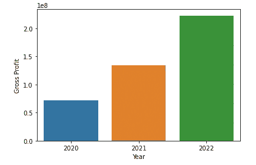

资产负债表和股东权益总额的代码也有类似的趋势。要收集的代码和输出如下。

```
gtlb.balance_sheet
```

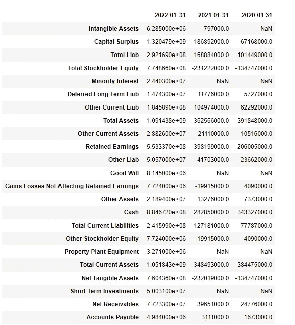

```
# Gathering Total Stockholder Equity and putting into a dataframese = gtlb.balance_sheet.loc['Total Stockholder Equity']
se_df = pd.DataFrame(columns=["Year", "Total Stockholder Equity"])
se_df["Year"] = gp.index
se_df["Year"] = pd.DatetimeIndex(se_df["Year"]).year
se_df["Total Stockholder Equity"]=se.values
```

此外，采用类似的操作，用下面的代码和输出来显示股东权益总额。

```
#Plotting Total Stockholder Equity
sns.barplot(data=se_df, x="Year", y="Total Stockholder Equity")
plt.show()
```

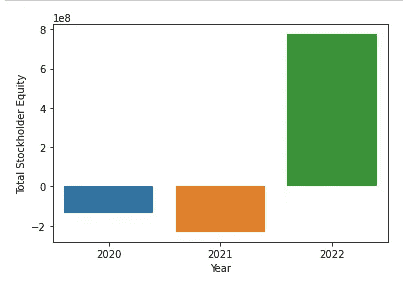

最后，下一部分将显示与上述两部分类似的现金流量表和总经营现金流量表。

```
gtlb.cashflow
```

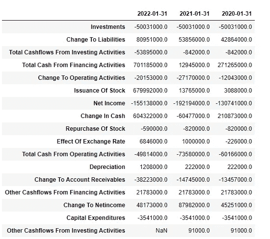

```
# Gathering Total Cash From Operating Activities and putting into a dataframecc = gtlb.cashflow.loc['Total Cash From Operating Activities']
cc_df = pd.DataFrame(columns=["Year", "Total Cash From Operating Activities"])
cc_df["Year"] = cc.index
cc_df["Year"] = pd.DatetimeIndex(cc_df["Year"]).year
cc_df["Total Cash From Operating Activities"]=cc.values#Plotting Total Cash From Operating Activities
sns.barplot(data=cc_df, x="Year", y="Total Cash From Operating Activities")
plt.show()
```

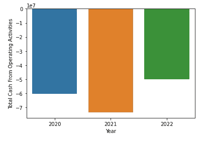

## 结论

对于上市公司来说，了解他们的股票趋势是至关重要的。此外，他们必须很好地了解自己与竞争对手相比的情况。最后，重要的是要知道趋势是如何在企业的财务中表现出来的。

我希望以上提供了一个体面的框架。希望听到您的反馈。

[](/mlearning-ai/mlearning-ai-submission-suggestions-b51e2b130bfb) [## Mlearning.ai 提交建议

### 如何成为 Mlearning.ai 上的作家

medium.com](/mlearning-ai/mlearning-ai-submission-suggestions-b51e2b130bfb)