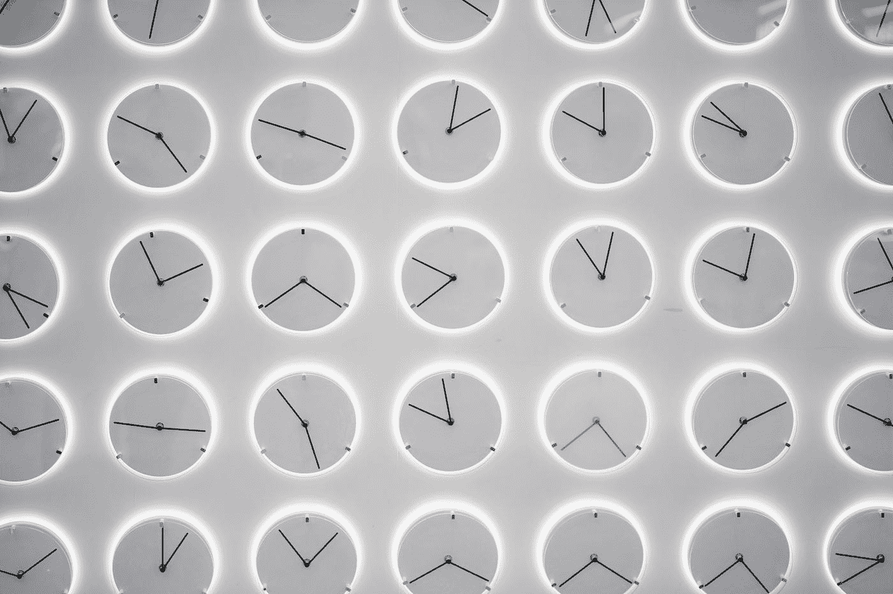
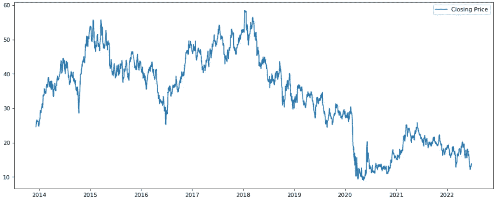
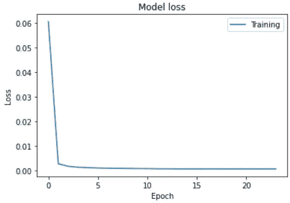
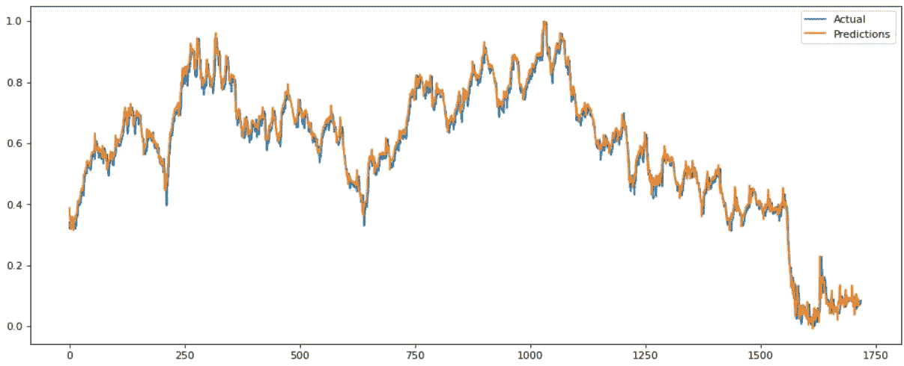
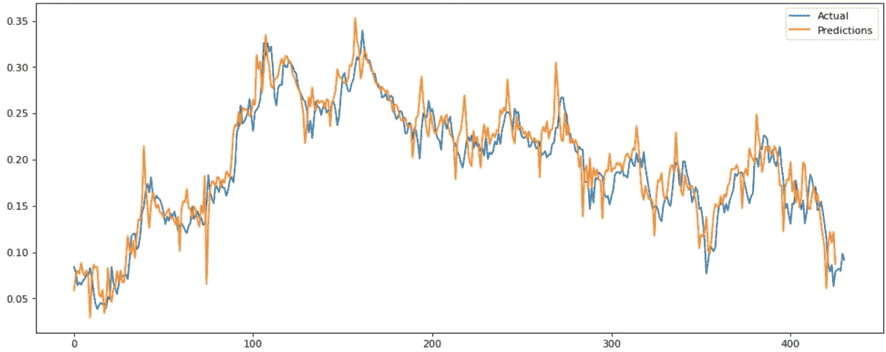
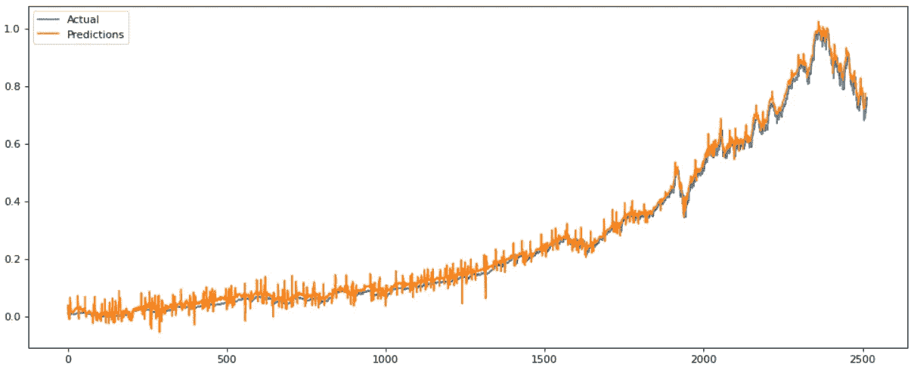

# 利用时间序列数据预测股票价格

> 原文：<https://medium.com/mlearning-ai/stock-price-prediction-using-time-series-data-f2895dff38e6?source=collection_archive---------2----------------------->

股票价格数据本质上是按时间顺序排列的。如你所料，每一天都跟随着前一天。

Photo by [Donald Wu](https://unsplash.com/@donaldwuid?utm_source=medium&utm_medium=referral) on [Unsplash](https://unsplash.com?utm_source=medium&utm_medium=referral)

为了预测未来的股票价格，使用一种特殊类型的神经网络，称为递归神经网络(RNN)。这种类型的网络不同于普通的 CNN，因为它将节点组织成一个时间序列。

要开始应用这个，我们首先需要访问时间序列股票数据。在本例中，[Ameritrade API](https://developer.tdameritrade.com/apis)用于生成数据文件，但是也可以使用其他来源。

上面的代码查询 Ameritrade APIs 并返回 10 年的股票价格数据，在本例中是美国航空公司的股票价格数据。绘制完成后，数据应该如下所示:

然后，蜡烛线数据被转换成熊猫数据框架，并为前一天的收盘价添加一个新列。然后保存到一个 CSV 文件中。

然后可以单独加载文件，开始处理预测。

将数据加载回 dataframe 后，需要将时间戳列设置为索引，然后必须将其调整到 0 到 1 的范围内，以便于处理。

为此，我们只缩放收盘价、成交量和前几天收盘价列。

现在，我们将把数据分成训练数据集和测试数据集。

重要的是，数据在时间序列的预定点被分割。在这种情况下，我们在 80%标记处将其分开，这意味着时间序列的后 20%将用于稍后测试预测。

接下来，我们必须打开数据窗口。这样做可以沿着时间序列创建数据片段，每个片段都将被独立训练。

在上面的例子中，数据被窗口化为 5 个样本的组。每组中的样本数量可以变化，结果会因使用的值不同而有很大差异。

数据现在已经准备好了，所以我们将继续构建 RNN 模型本身。这从创建一个回调函数开始，如果性能没有提高，就提前停止训练。

模型建立后，我们现在可以将它与数据进行拟合。最初，我们将在 50 个时期和 20 个批次中使用 0.0001 的学习率。

随着时代的运行，模型损失函数应随时间而降低。在这种情况下，大约 10 个时期后达到最佳结果。训练持续了一段时间，提前停止的回调在大约 25 个时期停止了训练。该模型现在已经训练完毕，可以进行一些预测了。

下面的代码片段加载以前加窗的训练数据，并生成新的预测。

该预测是训练期间的实际股票价格与预测价格的对比。由于我们是根据我们训练的相同数据进行预测的，因此通常会获得非常好的结果，如下所示:

如果我们现在根据保留的测试数据(我们在开始时分离的 20%)生成一个预测，可以生成一个更现实的预测。

在这种情况下，我们看到值之间有一些分离，但预测值通常遵循实际值。

然而，对该模型的真正考验是，它对另一个股票价格的概括能力有多强。为此，另一个股票价格被捕获到一个 csv 文件中(使用我们在开始时运行的相同代码)，然后加载到模型中以生成预测。以下示例显示了对 Microsoft 股票价格的预测:

总的来说，模型表现得相当好。预测中存在一定程度的噪音，但它很好地遵循了总体趋势。

最后要做的事情是建立能够预测明天股票价格的解决方案。为此，我们向数据序列添加另一个零值窗口。

然后，我们将像以前一样运行预测，但在这种情况下，最后一个窗口将包含未来预测。要提取实际预测，必须反转开始时应用的缩放比例。

这就完成了解决方案！

 [## Mlearning.ai 提交建议

### 如何成为 Mlearning.ai 上的作家

medium.com](/mlearning-ai/mlearning-ai-submission-suggestions-b51e2b130bfb)