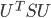
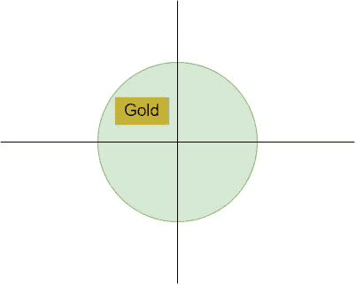
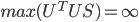
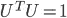
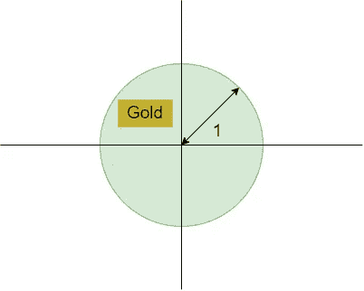
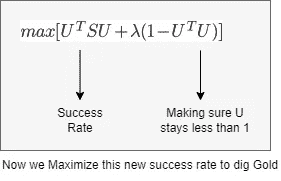
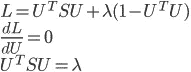

# 拉格朗日乘数的故事。

> 原文：<https://medium.com/mlearning-ai/story-of-lagrange-multiplier-9ca0899d9645?source=collection_archive---------8----------------------->

拉格朗日乘子为机器学习中的优化问题增加了必要的约束。让我们通过一个故事来理解这个概念，并了解为什么使用这些约束。

Photo by [Holly Mandarich](https://unsplash.com/@hollymandarich?utm_source=medium&utm_medium=referral) on [Unsplash](https://unsplash.com?utm_source=medium&utm_medium=referral)

# 是时候发现金矿了:

想象一下，有人告诉你在你的地方藏着一个大金矿。你想发现它，但你不知道从哪里开始。

假设挖掘金矿的*成功率*由下式给出:

*现在你要尽可能地挖，换句话说，你要最大化成功率:* ***最大化 U^TSU***

Location of Gold Mine at the digging area.

在上面的图表中，你可以从任何一点开始挖掘，挖掘到无穷远处，这样 U^TSU 的成功率就最大了。

因此，通过将 U =无穷大，U^TSU 的最大值变成无穷大。

因此，我们已经最大化了成功率的价值，并且 100%确定我们会找到金矿。很好。我们做到了？错了！！👎😯

生活并不那么容易，所以把无限放在一边意味着我们无限深挖 直到找到金矿，谁来做呢？

## 确定挖掘深度:

由于我们无法挖掘无限深，因此无法利用无限来最大化成功率，因此我们将可挖掘的最大深度设置为 1。
*因此，假设最大深度由以下约束给出:*

Max depth for digging=1

通过这样做，我们可以确保在挖掘时不会超过 1 米，好吗？
*现在剩下的唯一挑战是找到正确的方向，指引我们找到金矿。在上图中，向右的方向是圆的左上方。*

## 使用拉格朗日方法的时间:

很好，现在让我们在成功率中添加一个限制条件，将挖掘深度限制为 1，以便最大化挖掘深度。

这里***λ被称为拉格朗日乘子*** ，它控制着我们带入成功率方程的约束的影响。
您知道吗，加上约束条件后，上面的方程就正式叫做“拉格朗日方程”？😃

Photo by [Dmitry Demidko](https://unsplash.com/@wildbook?utm_source=medium&utm_medium=referral) on [Unsplash](https://unsplash.com?utm_source=medium&utm_medium=referral)

## 求解拉格朗日方程:

我们的新成功率(拉格朗日法)已准备好最大化，我们可以通过取导数并将其设置为 0 来求解，从而找到最大值。
*现在最大化拉格朗日将确保我们朝着金矿所在的正确方向前进。*😎

这些是一些最大化拉格朗日的简单数学步骤。

让我解释一下你在上面看到的三个方程:

1.  第一个方程是带有拉格朗日乘子的拉格朗日方程，我们想最大化它来找到我们的金矿。
2.  在第二个方程中，我们取拉格朗日的导数，将其设置为 0，这样我们就可以找到最大值。您可以使用任何优化求解技术，如梯度下降法来求解拉格朗日方程。
3.  最后，求解后，第三个方程表示解。

最终解:U^TSU = λ

在最后一个等式中，右边是我们开始解决问题时的初始成功率，对吗？我们想最大化它。
在左手边，你会看到变量 **λ** 这意味着我们成功率的最大值等于 **λ** 的最大值，嗯？

因此，如果我们想最大限度地提高寻找金矿的成功率，那么我们必须找到 **λ** 的最大值。 *(* **λ** *是根据我们当前方程的特征值，因此找到最大特征值就是正确答案)。*

耶！现在我们知道如何成功找到我们的金矿👑，感谢拉格朗日。🤗

这篇文章的目的是给你一个关于拉格朗日乘子的相当简单的直觉，以及它在解决机器学习中优化问题的大背景中的位置。很好！

## 一般形式:

这是拉格朗日量的一般形式。
这里， ***f(x) =成功率*** 和 ***g(x) =约束***

# 结论:

1.  *当我们在原方程 f(x)中加入一些约束时，会用到拉格朗日乘子。也可以添加多个约束。*
2.  *拉格朗日乘数* ***λ*** *充当约束的权重。*
3.  *加入约束和* ***λ，*** *后的方程称为拉格朗日方程。*
4.  *拉格朗日可以被求解以找到最大值或最小值。*
5.  *还有你摇滚！*👏

*感谢阅读。干杯！*🍻

# 与我联系:

***邮箱****:saurav@guptasaurav.com* ***领英****:*[*https://www.linkedin.com/in/sauravgupta20*](https://www.linkedin.com/in/sauravgupta20/)

 [## Mlearning.ai 提交建议

### 如何成为 Mlearning.ai 上的作家

medium.com](/mlearning-ai/mlearning-ai-submission-suggestions-b51e2b130bfb)