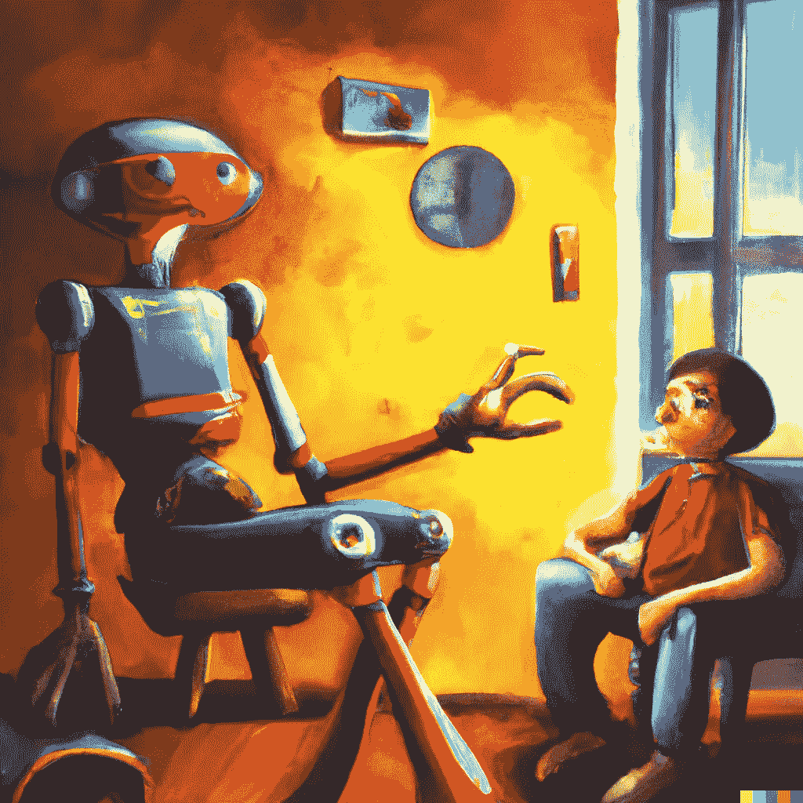
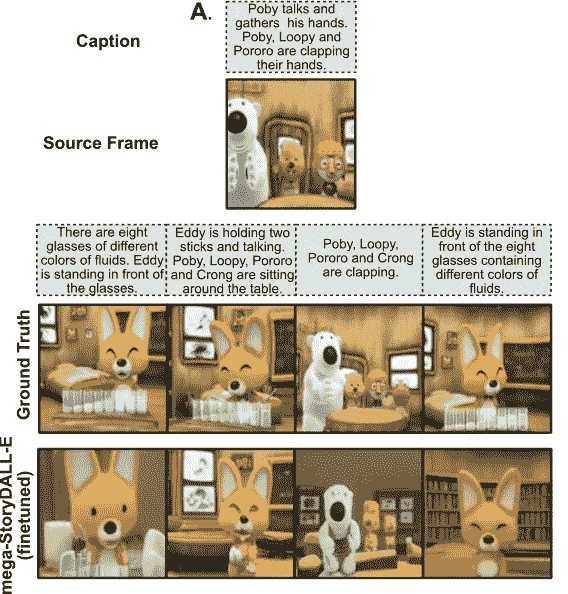
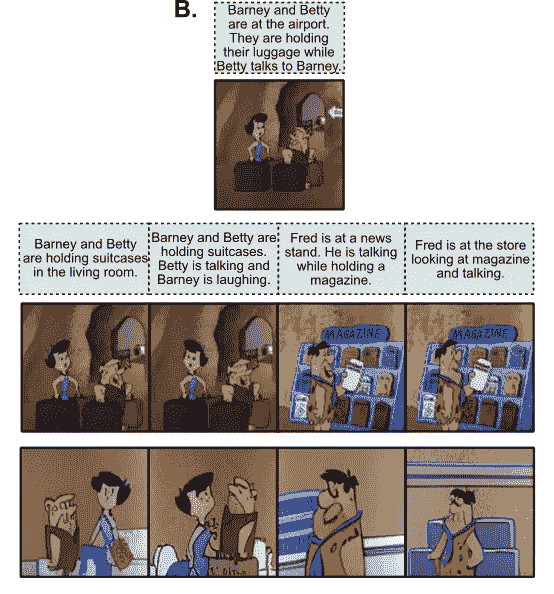
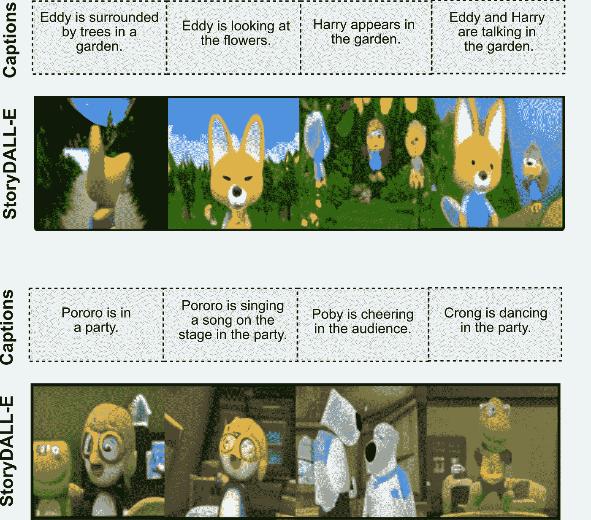
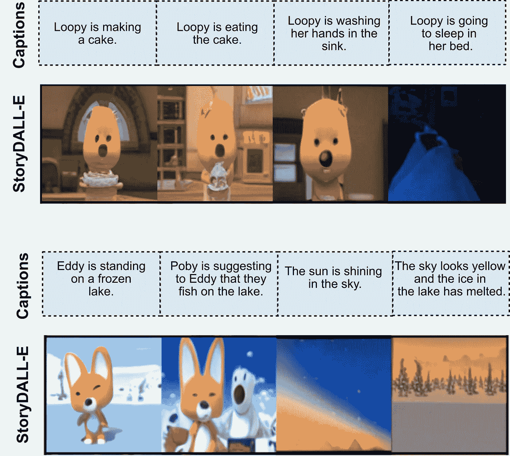

# 当人工智能开始讲故事时

> 原文：<https://medium.com/mlearning-ai/storydall-e-8d60b6577f5a?source=collection_archive---------4----------------------->

## 浅谈 DALL-E 的新故事可视化版本

Image by Author (generated by AI)

无论是技术人员还是非技术人员，我们在互联网上的任何地方都能看到人们痴迷于新的文本到图像的模式。从今年 4 月的 DALL-E 2 开始，涨势已经从谷歌的 Imagen 上升到现在的开源模型，如 StableDiffusion 和 MidJourney，后者实际上没有限制。你想到了什么，然后立刻创造出来。你猜怎么着？现在，这些艺术品可以在 Playform 这样的平台上购买和创作。

随着所有新的研究都朝着这个方向发展，如果另一个令人兴奋的事情从下面出现了呢？是的，现在 AI 也会讲故事了！这是 StoryDALL-E 在 2022 年 9 月的论文中提出的- [*StoryDALL-E:为故事延续*](https://paperswithcode.com/paper/storydall-e-adapting-pretrained-text-to-image) 调整预训练的文本到图像转换器，这是一个巨大的潜力。它能够通过从初始帧复制相关元素来连续生成图像，这是图像生成中的一个突破。

## StoryDALL-E:有什么新消息？

正如我们所知，在文本到图像合成方面正在进行激烈的研究，这导致了许多复杂的 GAN 架构和性能升级，但迄今为止在故事可视化方面几乎没有进展。StoryDALL-E 可能是同类产品中第一个基于文本转录和初始输入图像产生类似故事的序列图像。

StoryDALL-E 的基本工作原理是将地面真实场景和文本转录作为输入，并从中生成后续场景。所发生的是，当故事生成时，模型从源帧中提取视觉元素，如人物、物体和场景，并将它们复制到后续帧中。它也可以创造全新的角色或看不见的元素，但目前为止效果还令人满意。

**建筑**

在深入研究之前，我们需要大致了解 DALL-E 是如何工作的。 *DALL-E 是一个解码器专用的稀疏变换器*。120 亿参数架构主要使用 64 个注意层工作。简单来说，DALL-E 是 Open-AI 的 GPT-3 的扩展。GPT 3 号接收文本，并以文本形式作出回应，而另一方面，DALL-E 号以图像形式作出回应。它主要由两部分组成:将文本转换为潜在空间的转换器部分和将潜在空间转换为最终图像的 VAE 部分。一种文字到像素的映射。

StoryDALL-E architecture for prompt tuning setting. (Image strictly from the original paper)

看起来 StoryDALL-E 是一个创造性的微调 DALL-E 架构本身，但有一些额外的实现。在这里，他们采用了一个预训练的 DALL-E，带有插件，使其能够根据源帧有条件地生成图像序列。以下是插件:

**1。全球故事编码器**:原文称之为“*一个基于自我关注的编码器*”。Global Story Encoder 没有采用顺序处理的方法，而是依靠自我关注模块从单词嵌入中生成故事嵌入。它根据输入框架和转录提供预期故事的上下文。

**2。改装**:在微调过的 DALL-E 架构中，交叉关注块被插入 64 个自关注模块，在原文中称为“*改装*”。这使得模型能够在从源图像生成的后续图像中创建新的看不见的元素。

**数据集&结果**

StoryDALL-E 已经在两个数据集上进行训练- [PororoSV](https://paperswithcode.com/sota/story-visualization-on-pororo) 和 [FlintStonesSV](http://flintstones-dataset-dev-rev.s3-website-us-west-2.amazonaws.com/structure/) 。本文还提出了一个新的数据集来评估模型的泛化能力， [DiDeMo](https://paperswithcode.com/dataset/didemo) 。与包含后续帧中重复出现的字符的前两个数据集相比，这个新数据集有助于判断其创建全新字符的能力。

这里有一些直接来自[原始论文](https://arxiv.org/pdf/2209.06192v1.pdf)的精彩结果。该演示目前不可用，因此新图像将在公开发布后立即包含在内。

(Image strictly from the original paper implementation)

(Image strictly from the original paper implementation)

(Image strictly from the original paper implementation)

## **结论**

随着图像生成领域的研究越来越多，我们听到了许多令人兴奋的消息。现在人工智能可以创造一个完整的短篇故事，你一定会欣喜若狂。当考虑在故事情节中创造全新角色的能力时，StoryDALL-E 还有很多要走的路，但随着它开始的更多研究，毫无疑问我们可以在不久的将来看到杰作。别忘了查看 StoryDALL-E 的原始论文和官方 GitHub [回购](https://github.com/adymaharana/storydalle)

本文中的所有数字和数据都来自参考文献中的原始论文。

## 参考

[1].Adyasha Maharana、Darryl Hannan 和 Mohit Bansal。 [StoryDALL-E:为故事延续调整预训练的文本到图像转换器](https://arxiv.org/pdf/2209.06192v1.pdf) (2022)。arXiv 预印本 arXiv:2209.06192

[2].Lisa Anne Hendricks，Oliver Wang，Eli Shechtman，Josef Sivic，Trevor Darrell，Bryan Russell，加州大学伯克利分校，Adobe Research，INRIA。[用自然语言定位视频中的瞬间](https://arxiv.org/pdf/1708.01641v1.pdf) (2017)。arXiv 预印本 arXiv:1708.01641

[3].Aditya Ramesh，Mikhail Pavlov，Gabriel Goh，Scott Gray，Chelsea Voss，Alec 拉德福德，陈唐山，Ilya Sutskever。[零镜头文本到图像生成](https://arxiv.org/pdf/2102.12092) (2021)。arXiv 预印本 arXiv:2102.12092

 [## Mlearning.ai 提交建议

### 如何成为 Mlearning.ai 上的作家

medium.com](/mlearning-ai/mlearning-ai-submission-suggestions-b51e2b130bfb)