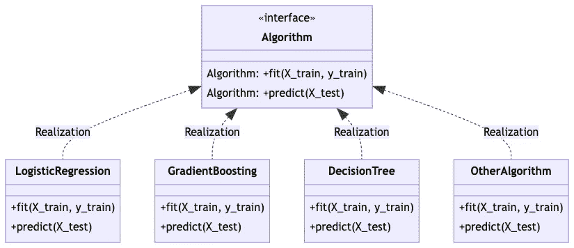
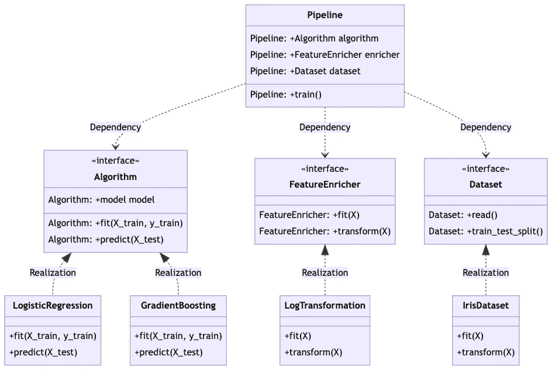
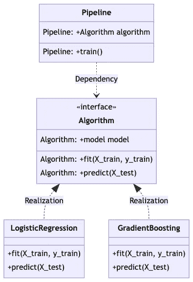

# 有效 ML 管道的策略设计模式

> 原文：<https://medium.com/mlearning-ai/strategy-design-pattern-for-effective-ml-pipeline-1099c5131553?source=collection_archive---------2----------------------->

Python **策略**和**工厂**设计模式帮助我们将复杂的问题构造成更小的部分，更容易扩展和修改，因此是有效的 ML 管道。

# **动机**

给定手边的 ML 问题，作为数据科学家，你可能想要试验 ML 管道的不同方面，例如特征工程、学习算法。对于每个方面，你也可以做很多不同的事情。例如，如果您决定尝试学习算法，您可以尝试使用不同的算法，从最简单的算法(如线性模型)到最复杂的算法(如神经网络、梯度推进)。如果您决定试验特征工程，有许多可能的特征组合，您也需要评估它们如何影响模型性能。更不用说如果你想同时尝试学习算法和特征工程。

> 在 ML 训练中做实验是一个复杂的问题。

Photo by [Markus Winkler](https://unsplash.com/@markuswinkler?utm_source=medium&utm_medium=referral) on [Unsplash](https://unsplash.com?utm_source=medium&utm_medium=referral)

# 学习目标

我们将学习在数据科学项目中派上用场的两种 Python 设计模式，即**策略**和**工厂**。

> 这篇博文中使用的代码是[这里是](https://github.com/ajisamudra/strategy-pattern-for-effective-ml-pipeline)

# **Python 设计模式**

## **工厂**

> 抽象工厂是一种创造性的设计模式，它解决了在不指定具体类的情况下创建整个产品族的问题。工厂定义了一个创建所有不同产品的接口，但是将实际的产品创建留给了具体的工厂类。[重构大师](https://refactoring.guru/design-patterns/abstract-factory/python/example#lang-features)

换句话说，Factory 中有两个类，抽象类和具体类。具体类是抽象类的子类。我们在抽象类中定义接口，而不指定它的具体实现。该接口被定义为**抽象方法**。接口的实现在具体的类中提供。abstractmethod 强制要求具体的类必须实现接口。有了这个，我们就可以创建尽可能多的具体类的不同实现，而不用担心实现是否会破坏代码。为什么？因为所有不同的具体类都有相同的接口。

**符合工厂模式的案例:**

**例 1:** Scikit-learn 著名接口 **`fit`** 和 **`predict`** 方法。这是一个例子，有很好的标准接口跨越库中可用的算法。

**示例 2:** 假设您想要为两个不同的库创建一个训练管道，即 Scikit-learn 和 lightgbm/xgboost/catboost。尽管它们具有相同的“拟合”和“预测”方法，但它们并不相同。在 lightgbm/xgboost/catboost 中，“fit”方法具有附加参数，如“early_stopping_round”和“eval_set ”,这些参数有助于防止模型过度拟合。另一方面，Scikit-learn 线性模型(LinearRegression、LogisticRegression 等)要求我们在调用“fit”方法之前执行特征缩放。这将有助于线性模型加快训练过程以达到最优解。只有两种不同的算法(线性模型和梯度推进)，我们需要区分管道中的过程。

**梯度推进** : (1)读取训练数据(2)分割数据进行训练和测试(3)拟合模型(4)预测(5)评估模型
**线性模型** : (1)读取训练数据(2)分割数据进行训练和测试(3)尺度特征(4)拟合模型(5)预测(6)评估模型

通过在**包装器方法‘fit’和‘predict’**中包装不同的过程，工厂对于我们创建不同 ML 库的标准接口是有用的。

## **策略**

> 策略是一种行为设计模式，它将一组行为转化为对象，并使它们在原始上下文对象中可以互换。称为 context 的原始对象包含对策略对象的引用，并委托它执行行为。为了更改上下文执行其工作的方式，其他对象可能会用另一个对象替换当前链接的策略对象。[重构大师](https://refactoring.guru/design-patterns/strategy/python/example#lang-features)

换句话说，我们在策略模式中使用不同的具体类实现。它使我们能够在相同的问题背景下互换行为/策略。

**符合策略模式的示例案例:** 在 ML 训练管道问题中，我们把训练管道分成几个部分:(1)管道(2)数据(3)算法(4)特征工程等。

1.  如果我们将管道设计成一个上下文对象。
2.  我们可以有不同的算法作为不同的行为/策略。
3.  我们可以将不同的特征工程或数据集作为不同的策略。

因此，以后如果我们想要添加新的算法或功能工程或数据集，我们只需为算法或功能工程创建一个新的具体类，而无需修改管道或上下文对象。简而言之，我们的代码很容易修改和扩展。

# 履行

我们去编码吧！在本例中，我们使用虹膜数据集。它有 3 个类，我们把这个问题框架为一个多类分类问题。为此，我们使用不同库中的两种算法:

1.  来自 Scikit-learn 的**logistics regression**
2.  **light GBM 的 LGBMClassifier**

如前所述，我们需要为每个算法实现不同的过程。
**LGBMClassifier** : (1)读取训练数据(2)分割数据以进行训练和测试(3)拟合模型(4)预测(5)评估模型
**逻辑回归** : (1)读取训练数据(2)分割数据以进行训练和测试(3)尺度特征(4)拟合模型(5)预测(6)评估模型

## 以前

我们如何创建一个能够训练不同算法的管道？最简单的方法是以函数式编程的方式使用 if-else 语句。对于每个 if-else 块，我们为一个算法定义了唯一的过程。这就是我们的代码看起来的样子。

您可能会注意到，我们在这里没有遵循 DRY 原则，因为我们重复了步骤(5)评估模型。但是我们不能合并步骤(5 ),因为在 LogisticRegression 中我们需要进行特征缩放，而在 GradientBoosting 中我们不需要。想象一下，如果您需要在管道中添加一个新的算法。您需要为这个算法添加一个新的 if-else 块，并且可能为不同的算法重复相同的代码。如果你有很多算法，也很难维护。我们将以一个非常长的函数结束，这不是一个好的实践。让我们看看策略和工厂模式能做什么。

## 在...之后

为了实现策略和工厂模式，我们需要从函数式编程切换到面向对象编程。我们需要两个高级对象:**上下文**和**策略**。在我们的例子中，训练管道是我们的上下文对象。上下文可以采用工厂模式中定义的各种**策略对象。**

上下文对象将如下所示。它采用不同的算法(即策略对象)作为输入。算法策略是可以互换的，所以如果我们想在管道中添加一个新的算法，我们不需要改变上下文对象。

注意，现在算法对象只有包装器“fit”和“predict”。“适应”和“预测”背后的不同过程将在工厂模式中定义。

用工厂模式实现算法策略怎么样？
在这里，我们需要定义抽象类和具体类。抽象类只定义接口。我们将包装器“fit”和“predict”定义为抽象方法。

具体的类为每个算法定义了不同的实现。例如，在 LogisticRegression 中，我们需要在拟合模型之前先缩放 X 上的要素。然后，我们需要保存 scaler 对象，我们稍后将在 predict 方法中使用它。上下文对象不知道这个不同的实现，因为它只需要包装器“fit”和“predict”。

我们现在已经实现了不同的算法策略。在此设置中，我们可以为特征工程/数据集添加新的策略对象。现在可以更容易地在管道(上下文对象)周围添加新的策略块。

# 结论

策略和工厂模式是有用的，尤其是当你在特定的环境中有很多可能的“策略”时。

# 参考

1.  重构大师:[https://refactoring.guru/](https://refactoring.guru/)
2.  Arjan 代码——写出更好的 Python 代码:【https://github.com/ArjanCodes/betterpython 

 [## Mlearning.ai 提交建议

### 如何成为 Mlearning.ai 上的作家

medium.com](/mlearning-ai/mlearning-ai-submission-suggestions-b51e2b130bfb) 

[成为 ML 作家](/mlearning-ai/mlearning-ai-submission-suggestions-b51e2b130bfb)