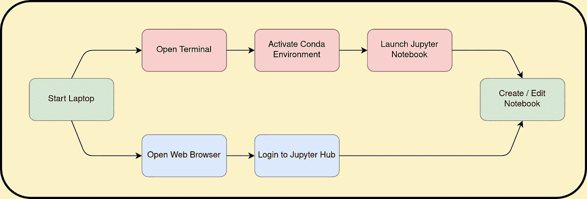
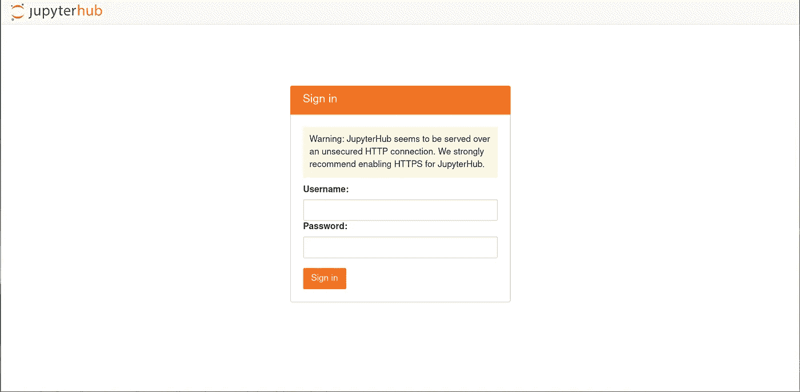
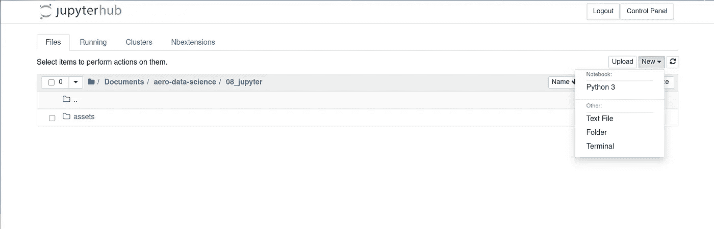
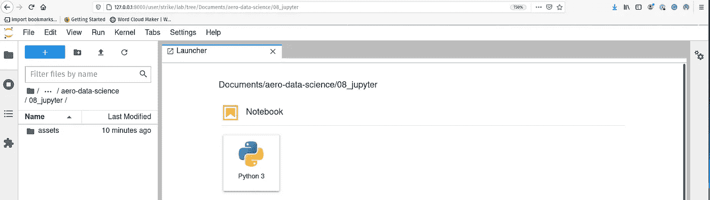
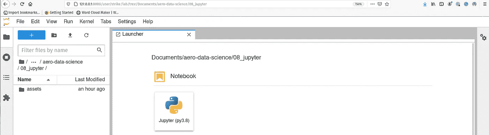
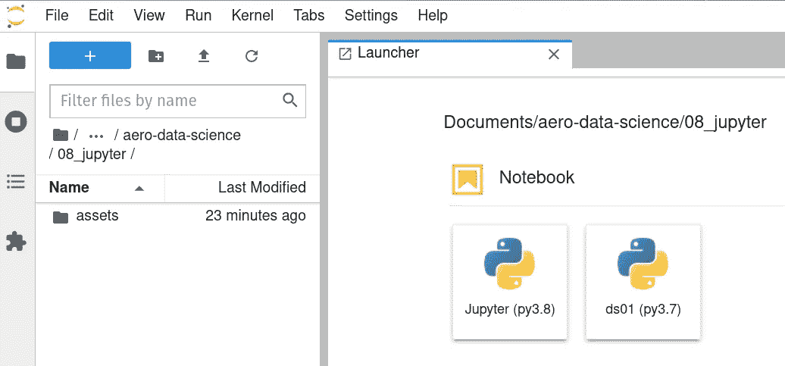
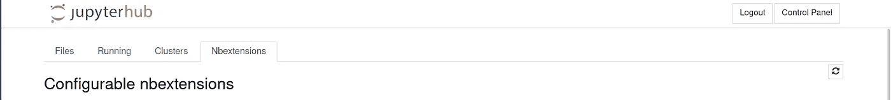
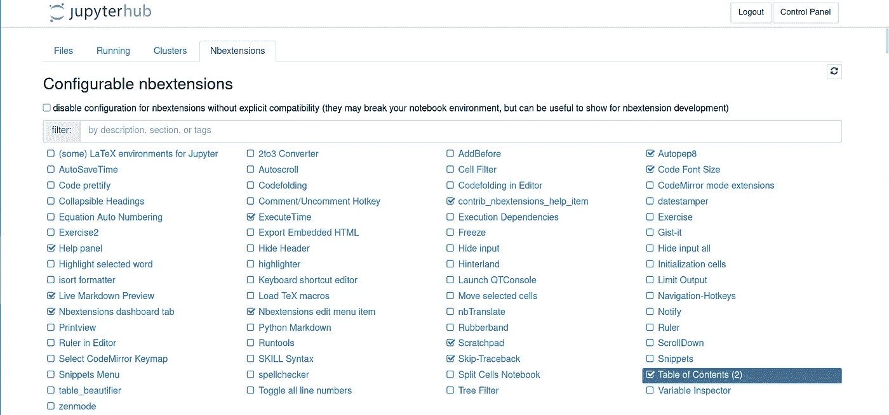

# 通过 Jupyter Hub 简化您的数据科学体验

> 原文：<https://medium.com/mlearning-ai/streamline-your-data-science-experience-with-jupyter-hub-3af05d37d26d?source=collection_archive---------2----------------------->

## 使用 Jupyter Hub、ipykernel 和 systemd 改善您的工作流程


Photo by [Estée Janssens](https://unsplash.com/@esteejanssens?utm_source=unsplash&utm_medium=referral&utm_content=creditCopyText) on [Unsplash](https://unsplash.com/s/photos/notebook?utm_source=unsplash&utm_medium=referral&utm_content=creditCopyText)

# 范围

作为 *Jupyter 笔记本*和/或*实验室*的狂热用户，本指南展示了如何自动启动 *Jupyter* 服务器，允许您使用 web 界面选择所需的 *Python* 环境，然后开始编码。

如果像我一样，你的典型工作流程是启动一个终端，在运行`jupyter notebook`或`jupyterlab`之前激活你想要的 *Python* 虚拟环境，那么这个指南应该提供一个更容易和更完整的体验。它是通过将`jupyterhub`安装到专用的虚拟环境中，设置对多个 *iPython* 内核的访问，并使用一个`systemd`启动脚本(用于相关的 *Linux* 发行版)在系统启动时启动`jupyterhub`来实现的。

不建议服务器使用此设置(根据并行用户的数量，服务器已经有了专用指南)；此外，该指南适用于*Linux*； *Mac* 和 *Windows* 用户可以遵循类似的方法，除了自动启动 *Jupyter Hub* 。


Image by the Author | See below for full Attribution details

# 介绍

像许多数据科学家一样，我利用最佳实践来创建专用的、可控的和已知的 Python 环境，使用像 T5 这样的工具。同样，我也热衷于使用 *Jupyter* 生态系统，尤其是 *Jupyter 笔记本*以及有时 *Jupyter 实验室*。下图中的顶部分支代表了我的典型工作流程:



Jupyter Workflow | by the Author

底部分支是我最近采用的新工作方式，虽然表面上看起来像是节省了一个步骤，但实际上对于经常与 Jupyter 打交道的人来说，这种体验的改善更为显著。最终结果是一个环境，其中 *Jupyter Hub* 总是在后台运行，因此 *Jupyter 笔记本*和*实验室*都是按需可用的。此外，我没有明确地激活一个特定的`conda`环境，因为它可以直接从 web 界面选择和更改。

我很欣赏在没有真正使用 *Jupyter Hub* 本身的情况下*可以实现这一点，但是我发现当所有元素组合在一起时会容易得多。*

最后，许多用户要么在云中运行 *Jupyter* ，要么在一个服务器(本地或远程)上运行，那里有专门的指南。关键的区别是获得传输层安全性(TLS)证书来可验证地加密客户端和服务器之间的通信:

 [## 最小的 JupyterHub -最小的 JupyterHub v0.1 文档

### 针对单台服务器上少量(0-100)用户的简单 JupyterHub 发行版。我们建议在什么时候阅读…

tljh.jupyter.org](https://tljh.jupyter.org/en/latest/) 

# Jupyter 中心设置

## Conda 设置

本指南假设您有一个使用`mamba`的 *Miniconda* 或 *Miniforge* 的工作环境，这是我的建议:

[](https://github.com/conda-forge/miniforge) [## 康达锻造厂/小型锻造厂

### 这个库包含了一个针对 conda-forge 的 Conda 最小安装程序。它与 Miniconda 相当，但与…

github.com](https://github.com/conda-forge/miniforge)  [## Miniconda - Conda 文档

### Miniconda 是 conda 的免费最小安装程序。它是 Anaconda 的一个小型引导版本，只包含 conda…

docs.conda.io](https://docs.conda.io/en/latest/miniconda.html) 

企业/商业用户请注意 *Anaconda* 关于从 2020 年 8 月起`conda`使用`main`频道的许可变更，这可能会限制您可以访问的*频道*。

## 创造环境

对于普通读者来说，下面的设置应该是熟悉的，但通常是不言自明的。因此，在您的首选终端中键入以下内容:

Conda environment for Jupyter Hub | by the Author

鉴于即将推出的 *Python 3.10* ，我已经将我使用的 *Python* 版本撞上了最新的 3.8 版本(在撰写本文时为 3.8.8)以及包括`autopep8`在内的流行的`jupyter_contrib_extensions`包。

在此阶段启动`jupyterhub`应显示以下内容:



Screenshot of the *Jupyter Hub* Login Page | by the Author

可以通过 [http://127.0.0.1:8000](http://127.0.0.1:8000) 访问该页面(假设 8000 端口是空闲的)，然后使用您的系统登录详细信息，即使用您用于登录您的 *Linux* 发行版的相同用户名和密码。

默认情况下， *Jupyter Hub* 会重定向到 *Jupyter Notebook* 服务器([http://127 . 0 . 0 . 1:8000/user/<username>/tree](http://127.0.0.1:8000/user/strike/tree))，但是实验室也可以通过:[http://127 . 0 . 0 . 1:8000/user/<username>/Lab](http://127.0.0.1:8000/user/<username>/lab)访问:



Screenshot of Jupyter Notebook Server with New Notebook Menu | by the Author

当创建一个新的笔记本时，我们有一个无用的“ *Python 3* ”显示条目，这里不清楚它指的是哪个`conda`环境。显示与 *Jupyter Lab* 相似:



Screenshot of Jupyter Lab with New Notebook Menu | by the Author

如果您不清楚，那么“Python 3”实际上是指本指南中创建的`jupyter`环境。下一步是更新显示名称，并使其他的`conda`环境可以从同一个 *Jupyter* 实例中访问。

# Jupyter Python 内核

当你安装 *Jupyter* 时，默认情况下它会安装`ipython`内核，但是被限制在当前的`conda`环境中(很明显)。以下命令显示系统上当前可访问的内核和所有环境:

List of Accessible Kernels | by the Author

上面的代码片段显示，与系统上总共五个`conda`环境相比，该环境中只有一个内核可用。

## 重命名现有内核

第一步是将现有的内核重命名为更容易识别的名称。每个内核的属性和元数据都包含在一个名为`kernel.json`的专用文件中。上面代码片段中的第 5 行显示了包含以下内容的文件的路径:

Kernel JSON file | by the Author

第 9 行包含`display-name`，它应该在文本编辑器中或通过命令行更改为“Jupyter (py3.8)”，如下所示:

Updated Kernel JSON file | by the Author

刷新 *Jupyter 笔记本*或*实验室*将显示更新的描述:



Screenshot of Jupyter Lab with updated description | by the Author

截图显示了现有内核的更新版本`display-name`，现在更加清晰地显示了环境(`Jupyter`)和版本 *Python* ( `py3.8`)。

## 附加内核

我们想使用`jupyter` `conda`环境(及其 *Jupyter Hub* 安装)直接从 web 界面访问其他`conda`环境。这在 i [python 文档](https://ipython.readthedocs.io/en/stable/install/kernel_install.html#kernels-for-different-environments)中有详细描述，用于访问多个内核，演示如下:

Adding ds01 to shard kernel list | by the Author

上面的例子显示了`ds01` `conda`环境的激活和`ipython`内核在环境(`— name`)`ds01``display-name`“ds01(py 3.7)”的用户空间中的安装。这也反映在 *Jupyter 笔记本* / *实验室*中:



Screenshot of Jupyter Lab with ds01 environment added | by the Author

应该注意的是，共享内核不仅仅是创建一个新的笔记本。基于一个内核的现有笔记本可以在加载后切换到使用不同的内核，这意味着单个项目可以从单个界面使用多个环境。例如，你可以有一个专用于可视化的环境，另一个用于深度学习，另一个用于文档等。

还应该注意的是，对于如何显示环境，目前没有定制的排序选项。默认是按字母顺序排列的，所以如果你喜欢，你可以使用数字前缀来改变环境的顺序，比如`1_`、`2_` 或者`A_`、`B_`等等。

设置好所需的易用环境`jupyter`后，下一步是自动启动 *Jupyter Hub* 。

# 带 Systemd 的自动装载 Jupyter Hub

这一步仅限于使用`systemd`的 *Linux* 发行版，并基于这个伟大的 *Stackoverflow* 答案加上`Environment`变量:

[](https://stackoverflow.com/questions/53928299/how-to-convert-a-python-script-in-a-local-conda-env-into-systemd-service-in-linu) [## 如何将本地 conda env 中的一个 python 脚本转换成 Linux 中的 systemd 服务？

### 感谢贡献一个堆栈溢出的答案！请务必回答问题。提供详细信息并分享…

stackoverflow.com](https://stackoverflow.com/questions/53928299/how-to-convert-a-python-script-in-a-local-conda-env-into-systemd-service-in-linu) 

作为一点背景知识，在用`systemd`启动系统时，需要克服多个障碍。首先，由于`conda`本身的原因，有一个抽象层`systemd`跟随着另一个抽象层。经过反复试验，这些步骤允许(至少对于 *Ubuntu 20.04* )正确的`conda`环境用于`jupyterhub`自动加载。所需的`systemd`维修文件是:

Systemd Service file for Jupyter Hub | by the Author

标签`<username>`应该替换为您的用户名。本质上，系统启动时加载 *Jupyter Hub* 有两个部分:

1.  使用正确的命令构建正确的服务文件
2.  以`user`而不是`root`的身份运行服务

## 构建服务文件

构建服务文件的两个困难部分是设置正确的`PATH`变量和设置正确的环境变量。

`ExecStart`需要的命令是:

```
/bin/bash -c 'PATH=/home/<username>/miniconda3/envs/jupyter/bin:$PATH exec jupyterhub'
```

它包含 shell 的绝对路径(`/bin/bash`)和一个命令，该命令更新`PATH`变量以反映`conda`及其二进制文件的位置，然后运行`jupyterhub`命令。

第二部分是传递正确的环境变量；这些可以通过运行`env`命令获得:

List of Conda related Variables | by the Author

对于`systemd`，列表需要转换成空格分隔的单行列表，而不是换行符分隔的列表。然后这些被复制到`Environment=`参数的服务文件中。

## 启用和启动 Systemd 服务

有了`systemd`，通过将服务文件作为`jupyterhub.service`放在`~/.config/systemd/user/`中，可以在没有`root`权限的情况下运行。以下命令重新加载服务文件列表，检查其状态并启动测试过程:

Systemd Service Check | by the Author

第一个命令确保`systemd`从用户目录加载服务文件。status 命令确认没有格式或参数错误(这些错误以红色作为附加消息列出)。为了测试服务文件，`start`命令允许用户启动服务，可以通过访问 [http://127.0.0.1:8000](http://127.0.0.1:8000) 或 [http://localhost:8000](http://localhost:8000) 进行检查。再次运行`status`命令显示运行`jupyterhub`的输出。

这些步骤确认服务文件按预期工作。为了确保服务在系统启动时即笔记本电脑启动时启动，必须显式启用该服务。最后的测试当然是重启机器，并在登录后检查 *Jupyter Hub* 是否确实在运行。

# 配置 Jupyter 笔记本扩展

在 Jupyter 笔记本的基础上，我推荐几个 poplar 扩展。我不会详尽地介绍这一点，因为有许多可用的指南。要访问扩展页面，只需点击`NBextensions`选项卡:



Screenshot of Nbextensions tab | by the Author

我推荐以下扩展(你可以通过点击来阅读每个扩展):

*   帮助面板-是的，你可以按下 Shift 键，但这是一个很好的备份
*   实时降价预览—在您键入时查看降价渲染
*   ExecuteTime —最有用的特性是知道命令的运行时间
*   暂存器—例如，按 CTRL+B 获得运行局部变量的临时环境
*   跳过追溯—使错误消息更易于管理
*   Autopep8 —轻松格式化代码单元格；我主要用它来清理用锤子按钮手工输入的列表
*   目录—可以显示笔记本中所有标题的侧菜单



Screenshot of Configured Notebook Extensions | by the Author

# 摘要


Jupiter and one of its moons — Io | Image by [flflflfl](https://pixabay.com/photos/io-jupiter-planet-astronomy-2773533/) from Pixalbay

本指南介绍了三个组件，以实现更好的 *Jupyter 笔记本*或*实验室*体验。第一步是将 *Jupyter Hub* 安装到专用的`conda`环境中。第二步是重命名现有的`kernel`，使其更加明显，并与适当的`display-name`共享来自不同`conda`环境的其他内核。最后一步是激活新的`conda`环境，并使用`systemd`自动运行`jupyterhub`。作为奖励，一些基本的扩展也被推荐给了 Jupyter 笔记本。

最终结果是一个易于使用的基于 web 的环境，允许在`conda`环境之间轻松切换。

# 属性

所有`gists`，笔记本，终端演员表均为作者。所有的艺术作品都是基于明确的 [CC0、公共领域](https://creativecommons.org/share-your-work/public-domain/cc0/)许可或 [SIL OFL](https://scripts.sil.org/cms/scripts/page.php?item_id=OFL_web) 的资产，因此不侵权。主题灵感来自并基于我最喜欢的`vim`主题:[grubbox](https://github.com/morhetz/gruvbox)。