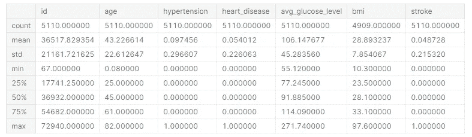
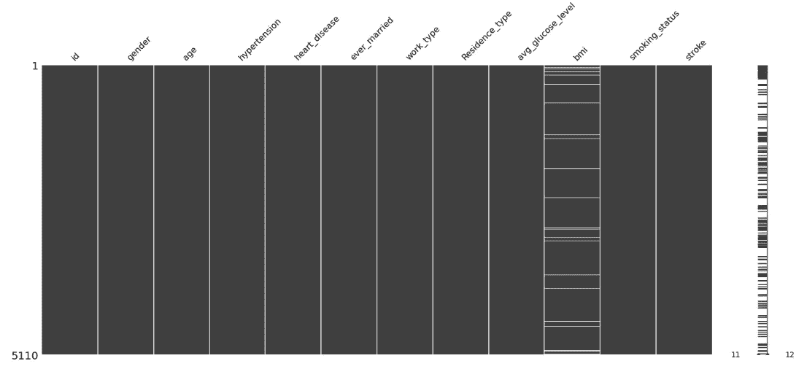
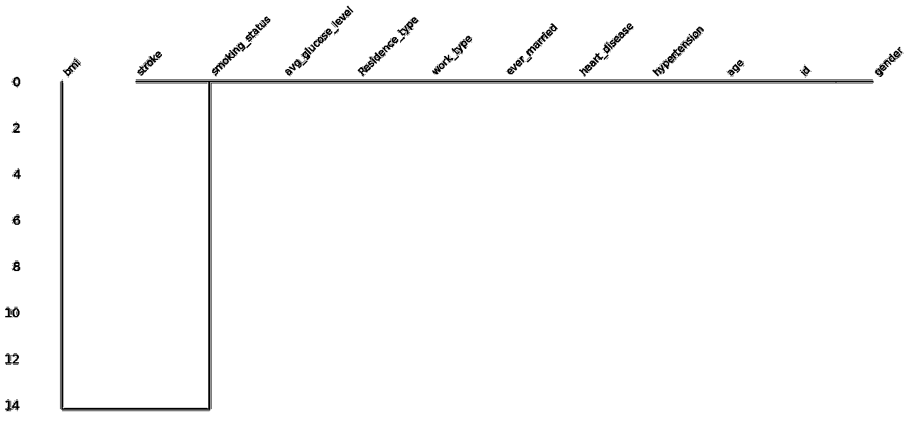
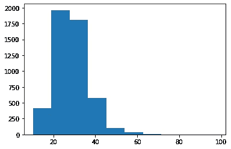
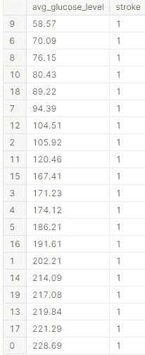

# 使用 Python 的机器学习回归进行中风预测

> 原文：<https://medium.com/mlearning-ai/stroke-prediction-using-machine-learning-regression-with-python-c0bc8ad5f8b8?source=collection_archive---------4----------------------->

中风是世界上最严重的医学问题之一，每年导致数百万人死亡，并被世界卫生组织(世卫组织)强调为严重的医学问题。

# 介绍

当我们冒险需要数据时，我们首先必须考虑患者保密原则，因为我们不能透露患者的某些细节，即使他们的姓名被隐藏，包括家族史和遗传学。

用于使用 python sklearn 库演示建模框架的数据在 Kaggle 上是公开可用的，并且用于学习，因此在 ka ggle 上不存在这种性质的问题。


Photo by [Markus Winkler](https://unsplash.com/@markuswinkler?utm_source=medium&utm_medium=referral) on [Unsplash](https://unsplash.com?utm_source=medium&utm_medium=referral)

# 数据理解

在将数据建模为业务解决方案之前，我们必须了解数据以及它能产生什么。根据公开数据集，我们可以理解数据中的以下特征意味着:

```
id                   The patient's identification tag assigned.
gender               The Biological sex of the patient.
age                  The patient's age at admittance.
hypertension         The patient's blood pressure intensity.
heart_disease        The patient is/not with the heart diesease.                    
ever_married         Status of Marriage of the patient.
work_type            Patient's employment classification.
Residence_type       Patient's residence classification.
avg_glucose_level    Patient's average level of sugar.
bmi                  patient's total body mass.
smoking_status       patient's does/does not smoke.
stroke               patient's did/didnt have a stroke.
```

# 建模方法

我们必须首先识别和理解数据及其所有特征，因为我们可能会发现更多有价值的特征，这些特征可以让我们对数据有更深入的了解，并做出更有价值的预测。

```
# Import basic libraries
import pandas as pd
import numpy as np
%matplotlib inline
import seaborn as sns
import missingno as mn
```

## 1.文件介绍

```
# Enter kaggle link in pandas and set file name as 'df'df =  pd.read_csv(r'/kaggle/input/stroke-prediction-dataset/healthcare-dataset-stroke-data.csv')# view first five rowsdf.head(5)
```

## 2.检查变量的所有统计数据

```
*# lets check all stats*
df.describe()
```



Authors Visualization

## 3.检查缺少的值

```
*# lets check for null values* 
df**.**isnull()**.**sum()OUTPUT:id                     0
gender                 0
age                    0
hypertension           0
heart_disease          0
ever_married           0
work_type              0
Residence_type         0
avg_glucose_level      0
bmi                  201
smoking_status         0
stroke                 0
dtype: int64# we can see that bmi has 201 missing values
```

## 4.检查缺失的值关系

```
*# we need to first examine connections of missing values* 
mn**.**matrix(df)
# Based on the output below we can see values are missing at random 
```



Authors Visualization

## 5.我们形象化了缺失值连接的树状图

```
mn.dendrogram(df)
```



Authors visualization

```
*# so we can fill bmi's missing values with smoking_status values as we can see the connection from the dendrogram*df[df['bmi'].isnull()]['smoking_status'].value_counts()OUTPUT:Unknown            61
smokes             52
formerly smoked    48
never smoked       40
Name: smoking_status, dtype: int64
```

## 6.我们通过计数检查患者体内记录的身体质量指数水平。

```
from matplotlib import pyplot as plt
plt.hist(df['bmi'])
```



Authors visualization

## 7.小心警戒！

由于上述身体质量指数水平的数据过于外推，仅使用一个类别来填充剩余的缺失值是不安全的

```
*# instead we shall use interpolation to fetch the nearest form of data to fill the missing values*df['bmi'] = df['bmi'].interpolate(method ='linear', limit_direction='forward')*# lets check if that worked* 
df.isnull().sum()OUTPUT:id                   0
gender               0
age                  0
hypertension         0
heart_disease        0
ever_married         0
work_type            0
Residence_type       0
avg_glucose_level    0
bmi                  0
smoking_status       0
stroke               0
dtype: int64
```

因此，我们现在已经填充了所有缺失的值，如上所示。

## 8.我们按卒中对平均血糖水平进行分类，以观察卒中原因是否取决于患者计数的平均血糖水平。

```
# check by first 20 rows and place in a object called 'measure'measure = df[['avg_glucose_level','stroke']].head(20)
```



Authors visualization

## 9.在散点图中检查中风患者的平均血糖水平

```
*# lets check the relationship throughout all given datapoints in both attributes*
df.plot.scatter('avg_glucose_level','stroke')
```


Authors Visualization

显示出葡萄糖水平是随机变量，并且在中风患者和非中风患者中是高的。

# 机器学习建模

在基于监督回归的机器学习算法中使用线性回归进行预测。

## 10.*让我们删除不必要的分类列*

```
df.drop(['gender'], axis=1, inplace=True)df.drop(['smoking_status'], axis=1, inplace=True)df.drop(['ever_married'], axis=1, inplace=True)df.drop(['work_type'], axis=1, inplace=True)df.drop(['Residence_type'], axis=1, inplace=True)
```

## 11.我们设置 x 和 y 变量，通过将 x 作为中风，将 y 作为中风相对于 x 的预测数据，来预测中风。

```
x = df.drop(['stroke'], axis=1)
y = df['stroke']
```

## 12.机器学习的导入算法。

```
from sklearn.linear_model import LinearRegression
from sklearn.model_selection import train_test_split as ttl
```

## 13.分割数据，拟合和测试模型

```
*# lets split the training and testing data* 
# tx,ty are training data and tey and tex are testing datatx, tex, ty, tey = ttl(x, y, test_size=0.3, random_state=0)# Create Regression
Model_str = LinearRegression() *# now lets fit the training data* 
Model_str = Model_str.fit(tx,ty)# *Now to predict with the test data* 
Model_str.predict(tex)# Place predicted outputs in a variable
prediction = Model_str.predict(tex)
```

## 14.检查模型结果并保存模型

```
# CHECK MODEL INTERCEPT
Model_str.intercept_OUTPUT:
-0.039604964329334226# CHECK MODEL COEFFICIENT
Model_str.coef_OUTPUT:array([ 3.47715041e-08,  2.04813204e-03,  3.34073078e-02,  9.02350420e-02,2.48261512e-04, -1.26123592e-03])# Save your model for future use on another machine with the same datamodel**.**save('Stroke Regression Model by Ammar')
```

# 结论

因此，虽然我们的模型可以工作，但在使用之前需要进行改进，因为该指标还没有显示其部署就绪！

然而，这是一个很好的概念证明，证明了我们如何使用回归来预测中风。

# 作者指出

我希望这对你在工作场所或学术机构的医疗保健领域的机器学习项目有所帮助。

我期待您对我工作的改进提出反馈和建议。

# 我是谁


嘿，伙计们，我目前正在伦敦大学攻读数据科学硕士学位，并作为一名自由职业者在 Upwork 上从事分析工作。如果您对任何基于分析/数据科学/机器学习的项目有任何评论、批评或任何建议需求。请随时在 LinkedIn 上联系我。您可以使用我的 Github/ka ggle python 代码模板库和已经制作的可视化和机器学习模型来实现或参考。

> *领英:*[*https://www . LinkedIn . com/in/goto-resumemuhammad-ammar-jamshed-029280145/*](https://www.linkedin.com/in/goto-resumemuhammad-ammar-jamshed-029280145/)
> 
> *GitHub:*T10*https://github.com/AmmarJamshed*
> 
> *卡格尔:*[*https://www.kaggle.com/muhammadammarjamshed*](https://www.kaggle.com/muhammadammarjamshed)

[](/mlearning-ai/mlearning-ai-submission-suggestions-b51e2b130bfb) [## Mlearning.ai 提交建议

### 如何成为 Mlearning.ai 上的作家

medium.com](/mlearning-ai/mlearning-ai-submission-suggestions-b51e2b130bfb)