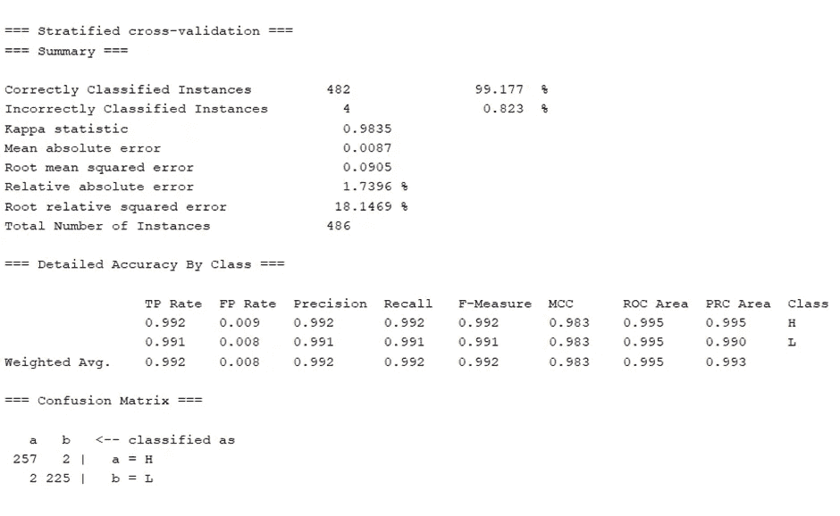
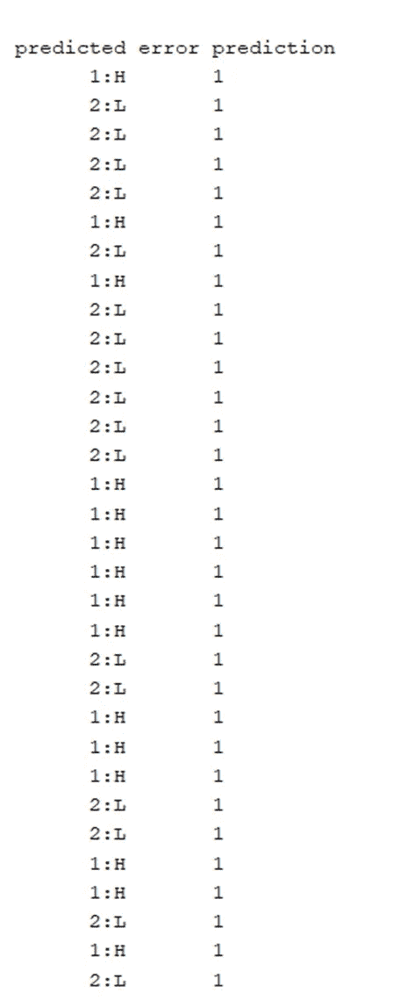
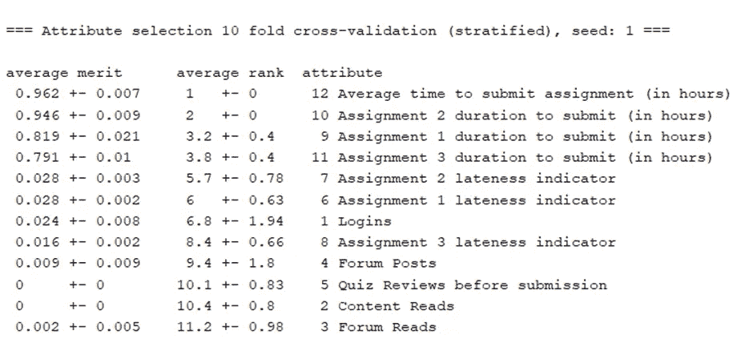

# 使用 weka 的学生学习材料投入预测模型

> 原文：<https://medium.com/mlearning-ai/student-study-material-engagement-prediction-model-using-weka-bd2a2ee97cd8?source=collection_archive---------2----------------------->

## 数据挖掘项目

## 在没有编码知识的情况下，您可以使用 weka 工具训练模型、预测数据集分类标签、要素选择等。

> 数据集详细信息

**描述:**

本项目将使用学生参与度预测数据库来预测学生对学习资源的参与度。根据学生与学习材料的互动，预测的类别标签将显示高或低。数据集包含 13 个属性，包括类属性和近 500 条记录。

它包括:

*   **登录:**学生登录门户的次数。
*   **内容阅读:**学生阅读学习材料内容的次数。
*   **论坛阅读:**学生在社区论坛上阅读问题/议题的次数。
*   **论坛帖子:**学生在社区论坛上发布问题的次数。
*   **复习:**学生在提交前复习小考多少次。
*   **迟到指示器:**是学生迟交作业。有多个迟到指示器属性。
*   **平均作业提交时间:**学生提交作业需要多少小时。有多个迟到指示器属性。
*   **参与度:**这是一个班级标签，它将根据以前的属性显示学生参与学习材料的程度。

**来源:**

数据集的来源来自 GitHub(开源平台)，你可以从[这里](https://github.com/Western-OC2-Lab/Student-Performance-and-Engagement-Prediction-eLearning-datasets/blob/main/Student%20Engagement%20Level%20Prediction%20-%20Binary%20Case/Student%20Engagement%20Level-Binary.csv)得到这个数据集。

**问题类型:**

我想预测类标签，所以我将使用分类，因为分类用于预测类属性的名义值。

**技法:**

我将使用 weka 工具进行分类，以训练模型并预测类别标签。我还将使用特征选择来选择模型训练的相关属性。

> **实用方法**

**预处理:**

数据集已经过预处理。没有负值、null 或空值。类别属性标签是名义上的，包含 H(高)或 L(低)标签。

**分类:**

我将使用分类，因为分类用于预测类属性的名义值。我将使用不同的算法和测试选项来训练模型。

以下是执行分类的一些步骤:

*   将训练数据加载到 weka 中。
*   在“分类”选项卡中，选择一棵树并选择 J48 算法。
*   在测试选项中选择交叉验证(10 倍)。
*   选择类别属性
*   开始流程。

结果显示，数据集的正确分类率为 99%。还有其他细节，如总实例、根均值、绝对误差、混淆矩阵、准确性细节等。

右键单击结果项，并为测试数据标签预测选择“保存模型”。

现在，创建训练数据的副本，打乱顺序，并删除类属性的所有标签，以检查训练的模型是否可以预测类标签。

以下是执行预测的一些步骤:

*   在分类选项卡中，在测试选项中选择**提供的测试数据**。
*   加载测试数据文件(不带标签)。
*   选择类属性。
*   点击更多选项，在输出预测中选择**纯文本**。
*   在当前数据集上重新评估模型。
*   结果将显示预测的分类标签。

结果是基于训练的模型将预测的类标签显示为高或低。

**关联规则:**

关联规则不适用于这种类型的数据集，此功能超出了范围。只有当数据集包含项集时，关联规则才适用。

**功能选择:**

属性选择任务本质上在于选择最初可用属性的子集，以便随后用于模型创建。为此，我将使用“选择属性”选项卡来选择将在培训模型中使用的数据集中的前 10 个相关属性。

以下是执行特征选择的一些步骤:

*   将训练数据加载到 weka 中。
*   在分类选项卡中，选择属性赋值器中的信息增益。
*   在 Ranker 中将数字选项设置为 10。
*   在测试选项中选择交叉验证(10 倍)。
*   选择类别属性
*   开始流程。

结果是显示模型训练所必需的相关属性。属性在平均排名的基础上是短的。为培训模型选择顶级属性。类别属性将是强制性的。

 [## Mlearning.ai 提交建议

### 如何成为 Mlearning.ai 上的作家

medium.com](/mlearning-ai/mlearning-ai-submission-suggestions-b51e2b130bfb)