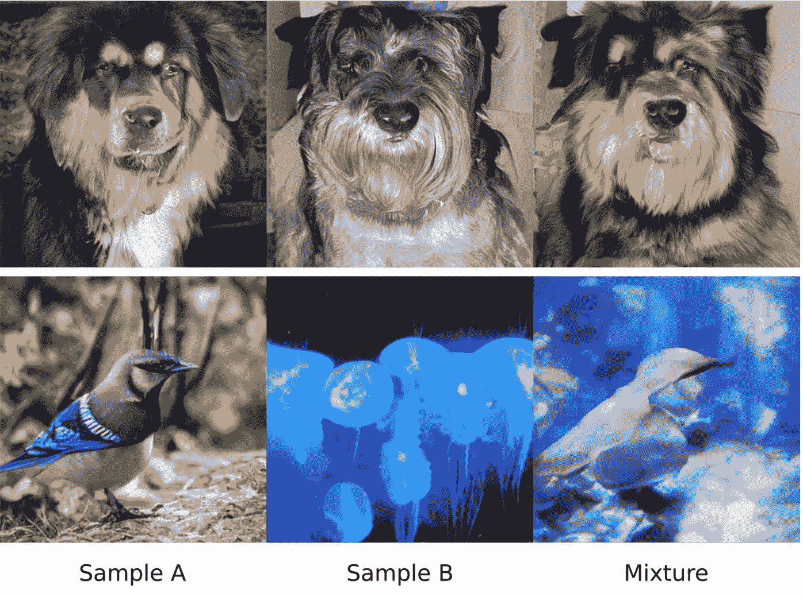

# StyleGAN-XL 比 StyleGAN3 大三倍

> 原文：<https://medium.com/mlearning-ai/stylegan-xl-is-three-times-larger-than-stylegan3-575fc853e529?source=collection_archive---------1----------------------->

## [机器学习艺术](https://mlearning.substack.com)

## 演示+代码

[https://mlearning.substack.com](https://mlearning.substack.com)

## TL；DR:在经历了正确的训练策略后，StyleGAN 在 ImageNet 中达到了 SOTA 的表现

最近一波以数据为中心的方法极大地影响了计算机图形学。一种特殊的方法…