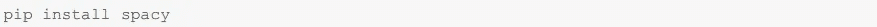
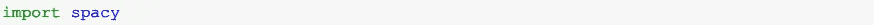
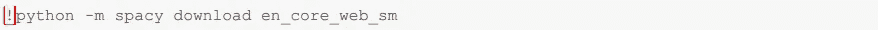
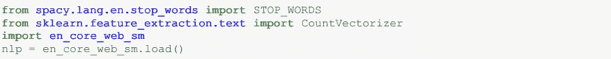
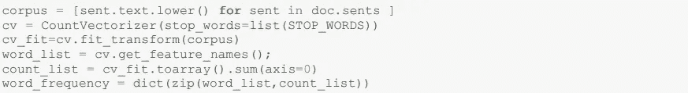
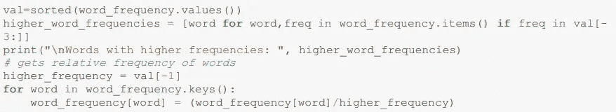
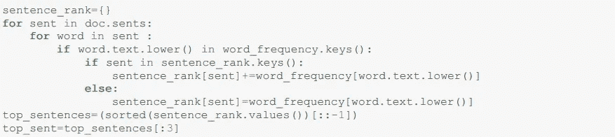

# 使用 NLP 总结文章的初学者指南。

> 原文：<https://medium.com/mlearning-ai/summarize-articles-using-nlp-da1f5befe52b?source=collection_archive---------1----------------------->

用这个简单的技巧总结文章。

大家好！在信息过载的今天，我总是希望有一种方法可以让我只阅读摘要，而不是一页一页地阅读文章。这让我学会了如何总结一篇文章，并从中提取最相关的信息。现在，自动摘要不仅限于文章，它可以用于任何东西，从一篇文章，时事通讯，法律文件，社会媒体营销内容等等。

用自然处理语言概括数据有两种方法:

1.  基于提取的摘要:这里我们提取关键短语并创建一个摘要，而不添加任何额外的信息。
2.  基于抽象的摘要:在这种类型的摘要中，我们创建新的短语来解释原始来源。这是最常见的自动摘要方法。

使用自然处理语言的自动摘要可以应用于各种文档，例如 URL、电子邮件、PDF 文件、文本文件等。它可以针对单个文档或多个文档一起完成。

我们将看到如何使用自然处理语言进行基于提取的摘要。

下面是我使用的输入数据:[https://github.com/poonam-ydv/Auto-Summarization-NLP/blob/main/Auto-sum . txt](https://github.com/poonam-ydv/Auto-Summarization---NLP/blob/main/Auto-Sum.txt)

以下是对提取摘要技术背后的代码的解释:

步骤 1:安装任务所需的 Spacy 和 Scikit-learn 库。

步骤 2:加载英文的通用 spacy 模型，然后打开包含要汇总的文本的文件(在本例中为 Auto-Sum.txt)。然后将管道应用于加载的文本。

步骤 3:在接下来的步骤中，我们从文件中删除停用词，并创建一个包含其各自频率的作品字典。

第四步:这是我决定句子相关性的地方。我们根据他们词汇的累积频率来衡量。

第五步:在最后一步中，我们已经将文章中的所有句子按照重要性排序。我们现在可以提取前 N 个(比如 10 个)句子来创建摘要。

我们还有很多其他方法可以做到这一点。这篇文章旨在培养对自动摘要基础的理解。

如有任何问题，请随时与我联系👇

https://www.linkedin.com/in/poonam-ydv/

【https://github.com/poonam-ydv/Auto-Summarization NLP