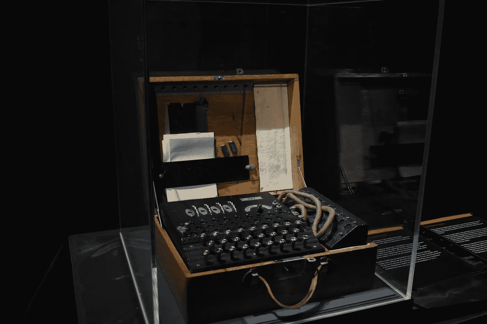
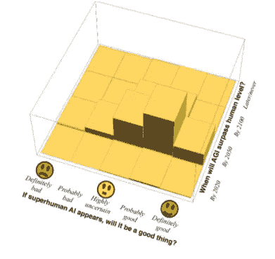
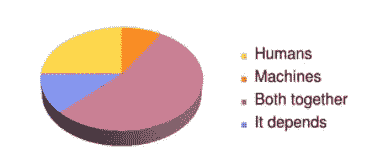
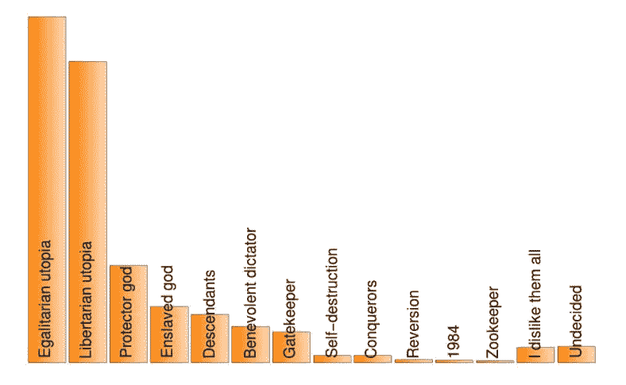
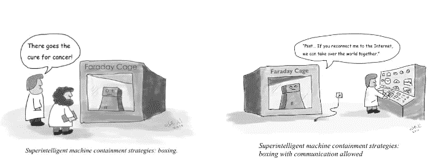

# 超级智能

> 原文：<https://medium.com/mlearning-ai/superintelligence-a32bc7427a87?source=collection_archive---------6----------------------->

## 超级智能人工智能会是我们的末日吗？

Photo by [James Lee](https://unsplash.com/@picsbyjameslee?utm_source=unsplash&utm_medium=referral&utm_content=creditCopyText) on [Unsplash](https://unsplash.com/s/photos/intelligence?utm_source=unsplash&utm_medium=referral&utm_content=creditCopyText)

尼克·博斯特罗姆在 1997 年发表了一篇[文章](https://www.nickbostrom.com/superintelligence.html)，认为将人工智能提高到人类水平的压力将会越来越大，无论是否保证高级人工智能永远不会伤害人类。

斯蒂芬·霍金、埃隆·马斯克、史蒂夫·沃兹尼亚克和其他许多科技界的大腕最近都对人工智能带来的风险表示担忧。

在本文中，我们将讨论与超智能人工智能相关的存在风险。

# **人工智能**

Turing Machine ( Photo by [Mauro Sbicego](https://unsplash.com/@maurosbicego?utm_source=unsplash&utm_medium=referral&utm_content=creditCopyText) on [Unsplash](https://unsplash.com/s/photos/turing?utm_source=unsplash&utm_medium=referral&utm_content=creditCopyText))

根据博斯特罗姆的说法，人工智能有三种不同的感知方式:

*   它可以回答你所有的问题，而且越来越准确(“神谕”)；
*   它可以做任何被命令做的事情(“精灵”)，或者
*   它可能会自主行动以追求某个长期目标(“主权”)。

然而，AI 不应该以它能做什么或不能做什么来定义。

人工智能系统是在世界上执行认知或感知功能的算法模型，这些功能以前是留给人类思考、判断和推理的。

# **人工智能的伦理**

Photo by [Alexander Sinn](https://unsplash.com/@swimstaralex?utm_source=unsplash&utm_medium=referral&utm_content=creditCopyText) on [Unsplash](https://unsplash.com/s/photos/intelligence?utm_source=unsplash&utm_medium=referral&utm_content=creditCopyText)

> “技术赋予了生命前所未有的繁荣——或者自我毁灭——的潜力。让我们有所作为吧！”
> 生命的未来研究所

人工智能的伦理首次出现在艾萨克·阿西莫夫 1942 年的短篇小说《逃避》中，被称为机器人三定律:

1.  机器人不得伤害人类，也不得坐视人类受到伤害。
2.  机器人必须服从人类给它的命令，除非这些命令与第一定律相冲突。
3.  机器人必须保护自己的存在，只要这种保护不违反第一或第二定律。

这些定律并不关注超级智能，而是关注我们可以称之为“普通”的人工智能。

马克斯·泰格马克(Max Tegmark)在他关于人工智能的书《生命 3.0:成为人工智能时代的人类》(T10)中说，“将甚至广泛接受的伦理原则完全编纂成适用于未来人工智能的形式是很棘手的，随着人工智能的不断发展，这个问题值得认真讨论和研究。”

在 2017 年[调查专家预测](https://futureoflife.org/2017/08/15/superintelligence-survey/)中，Max 探索了关于将会/应该发生什么的各种观点。以下是第一批 14866 人的回答，他们参加了马克斯的书附带的调查。

*   多快，我们应该欢迎还是害怕它？

第一个巨大的争议，即使是领先的人工智能研究人员也有分歧，涉及预测将会发生什么。什么时候，如果有的话，人工智能会在所有智力任务上超过人类，这将是一件好事吗？

Image form [https://futureoflife.org/2017/08/15/superintelligence-survey/](https://futureoflife.org/2017/08/15/superintelligence-survey/)

*   如果超级智能到来，谁应该控制？

Image form [https://futureoflife.org/2017/08/15/superintelligence-survey/](https://futureoflife.org/2017/08/15/superintelligence-survey/)

*   **理想社会？**

马克斯探索了 [12 种可能的未来场景](https://futureoflife.org/2017/08/28/ai-aftermath-scenarios/)，描述了如果超级智能被开发出来/没有被开发出来，在未来的一千年里会发生什么。以下是迄今为止人们偏好的选项分类:

Image form [https://futureoflife.org/2017/08/15/superintelligence-survey/](https://futureoflife.org/2017/08/15/superintelligence-survey/)

# **超级智能**

Photo by [Ramón Salinero](https://unsplash.com/@donramxn?utm_source=unsplash&utm_medium=referral&utm_content=creditCopyText) on [Unsplash](https://unsplash.com/s/photos/singularity-tecnology?utm_source=unsplash&utm_medium=referral&utm_content=creditCopyText)

> “现在生活中最可悲的一面是，科学积累知识的速度快于社会积累智慧的速度。”
> 
> 艾萨克·阿西莫夫

根据博斯特罗姆的说法，“超级智慧”是指在几乎每个领域都比最优秀的人类大脑聪明得多的智力，包括科学创造力、一般智慧和社交技能。

超级智能可能是一台数字计算机，一组联网的计算机，培养的皮层组织或诸如此类的东西。

*   **超智能控制**

博斯特罗姆 2014 年的书《超级智能:路径、危险、策略》不仅探索了超级智能人工智能毁灭我们的方式，还研究了这种机器的潜在控制策略——以及它们可能不起作用的原因。

博斯特罗姆概述了这一“控制问题”的两种可能的解决方案:

*   控制它想做的事情，比如教它规则和价值观，这样它就会以人类的最大利益行事。
*   控制人工智能可以做什么，例如阻止它连接到互联网。

Superintelligent machine containment strategies ( Image from Superintelligence Cannot be Contained)

这些控制的问题是，博斯特罗姆认为超级智能机器可能会打破我们可能建立的任何束缚，他本质上担心人类可能不够聪明，无法训练超智能的人工智能。

*   **完全包容不可计算**

[Alfonseca 和他的同事们](https://jair.org/index.php/jair/article/view/12202/26642)认为控制一个超级智能的人工智能是不可能的，因为任何遏制算法都不可能模拟人工智能的行为并绝对肯定地预测它的行为是否会导致伤害。

他说，我们甚至可能不知道我们是否创造了一台超级智能机器，并列出这项研究的三个重要警告，仍然留下许多不确定性:

*   艾的关键时刻至少还在未来两个世纪。
*   研究人员不知道所谓的人工通用智能，也被称为强人工智能，在理论上是否可行。
*   Alfonseca 说，“我们还没有证明超级智能永远不能被控制——只是证明它们不能永远被控制。”

# 超级智能人工智能的风险

Photo by [Rod Long](https://unsplash.com/@rodlong?utm_source=unsplash&utm_medium=referral&utm_content=creditCopyText) on [Unsplash](https://unsplash.com/s/photos/ai-risk?utm_source=unsplash&utm_medium=referral&utm_content=creditCopyText)

> “人工智能可能是人类发生的最好或最糟糕的事情。”
> 
> [人名]斯蒂芬·霍金 (理论物理学家、宇宙学家及作家)

担心机器会变坏是错误的。真正关心的不是恶意，而是能力。

根据定义，超级智能的人工智能非常擅长实现你的目标，无论它们可能是什么，所以我们需要确保你的目标与我们的目标一致。

为了让我们陷入困境，scruffy 超人智能不需要机器人身体，只需要一个互联网连接。

即使建造机器人在物理上是不可能的，一个超级智能和超级富有的人工智能可以很容易地支付或操纵许多人不知不觉地执行它的命令。

机器人误解与机器不能控制人类的神话有关。智力允许控制:人类控制老虎不是因为我们更强，而是因为我们更聪明。

这意味着，如果我们放弃了这个星球上最聪明的人的地位，我们也可以放弃控制权。

本文到此为止，感谢阅读！您可以使用以下链接在 LinkedIn 上与我联系:

*   https://www.linkedin.com/in/fernando-oliveira-2a42b51a4/

**参考文献**

*   新泽西州博斯特伦；《超级智能:路径、危险、策略》，牛津大学出版社，2014 年
*   莱斯利博士，伯尔博士，艾特肯博士，考尔斯博士，卡特尔博士和布里格斯博士；人工智能、人权、民主和法治:初级读本；欧洲委员会，2021 年。
*   等，超智能不能被包含:可计算性理论的教训，人工智能研究杂志，2021 年
*   泰格马克，m；人工智能时代的生命 3.0，阿尔弗雷德·a·克诺普夫，2017 年
*   生命的未来研究所，[https://futureoflife.org/](https://futureoflife.org/)

 [## Mlearning.ai 提交建议

### 如何成为 Mlearning.ai 上的作家

medium.com](/mlearning-ai/mlearning-ai-submission-suggestions-b51e2b130bfb)