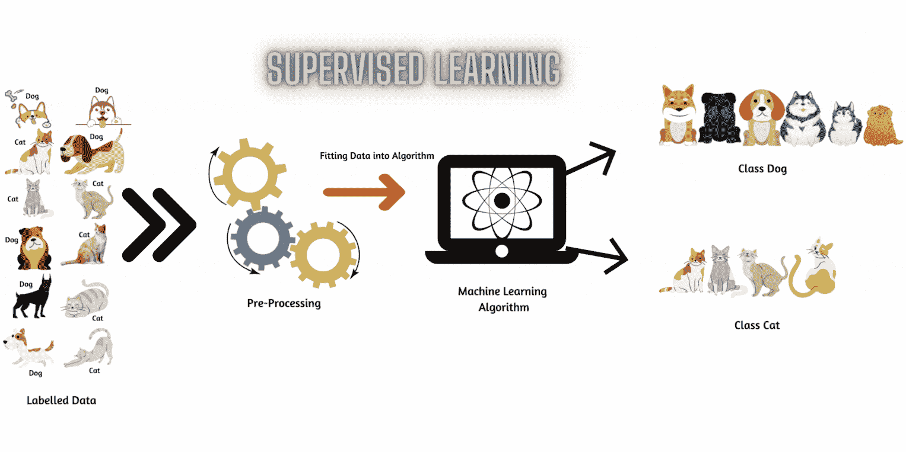
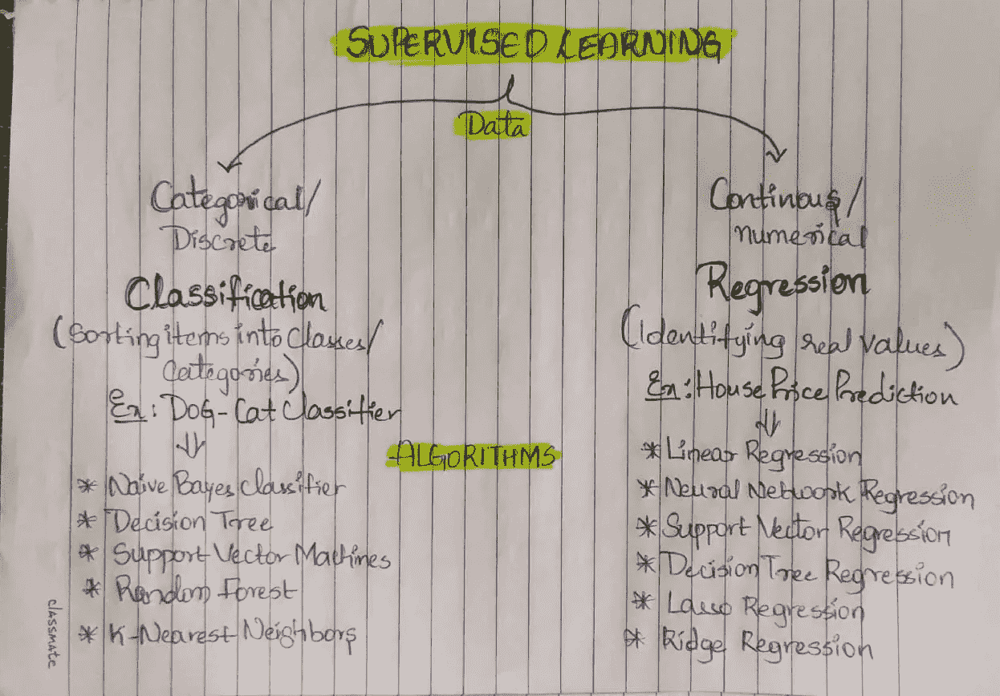

# 监督学习

> 原文：<https://medium.com/mlearning-ai/supervised-learning-91dbac0c6653?source=collection_archive---------9----------------------->



Image Credit: Author Edit

在计算机领域，编程和给出指令是很平常的事情。你有没有考虑过计算机是否可以从这些丰富的知识中受益？我们都知道计算机内存的寿命是有限的，最终会耗尽，因此我们都将所有东西作为文件或对象存储在永久存储器中是理所当然的。计算机从先前获取的数据中学习的说法在机器学习(ML)领域广泛存在，但这是真的吗？在本文中，让我们通过回答一系列问题来进行调查。

# 数据从何而来，从何而来？

> 数据只不过是任务过程中记录的信息/观察结果。


Image Credit: Author Edit

在数据语料库中，数据通常是从用户端点捕获的，并且通常包含许多有助于预测或试图预期单个输出或独立变量的特性、特征或相关因素。它可能通过网站上的用户行为、支付交易数据、IOT 数据、智能手表、手机和许多其他来源收集。但是这种被记录的原始数据有助于程序学习吗？简单的答案是否定的，这就是我们利用数据转换的原因。但是，即使在转换之后，每个观察值都可以用于训练监督学习模型吗？

# 什么是监督学习？

> **监督学习(SL)** 是学习函数的[机器学习](https://en.wikipedia.org/wiki/Machine_learning)任务，[基于示例输入输出对将](https://en.wikipedia.org/wiki/Map_(mathematics))输入映射到输出。[【1】](https://en.wikipedia.org/wiki/Supervised_learning#cite_note-1)它从由一组*训练实例*组成的*标签为* [*训练数据*](https://en.wikipedia.org/wiki/Training_set) 中推断出一个函数。在监督学习中，每个例子是一个由输入对象(通常是一个向量)和期望输出值(也称为*监督信号*)组成的*对*。

简单来说， ***一种机器学习是监督学习，它涉及标记数据(例如，包括特征和预测结果的数据)，并使用这些数据来训练算法。***

```
For example: 
| x |  y  | sum |
---------------
| 2 | 3 | 5 | 
| 4 | 1 | 5 |
| 18 | 14 | 32 |Labelled data looks similar to this where, 
x,y --> features 
sum --> output label / predictable feature 
```

# 每个监督学习问题都表现出一致的行为吗？



Image Source: Author Edit

尽管监督学习中使用的数据从不一致，并且根据情况可能是离散的/分类的或连续的/数字的，但它用于发现规则或从特征/属性和预期输出之间的关系中学习。分类算法(将对象分类或归类)和回归算法(预测真实值)是监督学习的两个类别，这些方法的列表很长。那么如何在合适的时间选择合适的算法呢？我个人使用 Scikit-Learn 模型选择备忘单作为经验法则。


Image Source: [Scikit-Learn](https://scikit-learn.org/stable/tutorial/machine_learning_map/index.html)

然而，不要认为这是你唯一的选择；如果你在选择算法时遇到麻烦，它可能会派上用场。然而，您可能总是通过试错法来试验其他方法，随着您在使用某些开源数据集执行辅助项目方面的进步，您将会习惯这种方法。

# 实用时间:

让我们在这个练习中检查一个分类的例子，它属于监督学习的范畴。但是首先，我们需要熟悉一些流行的 ML 术语。

*   **数据集:**数据集是一组相互连接的不同数据，可以单独查看、一起查看或作为一个单元处理。每个数据集包括要素(有助于目标预测的可靠特征)、目标(可由要素预测的不可靠变量)。
*   **模型:**一种程序/算法，可以被训练来识别数据中的模式并预测期望值。
*   **训练、测试和验证分割:**每个 ML 挑战都包括数据集的训练、测试和验证分割。相反，验证数据是一种实时模拟，我们试图模拟类似生产的数据，以验证我们的模型在类似生产的环境中的表现如何。测试数据是我们用来测试我们的训练模型的数据，以查看它在以前没有见过的类似数据上执行的程度，而训练数据是算法在训练期间学习的数据，并返回给我们一个模型。
*   **指标:**指标是我们用数字来评估模型性能的一种机制。在我们的实际例子中，我们使用混淆矩阵作为衡量标准之一，您可以在这里[了解](https://vtantravahi.medium.com/confusion-matrix-96fb002e13d1)。

# 结论:

最后一点，业界在人工智能和人工智能方面的进步已经发生了相当大的转变。对于许多 ML 工程师和数据科学家来说，监督学习是一种职业起步学习，然而，它已经在市场上占据了一席之地。在我看来，类似于我们在不确定结果的情况下，是如何学习和做出判断的。我希望你完全掌握了这个想法，并期待收到你的来信。

[](/mlearning-ai/mlearning-ai-submission-suggestions-b51e2b130bfb) [## Mlearning.ai 提交建议

### 如何成为 Mlearning.ai 上的作家

medium.com](/mlearning-ai/mlearning-ai-submission-suggestions-b51e2b130bfb)