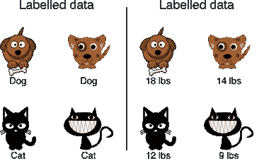
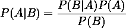

# 监督学习变得简单

> 原文：<https://medium.com/mlearning-ai/supervised-learning-made-easy-b5511782ab46?source=collection_archive---------7----------------------->

在之前的文章中，我们对[人工智能](http://thoughtsonprogramming.com/an-introduction-to-artificial-intelligence/)和[机器学习](http://thoughtsonprogramming.com/machine-learning-an-introduction/)进行了简短的介绍。在本文中，我们开始介绍机器学习的第一种技术，监督学习。

# 什么是监督学习

如果我们阅读[维基百科](https://en.wikipedia.org/wiki/Supervised_learning)，我们可以读到监督学习的定义:

> ***【SL】****监督学习(Supervised learning)是基于示例输入输出对来学习将输入映射到输出的函数的机器学习任务。它从由一组*训练实例*组成的*标记的训练数据*中推断出一个函数。在监督学习中，每个例子是一个由输入对象(通常是一个向量)和期望输出值(也称为*监督信号*)组成的*对*。*

然而，为了更好地理解监督算法是如何工作的，让我们定义一些对构建我们的算法有用的基本术语。

我们如何知道每一个机器学习算法的燃料，是数据，一个用作输入的监督学习算法一个**数据集**作为一个**标记数据**的集合

更正式地说，我们可以这样描述标记数据的数据集:

*中***【Xi】***的每个元素称为一个 ***特征向量*** 。*特征向量*是每个维度 *j=1，…的向量。，N* 包含描述分析中的示例的值。这个值称为，并由语法表示。*

*监督学习的目标是根据数据中存在的特征预测输入数据，然后对数据本身进行分类。图 1 显示了一个功能是如何工作的，在图中我们看到了标记的数据，狗和不同的体重，例如 18 磅或 14 磅。特征本质上是与数据相关的特征，当我们想要*对*进行分类时，该特征很重要。*

# *分类与回归*

*当我们谈论监督学习时，其思想通常是解决两种主要类型的问题:*

**分类*问题是一种机器学习试图根据之前的观察对数据进行分类的问题。*

*一个典型的例子是垃圾邮件过滤器，该过滤器学习共同的规则来将邮件分类为垃圾邮件或不是垃圾邮件，这种类型的分类被称为 ***二元分类*** 。*

*另一种类型的分类称为 ***多类分类*** ，这种类型的分类可以用于例如识别不同类型的动物，我们向算法提供不同的图片，算法根据看不见的数据对动物进行分类。*

*分类的本质是给无序的、看不见的数据分配一个 ***分类标签*** 。*

*还有一个与监督学习相关的重要任务，这被称为 ***回归*** 。*

*回归分析用于在预测的基础上预测一个连续的结果变量，如果我们想更正式一点，回归分析是为了找出某个*自变量*和某个*因变量之间的相关性。*回归分析的一个经典例子是基于平方英尺或位置的房屋价格预测。*

# *监督学习算法*

*我们现在对监督学习有了一个概念，以及我们可以用这种技术解决什么类型的问题，为了更好地理解如何使用，让我们看看监督学习使用的主要算法。*

# *k-最近邻*

*KNN 或 K-最近邻是一种简单的算法，用于根据数据的相似性对数据进行分类。在该算法中，使用*‘k’*来识别数据点附近邻居的值，这用于分析数据点附近的值，然后对数据进行分类，新数据由邻居的多数投票进行分类，使用的邻居数量由值 k 来识别*

# *朴素贝叶斯*

*朴素贝叶斯分类器是一种概率算法，它基于贝叶斯定理，用于解决分类问题。这种类型的算法本质上是一种概率分类器，这意味着分类是通过使用贝叶斯定理的事件概率来完成的:*

**

*其中:*

*   ***P(A|B)** 是后验概率，即假设 A 对观察事件 B 的概率*
*   ***P(B|A)** 是似然概率，一个假设为真的概率*
*   ***P(A)** 是一个先验概率，在观察证据之前假设的概率*
*   ***P(B)** 是边际概率，证据的概率*

*朴素贝叶斯用于垃圾邮件分类或文本分类。*

# *决策树*

*决策树既用于来自监督学习的问题，也用于分类和回归，为此，有时又称为 ***分类和回归树(CART)*** 。*

*在决策树中，响应的预测是通过学习从特征本身导出的特征来直接做出的。*

*在决策分析中，决策树可用于可视化数据，并明确表示决策和决策制定。*

# *线性回归*

*线性回归是机器学习最基本的算法之一，利用线性回归算法，模型试图找到因变量和自变量之间的最佳线性。*

*线性回归可以分为两种主要类型:*

*   **简单线性回归*，这里我们只有一个自变量*
*   **多元线性回归*，这里我们有多个自变量*

*在这两种情况下，模型都试图找到自变量和因变量之间的相关性。*

# *支持向量机(SVM)*

*支持向量机是另一种可用于分类和回归两种情况的算法。*

*SVM 算法将每个数据项绘制为在 *n* 维空间中的一个点，其中 *n* 是我们在模型中拥有的特征的数量，每个点代表空间中的一个坐标。*

*定义了坐标后，我们使用分类找到一个用于区分数据的超平面。*

# *结论*

*在本文中，我们介绍了监督学习算法，这是第一个用于人工智能和机器学习的算法。*

*在接下来的文章中，我们将开始了解如何实现所介绍的一些算法，以及如何使用该算法来构建我们的机器学习模型。*

*如果你有兴趣更深入地研究这个算法，我可以推荐一些令人惊叹的书籍:*

*   *[数据挖掘:实用的机器学习工具和技术](https://amzn.to/3IqF2Uh)，这本书是学习所有数据挖掘相关技术的必备之作*
*   *[使用 PyTorch 和 Scikit-Learn 进行机器学习:使用 Python 开发机器学习和深度学习模型](https://amzn.to/3ucmmCG)，这本书对于将机器学习的理论和实践结合在一起至关重要*

*如果你喜欢这篇文章，请随意添加评论并提出任何问题*

**原载于 2022 年 3 月 20 日*[*http://thoughtsonprogramming.com*](http://thoughtsonprogramming.com/supervised-learning-made-easy/)*。**

* [## Mlearning.ai 提交建议

### 如何成为 Mlearning.ai 上的作家

medium.com](/mlearning-ai/mlearning-ai-submission-suggestions-b51e2b130bfb)*