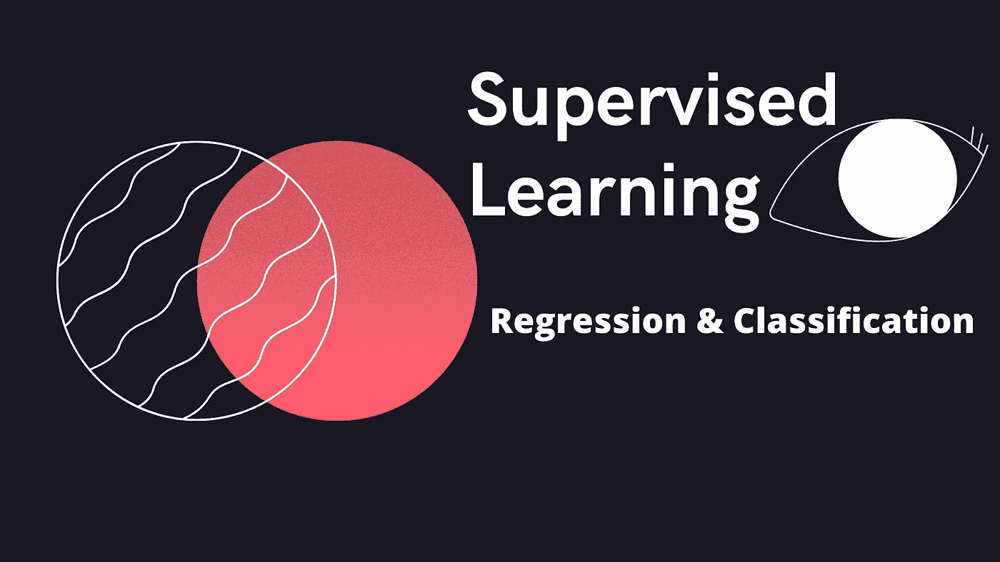
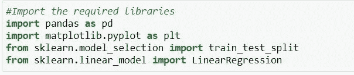
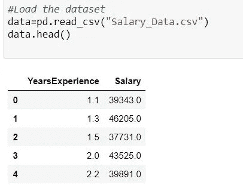
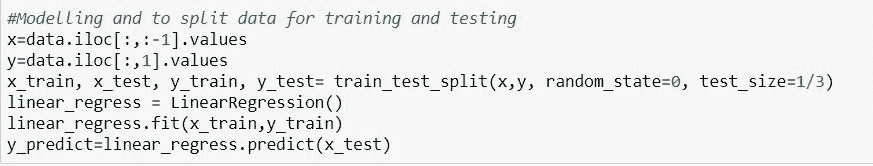
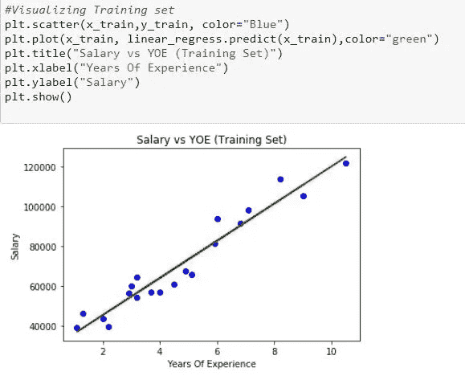
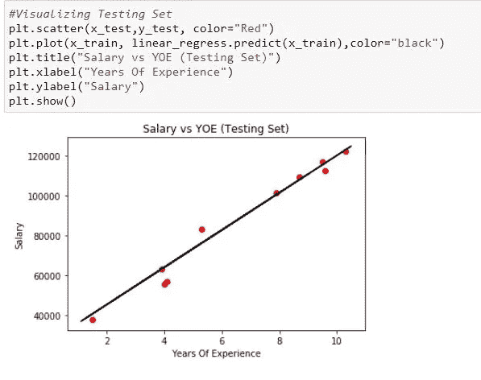

# 监督学习:真实世界用例的线性回归

> 原文：<https://medium.com/mlearning-ai/supervised-learning-regression-on-real-world-use-cases-b97897210c23?source=collection_archive---------6----------------------->

## 监督学习是创建人工智能或机器学习模型的主要步骤，用于更好的预测、垃圾邮件检测、欺诈检测、图像识别和产品识别等。，在本文中，我们将了解监督学习技术如何用于现实世界中的问题。

让我们了解一下监督学习到底是什么。

监督学习是一种技术，在这种技术中，我们已经知道我们的输出应该是什么样子，并且输入数据集被提供给模型。

监督学习有两种类型:

—分类

—回归

在回归中，我们试图预测连续输出的结果，而在分类中，我们试图预测离散输出的结果。

回归的例子:

你给了一个人的图像，我们必须根据给定的图像来预测一个人的年龄。

让我们使用回归技术来解决现实世界的问题:

dataset:[https://www . ka ggle . com/rohankayan/years-of-experience and-salary-dataset](https://www.kaggle.com/rohankayan/years-of-experience-and-salary-dataset)

从上面的链接下载数据集！

**问题陈述:**给定关于工资和工作经验年限的数据集。我们需要预测随着工作经验的增加，工资会有怎样的变化。

让我们试着想象一下工资随着工作年限的变化。

# 实施:

使用任何平台编码，如 Jupyter Notebook、Github、Kaggle 和 Google Colab。

这里我用的是 Jupyter 笔记本:

**步骤 1:** 让我们导入所需的库

Import required Libraries

**步骤 2:** 导入库后，使用 pd.read_csv 函数加载数据

Reads and displays first 5 rows of the dataset

为了读取数据集，我们使用 pd.read_csv()函数，为了打印前 5 行数据，我们使用 df.head()函数。

**第三步:**进行数据预处理，分割数据用于测试&训练，然后生成并评估模型

Modeling and splitting data

df.iloc[:，:-1]选择所有行，直到最后一列，df.iloc[:，1]选择所有行，第一列除外。

对于 train_test_split 数据，我们使用 random state=0(可以是 1 或 0 或任何整数), test_size 是定义测试集大小的数字。如果没有给定，默认情况下将是 0.25%或 25%。

**步骤 4:** 为了可视化训练集，使用如下所示的必要函数:

Training Set plot

这里，plt.scatter 用于绘制水平轴和垂直轴上的数据点，试图显示一个变量对另一个变量的影响程度。

plt.plot()绘制图形并对其进行一些更改，plt.show()显示图形。

**步骤 5:** 为了可视化测试集，使用如下所示的必要函数:

Testing Set plot

这就是回归在各个领域解决业务问题的方法。

点击本页查看更多相关文章:

 [## 利希塔·卡卡努鲁-培养基

### 让我们知道机器学习的实际定义。根据阿瑟·塞缪尔在 1959 年的定义，ML 是一个…

likhithakakanuru.medium.com](https://likhithakakanuru.medium.com/)