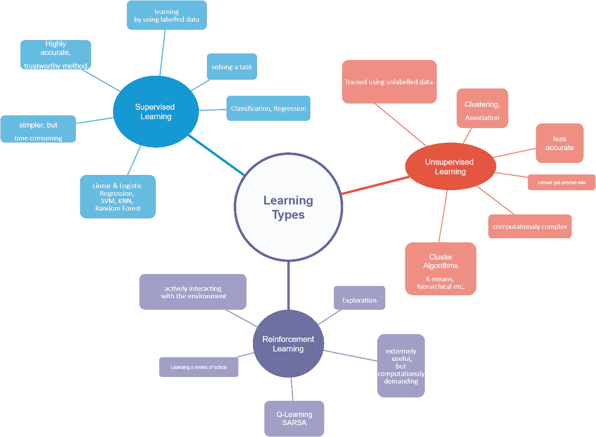

# 监督学习 Vs .非监督学习 Vs .强化学习

> 原文：<https://medium.com/mlearning-ai/supervised-learning-vs-unsupervised-learning-vs-reinforcement-learning-a2a7d89b6a99?source=collection_archive---------5----------------------->

Photo by [Andrea De Santis](https://unsplash.com/@santesson89?utm_source=medium&utm_medium=referral) on [Unsplash](https://unsplash.com?utm_source=medium&utm_medium=referral)

最近，我们向机器展示了如何通过模仿我们大脑中的场景来学习。好像，作为人类，我们可以完美地做每件事…幸运的是，机器比我们更容易学习:)

我们可以首先把机器学习的方法收集在三个主要标题下:*监督学习、无监督学习、强化学习*。先说一个众所周知的小加热器例子。假设家里的婴儿和家里的一只狗一起长大。宝贝，他的宠物狗的各种特征；四条腿，湿湿的鼻子，爪子，等等。都会认识他们。然后宝宝的妈妈带来了第二只狗，另一只，宝宝从来没有见过。宝宝会怎么认第二只狗？

1.  如果妈妈把第二只狗拿出来给宝宝介绍为“这是一只狗，和你的另一只宠物狗一样”；监督学习
2.  学习宝宝从远处观察，不用任何人说什么，就意识到第二只狗其实和自己的宠物狗有相似的特征(四条腿，爪子……)；无监督学习
3.  如果婴儿触摸第二只狗，捏它，也许最终导致它咬自己；强化学习

再开一点吧…

([https://www.reddit.com/r/ProgrammerHumor/comments/fvwbgt/machine_learning_guys/?utm_source=share&utm_medium=web2x&context=3](https://www.reddit.com/r/ProgrammerHumor/comments/fvwbgt/machine_learning_guys/?utm_source=share&utm_medium=web2x&context=3))

> 监督学习

在这种类型的学习中，我们使用标记数据集。这些数据集旨在训练或控制算法来对数据进行分类或准确预测结果。使用标记的输入和输出，模型可以测量其准确性，并随着时间的推移进行学习。监督学习允许我们收集数据，并从以前的经验中产生一个输出。它用于完成两个主要任务的给定任务:

1.  *分类:*比如最知名的一个，比如把收到的邮件解析成电子邮件，不管是不是垃圾邮件。
2.  *回归:*比如从训练数据(房子大小、位置等)中估算房价。).

如果我们注意，当使用监督学习时；给出了输入和输出值。使用标记的数据来训练算法。训练数据用于建立输入和输出连接。

> 无监督学习

无监督学习中的算法发现数据中的隐藏模式，不需要人为干预，因此是无监督的。它的使用场合:

1.  *聚类:*用于根据相似性或差异性对未标记的数据进行分组。
2.  *关联:*寻找特定数据集中变量之间的关系；比如我们购物时看到的“买了这个产品的人也买了这个”这句话。

无监督学习只有输入数据，没有输出数据。系统应该自己学会这一点。算法用于未标记的数据。

> 强化学习

在这种学习中，模型同时接收数据并寻求反馈以探索学习。因为它让学习变得主动。也就是说，系统需要一个反馈信号来了解它的哪些行动是最好的，哪些不是。我们也可以说，它通过使用惩罚或奖励系统来检测预测的错误。

By Z.

稍后我将更详细地介绍它们..

z！