# 支持向量机——你只需要一条线

> 原文：<https://medium.com/mlearning-ai/support-vector-machine-a-line-is-all-you-need-10a80e87cc64?source=collection_archive---------1----------------------->

本文解释了支持向量机(SVM)算法如何在回归和分类问题中工作。

Photo by [Fabrizio Conti](https://unsplash.com/@conti_photos?utm_source=medium&utm_medium=referral) on [Unsplash](https://unsplash.com?utm_source=medium&utm_medium=referral)

首先，**支持向量机**是对分类问题直观的算法。我想说的是，当你必须区分两个阶级时，SVM 背后的思想是很容易解释的。然而，这并不意味着这种算法只用于分类，相反，它可以很好地用于任何回归，但逻辑会有所改变！

让我们深入了解支持向量机的概念…

# 线性可分情况下的 SVM

SVM 是一种用于**二元分类**的算法(当然当你的问题是一个分类的时候)。因此，即使今天，有可能在多类问题中使用 SVM，背后的数学本质上只划分两类。

理解 SVM 的最好和最简单的方法是使用两个类是线性可分的情况，这意味着您可以在两个类的数据点之间画一条线:

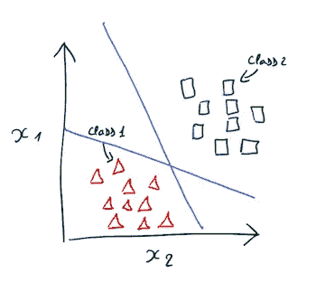

可以用多种方式分割计划，但 SVM 算法的逻辑是找到离两个类别最远的**边界**:

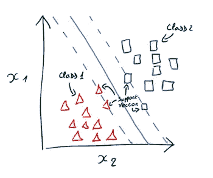

连续的蓝色线是 ***边界*** ，它是两个类的完美分界线。虚线是页边距，两个页边距之间的空间可以称为 ***路径*** (或 ***超平面*** )。两边距边框的距离相等。

如图所示，位于边缘的数据点被称为**支持向量**(这解释了支持向量机的名称)。

有趣的是，如果你在图上有更多的观察值(来自任何类别)，只要它不在*路径上，*边距就不会改变，这种情况将保持最优。

> SVM 算法的目标是找到分隔两个类别的最大路径

让我们看看它在数学上是如何工作的…

对于所有数学符号，我们使用向量，因为它代表数据集的所有观察/特征。

*边界*可以被声明为满足该等式的任何输入( *x* ):

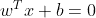

The decision function

也是算法的**决策函数**，以 ***w*** 作为特征(其他项参数)的**权重**， ***x*** 作为输入， ***b*** 作为**常数** **项**。

两个**边距**的定义如下:

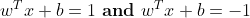

Margins

最后，算法的决策函数将根据函数值给出**估计** **输出**(*):0 或 1:*

*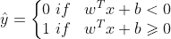*

*Estimated output*

****→线性 SVM 的目的是找到优化决策函数的权重和常数项。****

## *如何找到*优化决策函数的参数(w* 和 *b)* ？*

*让我们记住:用逻辑回归解决一个分类问题基本上就是最小化目标函数的损失函数。*

*关于支持向量机，寻找最优参数( *w* 和 *b* )是通过**最小化******斜率**的**决策** **函数**来解决的:***

***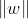***

***The slope of the decision function***

***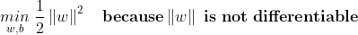***

***Minimizing the slope***

***因为我们希望这两个类尽可能分开，并且在超平面内没有数据点，所以我们必须在最小化期间声明这个约束:***

***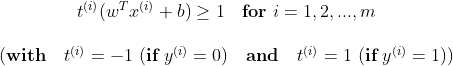***

***Constraint during optimization***

***它只是指定没有数据点会在超平面内(边缘之间)。***

***最后，我们得到了最终最小化的**目标:*****

***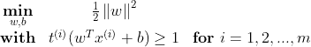***

*   ***最小化决策函数的修正斜率***
*   ***在边距的约束下(判定函数= 1 且判定函数= -1，在 1 和-1 之间没有任何东西)***

******→ SVM 最大化两个边距之间的距离(两个类的支持向量之间)。******

***让我们快速说明一下:***

***决策函数的斜率看起来像一个独特的观察:***

***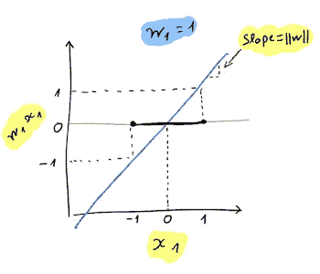***

***y 轴是决策函数，X 轴是观测值。函数的斜率告诉我们 1 和-1 之间的距离(边距)等于 2(*x1*1 和-1 之间)。***

***如果我们**将**的斜率除以 2 ，结果如下:***

***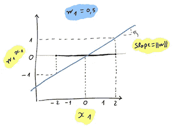***

***我们注意到 1 和-1 之间的**距离**随着**斜率**的**减小**(*x1*在 2 和-2 之间)。***

> ***这就是 SVM 正在寻找的，最大化边距之间距离的权重(和常数项)(决策函数在 1 和-1 之间)。***

# ***硬利润与软利润***

***我没有说明之前的解释是关于**硬边界线性 SVM 分类**。然而，与**软余量**的区别很简单:***

***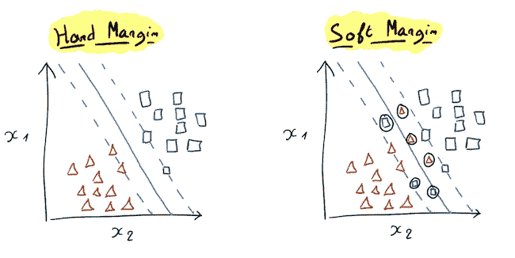***

*****软边界分类**基本上是允许一些数据点在超平面内(边界之外)，硬边界分类不是这种情况。***

***数学上，我们需要在最小化方程中增加一个变量 **ζ (Zêta)** 和一个超参数 **C** 。***

*   *****ζ** :测量第 I 次观察被允许如何冲击边缘。***
*   *****C** :定义增加作为**第一目标**的超平面(边距之间的距离)和减少边距侵占(**第二目标**)之间的权衡。***

# ***当数据不是线性可分的时候会发生什么？***

***SVM 非线性分类使用多项式要素变换来创建要素之间更复杂的关系，并允许 SVM 像线性分类一样将两个类分开:***

***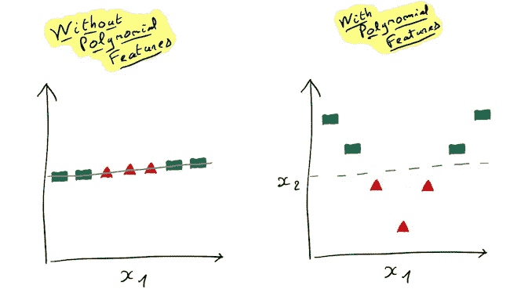***

***为了避免添加多项式特性的缺点(那样做是可行的)，有一个技巧:内核技巧**。*****

******基本上与添加多项式特征相同，但实际上并没有这样做。******

*****如果你想了解更多这方面的技巧，我向你推荐德鲁·威利米蒂斯的这篇文章。*****

# *****SVM 回归*****

*****对于回归问题，SVM 算法的思想不是分离类，而是在路径(超平面)内拥有最多的数据点:*****

*****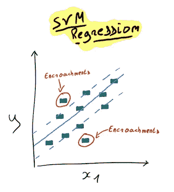*****

*****软余量也可以通过定义超参数来实现: **ε** 。*****

# *****结论*****

*****综上所述， **SVM** 是基于**数据** **点**不同 **类**之间的**距离**的算法(或者在回归问题的情况下只是数据点)。它只在观测值从两个类或**线性** **可分**时才起作用。然而，**可以转换******数据**之间的****关系** **，并创建一种方法来分离它们。
我们称之为支持向量，即两个类别之间距离最远的数据点。 ***超平面/路径*** 是那些支持向量之间的空间。***********

***最后，SVM 算法的目标是**通过区分这两个类来优化**超平面**和**使其尽可能的精确。事实上，支持向量分离得越多，模型就应该越好。然而，有时候，算法必须允许一些**侵占**(超平面内的数据点)能够真正地创建类之间的差异。***

## ***参考来源:***

*** [## 使用 Scikit-Learn、Keras 和 TensorFlow 进行机器实践学习，第二版

### 通过最近的一系列突破，深度学习推动了整个机器学习领域。现在，甚至…

www.oreilly.com](https://www.oreilly.com/library/view/hands-on-machine-learning/9781492032632/)  [## 机器学习的支持向量机-机器学习掌握

### 支持向量机可能是最受欢迎和谈论最多的机器学习算法之一。他们是…

machinelearningmastery.com](https://machinelearningmastery.com/support-vector-machines-for-machine-learning/)  [## 机器学习中的支持向量回归

### 支持向量机(SVM)在机器学习中广泛应用于分类问题。我经常…

www.analyticsvidhya.com](https://www.analyticsvidhya.com/blog/2020/03/support-vector-regression-tutorial-for-machine-learning/)  [## Mlearning.ai 提交建议

### 如何成为 Mlearning.ai 上的作家

medium.com](/mlearning-ai/mlearning-ai-submission-suggestions-b51e2b130bfb)***