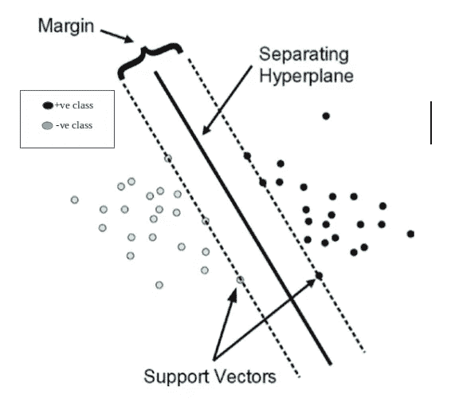
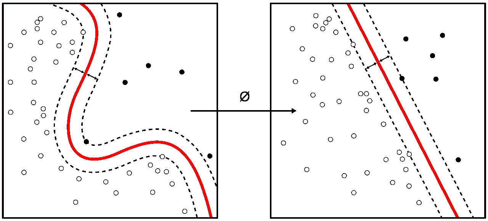
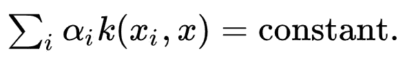
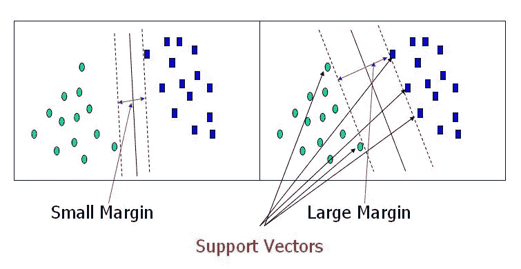
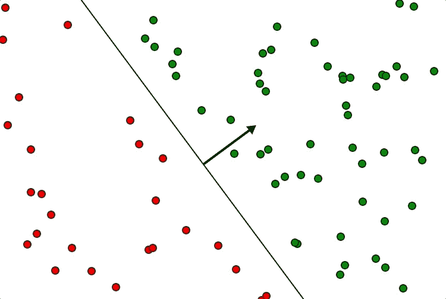
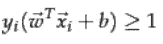

# 支持向量机(SVM)算法。

> 原文：<https://medium.com/mlearning-ai/support-vector-machine-svm-algorithm-a5acaa48fe3a?source=collection_archive---------2----------------------->

SVM 是一种监督方法，可用于分类和回归问题。

**支持向量机** ( **支持向量机**，还有**支持向量网络**)是具有相关学习算法的监督学习模型，用于分析数据以进行分类和回归分析。

让我们尝试并理解 SVM 是如何执行分类任务的。为直观起见，该算法试图找到线性分离(2D 的情况下是直线，3D 的情况下是平面，以及超平面维度空间)

对于二进制分类问题，如果两个类别的数据点都位于相对侧并且远离分隔符，直观上我们会对我们的分类更有信心(使用线性分隔符)。

分隔符和数据点之间的最小距离称为边距。目标是找到这个超平面，该超平面最大化这个余量，使得新数据点被正确分类的机会很高。从技术上来说，这意味着在数据中有某些数据点定义了在哪里设置这个超平面。这样的点称为支持向量。其他数据点基本上不参与决定这个决策面。

在更高的维度(具有更多属性的数据)中，或者当数据是非线性的时，我们可能经常找不到具有上述约束的理想的线性分隔符。因此，我们尝试将这些数据移动/转换到一个更高维度的空间，并在该空间中寻找线性分隔符。

*   数据在哪个维度空间变得线性可分？—回答这个问题可能不是决定性的。
*   这需要多少计算量？—对于这个问题，肯定是贵的。

现在，我们前面提到，如果在较低的维度中没有找到线性分隔符，那么我们将数据转换到较高的维度，并在那里找到线性分隔符。此外，这是一个昂贵的过程。相反，为了找到这个线性分隔符，我们使用了所谓的内核技巧

*   我们之前提到过，为了得到宽度，我们必须解决一个优化问题，我们所需要的就是得到两个向量(数据点)之间的点积
*   从技术上讲，要获得更高维的点积，我们不需要显式地将数据转换到更高维。
*   这里，我们发现了一个神奇的盒子(一个函数),当我们对低维数据应用该函数时，我们直接获得点积值，就好像我们已经将数据转换到高维空间，然后计算点积
*   这个神奇的盒子/函数被称为内核
*   在这个高维空间中，我们可以找到线性分隔符。当那个
*   线性分隔符被投影到较低的维度，它可能变成非线性的

**简单来说——在 SVM 遵循的步骤**

**Step01** —输入低维空间中的数据，需要高维空间中数据点的点积得到线性分隔符

**Step02** —魔盒内核

**步骤 03** —点积值，就好像输入数据首先被转换到高维空间，然后在那里计算点积

有各种各样的核，如线性核、径向基函数核、多项式核等，根据数据，我们可以选择合适的核，或者我们可以试验不同的核，并选择最佳的核。

为了保持合理的计算负荷，SVM 方案所使用的映射被设计成确保输入数据向量对的点积可以根据原始空间中的变量来容易地计算，这是通过根据被选择来适合该问题的核函数 k(x，y)来定义它们来实现的

kernel machines are used to compute non-linearly separable functions into a higher dimension linearly separable function.

高维空间中的超平面被定义为点的集合，这些点与该空间中的向量的点积是常数，其中这样的向量集合是定义超平面的向量的正交(因此是最小的)集合。定义超平面的向量可以选择为带有参数的线性组合

数据库中出现的特征向量 xi 的图像。通过选择超平面，映射到超平面的特征空间中的点 x 由以下关系定义

注意，如果 k(x，y)随着 y 远离 x 而变小，则总和中的每一项都测量测试点 x 与相应的数据库点 xi 的接近程度。以这种方式，上述核的总和可以用于测量每个测试点与源自要被区分的一个或另一个集合的数据点的相对接近度。请注意，映射到任何超平面的点集 x 可能会非常复杂，从而允许在原始空间中根本不凸的集合之间进行更复杂的区分。

现在，我们讨论 SVM 的硬利润和软利润。我们知道，该算法基本上试图在相反类别的支持向量之间绘制一个具有最大可能宽度的平面。

*   如果我们设置一个非常严格的约束，即所有的数据点都需要用一个线性分隔符正确分类。那么这种余量就是所谓的硬余量。如果算法找不到超平面，使得所有点没有被正确分类，则不绘制分隔符。
*   如果我们可以放松约束，并且我们可以允许一些错误分类(错误)，那么可以识别线性分隔符。具有这种放松的约束的裕度被称为**软裕度**。允许对超平面方程 yi **WT 的误分类。X +b ≥ 1** 增加了另一项，称为松弛变量。这决定了可以允许多少错误分类。方程是 yi **WT。X+b≥1-ξ**

我想用正则化方程做个类比。成本函数是误差之和以及系数的平方和(根据脊线)。

*   在 SVM 的例子中，我们需要让 W 服从约束。我们还看到，如果没有找到正确分类所有数据点的线性分隔符，那么我们引入了允许某些错误分类(或错误)的松弛变量。我们检查边距应该尽可能宽(所以||W||应该最小化，错误分类应该更少。所以方程写成 min∨w ∨+ C∨ξ∨。

这里的 C 称为可调参数。C 参数越高，余量越小，C 参数越低，余量越大。为什么这很重要？

*   对于较大的 C 值，裕度较小，当将其应用于测试数据时，我们可能会有更多的错误(想想这个！！)这可能会导致过度拟合
*   对于较小的 C 值，它试图以更多的误分类为代价获得更大的裕度。这可能导致不合身。
*   因此，这个 C 参数需要调整到一个最佳值，以便我们能够正确拟合数据。

**预测是如何做出的？**

*   要记住的一点是，只有支持向量定义了 W 的值(参考第 6 点 f)，这是使用二次优化框架解决的。所以，SVM 模型基本上存储了支持向量的坐标。
*   当新的测试点出现时，在支持向量和数据点之间进行点积。

recollect that wT is defined by support vectors.

*   从技术上讲，它是支持向量和测试点之间的点积。如果符号是+ve，它属于一个类，否则它属于另一个类。

**支持向量机的优势:**

*   当类别之间存在可理解的分离界限时，支持向量机工作得相当好。
*   在高维空间更有生产力。
*   这在维数大于样本数的情况下是有效的。
*   支持向量机是比较记忆系统的。

**支持向量机的缺点:**

*   支持向量机算法对于大数据集是不可接受的。
*   当数据集具有更多声音时，即目标类重叠时，它不能很好地执行。
*   在每个数据点的属性数量超过训练数据样本数量的情况下，支持向量机将表现不佳。
*   由于支持向量分类器通过将数据点放置在分类超平面的上方和下方来工作，因此没有分类的概率澄清。

**支持向量机的应用:**

1.  **人脸观察—** 根据分类器和模型检测人脸。
2.  **文本和超文本安排—** 在这种情况下，分类技术被用来寻找重要的信息，或者你可以说是安排文本所需的信息。
3.  **画像分组—** 它也用于画像分组，或者你可以说是通过比较信息并采取相应的行动。
4.  **生物信息学—** 它也用于医学以及实验室、DNA、研究等。
5.  **笔迹记忆—** 在这种情况下，用于笔迹识别。
6.  **蛋白质折叠和远程同源性点样—** 它用于点样，或者你可以根据氨基酸序列将分类分为功能类和结构类。这是生物信息学中的问题之一。
7.  **广义预测控制(GPC) —** 它也用于预测的广义预测控制(GPC ),它依赖于使用多层前馈网络的预测控制，作为工厂线性模型。

**点 6 位数学(用于额外读取):**

让我们从数学上把支持向量机的边界定义为

**Yi**t20】w^t. x+b≥1(其中 yi 的值为 1，+1 为正类，-1 为负类)。

**W^T** 是垂直于超平面的向量，称为权重向量。上面的方程基本上定义了边界/超平面。如果等式的值大于 1，则属于 1 类，如果值小于-1，则属于 2 类。然后问题归结为识别 W 和 b，使它们满足约束。

两个边界的中间值具有等式 **WT。X +b=0。**这个平面到一边最近点的距离几何上给定为 1/||W||。因此，从技术上讲，边距等于 2/||W||。||W||是 **W** 的量级。

如前所述，我们需要最大化这个余量 2/||W||或最小化||W||因为它是倒数(min∨W∨)

为了解决这个问题，建立了一个二次优化方程。为了容易解决问题，原始优化问题被转换成一个对偶问题。为此，他们使用与每个约束相关的拉格朗日乘数。

在 dual 中解决这个优化问题时(为了得到 W ),需要注意的是，我们需要的只是找到数据点之间的点积。对于除支持向量之外的大多数数据点，这些值趋于零。如果两个数据点(支持向量)属于不同的类别，则它们倾向于最大化裕度，如果两个向量属于同一类别，则它们是冗余的。

w 由∑𝑛 𝛼 𝑦 ⃗𝑥⃗给出，其中 I 的范围从 1 到所有数据点，并且我们对于支持向量数据点具有非零值，其中𝛼𝑖是与每个数据点相关联的拉格朗日乘数。