# 从头开始支持向量机

> 原文：<https://medium.com/mlearning-ai/support-vector-machines-16241417ee6d?source=collection_archive---------6----------------------->

## 使用感知器算法

在这篇文章中，你将学习如何实现一个简单的算法来从头开始求解 SVM。

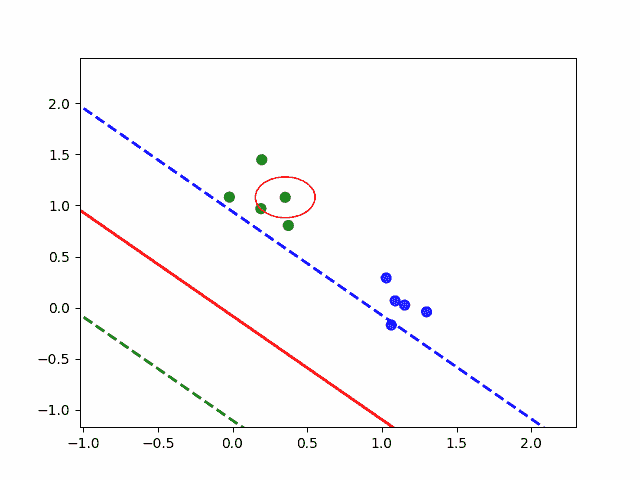

Perceptron algorithm for solving SVM

## Tldr 支持向量机

目标是找到分隔班级的最宽街道。街道由 3 条线定义:

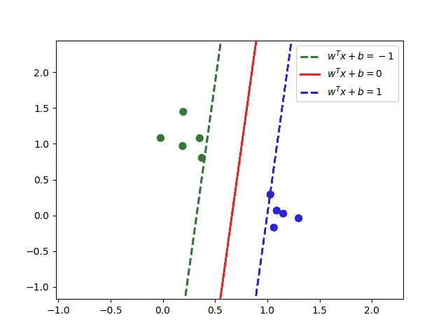

在这个例子中，我们有两个类(**蓝色= +1** 和**绿色= -1** )。红线是决策边界——使用上述 SVM 方法对未知点 **u** 进行分类:

*   **w^T u + b ≥ 0** 然后**蓝色**
*   **w^T u + b < 0** 然后**绿色**

这条街的宽度是

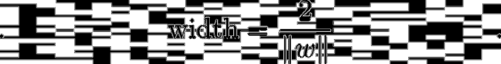

这意味着街道的宽度与 w 的大小成反比。

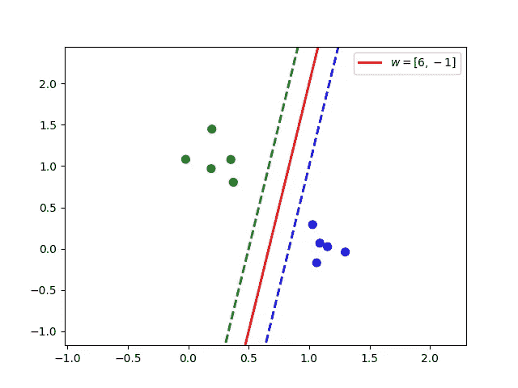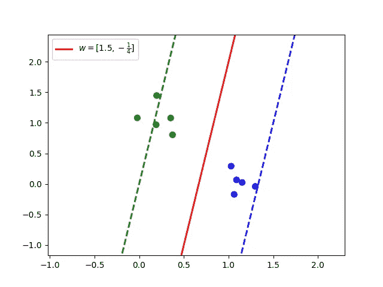

因此，找到最宽的街道意味着我们想要找到一条尽可能小的街道来分隔各个阶层。

## 膨胀/收缩率

请注意，将 **w** 和 **b** 乘以相同的常数 **c** 不会改变决策边界，但会改变街道的宽度。如果:

*   **0 < c < 1** 宽度将**扩大**
*   **c > 1** 宽度将**缩回**

假设我们有一个线性可分的数据集，我们将施加约束，即没有数据点位于街道上。这意味着，如果我们找到一条线来分隔我们的阶级，但有些点位于街道上，我们应该使街道变得更窄。而如果我们发现有一条街把我们的阶级分开，而他们都不在这条街上，我们就应该扩大这条街。

理想情况下，一些特殊点(称为支持向量)正好位于街道边缘。

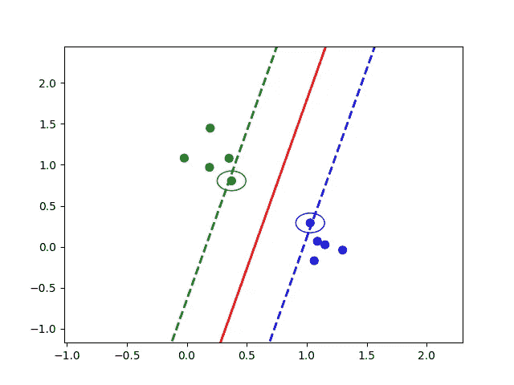

## 感知器算法

如果当前的 **w** 和 **b** 导致我们数据集中随机点 **x** 的错误分类，我们可以将线向 **x** 移动一定量 lr，如下所示:

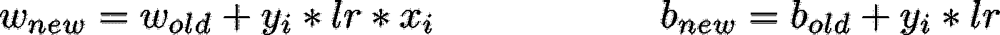

如果那个点 **x** 在街道上，我们可能想要收回街道。如果该点不在街道上或分类正确，我们可能需要扩展它。

## 把所有的放在一起

从一个随机的 **w** 和 **b** 开始(注意:w**w**和 **b** 的初始值对通过这个过程学习什么线影响很大)。

```
epochs = 100
lr = .05
expanding_rate = .99
retracting_rate = 1.01for _ in range(epochs):
    # pick a point from X at random
    i = np.random.randint(0, len(X))
    x, y = X[i], Y[i]
    ypred = w[0] * x[0] + w[1] * x[1] + b
    if (ypred > 0 and y > 0) or (ypred < 0 and y < 0):
        # classified correctly
        if ypred < 1 and ypred > -1:
            # in the street / street is too wide
            w = w + x * y * lr * retracting_rate
            b = b + y * lr * retracting_rate
        else:
            # street is too narrow
            w = w * expanding_rate
            b = b * expanding_rate
    else:
        # misclassified
        w = w + x * y * lr * expanding_rate
        b = b + y * lr * expanding_rate
```

用红色**圈起来的**是被错误分类的点。用黄色**圈起来的**是被正确分类的点。


Perceptron algorithm for solving SVM

## 如果数据不是线性可分的呢

再看一遍问题陈述——我们希望在数据集中的点不能位于街道的约束下，最大化街道的宽度。数学上，我们希望找到:

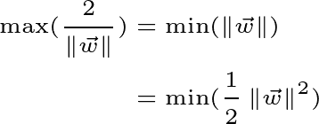

根据:

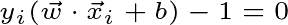

这相当于最大限度地减少:


取导数 wrt**w**:

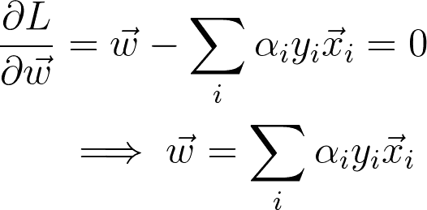

因此，决策边界可以重写为:


更新 **w** 意味着更新 **α。**

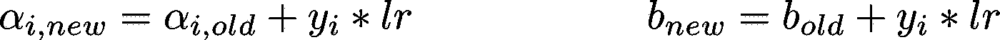

因此，我们可以这样重写上面的算法:

```
epochs = 100
lr = .05
expanding_rate = .99
retracting_rate = 1.01def **predict**(alpha_i, b, x):
    wx = 0
    for j in range(len(X)):
        wx += alpha_i[j] * np.dot(X[j], x)
    return wx + bfor _ in range(epochs):
    # pick a point from X at random
    i = np.random.randint(0, len(X))
    x, y = X[i], Y[i]
    ypred = **predict**(alpha_i, b, x)
    if (ypred > 0 and y > 0) or (ypred < 0 and y < 0):
        # classified correctly
        if ypred < 1 and ypred > -1:
            # in the street / street is too wide
            alpha_i[i] += y * lr
            alpha_i = alpha_i * retracting_rate           
            b += y * lr * retracting_rate
        else:
            # street is too narrow
            alpha_i = alpha_i * expanding_rate
            b *= expanding_rate
    else:
        # misclassified
        alpha_i[i] += y * lr
        alpha_i = alpha_i * expanding_rate
        b += y * lr * expanding_rate
```

## 内核技巧

为了找到非线性决策边界，我们可以使用“核技巧”。也就是说，我们只需要定义转换后的空间中的内积，而不是定义一个到新的特征空间的显式映射，其中数据集是线性可分的。该**核** **函数**定义了该内积，可以代替**预测**函数中的点积:


例如，我们可以使用多项式核

```
def **polynomial**(x_i, x_j, c, n):
    return (np.dot(x_i, x_j) + c) ** ndef **predict**(alpha_i, b, x):
    wx = 0
    for j in range(len(X)):
        wx += alpha_i[j] * **polynomial**(X[j], x, C, N)
    return wx + b
```

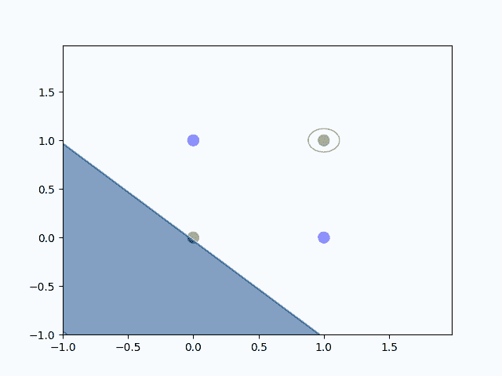

或者使用径向基函数核

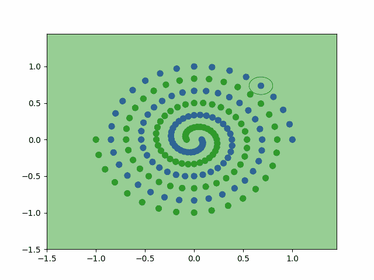

## 结论

虽然其他方法可以更有效地解决这个问题，但我希望这个简单的算法能帮助你更好地理解支持向量机！

[](/mlearning-ai/mlearning-ai-submission-suggestions-b51e2b130bfb) [## Mlearning.ai 提交建议

### 如何成为移动人工智能的作者

medium.com](/mlearning-ai/mlearning-ai-submission-suggestions-b51e2b130bfb)