# 为不关心优化的人提供支持向量机数学

> 原文：<https://medium.com/mlearning-ai/support-vector-machines-svms-for-people-who-dont-care-about-optimization-77873fa49bca?source=collection_archive---------3----------------------->

我一直回避支持向量机背后的数学，因为我知道这是一个优化问题，除非我用梯度下降来最小化一些东西，否则我对优化或线性规划或任何这些都不太了解。

然而，我最终花了一些时间阅读了优化方面的内容，并希望让没有多少优化背景的人更容易理解 SVM 数学的概念。

首先，让我们讨论一下我们要做的是什么。考虑以下情节:

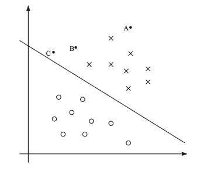

Image 1: Example Hyperplane Solved For Using an SVM. Figure Credit: [Andrew Ng](https://see.stanford.edu/materials/aimlcs229/cs229-notes3.pdf)

将 X 和 O 分开的线称为分离超平面，其中超平面只是 n 维空间中的一个平面，大小为 *n-1* (在上面的例子中，n=2)。无论如何，当我们使用支持向量机进行分类时，我们希望找到使我们的数据线性可分的超平面。然而，**与神经网络等其他生成分离超平面的方法不同，支持向量机在生成平面时不考虑远离直线的点**。在上面的示例图像中，点 A 离平面很远，因此它对线的最佳位置没有太大影响。然而，如果我们将 C 点下移，我们显然需要重新调整直线，以确保数据是线性可分的。

这是支持向量机的主要优点之一，它们只考虑会改变直线位置的点。**这些点被称为支持向量，并且是公式化超平面时唯一考虑的点。**

当我们讨论支持向量机如何求解这个超平面时，我们将在二元分类问题的上下文中这样做，其中我们将一些输入 *X* 映射到我们的目标空间*y∈{-1，1}* 。我们的目标是构建以下分类器。

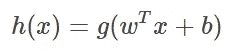

在上面的等式中:

> g 是我们的激活函数，如果( *w^Tx + b)* 为正，则返回 1，如果为负，则返回-1。
> 
> w 和 b 是我们希望学习的模型的权重和偏差
> 
> x 是我们的输入向量。

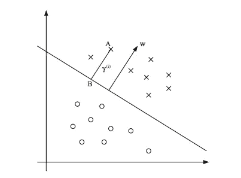

Example SVM “margin” γ. Figure Credit: [Andrew Ng](https://see.stanford.edu/materials/aimlcs229/cs229-notes3.pdf)

我读过的大多数关于支持向量机的数学教程都喜欢先讨论最大间隔分类器，然后再讨论支持向量机。边距是分离超平面和数据点之间的距离。在上图中，γ是从线到点 *A* 的边距。最大间隔分类器基本上只是用于完全线性可分数据的 SVM。**最大间隔分类器的目标是拟合一个超平面，使超平面每侧最近的数据点之间的距离/间隔最大化，从而使数据线性分离**，如下图所示。

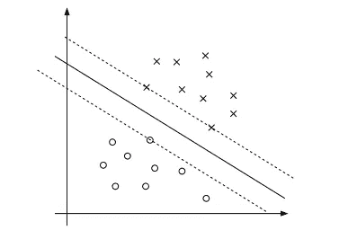

Maximum Margin Classifier. Figure Credit: [Andrew Ng](https://see.stanford.edu/materials/aimlcs229/cs229-notes3.pdf)

# 拉格朗日乘数和最优化的东西

可怕的优化部分来了。别担心，我保证会解释清楚这是什么意思。因此，最大间隔分类器希望解决以下问题:

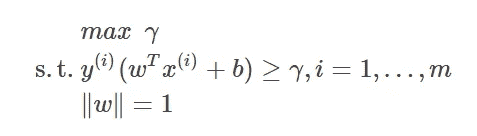

那么，这意味着什么呢？为了完整起见，我们先指出优化问题遵循这个总布局。首先，我们陈述我们想要优化(最大化/最小化)什么，然后我们陈述必须满足什么约束，通常用*这样的*或 s.t .符号。

让我们来看看这个优化问题。那么回想一下，直线每一边最近的数据点将会离超平面γ，对吗？因此，我们只想确保所有数据点尽可能远离直线(最大化γ)…这就是目标的意思。

此外， *y(i)(w^T x(i)+b)≥γ* 部分要求我们也确保所有点被正确分类，因为γ必须是正的，并且对于任何正确分类的数据点， *y(i)(w^T x(i)+b)* 都是正的。我不打算完全解释∨w ∨= 1 约束，因为我必须解释函数边界和几何边界之间的区别，而且…我不认为我们需要这样做。有关更多详细信息，请参考 https://see . Stanford . edu/materials/aimlcs 229/cs 229-notes 3 . pdf 的第 4 节。现在，我们只能说，通过使用∨w ∨= 1 约束，我们获得了一些不错的属性。

> 注意:当我说优化是“棘手”的时候，我的意思是这个函数很难优化。有一些建立方程的方法，允许更容易地使用现有的优化算法来最小化/最大化函数

现在，这实际上不是最大间隔分类器所需的优化的最终公式。我上面描述的提供了一些直觉，但实际上是一个相当棘手的优化。

为了使它变得简单一点，我们可以通过针对以下方面进行优化来获得相同的解决方案:

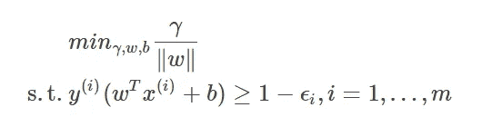

你可能会注意到，我们去掉了∨w ∨= 1 的约束，在目标函数的分母上增加了∨w∨。在不深入细节的情况下，我只想说，针对最大利润(除以∨w∨时得到的结果)的标准化版本进行优化，可以获得与最大化利润本身相同的结果。不幸的是，我们仍然有一点棘手的优化，但还有一件事我们可以做。

有一个技巧可以将这种优化重组为更可行的东西，当我说可行时，我的意思是将其格式化，以便能够插入到一些优化软件中(例如 scipy.optimize)。在**超高等级**下，我们将这样做的方式如下。

回想一下我们的分类器 *h(x)=g(wTx+b)* 。有趣的是，我们可以任意缩放 *w，b* 并得到相同的分类结果，因为我们的最终输出函数 *sign()，*只关心输出的符号。即*sign(g(wTx+b))= sign(g(2 wTx+2b))*。由于缩放约束不影响结果，我们可以强制裕度γ=1。换句话说，我们可以在不改变我们正在做的事情的情况下，重新调整所有的东西，使得裕度γ=1。由于规模的概念不影响分类，让我们将优化重写为:

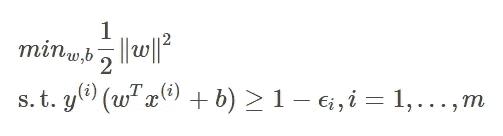

这是因为当γ=1 时，优化γ/‖w‖与最小化 1/∨w∨是相同的。因此，我们现在强制保证金等于 1。最后，我们有一些东西可以插入一些黑盒优化软件。此外，我很快注意到，这是我们的优化问题的原始公式。稍后将详细介绍这一点…

好了，棘手的部分来了，但我的意思是…这是支持向量机工作的核心。

假设您有以下优化问题:

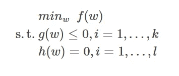

所以基本上只是一个函数，我们想用两个约束最小化。我们可以用拉格朗日乘数来解决这个问题(我假设你记得这些是什么)。我们将广义拉格朗日函数定义如下:

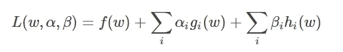

为什么我们需要拉格朗日函数？我们这样做是因为我们可以求解*拉格朗日乘数*，这允许我们解析地最小化某个函数 *f(w)* 。**你需要知道的:**拉格朗日乘数是α和β，它们允许我们将 *L* 的偏导数设置为 0，并在给定一些 *w* 的情况下最小化方程。因此，如果我们有乘数，我们可以最小化函数…这是我们的目标。

好了，现在我发现奇怪的部分来了。优化问题中有一些东西叫做“对偶”和“原始”公式。在某些条件下(在我们的例子中满足)，它们产生相同的解。对于支持向量机，对偶公式，我将跳过所有的数学细节，允许我们以更有用的方式重写最大间隔分类器优化。

首先，请注意，如果我们将最大间隔分类器的方程代入我们的广义拉格朗日方程，我们会得到:

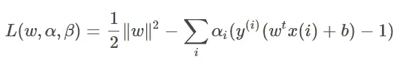

在做了大量的数学运算，得到了这个拉格朗日函数的对偶形式之后，我们找到了一个新的优化函数，它给出了与之前的原始形式相同的结果。

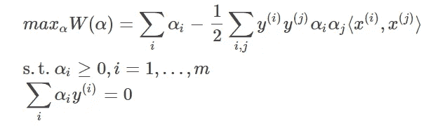

> 快速回顾:我们采用拉格朗日的一般公式，插入我们的最大间隔分类器方程，然后做一些简化，使用拉格朗日乘数将问题重写为优化问题。你只需要知道这些。

我相信你现在的问题是…“为什么我们需要这样做？”

首先，我们去掉了对 *w，b* 的依赖。我们剩下的是 *x(i)，x(j)* 的点积，我们可以在执行优化之前计算这些点积。你看到这有多酷了吗？我们需要做的就是求解αs。这使得问题更加有效，并让我们在低维空间中工作。此外，如果我们想学习一个非线性的决策边界，我们可以用一些非线性的核函数来代替点积。总的来说，我们现在只依赖于α的一切！但是我们如何用αs 来得到我们的超平面呢？

对于权重向量，我们可以将其表示为训练数据、训练标签和α的线性组合

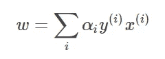

当我们想对一个测试数据点*x′*进行新的预测时，我们只需要简单地做

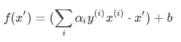

请记住，大多数权重将为 0，因为影响决策边界的唯一数据点是支持向量。这是这种新配方的另一个好处。也就是说，非零α将是我们的支持向量。因此，我们可以得到我们的最佳分离超平面，只看非零α……非常酷！

# 非线性可分数据的情况

如果我们添加数据点，使我们的数据集不再是线性可分的，那么我们到目前为止所讨论的将会打破。这是因为，如果你还记得我对优化函数的原始形式的讨论，我们要求所有的数据点都被正确分类。考虑到这一点，我们可以允许一些“松弛”，并用 L1 正则化重新制定优化，这基本上允许一些错误分类。

这是正则化 SVM 的原始形式

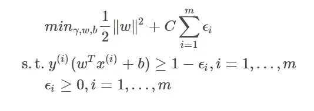

现在，允许每个训练点 *x(i)* 与分离超平面的距离小于 1(还记得以前我们限制点至少γ=1)。对于利润率小于 1 的样本，我们支付的价格是 *C* 。也就是说， *C* 控制着我们对犯错的在意程度。如果 *C* 很大，我们允许许多错误，并使用大量的正则化。如果 *C* 小，我们基本上就有了我们原来的优化问题，尽量少出错。

对偶形式，我跳过了它的推导，看起来像这样:

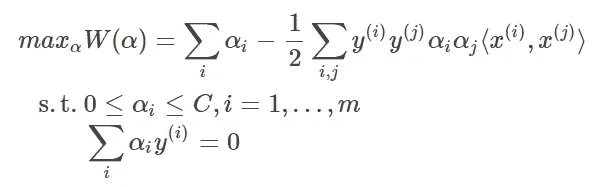

如您所见，这与我们已经讨论过的线性可分方法非常相似。另外，请注意，这是我们要从头开始编写 SVM 的代码。让我们看看这个怎么样。

首先，让我们生成一些数据。请注意，我们将默认的(0，1)标签更改为(-1，1)。这是必需的，因为我们希望我们的超平面方程分别等于 0 和边距等于-1，1。

```
from sklearn.datasets import make_blobs
from scipy import optimize
import numpy **as** np
**def** **gen_data**(n_samples):
    X, t **=** make_blobs(n_samples**=**n_samples, centers**=**2, cluster_std**=**2.0)
    minmax **=** MinMaxScaler()
    X **=** minmax.fit_transform(X)
    **for** i **in** range(len(t)):
        **if** t[i] **==** 0:
            t[i] **=** **-**1
    **return** X,t
```

这个函数将计算我们讨论过的所有点积。做完这些，剩下要做的就是计算αs。

```
**def** **H**(X):
    N **=** len(X)
    H **=** np.empty((N, N))
    **for** i **in** range(N):
        **for** j **in** range(N):
            H[i, j] **=** np.dot(X[i], X[j])
    **return** H
```

下面是我们将传递给优化器的目标函数和约束。关于 scipy.optimize 的几点说明

1) Scipy 会默认最小化你的函数。因此，为了计算最大值，我们返回函数的负值

2)不等式约束默认情况下确保返回的值大于 0

3)等式约束确保您返回的值等于 0

```
**def** **loss**(a):
    '''
    a: vector of alpha values 
    t: (accessed globally) vector of labels in (-1,1)
    '''
    at **=** a ***** t  
    **return** **-**(a.sum() **-** 0.5 ***** np.dot(at.T, np.dot(K, at)))

*# This is the inequality constraint 
# For N datapoints, this will produce a 
# matrix with 2N rows, where the first N
# assure alpha > 0 and the second N
# assure alpha < C. This is just a clever
# formulation of this I found on github! (see sources)* **def** **constraint1**(x):
    *# A,b accessed globally
*    **return** b **-** np.dot(A,x)

*# This is the equality constraint sum_i alpha_i*y_i = 0* **def** **constraint2**(x):
    *# t accessed globally
*    **return** np.dot(x,t)
```

下面是程序的主要逻辑

```
*# Get data and labels with 100 data points* X,t **=** gen_data(100)
N **=** len(X)
*# Set C value (error tolerence)* C **=** 1
*# Generate the dot_product matrix* K **=** H(X)

*# see constraint 1 comments to understand what happens here* A **=** np.vstack((**-**np.eye(N), np.eye(N)))
b **=** np.concatenate((np.zeros(N), C ***** np.ones(N)))

*# Define constraints for scipy* constraints **=** ({'type': 'ineq', 'fun': constraint1},
               {'type': 'eq', 'fun': constraint2})

*# initalize alpha values (doesn't matter too much how you do this)* a0 **=** np.random.rand(N) 
res **=** minimize(loss, a0, constraints**=**constraints)

a **=** res.x  *# optimal Lagrange multipliers* a[np.isclose(a, 0)] **=** 0  *# zero out nearly zeros* a[np.isclose(a, C)] **=** C  *# round the ones that are nearly C* 
*# points with a==0 do not contribute to prediction* support_idx **=** np.where(0 **<** a)[0]  *# index of points with a>0; i.e. support vectors*
```

现在我们已经完成了优化，通过以下方式求解 *b* 项

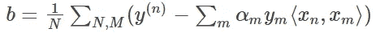

其中 *N，M* 是支持向量的数量。

```
*# Solve for b intercept term* a_times_t **=** a ***** t
all_b **=** []
**for** n **in** support_idx:
    x_n **=** X[n]
    eval_ **=** np.array([np.dot(x_m, X[n]) **if** a_m **>** 0 **else** 0 **for** x_m, a_m **in** zip(X, a)])
    b **=** t[n] **-** a_times_t.dot(eval_)
    all_b.append(b)
b **=** np.mean(all_b)
```

现在我们定义一个函数来“预测”测试数据，也就是在一组均匀分布的数字上生成超平面。

```
**def** **predict**(test, X, t, k, a, b):

    a_times_t **=** a ***** t
    y **=** np.empty(len(test))  *# array of predictions
*    **for** i, s **in** enumerate(test):
        *# evaluate dot product between new data point and support vectors; 0 if not a support vector
*        eval **=** np.array([np.dot(s, x_m) **if** a_m **>** 0 **else** 0 **for** x_m, a_m **in** zip(X, a)])
        y[i] **=** a_times_t.dot(eval) **+** b
    **return** y
```

现在我们策划！

```
plt.scatter(X[:,0], X[:,1], c **=** t)
*# plot the decision boundary and margins in the input space* grid **=** np.arange(X.min(), X.max(), 0.05)
xx, yy **=** np.meshgrid(grid, grid)
zs **=** predict(np.array(list(zip(np.ravel(xx), np.ravel(yy)))), X, t, None, a, b)
zz **=** zs.reshape(xx.shape)
CS **=** plt.contour(xx, yy, zz, levels**=**[**-**1, 0, 1], )
```

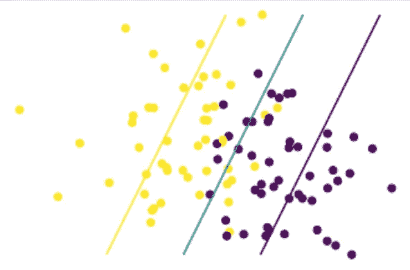

Example SVM Result

来源:

*   基于来自 https://github.com/yiboyang/PRMLPY/blob/master/ch7/svm.py[的非线性 SVC 的代码](https://github.com/yiboyang/PRMLPY/blob/master/ch7/svm.py)
*   从 https://see . Stanford . edu/materials/aimlcs 229/cs 229-notes 3 . pdf…这样一篇伟大的文章中学到了我现在对支持向量机的大部分了解
*   这也很有帮助！[https://web.mit.edu/6.034/wwwbob/svm.pdf](https://web.mit.edu/6.034/wwwbob/svm.pdf)