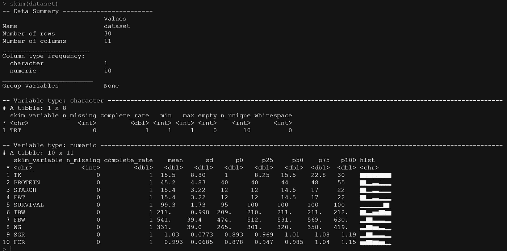
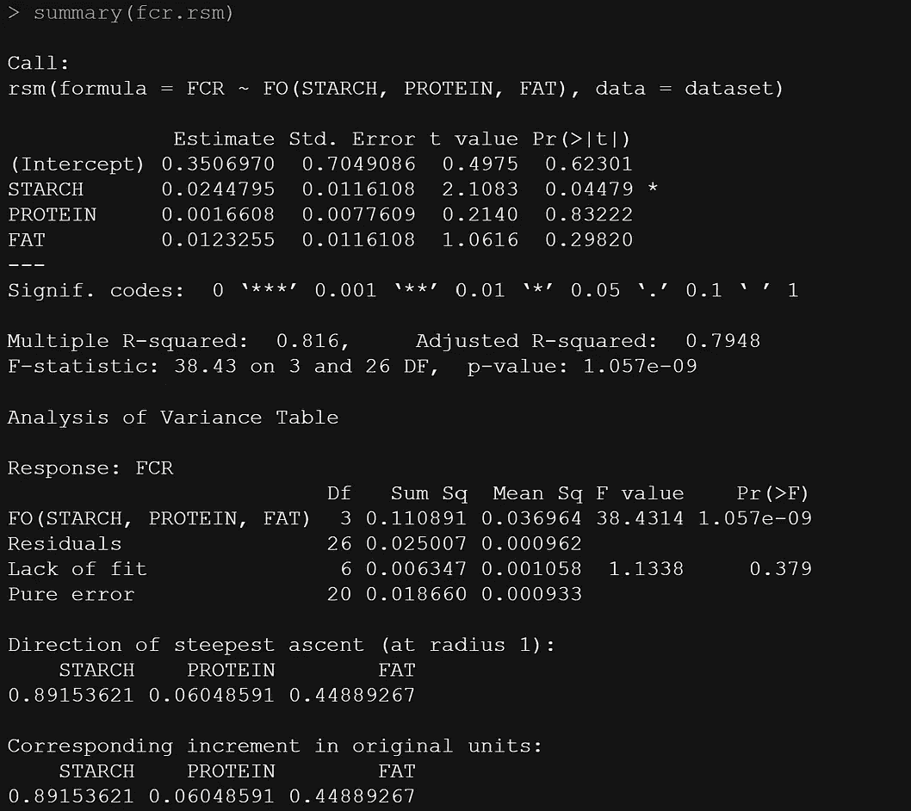
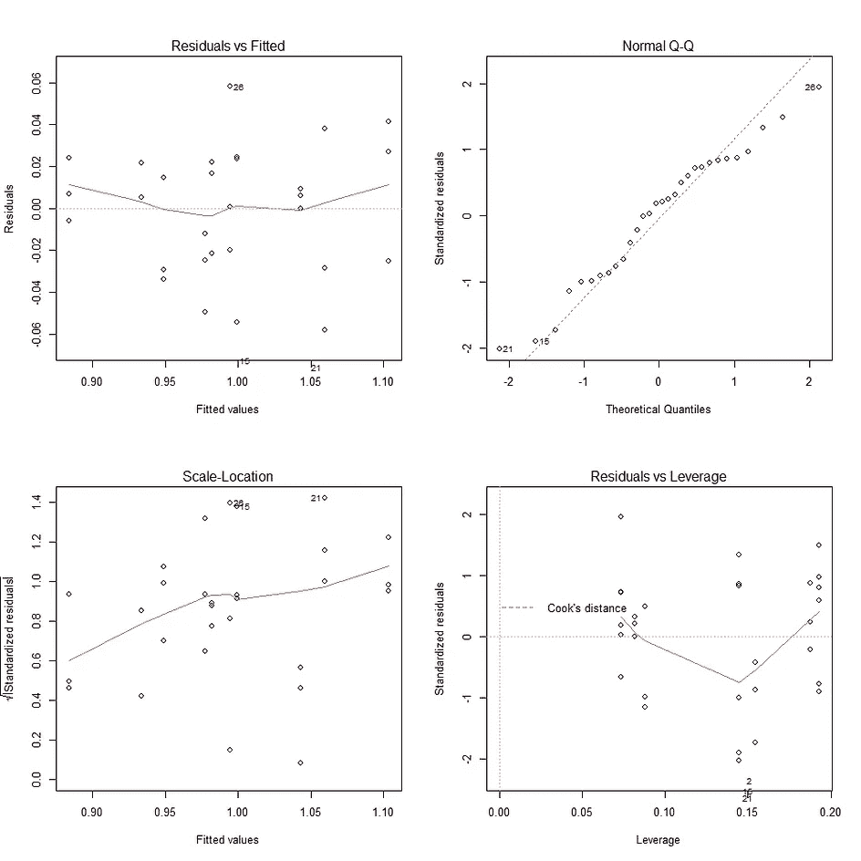
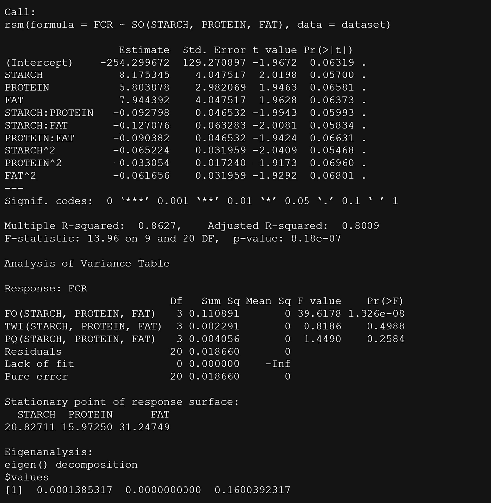
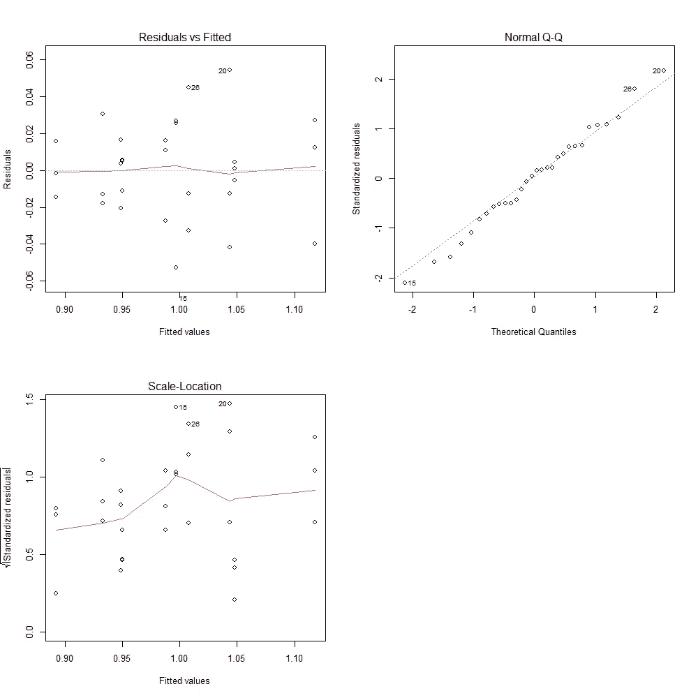
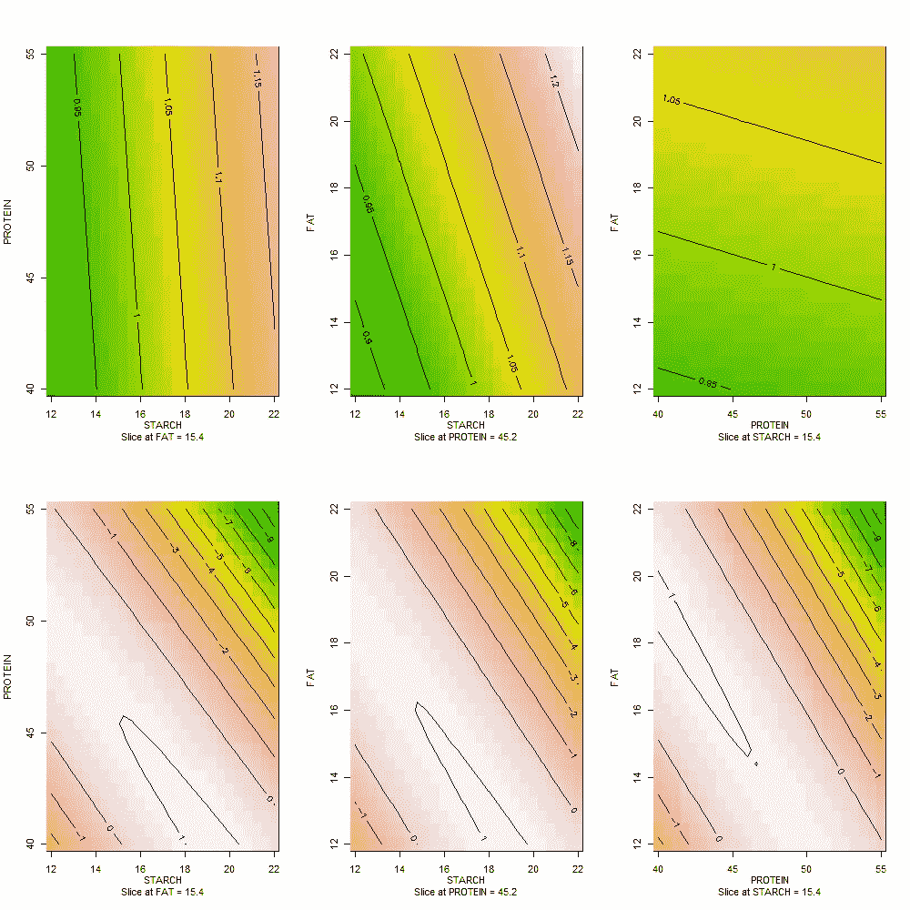
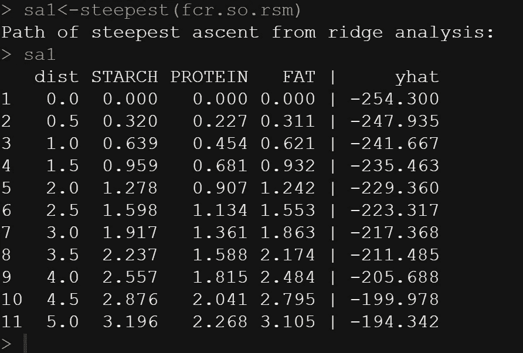
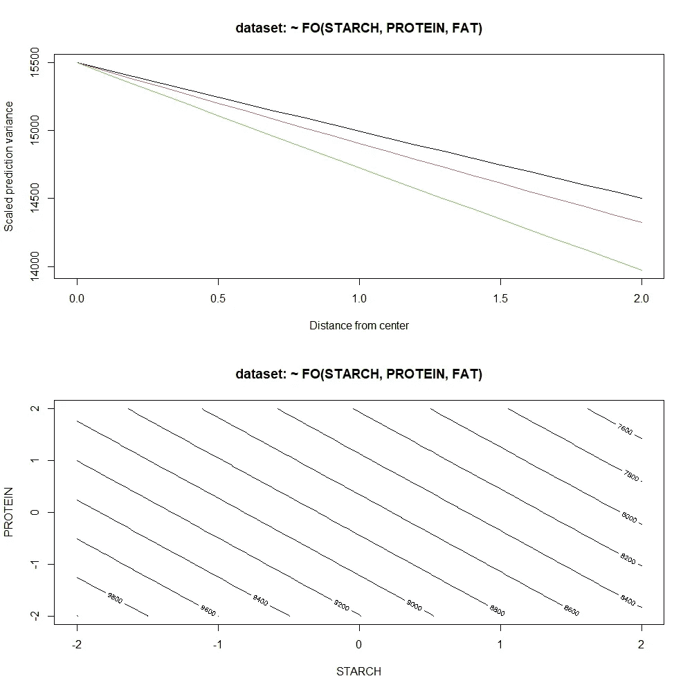
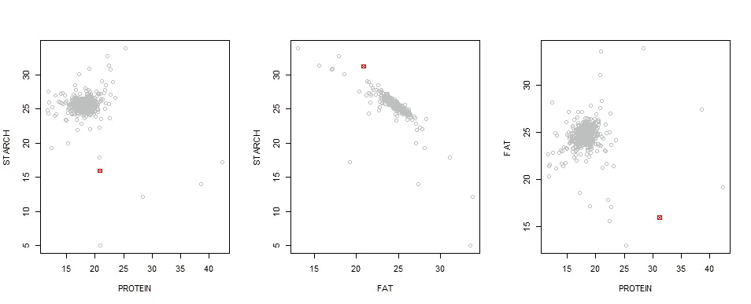

# 鱼类摄食数据的表面分析

> 原文：<https://medium.com/mlearning-ai/surface-analysis-of-feed-data-in-fish-5e426464d2f4?source=collection_archive---------6----------------------->

## 在 R 中使用响应面方法的简短收获

这不是我第一次在 response surface methodology 上发表的博文，但我非常喜欢它，以至于每当我将它应用到一个项目中时，我就必须写一篇关于它的博文。在我工作的动物饲料行业，响应面非常重要，因为它可以让你找到最优解(如果存在的话)。

让我们用 r 快速浏览一下。

```
library(readxl)
library(rsm)
library(skimr)
## Load data 
dataset <- read_excel("Surface analysis_dataset.xlsx")
View(dataset)
skim(dataset)
```



The data contains several piece of information on nutrients.

现在，当构建一个响应面时，你的成功程度真正取决于你的设计。如果实验设计正确，分析就简单明了。如果不是，那么，你就上当了，你真的需要小心寻找没有联系的地方。请记住，这些统计算法是模式猎人，他们是饥饿的。

现在，当使用 [rsm 包](https://cran.r-project.org/web/packages/rsm/index.html)构建响应面时，有两种主要的方法来构建模型:

1.  FO —一阶多项式
2.  SO —二阶多项式。这并不适合每个人，如果你想去，你需要像那样设计你的学习。否则，您可能很容易过度拟合您拥有的数据。

```
fcr.rsm <- rsm(FCR ~ FO(STARCH,PROTEIN,FAT), data = dataset)
summary(fcr.rsm)
par(mfrow = c(2, 2))
plot(fcr.rsm)
fcr.rsm <- rsm(FCR ~ SO(STARCH,PROTEIN,FAT), data = dataset)
summary(fcr.rsm)
par(mfrow = c(2, 2))
plot(fcr.rsm)
```



Looking O.K.



Residuals vs. Leverage plot could not be made, and some statistics are zero or infinite. Not a stable model.

```
par(mfrow = c(2,3))
fcr.fo.rsm <- rsm(FCR ~ FO(STARCH,PROTEIN,FAT), data = dataset)
fcr.so.rsm <- rsm(FCR ~ SO(STARCH,PROTEIN,FAT), data = dataset)
contour (fcr.fo.rsm, ~ STARCH + PROTEIN + FAT, image=TRUE)
contour (fcr.so.rsm, ~ STARCH + PROTEIN + FAT, image=TRUE)
```



Plotting the FO (top) and SO (bottom) shows that the SO is trying to hard to make something exotic from the data. I would not stick with the SO.

我们可以做的是更好地探索 SO 模型的估计量，但我并不认为这部分特别有启发性。

```
sa1<-steepest(fcr.so.rsm)
sa1
```



rsm 包在设计、分析和后拟合响应面方面有一些非常酷的工具。这让你可以使用数据，看看哪里出了问题。下面你将找到显示两个模型设计的缩放方差函数的代码。

在这个特殊的例子中，我不能说这真的提供了很多信息。

```
par(mfrow=c(2,1))
varfcn(dataset, ~ FO(STARCH,PROTEIN,FAT))
varfcn(dataset, ~ FO(STARCH,PROTEIN,FAT), contour = TRUE)
```



现在，我确实发现了一些与重采样有关的信息(我喜欢重采样)。我在这里要求的是对模型重新取样，以找到一个成功设计的假设中心点。换句话说，我从现有数据中做出实质性成果的机会有多大？

```
fcr.rsm <- rsm(FCR ~ SO(STARCH,PROTEIN,FAT), data = dataset)
fits = predict(fcr.rsm)
resids = resid(fcr.rsm)
boot.raw = replicate(1000, xs(update(fcr.rsm, fits + sample(resids, replace=TRUE) ~ .)))
boot = code2val(as.data.frame(t(boot.raw)), codings=codings(fcr.rsm))
par(mfrow = c(1,3))
plot(STARCH ~ PROTEIN, data = boot, col = "gray"); points(20.8271,15.9725, col = "red", pch = 7)
plot(STARCH ~ FAT, data = boot, col = "gray"); points(20.8271,31.2479, col = "red", pch = 7)
plot(FAT ~ PROTEIN, data = boot, col = "gray"); points(31.2479,15.9725 , col = "red", pch = 7)
```



This plot clearly shows that the center points I have now (in red) do not even come close to where it should be. This IS informative, as it can help you build a new study.

所以，这是一个关于响应面(后)拟合的快速帖子。想了解更多关于设计的信息，看看我的其他博客吧！！

[](/mlearning-ai/mlearning-ai-submission-suggestions-b51e2b130bfb) [## Mlearning.ai 提交建议

### 如何成为 Mlearning.ai 上的作家

medium.com](/mlearning-ai/mlearning-ai-submission-suggestions-b51e2b130bfb) 

🔵 [**成为作家**](/mlearning-ai/mlearning-ai-submission-suggestions-b51e2b130bfb)