# 点群中平均最近邻距离的惊人行为

> 原文：<https://medium.com/mlearning-ai/surprising-behaviour-of-the-average-nearest-neighbour-distance-in-a-cluster-of-points-dce671b86c3b?source=collection_archive---------2----------------------->

# 介绍

我盯着点缀着不同密度的椒盐噪声的图像。一些很自然的问题在我脑海里蹦了出来——当这些点越来越拥挤时，它们之间的距离会发生什么变化？如果我们要定义一个度量来衡量点与点之间的接近程度，比如说*平均最近邻距离*，那么这个度量随着点密度的增加会如何表现呢？

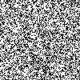

*椒盐比例=0.6 的图像*

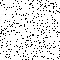

*椒盐比例=0.90 的图像*

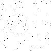

*椒盐比例=0.99 的图像*

盐和胡椒的比例被定义为随机选择的像素颜色为白色(盐)的概率。该值越高，黑色像素的数量就越少，因此这些点看起来相距更远。椒盐噪声只能应用于任何图像，即彩色或灰度。我们将限制我们的例子，只有单色图像。像素只能是白色或黑色。

# 了解最近邻距离

请考虑此图像中显示的点。根据定义，每个点都有一个最近的点。您可能有多个等距的点，因此有多个最近的邻居。但是对于这个讨论，我们将选择最近的邻居。

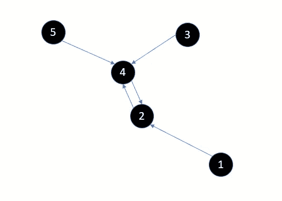

1.  点 2 是点 1 的最近邻
2.  点 2 是点 4 的最近邻，反之亦然
3.  点 4 是点 3 的最近邻点
4.  点 4 是点 5 的最近邻点

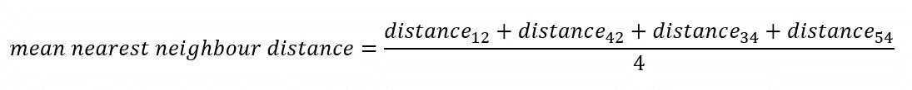

# 从单位正方形中的两点开始

这是一个经典问题。在一个边长为 1 的正方形中，随机选择的两个点之间的预期距离是多少？

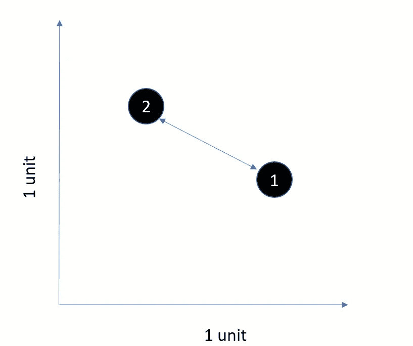

这个问题的数学解并不简单，我将不再讨论细节。关于这个主题的精彩论文可以在这里找到。根据同一篇文章，我给出了下面的等式，这是我们问题的解决方案。预期距离结果为 **0.5214** 。

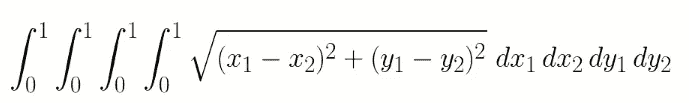

# 计算随机两点间期望距离的蒙特卡罗方法

```
import datetime
import math
import numpy as np
import random
import statistics #
#Pick 2 randmom points, compute the distance and repeat several times. 
#Compute average of all distances
#
def compute_expected_distance_between_2points_n_trials(max_trials:int):
    seed=datetime.datetime.now().second
    random.seed(seed)
    distances=[]
    for i in range(0,max_trials):
        x1=random.random()
        y1=random.random()
        x2=random.random()
        y2=random.random() distance=math.sqrt( (x1-x2)**2 + (y1-y2)**2 )
        distances.append(distance)
    return statistics.mean(distances)iterations=100000
average=compute_expected_distance_between_2points_n_trials(10000)
print("Average=%f after iterations=%d" % (average,iterations))
```

在这个简单的 Python 程序中，我们生成随机点对，并使用毕达哥拉斯定理计算距离。用 100000 次迭代运行上述程序，我得到的值是 0.522079，非常接近理论值 0.5214

# 如果我们增加点数会发生什么？

我们不会试图创造一个理论模型。相反，我们将编写一个简单的 Python 程序，用不同密度的点进行蒙特卡罗模拟。我们将逐渐增加点数，在每个阶段，我们将生成 N 个随机点。我们将使用 *scitkit-learn* 的 *KDTree* 类来计算平均最近邻距离。对于每个 N，我们将重复试验并计算平均值。

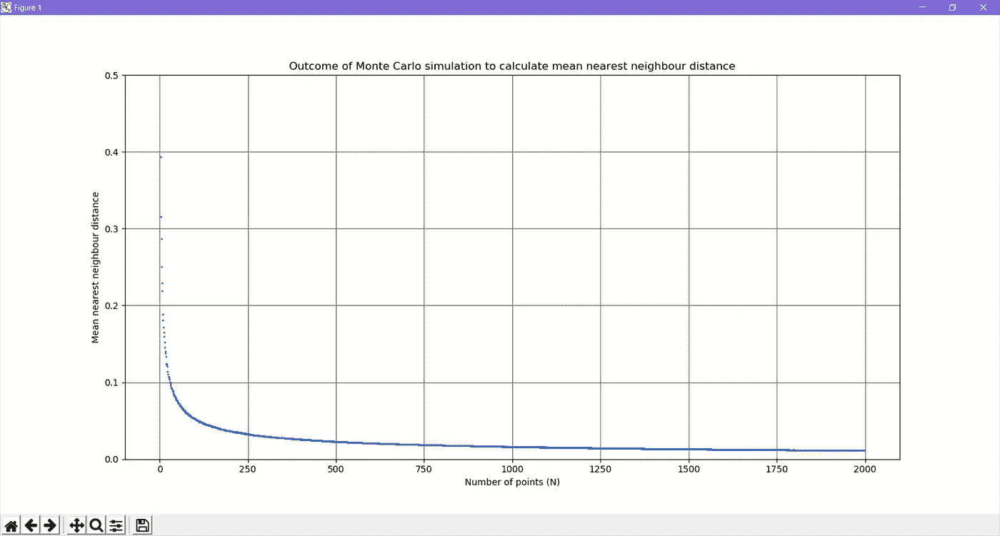

```
#
#We will select N randmon points in an unit square and then compute the mean nearest-neighbour distance
#We will then plot the mean NN distance vs N
#
#from typing import List
import numpy as np
import os
import random
from numpy.core.fromnumeric import mean
from skimage import io
from sklearn.neighbors import KDTree
import math
import statistics
import matplotlib.pyplot as plt class NearestNeighbourDistance(object):
    """docstring for NearestNeighbourDistance."""
    def __init__(self, squaresize:float,point_count:int, iterations:int):
        super(NearestNeighbourDistance, self).__init__()
        self.__squaresize=squaresize
        self.__point_count=point_count
        self.__iterations=iterations

    def compute_mean(self):
        means_across_iterations=[]
        for iteration in range(0,self.__iterations):
            random_array=np.random.random((self.__point_count,2))
            tree = KDTree(random_array)
            nearest_dist, nearest_ind = tree.query(random_array, k=2)  # k=2 nearest neighbors where k1 = identity
            mean_distances_current_iterations=list(nearest_dist[0:,1:].flatten())
            mean=statistics.mean(mean_distances_current_iterations)
            means_across_iterations.append(mean)
        return statistics.mean(means_across_iterations)def plot(points_count:List,  means:List):
    plt.scatter(points_count,means, marker='.', s=5)
    plt.grid(b=True, which='major', color='#666666', linestyle='-') plt.show()
    pass lst_pointcount=[]
lst_meandistance=[]
iterations=50
for point_count in range(2,1000):
    nn=NearestNeighbourDistance(squaresize=1,point_count=point_count,iterations=iterations)
    mean_distance=nn.compute_mean()
    lst_pointcount.append(point_count)
    lst_meandistance.append(mean_distance)
    print("Computed mean NN distance of %f for %d points" % (mean_distance,point_count))plot(lst_pointcount, lst_meandistance)
```

# 为什么平均邻居距离呈现这样的分布？

我们可以看到，在 N=2 时，平均值为 *0.5214* 。随着 N 的增加，平均距离迅速下降，然后趋于平稳。我们能设计出一个简单的数学模型来解释这种行为吗？

# 找到一个简单的数学模型

我们将做一些近似。考虑一个 N=4 点，N=9 点的正方形。

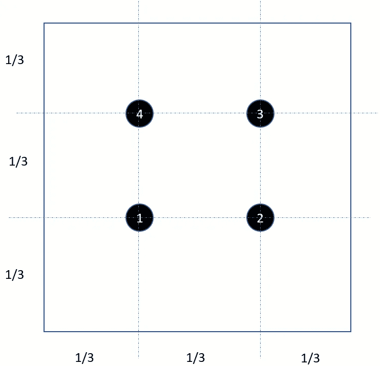

*N=4，平均最近邻距离=1/3*

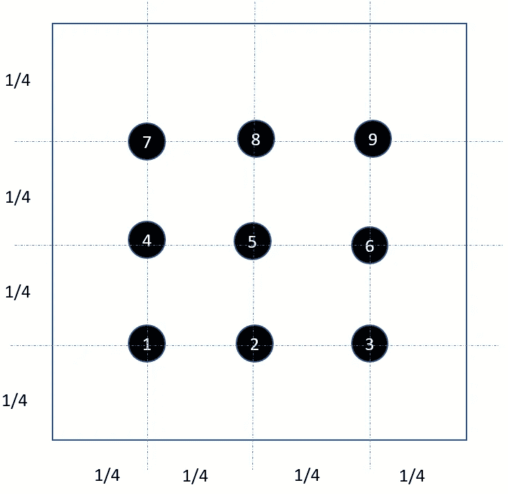

*N=9，平均最近邻距离=1/4*

从上面推断，我们可以看到下面的模式出现。显然，这对于 *n=2* 是不成立的，因为我们有一个之前讨论过的严格公式。


# 绘制简单数学模型与点数(N)的关系

我们可以清楚地看到，这条曲线展示了我们从蒙特卡罗模拟中获得的相同特征，即急剧下降，然后变平。

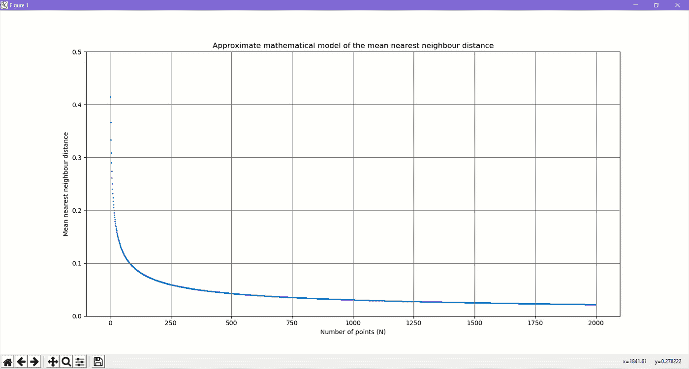

```
from typing import List
import numpy as np
import math
import matplotlib.pyplot as plt def plot(points_count:List,  means:List):
    plt.ylim([0, 0.5])
    plt.scatter(points_count,means, marker='.', s=5)
    plt.grid(b=True, which='major', color='#666666', linestyle='-') plt.show()
    passlst_pointcount=[]
lst_meandistance=[]
for point_count in range(2,2000):
    mean_distance=1/(math.sqrt(point_count)+1)
    lst_pointcount.append(point_count)
    lst_meandistance.append(mean_distance)
    print("Computed mean NN distance of %f for %d points" % (mean_distance,point_count))plot(lst_pointcount, lst_meandistance)
```

# 吸取的教训和结论

我们最初的任务是什么？
我们检查了带有椒盐噪声的图像，并着手了解最近邻距离如何随着点密度的增加而变化

**单位正方形中的 2 个随机点会发生什么？**
数学已经给了我们一个强有力的理论模型，证明这个距离是 *0.5214* 。我们也将通过蒙特卡洛模拟得出这个数字

**N 个随机点会怎么样？**
我们做了一个蒙特卡洛模拟。然后我们创建了一个近似模型。这两个模型显示了相同的趋势。

我们如何计算一个点的最近邻距离？
sci kite-learn 库的 *KDtree* 类使这变得非常简单和高效。

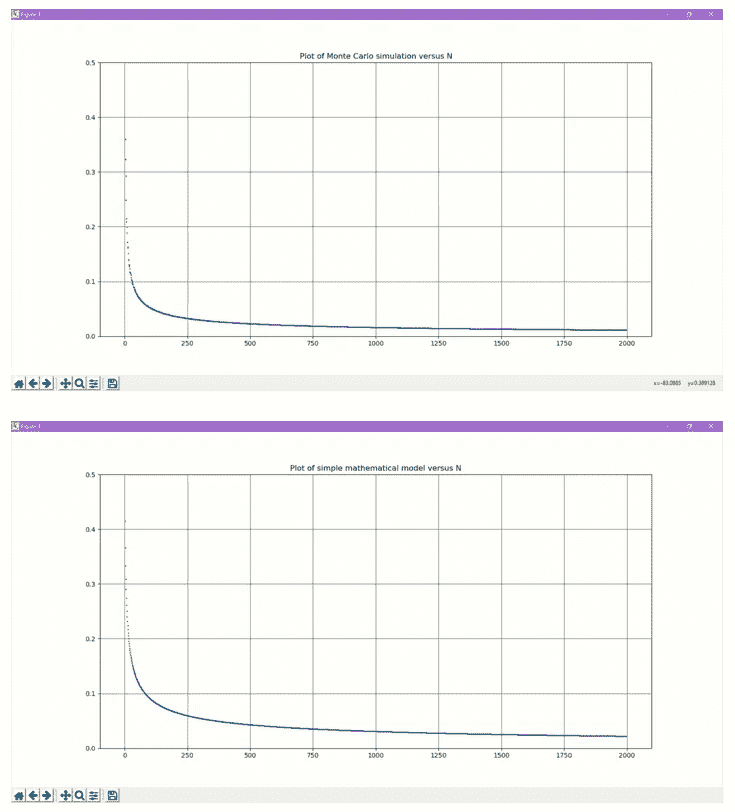