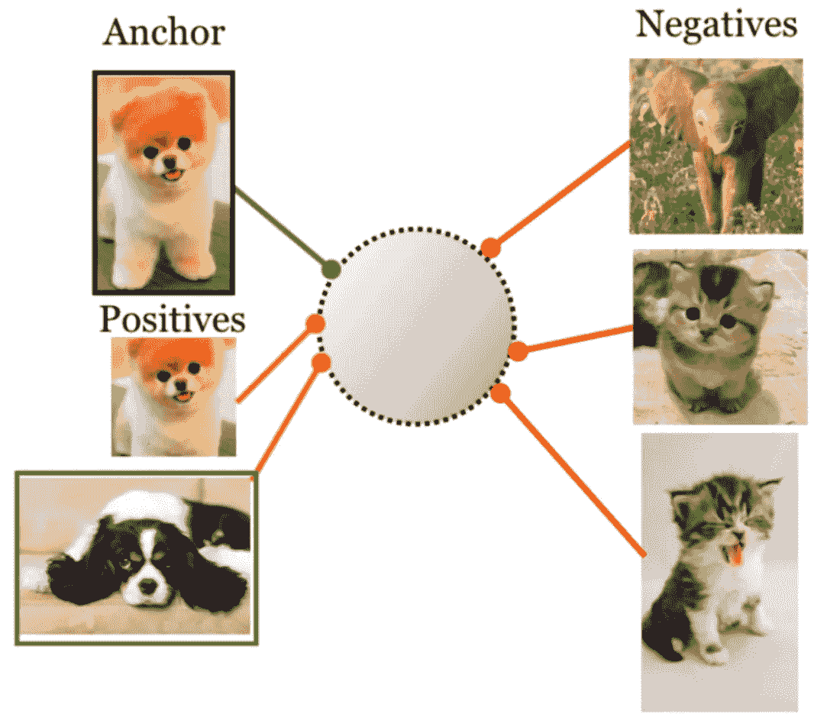

# 计算机视觉中的对比学习综述

> 原文：<https://medium.com/mlearning-ai/survey-of-contrastive-learning-in-computer-vision-89ff6fea277c?source=collection_archive---------3----------------------->

[Source](https://ai.googleblog.com/2021/06/extending-contrastive-learning-to.html)

这是一篇综述计算机视觉领域对比学习的调查文章。这个帖子是看完这个[视频](https://www.bilibili.com/video/BV19S4y1M7hm/?spm_id_from=pageDriver&vd_source=a3fd8cc7c926eda8f2bc99817b7c1c4e)后的一个简单总结。我会相应总结几篇著名的 CV 对比学习论文。这个帖子只会对每篇论文做一个大概的介绍。详细的阅读和分析将在后面。

首先，请允许我简单介绍一下对比学习。对比学习的目标是学习这样一种嵌入空间，其中相似的样本数据(图像/文本)保持彼此靠近，而不相似的样本数据则远离。对比学习是最强大和最流行的[自我监督学习](https://en.wikipedia.org/wiki/Self-supervised_learning)方法之一。

对比学习在近 2-3 年非常流行。对比学习在对比学习中的发展阶段如下:

# 第一阶段的不同方法

在这一阶段，发表了许多不同的方法。模型，损失函数和借口任务已经确定。这一阶段有几篇著名的论文:

> 通过非参数实例级辨别的无监督特征学习

论文链接:【https://arxiv.org/abs/1805.01978 

我们将这个模型称为 InstDisc，这是它的标题中最后两个字的缩写。如果说《MoCo》是对比学习中的一部里程碑式的作品，那么《英特迪斯克》可以说是巨人的肩膀。InstDisc 定义了借口任务:实例判断任务。与此同时，许多其他的对比学习论文直接效仿了本文的实验。

托词任务(实例辨别任务):InstDisc 将类的监督发挥到了极致，这样模型就能够学习能够辨别个体数据的特征表示。

模型:InstDisc 利用主干 CNN 将每个图像编码成特征嵌入。所有这些嵌入都分布在一个 128D 的单位球面上(128 维，L2 归一化)。

阳性和阴性数据:对于一个批次中的每个样本，阳性数据是其本身(包括补充数据)。负数据是从内存库中随机抽取的(文中的 4096)。在每一批训练之后，该批数据的嵌入将替换记忆库中相应的旧嵌入。本文还采用近似正则化方法，用动量更新嵌入(在记忆体内)。

损失:采用非参数的 softmax 和 NCE 损失来训练模型。

总结:

1.  提出了实例判定任务
2.  收养 NCE 损失
3.  采用另一种数据结构(存储体)来存储学习到的嵌入

> 基于不变和扩展实例特征的无监督嵌入学习

论文链接:[https://arxiv.org/abs/1904.03436](https://arxiv.org/abs/1904.03436)

我们称这个模型为 InvaSpread。

借口任务:实例判断任务

模型:主干 CNN 将图像投射到低维子空间

正面和负面数据:对于批次中的每个数据，获得一个增强图像。这是积极的数据。所有其他批次数据及其增强图像都是负面数据。这意味着，对于 m 的批量大小，每个图像将具有 1 个正数据(扩充的)和(2m-2)个负数据来计算损失函数。

损失:NCE 损失

总结:

与 InstDisc 相比，这里没有内存条来提供负样本。所有阴性样本都来自批次数据(及其扩充数据)。因此，InvaSpread 能够进行端到端的训练。

InvaSpread 的训练批量为 256，只能贡献 510 个阴性样本。因此它的性能不如 SimCLR，尽管它们有相似的训练程序。此外，InvaSpread 没有像 SimCLR 那样使用非常强大的数据处理技术，最终也缺少 MLP 应用层。然而，InvaSpread 可以被视为 SimCLR 的前身

> 对比预测编码的表征学习

论文链接:【https://arxiv.org/abs/1807.03748 

本文提出了一种通用的表征学习方法，无论输入是音频、图像、文本，甚至是强化学习。事实上，这种方法将语言模型推广到不同类型的输入，而不仅仅是文本。

模型:序列输入将被输入到编码器模型中。然后，返回的要素将输入到自动回归模型(RNN/LSTM)。这个自回归模型的输出是上下文表示。这个上下文表示向量包含了上下文的信息，如果足够强大的话，可以用来预测未来。

正负数据:真正的未来数据是正的数据。所有其他数据都可以被视为负面数据

借口任务:未来预测任务。这是一代人的任务之一。如果输入是文本序列，这种方法实际上就要训练一个语言模型。

> 对比多视图编码

论文链接:【https://arxiv.org/abs/1906.05849 

正面和负面数据:不同观点的数据可以被视为正面数据。如果数据的不同视图都是图像，这些视图可以被认为是不同的增强技术(？).Multiview 不仅限于图像视图，它还可以扩展到图像的语音描述和文本描述。这张纸实际上是以前的夹子。

# MoCo 和西姆克莱尔

现在到了 21 世纪 20 年代，出现了两种非常流行的对比学习方法

> 无监督视觉表征学习的动量对比

论文链接:[https://arxiv.org/abs/1911.05722](https://arxiv.org/abs/1911.05722)

本文将以往的对比学习方法归纳为一个字典查找问题。MoCo 提出了对比学习的两个组成部分:队列和动量编码器

型号:

MoCo 认为，对比学习是学习一个编码器来执行字典查找:在字典中，关键字是学习图像的特征，值是相应的实例。因此，在这种设置中，对比学习是学习可以将编码的查询(增强图像)匹配到编码的关键字(图像特征)的编码器。

因此，MoCo 建立了一个基于队列的动态字典。密钥由动量更新编码器编码(确保缓慢更新)。

正面和负面数据:

假设特征维数为 C，字典大小为 K，批次大小为 N。正数据是该批次中的图像，其将被编码为 N*C。负数据是当前字典中的数据，其大小为 K*C。对于每个图像，MoCo 应用两种不同的扩充技术来生成两个扩充数据。因此，正对数是从这两个扩充数据中计算出来的。负逻辑是在一个扩充数据和字典中的关键字之间计算的。在每次批量训练之后，当前小批的关键嵌入将被排入字典，并且最早的小批将被出队。与此同时，关键网络将进行动态更新。

损失函数:InfoNCE

总结:

MoCo 遵循与 InstDisc 非常相似的模型和实验设置。与 InstDisc 相比，MoCo 有两项改进:

1.  基于队列的字典:与 InstDisc 中的记忆库相比，MoCo 利用该字典存储负样本，保证了批量训练时有大量的负样本。
2.  动量编码器。同时，MoCo 利用动量技术更新关键编码器。这确保了字典中的键嵌入都来自相似的键编码器(成为有效的负样本)

> 视觉表征对比学习的简单框架

论文链接:【https://arxiv.org/abs/2002.05709 

这是计算机视觉中真正简单的对比学习技术。

正面和负面数据:与之前的对比学习一样，SimCLR 利用不同的增强技术来获得每个输入的增强示例对。因此，对于 N 个例子的小批量，它将产生 2N 个数据点。正对是显而易见的(来自同一图像的增强数据对)。SimCLR 将其他 2(N-1)个扩充示例视为反例。(为什么不和原始图像也进行比较呢？)

损失函数:InfoNCE

模型:在训练阶段，SimCLR 采用两个主要部分:表示编码器和可学习的非线性转换层(MLP)。这种非线性变换层的引入大大提高了学习表示的质量。在后面的下游任务中，这个转换层将被扔掉。只有编码器用于线性评估/微调。

总结:

非线性变换层的引入太棒了。在 SimCLR 中已经使用和评估了许多不同的增强技术。SimCLR 还进行了非常详细的消融实验，以评估这些增强技术的不同组合的性能。

> 动量对比学习的改进基线(MoCo-v2)

与 MoCo 的区别:

1.  使用 MLP 投影头(类似于 SimCLR)
2.  更多增强技术
3.  采用余弦学习率计划
4.  更多时代

相对于 SimCLR，MoCo-vs 对我们来说更有研究友好性(因为外部字典)，哈哈。随着批量大小为 256，MoCo-v2 已经可以达到 SOTA 结果。这样的设置下，我们使用 8 个 v100 GPUs 就可以在 53 小时内完成训练。

> 大型自监督模型是强半监督学习(SimCLR-v2)

提议的半静态学习框架:

1.  训练表示编码器(SimCLR-v2)
2.  使用带有标签的少量数据点微调模型。这样可以得到一个 v1 的模型。
3.  使用 v1 模型预测未分类数据。将这些伪标签与真实标签数据混合，训练 v2 模型

与 SimCLR 相比:

1.  放大模型:152 层 ResNet-50(4x)，并使用选择性内核
2.  增加非线性网络的容量(采用双层 MLP)
3.  采用动量编码器，不会带来很大的改善。SimCLR 已经有非常大的批量(许多阴性样本)

SimCLR 和 SimCLR-v2 都只在分类任务中测试，而 MoCo 的相关工作在几个下游任务中测试。

> 基于对比聚类分配的视觉特征无监督学习

SwAV 将阳性数据与聚类中心进行比较。也采用多作物技术(这是相当强大的)

# 没有阴性样本

在这个阶段，对比学习不利用负样本进行学习(非常有效……)。就我所见，没有非常有力的解释说明为什么这能起作用…为什么模型训练没有崩溃？

> 激发你自己的潜能一种自我监督学习的新方法(BYOL)

论文链接:[https://arxiv.org/abs/2006.07733](https://arxiv.org/abs/2006.07733)

由于在训练中只考虑正面数据，所以模型对于每个输入只能输出相同的数据。那么损失将为 0。这是模型训练(模型折叠)的简短解决方案。通过引入负数据，学习后的模型可以输出相似图像的相似嵌入和不同图像的不同嵌入。这是来自我们的共同认识。

BYOL 在训练中没有使用任何负面数据。BYOL 利用一个视图的特征来预测另一个视图的特征。BYOL 将对比学习从匹配问题转化为预测问题…

这里有一个 intertesting 博客(部分)解释为什么 BYOL 不需要负样本:[https://generallyintelligent . ai/blog/2020-08-24-理解-自我监督-对比-学习/](https://generallyintelligent.ai/blog/2020-08-24-understanding-self-supervised-contrastive-learning/) 。它提到负面信息隐藏在批量标准化中。

https://arxiv.org/abs/2010.10241 的作者 BYOL 很快发表了另一篇论文来回应这个帖子:。在这里，BYOL 利用另一组正常化也可以工作。然而，很难说这是一个好的解释…

> 探索简单暹罗表示学习(SimSiam)

论文链接:[https://arxiv.org/abs/2011.10566](https://arxiv.org/abs/2011.10566)

利用训练过程中的停止梯度，SimSiam 可以是一种类似期望最大化(EM)的算法。停止渐变将整个参数分成两组。训练过程也分为两个阶段。

# 基于变压器的模型

> 训练自我监督视觉转换者的实证研究(MoCo-v3)

论文链接:[https://arxiv.org/abs/2104.02057](https://arxiv.org/abs/2104.02057)

实际上，这是一个通用的对比学习架构。它不仅可以使用视觉变压器，还可以利用 CNN。该结构可被视为辛暹+ MoCo-v2

本文还提到了自我监督学习的不稳定性，以及采取何种措施使其更加稳定。作者查看了每一层的梯度，并观察了训练曲线中出现“下降”时的尖峰梯度。第一层(面片投影)中的梯度峰值出现得更早。因此，作者采用了一个固定的随机补丁投影层，以克服这种不稳定性时，训练与视觉变压器。

> 自监督视觉变压器(DINO)的新兴特性

论文链接:[https://arxiv.org/abs/2104.14294](https://arxiv.org/abs/2104.14294)

自监督学习中的视觉转换器可以学习非常好的无监督对象分割，甚至比监督对象分割更好。

 [## Mlearning.ai 提交建议

### 如何成为 Mlearning.ai 上的作家

medium.com](/mlearning-ai/mlearning-ai-submission-suggestions-b51e2b130bfb)