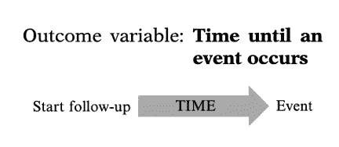
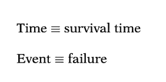
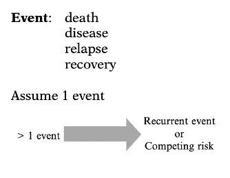
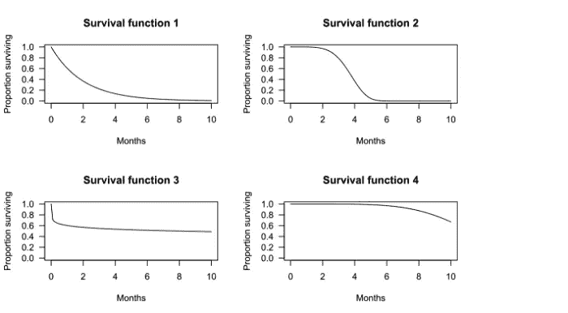
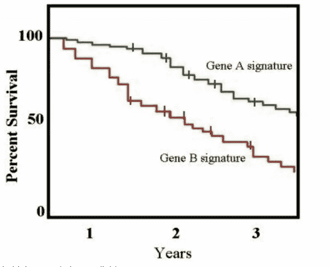

# 生存分析:第一部分

> 原文：<https://medium.com/mlearning-ai/survival-analysis-part-i-7a84fd270644?source=collection_archive---------2----------------------->

在开始生存回顾之前，我想指出本文分为两部分。第一部分将涵盖生存分析的基础知识，接下来是第二部分，包括一些精彩的例子。建议阅读这两个部分，以获得全面的理解。现在我们来谈谈生存分析及其基本术语。

生存分析是统计学的一个分支。它实际上有几个名字。在某些领域，它被称为事件时间分析，可靠性分析，或持续时间分析。由于 survival 软件包，r 是执行这种分析的主要工具之一。

**什么是生存分析？**

我们首先描述由生存分析解决的分析问题的类型。通常，生存分析是用于数据分析的统计程序的集合，其中感兴趣的结果变量是事件发生前的时间。

Survival Analysis

**时间和事件:**

所谓的**时间**，我们指的是从个体随访开始到事件发生的年、月、周或天；或者，时间可以指事件发生时个人的年龄。在生存分析中，我们通常将时间变量称为生存时间，因为它给了他们个体在某个随访期内“存活”的时间。

Time and Event

我们通常也将事件称为失败，因为感兴趣的事件通常是死亡、疾病发病率或一些其他负面的个人经历。然而，存活时间可能是“择期外科手术后恢复工作的时间”，在这种情况下，失败是一个积极的事件。

我们所说的**事件**是指死亡、疾病发生、缓解后复发、康复(例如，重返工作岗位)或任何可能发生在个人身上的指定经历。

Event

**审查:**

生存分析的第二个特征，删截，出现在开始或结束事件没有被精确观察到的时候。最常见的例子是右删截，当只知道最终终点超过特定值时就会出现这种情况。截尾可以分为三种类型:左截尾、右截尾和区间截尾。

*   **左删截**:左删截是指感兴趣的事件在登记前已经发生。I 型截尾，截尾时间是预先规定的。例如，在动物实验中，一群动物可以在特定时间开始，并且所有动物都被跟随直到预先指定的结束时间。在研究结束前没有经历感兴趣的事件的动物然后在那时被审查。
*   **右删截:**右删截发生在受试者在事件发生前离开研究，或研究在事件发生前结束。当实验对象被跟踪直到一个预先指定的部分失败时，II 型删失发生。这种设计在生物医学研究中很少见，但可以用在工业环境中，在工业环境中，设备的无故障时间是最重要的。例如，在观察到 100 个设备中有 25 个出现故障后，研究停止。剩下的 75 台设备将被审查。
*   **区间删失:**当不精确知道感兴趣事件发生的时间(相反，只知道落入特定区间)时，在生存分析中出现区间删失。当使用定期评估(通常是临床或实验室检查)来评估事件是否已经发生时，通常会产生这种审查。

**生存功能:**

[存活函数](https://en.wikipedia.org/wiki/Survival_function) S(t)是受试者存活时间长于时间 t 的概率。它给出了患者、设备或另一个感兴趣的对象将在任何指定时间后[存活](https://en.wikipedia.org/wiki/Survival_analysis)的[概率](https://en.wikipedia.org/wiki/Probability)。

下图显示了假设生存函数的例子。x 轴是时间。y 轴是存活的受试者比例。图表显示了受试者存活超过时间 t 的概率。

Survival Probabilities

*   生存函数 1，存活时间长于 t = 2 个月的概率为 0.37。也就是说，37%的受试者存活超过 2 个月。
*   生存函数 2，存活时间长于 t = 2 个月的概率为 0.97。也就是说，97%的受试者存活超过 2 个月。中位生存期可由生存期函数确定。例如，对于存活函数 2，50%的受试者存活 3.72 个月。因此，中位生存期为 3.72 个月。
*   在某些情况下，中位生存期无法从图表中确定。例如，对于存活函数 4，超过 50%的受试者存活超过 10 个月的观察期。

**描述群体成员的生存时间:**

1.**生命表:**生命表汇总了各事件以及在各事件时间点的存活比例。

2.**卡普兰-迈耶:**卡普兰-迈耶曲线是一种用于估计生存函数的估计量。卡普兰迈耶曲线是该函数的直观表示，它显示了某一事件在相应时间间隔内的概率。Kaplan-Meier 是一种用于事件时间数据分析的统计方法。发生事件的时间是指从进入研究到特定事件(例如，疾病发作)的时间。

An example of a Kaplan–Meier plot for two conditions associated with patient survival

*   *x 轴*是时间，从零点(观测开始时)到最后一个观测时间点。
*   *y* 轴是存活的受试者比例。在时间零点，100%的受试者都活着，没有发生任何事件。
*   实线(类似于楼梯)显示了事件发生的进程。

3.**对数秩检验:**[对数秩检验](https://en.wikipedia.org/wiki/Log-rank_test)比较两组或更多组的存活时间。本例使用对数秩检验来比较第 1 组和第 2 组的存活率差异。

4. **Cox 比例风险:**如混杂、效应修正、相关性和多变量方法模块中所定义的，生存分析方法可以推广到同时评估多个风险因素，类似于多元线性和多元逻辑回归分析。生存分析中最流行的回归技术之一是 Cox 比例风险回归。

5.**树形结构生存模型:**线性模型是 Cox PH 回归模型。它的工作方式类似于线性回归和逻辑回归。特别是，这些方法假定单一的线、曲线、平面或表面足以区分群体(活的、死的)或估计定量答案(存活时间)。

替代的划分也可以提供更精确的分类或定量数字。一组替代方法是树形结构生存模型，包括生存随机森林。树状生存模型可能比 Cox 模型给出更准确的预测。对于给定的数据集，检查这两种类型的模型是一种合理的策略。

**生存随机森林:**构建几棵生存树，每棵都使用数据样本，对这些树进行平均以预测生存，这是构建单棵生存树的一种替代方法。生存随机森林模型就是基于这种方法。

**相关:**跟进[第二部分](https://afafathar.medium.com/survival-analysis-part-ii-ddbbae048d3f)的实际实施。

希望这有所帮助:)如果你喜欢我的帖子，请关注我。请随时留下任何澄清或问题的意见。快乐学习😃

随意连接: [*LinkedIn*](https://www.linkedin.com/in/afaf-athar-183621105/)