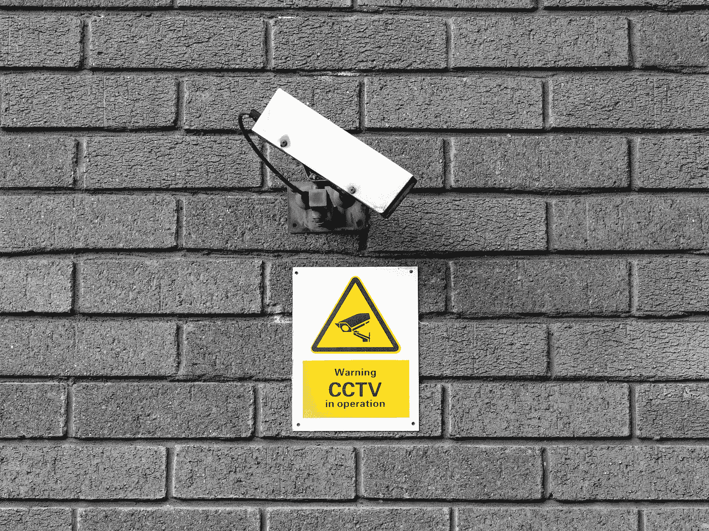
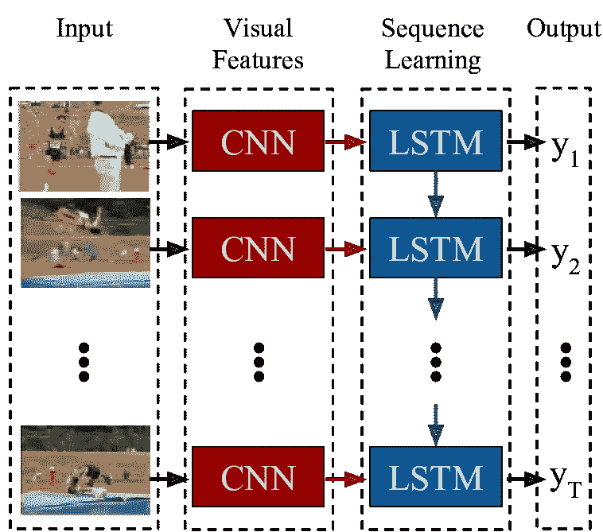
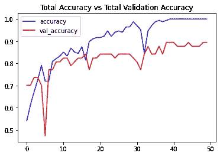

# 基于 LRCN 模型的 CCTV 可疑人体活动识别

> 原文：<https://medium.com/mlearning-ai/suspicious-human-activity-detection-95b870dae688?source=collection_archive---------1----------------------->

## 了解如何使用带有 Keras 的 LRCN 模型和 Python 中的 TensorFlow 对闭路电视录像中的人类活动进行分类



Photo by [the blowup](https://unsplash.com/@theblowup?utm_source=medium&utm_medium=referral) on [Unsplash](https://unsplash.com?utm_source=medium&utm_medium=referral)

# 介绍

在当今世界，闭路电视监控是一个场所可以拥有的最基本和最有效的安全功能。它可以在医院、商场、大学等地方找到。这是防止和检测有害活动的最著名的方法。但是想象一个学术校园，在多栋建筑中有超过 100 个闭路电视，如宿舍、教室、食堂、运动场、礼堂等。手动监控闭路电视摄像机上的所有事件是不可能的。即使事件已经发生，在录制的视频中手动搜索相同的事件也会浪费很多时间。

我们将为大学校园创建一个基于**长期循环卷积网络(LRCN)的系统，以监控闭路电视镜头** **，并检测非可疑活动，如跑步、散步&，可疑活动，如打架**。该系统可用于创建警报，如果检测到任何可疑活动，该警报将通知用户。

# 这个计划

*   加载可疑人员活动识别数据。
*   预处理数据。
*   为分类建立 LRCN 模型。
*   评估模型。

> [**这个完整的项目在 Github 上**](https://github.com/kunaltulsidasani/Suspicious-Human-Activity-Detection-LRCN) **。**
> 
> [**在浏览器上运行代码。**](https://colab.research.google.com/drive/1U4tqj7kDk4eIfzJeK9TQlbMsk4qooTrB?usp=sharing)

# 可疑人类活动识别数据

这些数据是从两个不同的数据集编译而来的——KTH 动作数据集[](https://www.csc.kth.se/cvap/actions/)**[**视频打斗检测数据集**](https://www.kaggle.com/naveenk903/movies-fight-detection-dataset)**

*   **[**KTH 数据集**](https://www.csc.kth.se/cvap/actions/) —包含六类*人体动作(行走、慢跑、跑步、拳击、挥手和拍手)*的数据库，由 *25 名受试者多次执行。*所有的序列都是用静态摄像机以 *25fps 帧速率*在同质背景上拍摄的。这些序列被下采样到空间分辨率为*160×120 像素*，并且平均长度为 *4 秒*。**
*   **[**视频打斗检测数据集**](https://www.kaggle.com/naveenk903/movies-fight-detection-dataset) **—** Kaggle 数据集由超过*个从电影和 YouTube 视频中获取的视频*组成，可用于训练可疑行为(打斗)。**

> ****每个动作拍摄了 100 个视频——从 KTH 数据集行走&，从 Kaggle 数据集打斗。****
> 
> ****最终编译的数据集使用:** [**驱动链接**](https://drive.google.com/file/d/1n-wc8ebopNacuTNdtGrkn7A7r7UOjBj7/view?usp=sharing)**

# **设置数据集变量**

**数据集变量是指将在整个代码中使用的变量，如要加载的帧的高度和宽度、序列长度——视频中要考虑的帧数、数据集目录和分类类别。以及设置将在训练测试数据分割时使用随机变量。**

# **数据预处理**

**将单个视频转换为 numpy 数组的过程，以便它可以用于训练模型。**

*   ****提取帧:**使用 OpenCV 库读取每个视频，以相等的时间间隔从视频中提取 30 帧，每个帧被读取为 3D numpy 数组维度—(高度，宽度，3)最后一个维度是指 RGB，即该单元的颜色。**
*   ****调整大小:**当我们需要增加或减少像素总数时，调整帧大小是必要的。因此，我们将所有帧的尺寸调整为**宽:64px** 和**高:64px** ，以保持输入到架构的图像的一致性。**
*   ****归一化:**它将帮助学习算法更快地学习，并从图像中捕捉必要的特征。因此，我们通过用 255 除**来标准化调整后的帧，使得每个像素值位于 0 & 1 之间。****
*   ****存储在 numpy 数组中:**30 个调整大小和标准化的帧存储在一个 Numpy 数组中，作为模型的输入。**

**该函数执行上述任务，并将视频位置作为参数。**

**为了预处理整个数据集并将其加载到一个 numpy 数组中，使用了以下函数，该函数返回每个视频的特征、加载的每个文件的标签和路径。**

**最后一个预处理步骤是类别编码:**

```
# Using Keras's to_categorical method to convert labels 
# into one-hot-encoded vectors
one_hot_encoded_labels = to_categorical(labels)
```

# **数据形状**

```
# Returns shape of features & labels
print(features.shape, labels.shape)
```

**特征—(视频数量、每个视频的帧数、高度、宽度、RGB)**

**标签—(#视频，)**

```
(300, 30, 64, 64, 3) (300,)
```

# **训练测试分割数据**

**拆分预处理后的数据用于训练和测试:**

*   **75%的数据用于训练**
*   **25%的数据用于测试**

# **LRCN 模型**

****长期递归卷积网络(LRCN):** 一组作者在 2016 年 5 月提出了 **LRCNs** ，这是一类利用**CNN**在视觉识别问题上快速进展的优势，以及将这种模型应用于时变输入和输出的日益增长的愿望的架构。LRCN 用一个 **CNN(中左)**处理可变长度的**视觉输入(左)**，其输出被送入一个递归序列模型 **(LSTMs，中右)**的堆栈，最终产生一个**可变长度预测(右)**。CNN 和 LSTM 权重都是跨时间共享的，这导致了一种可缩放至任意长序列的表示。**

****

**Long-term Recurrent Convolutional Networks for Visual Recognition and Description, Jeff Donahue, Lisa Anne Hendricks, Marcus Rohrbach, Subhashini Venugopalan, Sergio Guadarrama, Kate Saenko, Trevor Darrell, 2016**

# **建筑模型**

**我们将创建一个基本的 LRCN 模型，有 4 个 CNN 层，然后是一个 LSTM 层。你可以自己增加模型的复杂性。**

# **模特培训**

**该模型将在数据的训练分割上被训练，具有早期停止回调。**

> ****提前停止回调** —可以理解为当模型的改善停止或开始减少时，停止模型训练的功能。**

# **估价**

**这是训练时的准确度图:**

****

**Image by Kunal**

> **可以通过一些超参数调整来提高模型性能。**

****测试数据的准确性:****

```
Accuracy = 82.66666666666667
```

**模型达到了 83%左右的准确率，对于 300 条记录的数据来说已经不错了。**

# **未来的工作**

**该模型不训练进一步的可疑行为，如昏厥，盗窃等。该模型还可以通过对更多可疑行为进行训练来改进。如果代码在高端 GPU 上运行，它也可以用于近实时处理闭路电视镜头。**

# **结论**

**我们创建了一个 LRCN 模型，用于从 CCTV 镜头中检测像打斗、行走和奔跑这样的活动，该模型在 **300 个视频**上进行训练，并实现了大约 83%的**准确率。****

> **[**这个完整的项目在 Github 上**](https://github.com/kunaltulsidasani/Suspicious-Human-Activity-Detection-LRCN) **。****
> 
> **[**在浏览器上运行代码。**](https://colab.research.google.com/drive/1U4tqj7kDk4eIfzJeK9TQlbMsk4qooTrB?usp=sharing)**

# **参考**

*   **[KTH 行动数据集](https://www.csc.kth.se/cvap/actions/)**
*   **[视频打斗检测数据集](https://www.kaggle.com/naveenk903/movies-fight-detection-dataset)**
*   **[张量流序列模型](https://www.tensorflow.org/guide/keras/sequential_model)**

> ****可以在** [**LinkedIn**](https://www.linkedin.com/in/kunal-tulsidasani/) **上联系我，或者在**[**Github**](https://github.com/kunaltulsidasani)**上关注我。****

****

**Photo by [Kelly Sikkema](https://unsplash.com/@kellysikkema?utm_source=medium&utm_medium=referral) on [Unsplash](https://unsplash.com?utm_source=medium&utm_medium=referral)**

**[](/mlearning-ai/mlearning-ai-submission-suggestions-b51e2b130bfb) [## Mlearning.ai 提交建议

### 如何成为 Mlearning.ai 上的作家

medium.com](/mlearning-ai/mlearning-ai-submission-suggestions-b51e2b130bfb) 

[成为作家](/mlearning-ai/mlearning-ai-submission-suggestions-b51e2b130bfb)**