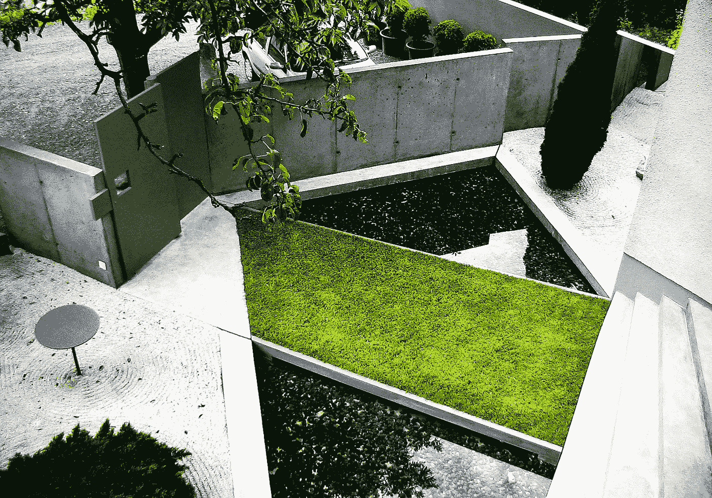

# 具有人工智能的可持续建筑

> 原文：<https://medium.com/mlearning-ai/sustainable-architecture-with-ai-2638d2569d22?source=collection_archive---------1----------------------->

## 时间与自然

## [数据采集者](https://datasculptor.medium.com/datasculptors-top-stories-616f2f098959?source=your_stories_page-------------------------------------)工作室花园

july 2004 [Datasculptor’s](https://datasculptor.medium.com/datasculptors-top-stories-616f2f098959?source=your_stories_page-------------------------------------) studio garden (after)

**时间和自然是我们这个世界上两个伟大的雕塑家******。****

**没有人会认为[架构的未来](/mlearning-ai/what-does-an-architect-do-615e733ac679)是不确定的。全球人口增长、技术进步和[气候变化](/mlearning-ai/to-survive-we-need-medieval-bells-8acb23dfa7b0)有助于更好地理解我们当前的挑战。但也很明显…**