# 奇异值分解和图像压缩

> 原文：<https://medium.com/mlearning-ai/svd-and-image-compression-749d59558410?source=collection_archive---------5----------------------->

在我的[上一篇文章](/mlearning-ai/eigendecomposition-2f04ce896e6f)中，我讨论了特征分解。然而，这只能应用于方阵。一种更通用的方法，奇异值分解(SVD)，被称为线性代数的*基本定理，适用于所有矩阵。*

在这篇文章中，我将首先介绍 SVD 的理论和构造，然后我将向您展示我们如何使用 SVD 来近似矩阵，从而允许图像压缩。请记住，毕竟，图像只是代表像素颜色的矩阵。

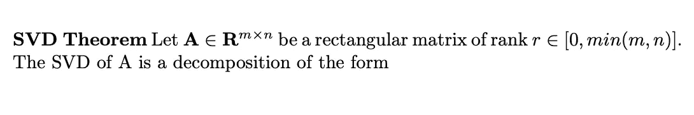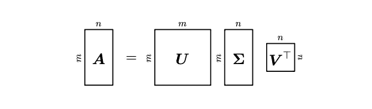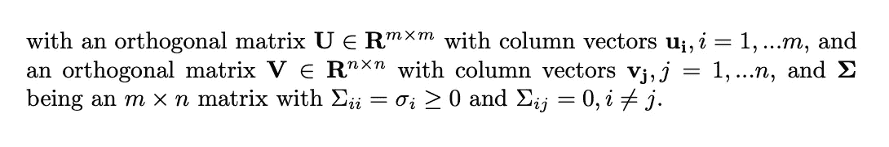

价值观:

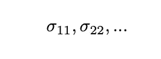

都称为奇异值，有 **r** 这样的值( **r** 是矩阵**A的秩)。按照惯例，它们是按降序排列的。此外，奇异值矩阵***σ***是唯一的，并且与矩阵*的大小相同。***

*矩阵 ***U*** 的列向量称为左奇异向量，矩阵*的列向量称为右奇异向量。**

## **SVD 分解的直觉是什么？**

**设 ***A*** 是将向量空间 **R** *{mxm}* 映射到向量空间**R***【nxn }*上的线性映射的变换矩阵。SVD 将这个线性映射分解成三个部分。**

1.  **矩阵 ***V*** 是 **R** *{n}* 中的变换矩阵，执行从**a**^*{ t }***a**的特征基到标准基的变换。因为 ***V*** 是正交的，所以它成立:**

**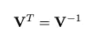**

**所以首先，***v***^*{ t }*执行一个从标准基到本征基的基变换*^*{ t }**。****

***2.*σ矩阵通过奇异值缩放新坐标并将***a***^*{ t }****a***的本征基映射到***aa***^*{ t }*。****

**3. ***U*** 是将特征基映射到 **R** *{m}* 的标准基的变换矩阵。**

**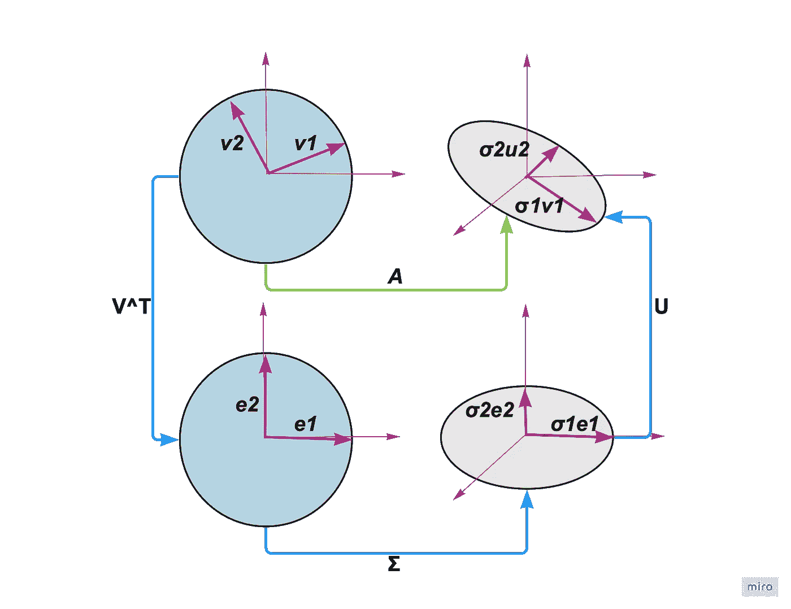**

**在 SVD 中，在 **R** *{mxm}* 和 **R** *{nxn}* 向量空间中都有基的变化，然而，在特征分解中，在同一向量空间中只有一个基的变化。**

## **奇异值分解的构造**

**首先，让我们回忆一下矩阵对称半正定(SPD)是什么意思。对称矩阵满足**

**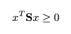**

**对于所有的 *x* 。**

**如果我们有任何一个矩阵 ***一个*** ，我们可以使 SPD 矩阵为:**

****

**因为:**

****

**同样代表:**

**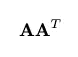**

**我们知道，我们可以用特征向量的标准正交基计算半正定矩阵的特征分解。因此，我们可以得到:**

**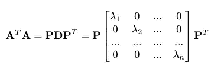**

**其中 ***P*** 为特征向量的正交基，对角矩阵包含正特征值。**

**假设奇异值分解存在:**

**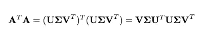****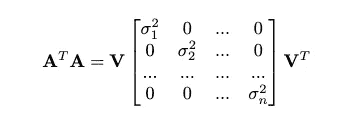**

**将 las 方程与本征分解比较可以看出， ***P*** 是一个右奇异向量***V***of*的矩阵，本征值是奇异值的平方。***

***至此，我们确定了什么应该是 ***P*** 矩阵和***σ***矩阵，但是我们需要构造*。****

***注意矩阵 ***V*** :***

**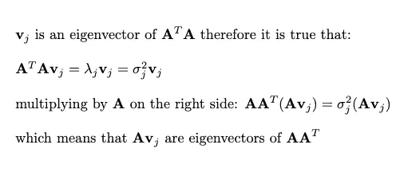**

**另外，在变换矩阵*下，正交的 ***V*** 的向量列的图像也必须正交。***

**再次假设 SVD 存在，请看:**

**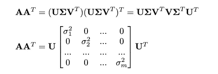**

**谱定理告诉我们，我们可以用标准正交特征向量对角化矩阵:**

**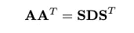**

*****AA*** ⊤的标准正交特征向量是左奇异向量*并构成标准正交基集。***

***所以，AV 形成了一个标准正交基 ***AA*** ⊤ A，但也 u .然而，我们知道:***

**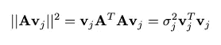**

**所以，获得 ***U*** 的方法就是将 ***AV*** :**

**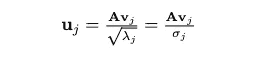**

**对于 j 的所有值，我们得出:**

**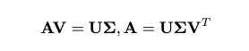**

**这是**的 SVD 分解*一*一**。**

## **矩阵近似**

**通过奇异值分解，我们得到:**

**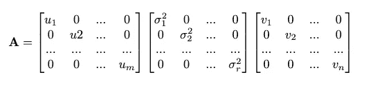**

**我们也可以把它写成:**

**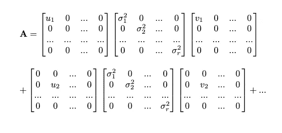**

**我们知道奇异值是降序排列的，第一个元素对结果的贡献更大。尝试去掉后面的部分是有意义的，这样可以有更小的维数，从而有更快的算法。**

**这就是我们如何执行秩 k 近似。我们只取若干个第一列向量*和同样数量的第一行向量*并计算结果。****

***下面是例子。使用的图片是:***

******

***图像的大小为 1240x1280。***

***使用 python 中的 numpy，我计算了图像的 SVD 分解，并尝试用 10、20、30、40 和 50 个第一列来近似图片。下面是我用代码得到的结果，可以在这里找到:***

***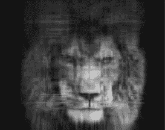***

***n = 10***

***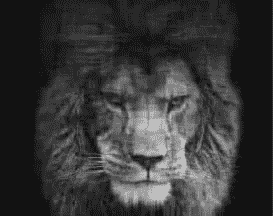***

***n = 20***

***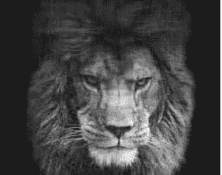***

***n = 30***

******

***n = 40***

***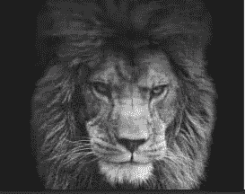***

***n = 50***

***最后一张图是最初形象的伟大代表。它只包括大约 7%的数字。(50*(1240+1+1280)/(1240*1280)).太神奇了:)***

## ***结论***

***当我们想要通过近似来执行数据压缩时，SVD 允许我们识别数据中的异构性。它是一种适用于非方阵和数据表的方法，这使得它的应用非常广泛。***

***还要记住的是，线性代数是一个非常强大的工具！***

*** [## Mlearning.ai 提交建议

### 如何成为 Mlearning.ai 上的作家

medium.com](/mlearning-ai/mlearning-ai-submission-suggestions-b51e2b130bfb)***