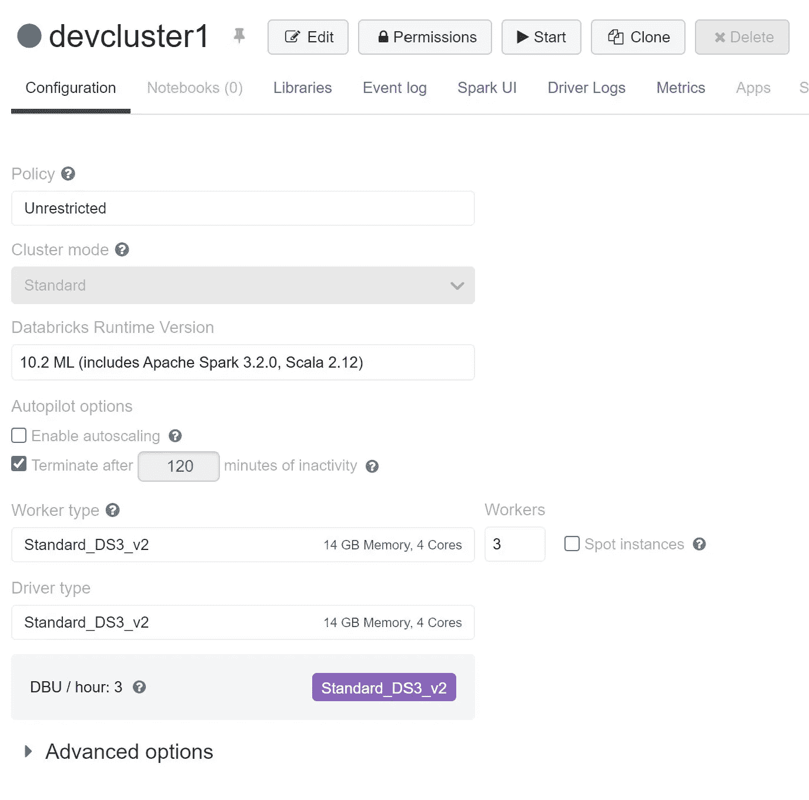
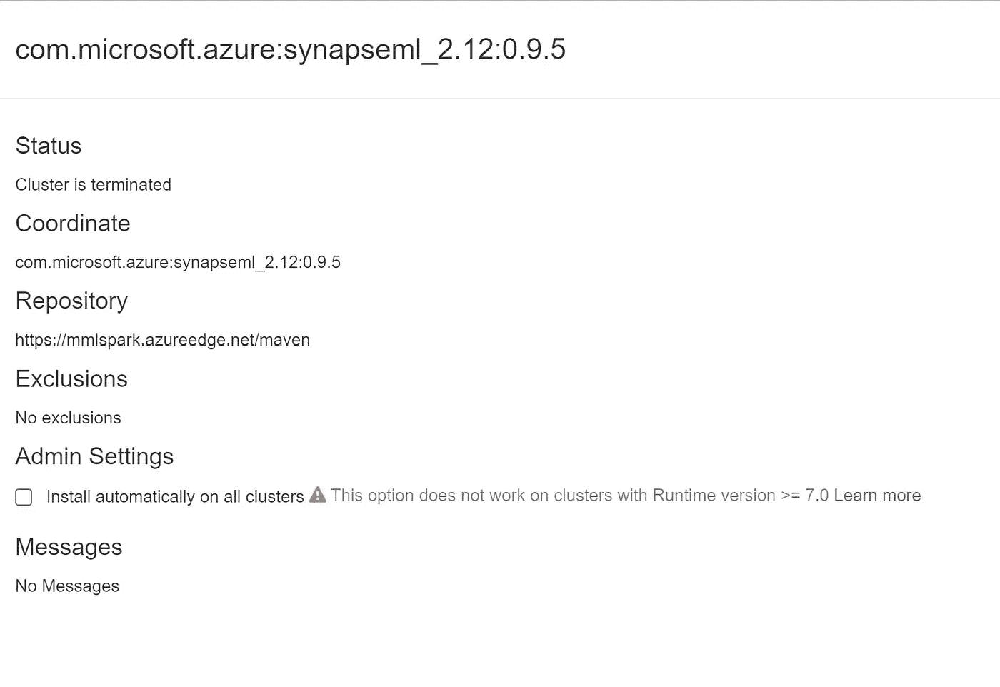

# Azure Databricks 中的 SynapseML(开源)

> 原文：<https://medium.com/mlearning-ai/synapseml-open-source-in-azure-databricks-56e3d11e2e70?source=collection_archive---------4----------------------->

# 如何在 Azure Databricks 中运行 SynalpseML

# 先决条件

*   Azure 订阅
*   Azure 数据块
*   SynapseML 安装说明

# 步伐

*   首先创建一个 Azure 数据砖块工作区
*   创建新计算机
*   我测试了光子和普通火花发动机



*   从 Maven 位置安装库
*   下面是经过测试的集群配置



*   synapseml 库安装的配置
*   查一下回购网址，不一样

```
maven cordinates: com.microsoft.azure:synapseml_2.12:0.9.5
Repository: [https://mmlspark.azureedge.net/maven](https://mmlspark.azureedge.net/maven)
```

*   接下来启动集群
*   等待群集进入运行状态，并且安装了库
*   接下来，让我们创建一个新笔记本

# 密码

*   现在让我们编写一个示例代码
*   我在 Azure databricks 中使用与 Repos 连接的 Git hub 存储库

```
import synapse.ml
from synapse.ml.cognitive import *import numpy as np
import pandas as pd
```

*   现在让我们加载数据

```
dataFile = "AdultCensusIncome.csv"
import os, urllib
if not os.path.isfile(dataFile):
    urllib.request.urlretrieve("https://mmlspark.azureedge.net/datasets/" + dataFile, dataFile)
data = spark.createDataFrame(pd.read_csv(dataFile, dtype={" hours-per-week": np.float64}))
data.show(5)
```

*   选择列并拆分用于训练和测试

```
data = data.select([" education", " marital-status", " hours-per-week", " income"])
train, test = data.randomSplit([0.75, 0.25], seed=123)
```

*   现在训练模型

```
from synapse.ml.train import TrainClassifier
from pyspark.ml.classification import LogisticRegression
model = TrainClassifier(model=LogisticRegression(), labelCol=" income").fit(train)
```

*   现在公制计算

```
from synapse.ml.train import ComputeModelStatistics
prediction = model.transform(test)
metrics = ComputeModelStatistics().transform(prediction)
metrics.select('accuracy').show()
```

*   以上是为了展示本库的功能
*   不打算解决任何用例
*   所有代码都基于文档

*最初发表于*[*【https://github.com】*](https://github.com/balakreshnan/Samples2022/blob/main/AzureDatabricks/synapsemladb.md)*。*

[](/mlearning-ai/mlearning-ai-submission-suggestions-b51e2b130bfb) [## Mlearning.ai 提交建议

### 如何成为 Mlearning.ai 上的作家

medium.com](/mlearning-ai/mlearning-ai-submission-suggestions-b51e2b130bfb)