# T20 板球比分预测器—端到端 ML 项目

> 原文：<https://medium.com/mlearning-ai/t20-cricket-score-predictor-end-to-end-ml-project-fbb3ec67dbb1?source=collection_archive---------0----------------------->

大家好，希望你们都过得好。T20 板球赛季正在进行，自过去 4 个月以来，我们连续目睹了一些真正令人难以置信的 t20 比赛，所以我认为这是在其上进行端到端机器学习项目的最佳时间。

今天在这个博客中，我们将制作一个分数预测器。我们的模型将通过考虑一些因素来预测一局结束时的总得分。

> *这个博客写的所有代码都在我的 github-*【https://github.com/HarshMishra2002/cricket_score_pred 
> 
> *所用数据集的链接-*[https://www . ka ggle . com/harshmishraandheri/t20i-cricket-matches-ball-by-ball-info-dataset](https://www.kaggle.com/harshmishraandheri/t20i-cricket-matches-ball-by-ball-info-dataset)

让我们开始这个项目。完整的项目是在 python 语言和木星笔记本被用作一个 IDE。

首先，我们将导入数据集并对其进行概述

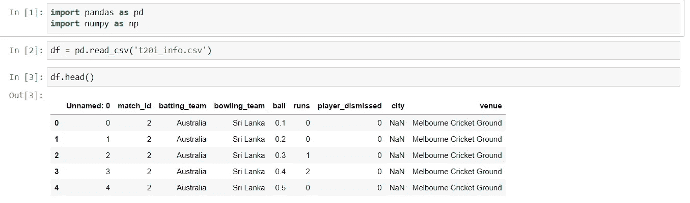

这是我们拥有数据集。我们需要创建一些列，并提取一些列来获得所需的数据。最终，我们希望我们的数据有列:

击球队
保龄球队
城市
当前 _ 比分
球左
检票口 _ 左
当前 _ 跑垒率
最后五名

现在我们的数据集中已经有了一些我们想要的列。击球队和保龄球队的数据我们已经有了。我们也有城市列，但它有一些空值，我们需要找出如何处理它。剩下的我们需要做一些操作。

现在我们将从城市列开始我们的特征提取。为了填充空值，我们将使用 venue 列。

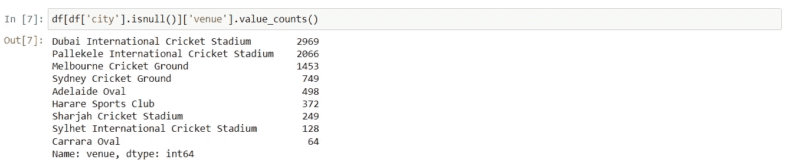

这里我们检查“地点”列中的值，其中“城市”列有空值。如果我们仔细注意，venue 中的第一个单词实际上是场地所在城市的名称，例如迪拜国际板球场中的迪拜或墨尔本板球场中的墨尔本。

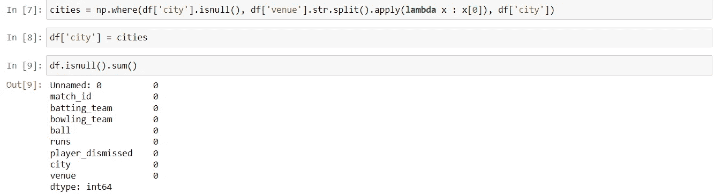

因此，我们将 venue 列的所有第一个单词存储在名为 cities 的变量中，然后用它来填充 city 列。现在我们的数据集中没有空值。但是还有一件事。我们的数据集是一个球一个球的数据集，这意味着如果有 63000 行，这意味着许多球已经打过了。

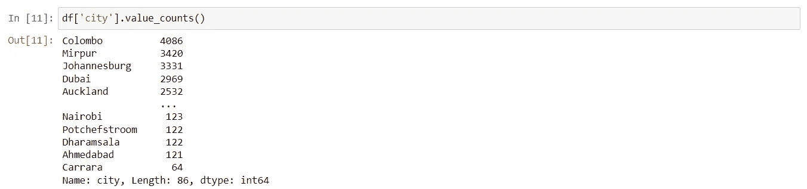

这说明有某些城市很少玩交付。因此，我们可以忽略这些城市，只考虑那些至少有 600 次交付的城市。

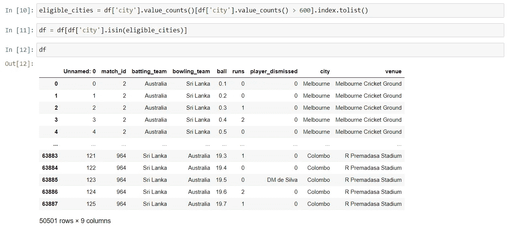

现在我们的城市专栏完成了。转到 current_runs 列，这很容易从 runs 列中提取。一个简单的 cumsum()函数(用于查找一列的累积和)将为我们完成这项工作。

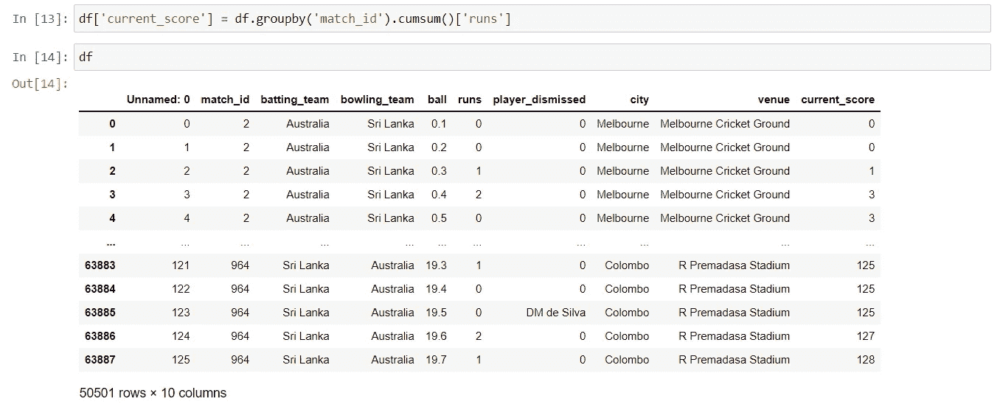

现在，我们的下一个目标是创建一个“balls_left”列，首先我们将创建新列:“overs”和“balls”，这告诉我们已经完成了多少回合，以及当前回合中已经投球了多少球。代码非常简单。

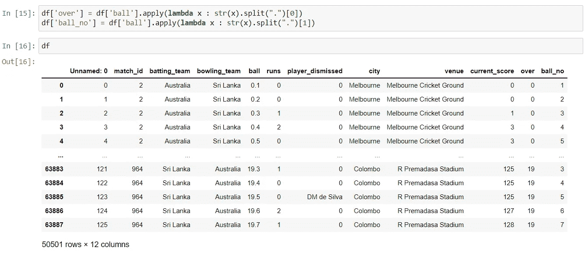

现在，通过使用一个简单的公式，我们可以创建一个“balls_bowled”列，它表示已经投了多少个球。公式是

balls_bowled = (overs * 6) + balls

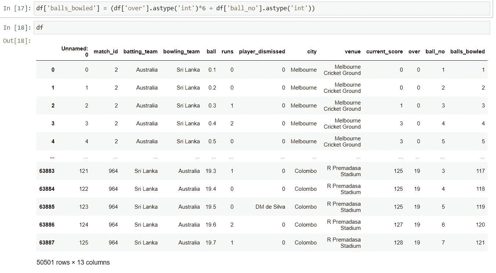

最后，我们可以通过从 120 减去 balls_bowled 来创建所需的列“balls_left ”,因为一局中共有 120 个球。有时因为额外的原因(宽，无球…)球数超过 120，所以在这种情况下我们可以简单地给 0 值。

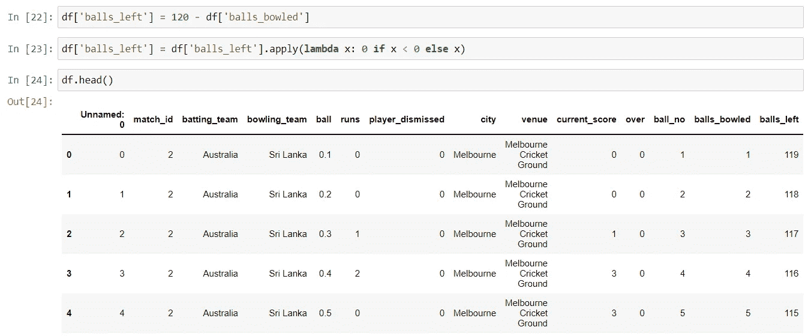

现在，如果我们查看“球员被解雇”列，它的值要么是 0，要么是在那个特定的球中出场的球员的名字。首先，我们将所有的名字替换为 1，然后对其应用 cumsum()函数，这样我们就可以得到 wickets 总数，我们将从 10 中减去它，得到“wickets_left”列。

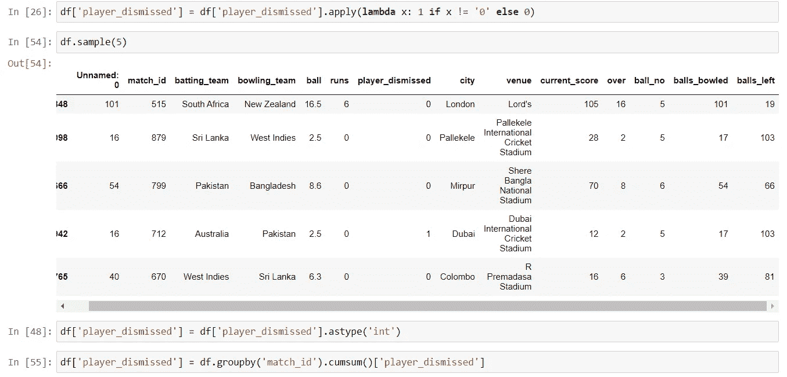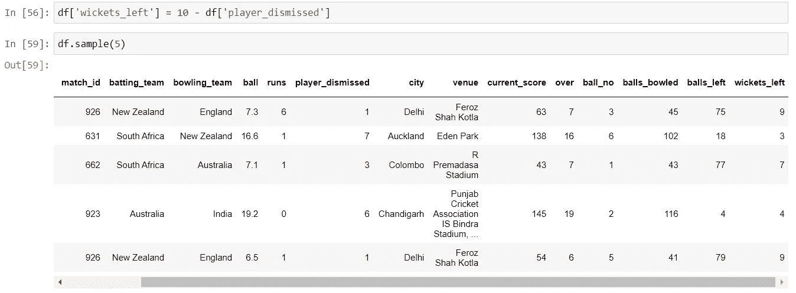

现在我们将创建当前运行率列，这很容易做到。

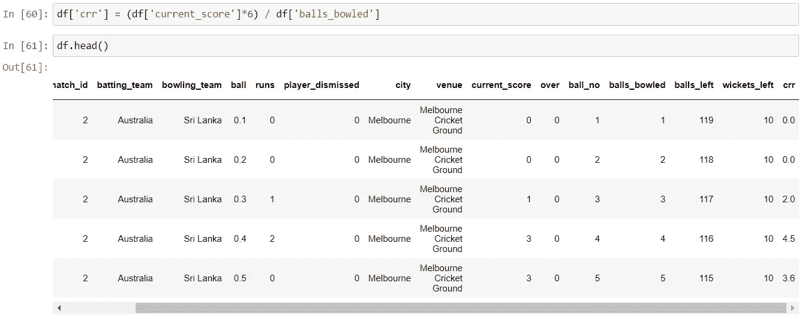

现在我们需要一个在过去五场比赛中得分的总得分栏。显然，对于前 5 次，我们将在该列中使用空值。

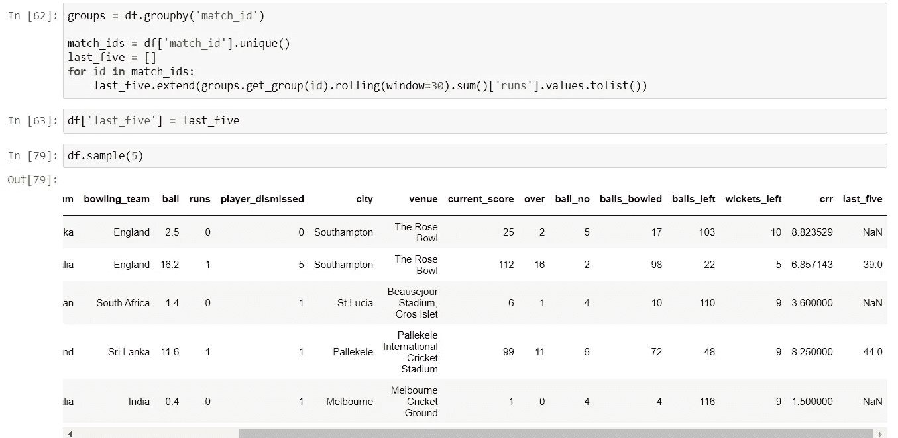

现在我们必须创建最后一列，这将是我们的目标列。那一局的总得分。

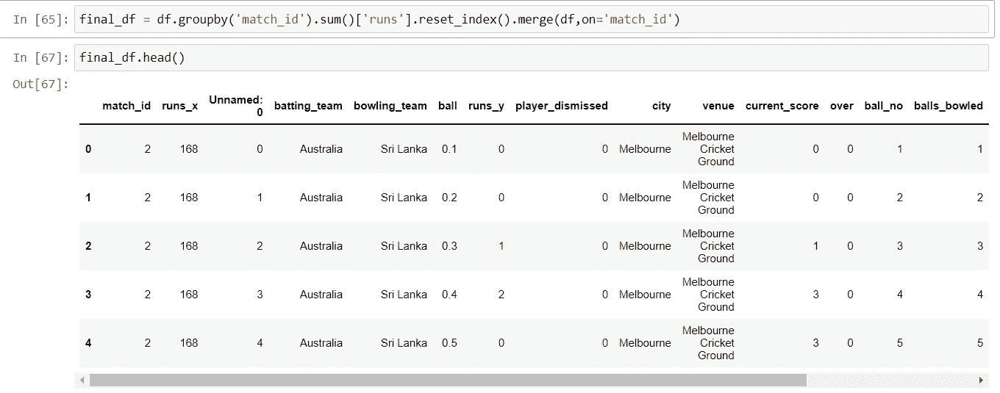

现在，我们将删除模型中不需要的所有列，保留刚才创建的那些列。此外，我们将洗牌的数据，以避免任何类型的偏见。

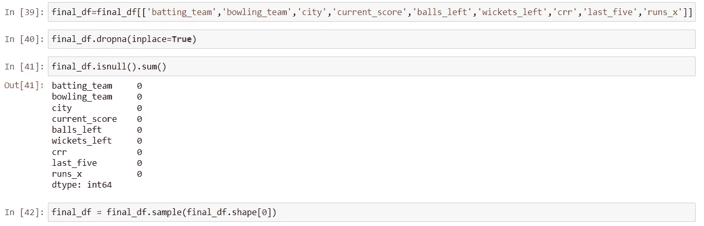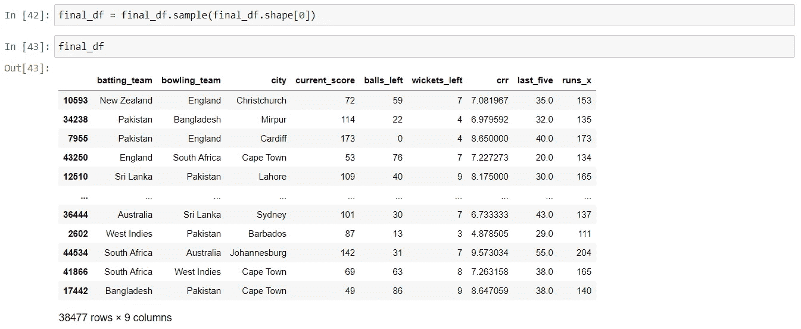

这样我们就完成了项目的特征提取部分。因此，经过大量的工作，我们终于有了开始时想要的确切数据。

现在让我们从模型构建过程开始。首先，我们将使用 sklearn 库 train_test_split 模块将数据集划分为训练集和测试集

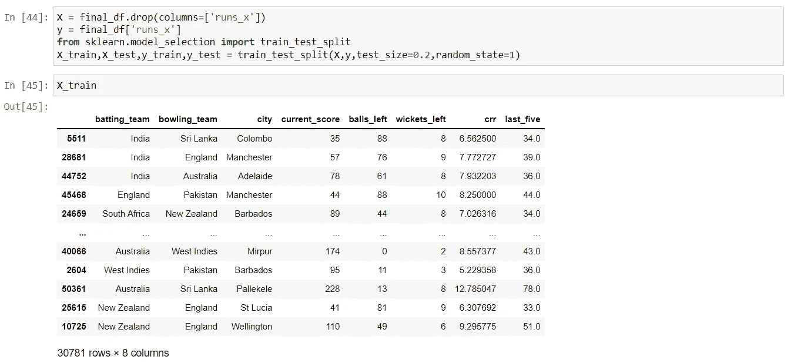

这里需要一些预处理步骤。我们将对分类特征(击球队、保龄球队和城市)应用一个热编码，然后我们将创建一个具有 ml 模型的 pipleline。此外，我们将对数据进行缩放，以便所有值都在一个范围内。

这里我们的模型 I 将使用 xgboost 算法。当然，您可以使用任何其他回归算法，并选择给出最佳结果的算法。

现在我们的模型已经准备好了，是时候检查它的 r2 分数了，看看它是如何工作的。

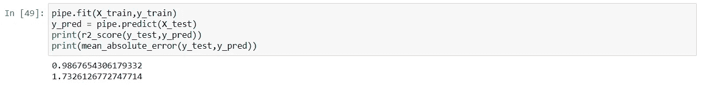

这真是不可思议。R2 得分 0.98。老实说，这让我担心过度拟合的情况。现在我让你们所有人来调整超参数，看看它如何影响我们的模型。

我已经使用 Streamlit 部署了这个模型。这是快速演示

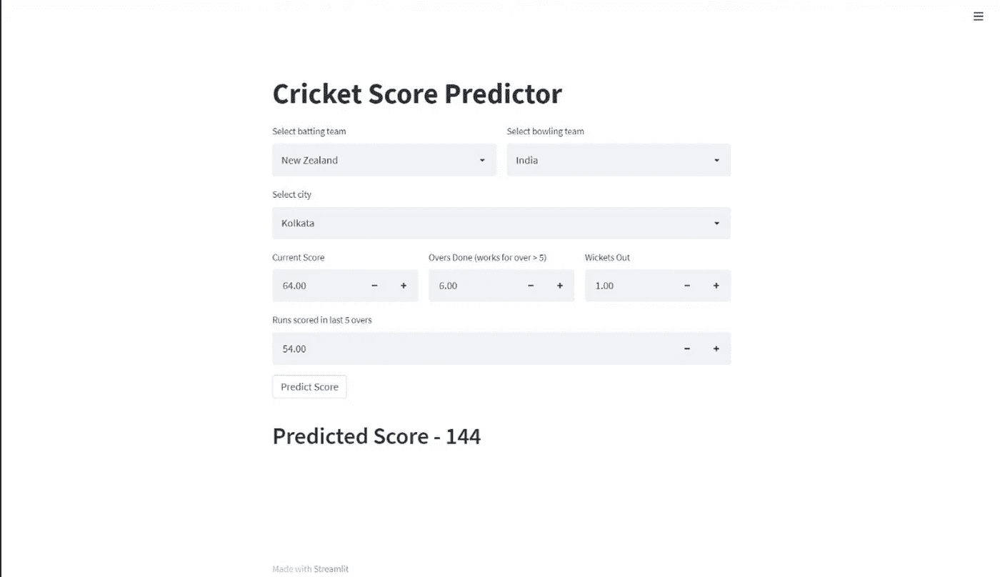

> 这就是我今天的全部内容。
> 
> 我希望你们能学到一些新东西，并喜欢这个博客。如果你确实喜欢它，那就和你的朋友分享吧。保重。不断学习。
> 
> 你也可以通过我的 Linkedin 账户找到我-[https://www.linkedin.com/in/harsh-mishra-4b79031b3/](https://www.linkedin.com/in/harsh-mishra-4b79031b3/)

 [## Mlearning.ai 提交建议

### 如何成为 Mlearning.ai 上的作家

medium.com](/mlearning-ai/mlearning-ai-submission-suggestions-b51e2b130bfb)