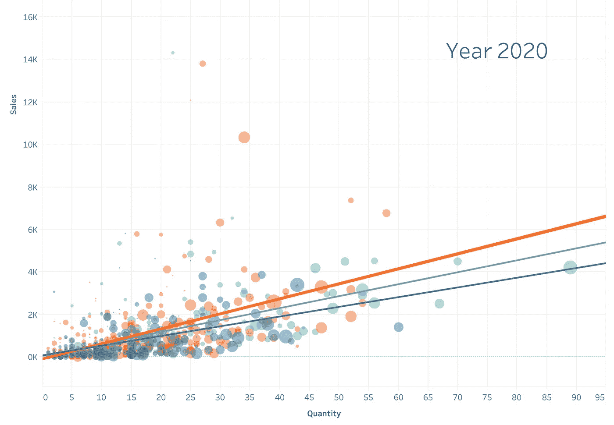

# Tableau 散点图动画

> 原文：<https://medium.com/mlearning-ai/tableau-scatter-plot-animation-a5b164ec1aa4?source=collection_archive---------3----------------------->

在 Tableau 中创建散点图、添加趋势线、创建注释和自动播放图表

Image Owned by GrabNGoInfo.com

在本教程中，我们将讨论如何创建一个 Tableau 散点图，并使用自动播放按类别制作动画。您将了解到:

*   如何使用 Tableau 创建散点图？
*   如何给散点图添加趋势线？
*   如何添加注释…