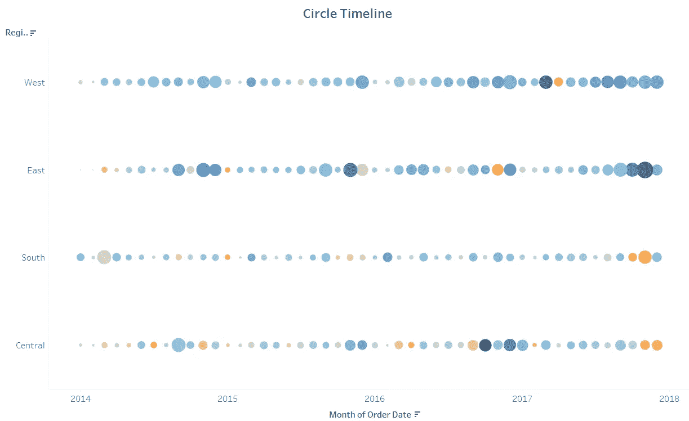
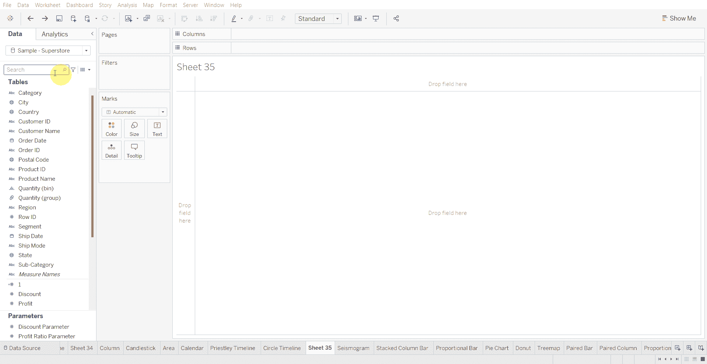
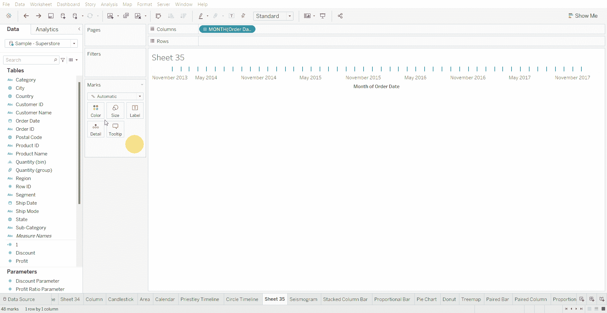
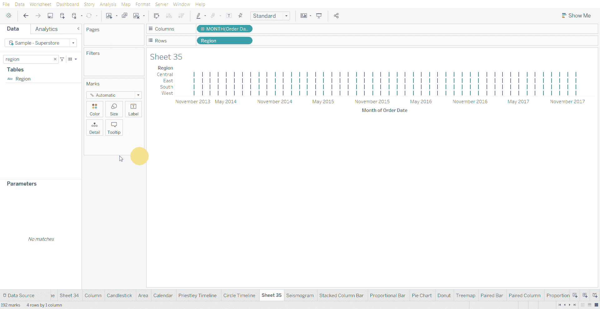
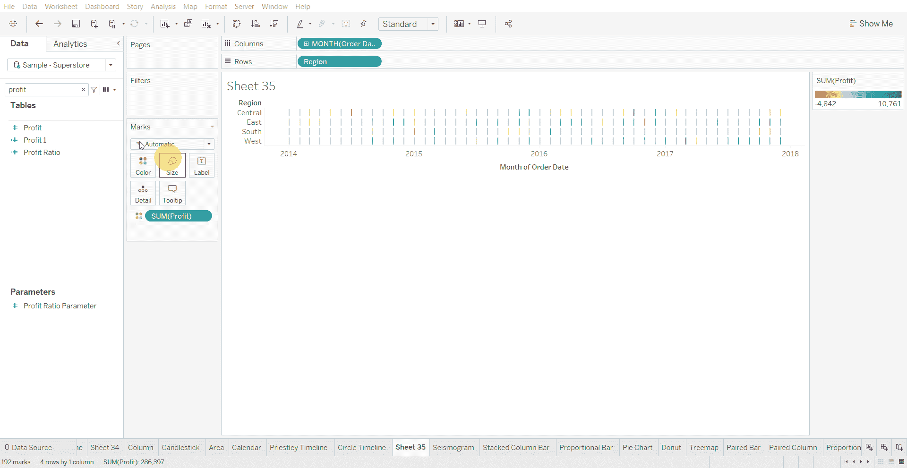
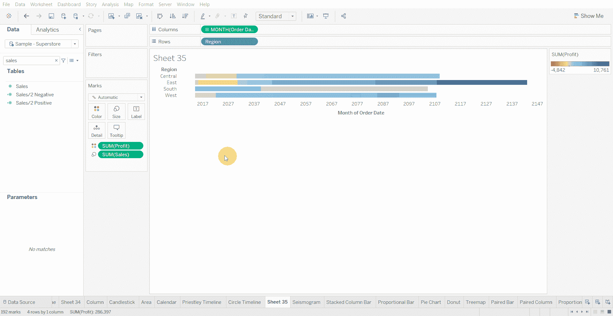
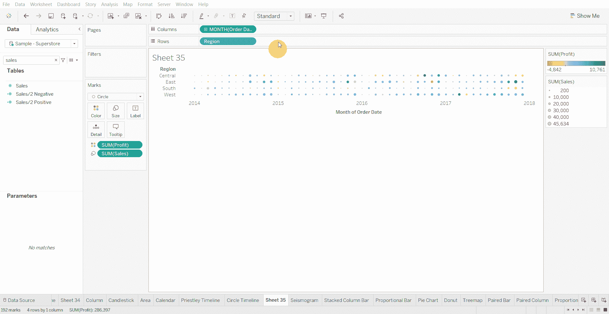

# Tableau 教程—如何创建圆形时间线图表

> 原文：<https://medium.com/mlearning-ai/tableau-tutorial-circle-timeline-chart-79bc8211db0d?source=collection_archive---------1----------------------->

圆形时间线图表适用于显示多个类别中不同大小的离散值。

下面使用的数据集是在 [Tableau 社区](https://community.tableau.com/s/question/0D54T00000CWeX8SAL/sample-superstore-sales-excelxls)上提供的超级商店数据集。

创建圆形时间线图表的步骤—

*   将日期变量拖到列架上

*   将分类变量拖到行架上

*   将数值变量拖到颜色标记上

*   将另一个数值变量拖到尺寸标记上

*   将标记类型更改为圆形

*   增加圆的大小

[1]:金融时报。(2021 年 3 月 7 日)。*管用的图表:FT 视觉词汇指南*[https://www . FT . com/content/c 7 bb 24 c 9-964d-479 f-ba24-03a 2 B2 df 6 e 85](https://www.ft.com/content/c7bb24c9-964d-479f-ba24-03a2b2df6e85)

 [## Mlearning.ai 提交建议

### 如何成为 Mlearning.ai 上的作家

medium.com](/mlearning-ai/mlearning-ai-submission-suggestions-b51e2b130bfb)