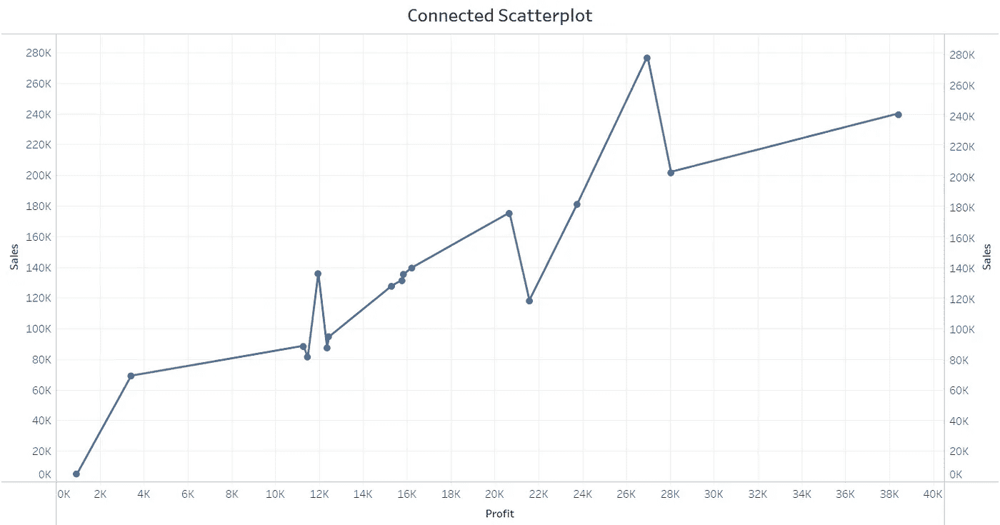
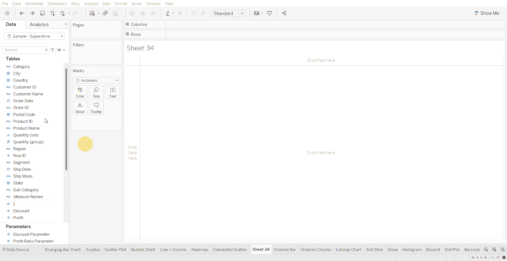
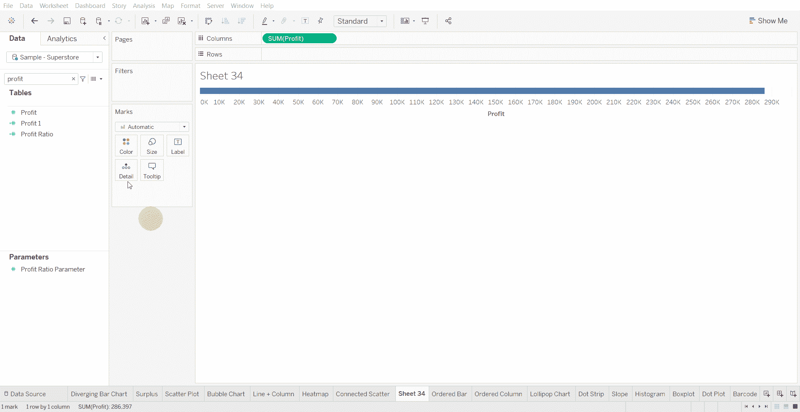
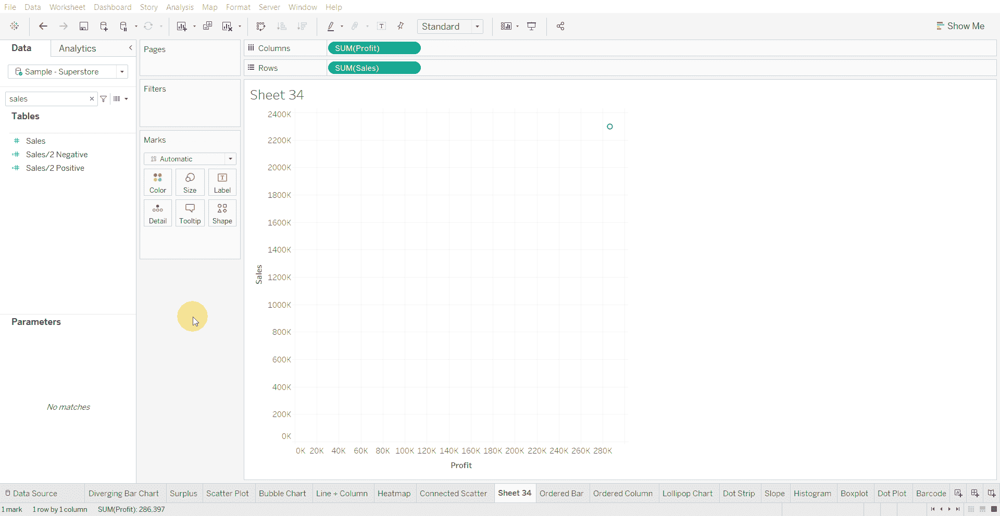
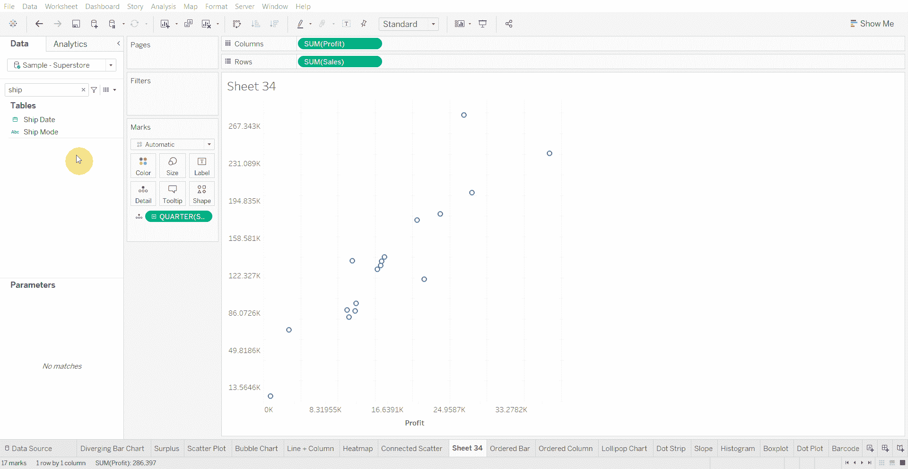
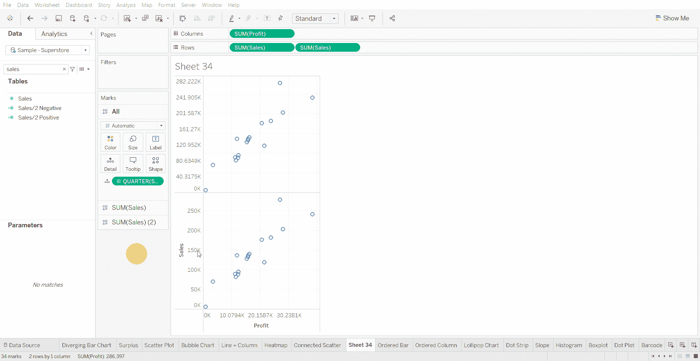

# Tableau 教程-如何创建相连的散点图

> 原文：<https://medium.com/mlearning-ai/tableau-tutorial-how-to-create-a-connected-scatterplot-12a67f4a6855?source=collection_archive---------6----------------------->

相连的散点图用于显示两个变量之间的关系是如何随时间变化的。

下面使用的数据集是在 [Tableau 社区](https://community.tableau.com/s/question/0D54T00000CWeX8SAL/sample-superstore-sales-excelxls)上提供的超级商店数据集。

创建连接散点图的步骤—

*   在列架上拖动数值

*   拖动行架上的数值

*   将日期移至 All-Marks 货架上的详细信息

*   复制行架上的数值

*   双轴复制的数值

*   将其中一个行数值变量更改为折线图，将第二个更改为圆形

[1]:金融时报。(2021 年 3 月 7 日)。*管用的图表:FT 视觉词汇指南*[https://www . FT . com/content/c 7 bb 24 c 9-964d-479 f-ba24-03a 2 B2 df 6 e 85](https://www.ft.com/content/c7bb24c9-964d-479f-ba24-03a2b2df6e85)

 [## Mlearning.ai 提交建议

### 如何成为 Mlearning.ai 上的作家

medium.com](/mlearning-ai/mlearning-ai-submission-suggestions-b51e2b130bfb)