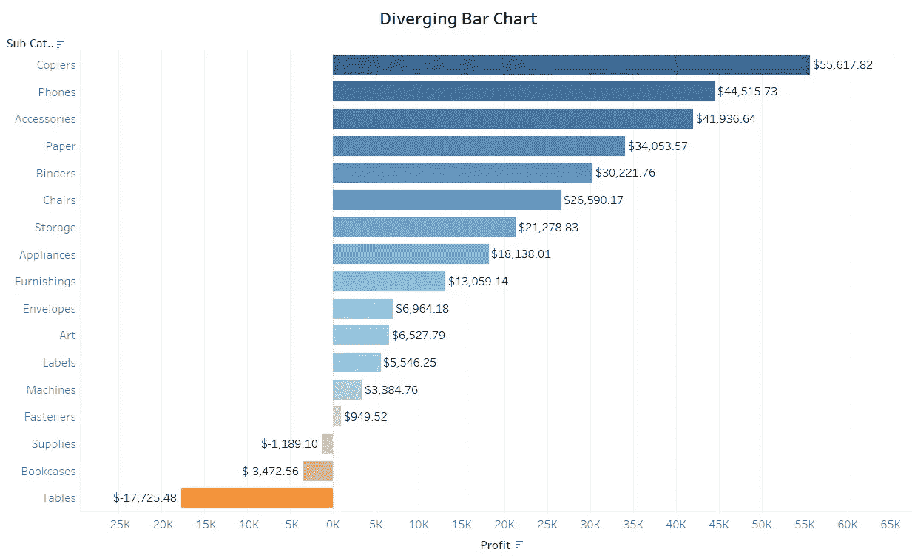
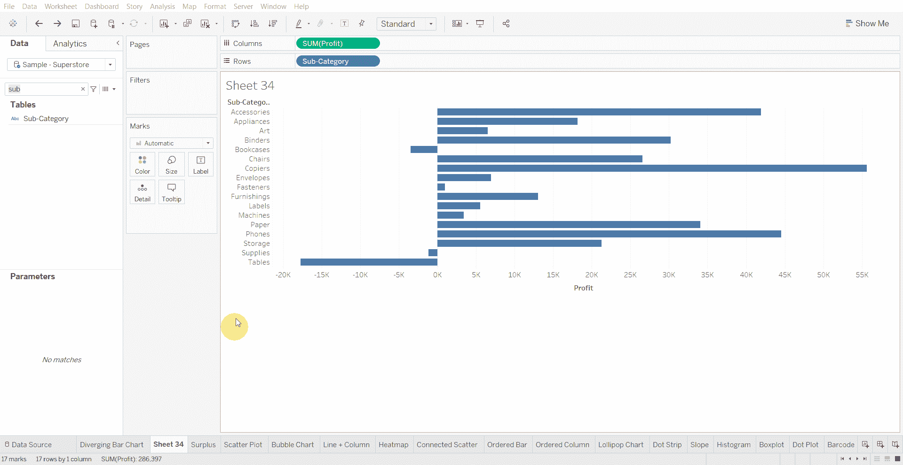
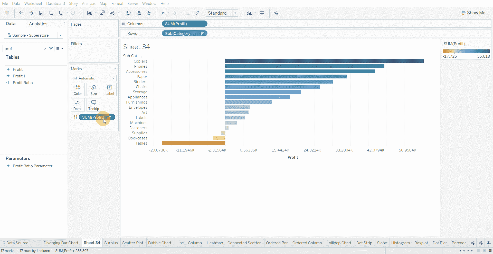

# Tableau 教程——如何创建发散条形图

> 原文：<https://medium.com/mlearning-ai/tableau-tutorial-how-to-create-a-diverging-bar-chart-c1529cae8a2a?source=collection_archive---------3----------------------->

发散条形图是简单的图表，可以处理负值和正值。

下面使用的数据集是在 [Tableau 社区](https://community.tableau.com/s/question/0D54T00000CWeX8SAL/sample-superstore-sales-excelxls)上提供的超级商店数据集。

创建发散条形图的步骤-

*   将数值字段(包括负数)放入列架，将分类变量放入行架

*   按字段排序，并将排序顺序设置为降序

*   将数值字段放入颜色标记中，以显示正值和负值之间的对比

*   将数字字段放入文本标记中，以显示每个条形旁边的数字

[1]:金融时报。(2021 年 3 月 7 日)。*管用的图表:FT 视觉词汇指南*[https://www . FT . com/content/c 7 bb 24 c 9-964d-479 f-ba24-03a 2 B2 df 6 e 85](https://www.ft.com/content/c7bb24c9-964d-479f-ba24-03a2b2df6e85)

 [## Mlearning.ai 提交建议

### 如何成为 Mlearning.ai 上的作家

medium.com](/mlearning-ai/mlearning-ai-submission-suggestions-b51e2b130bfb)