# Tableau 教程—如何创建圆环图

> 原文：<https://medium.com/mlearning-ai/tableau-tutorial-how-to-create-a-donut-chart-18391141748e?source=collection_archive---------6----------------------->

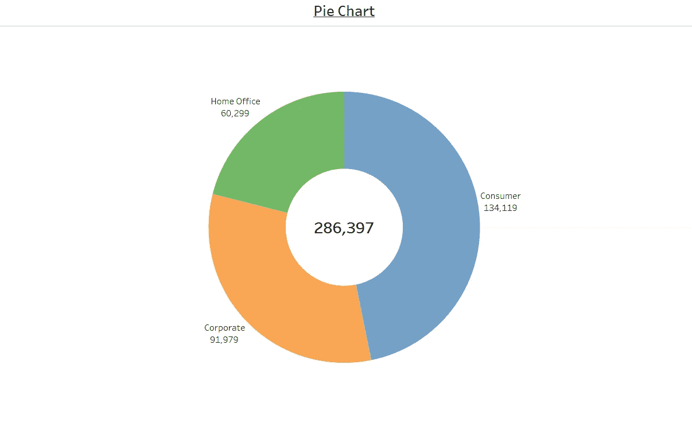

圆环图类似于饼图，但中心可以是一个很好的方式来创造空间，以包括更多的数据信息(如总)。

下面使用的数据集是在 [Tableau 社区](https://community.tableau.com/s/question/0D54T00000CWeX8SAL/sample-superstore-sales-excelxls)上提供的超级商店数据集。

创建圆环图的步骤—

*   选择饼图标记

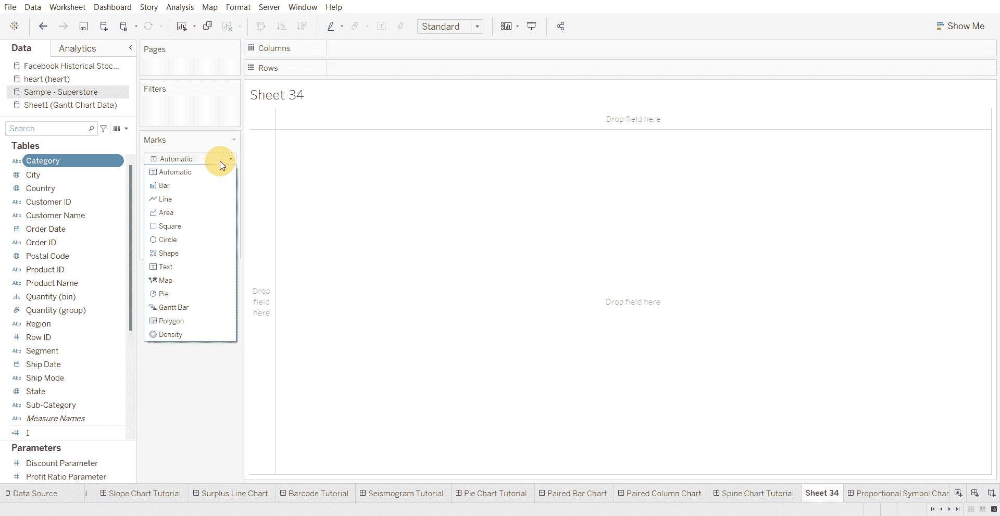

*   将数值移动到角度

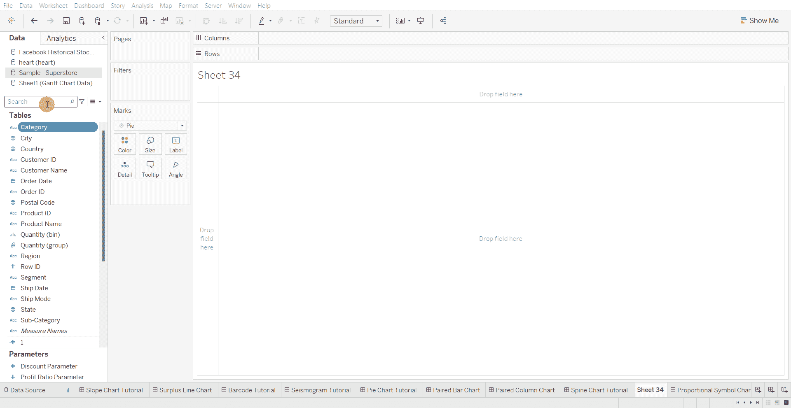

*   将分类变量移动到颜色架

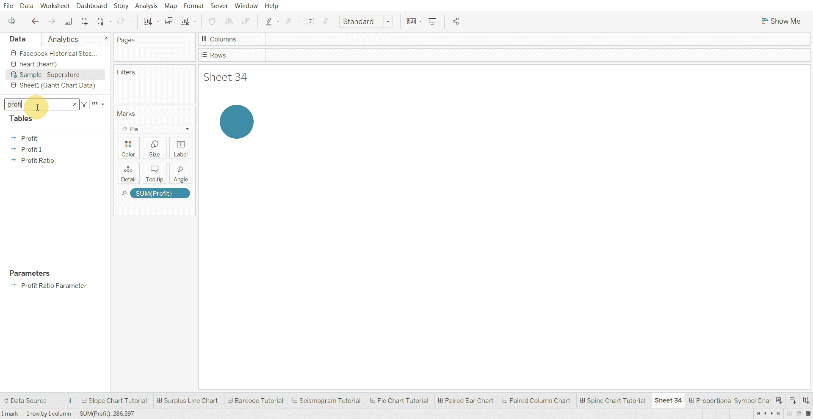

*   创建一个计算字段，并输入数字“1”

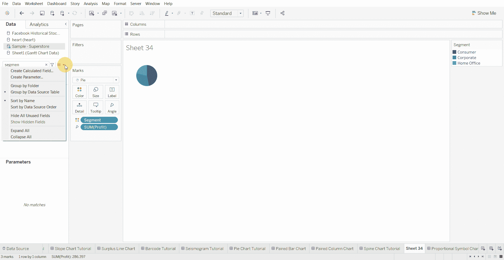

*   将计算字段移动到行架并复制

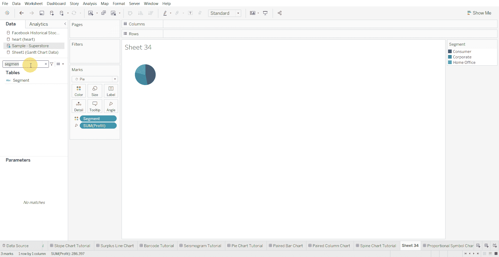

*   将行架度量上的两个计算字段都更改为最小值

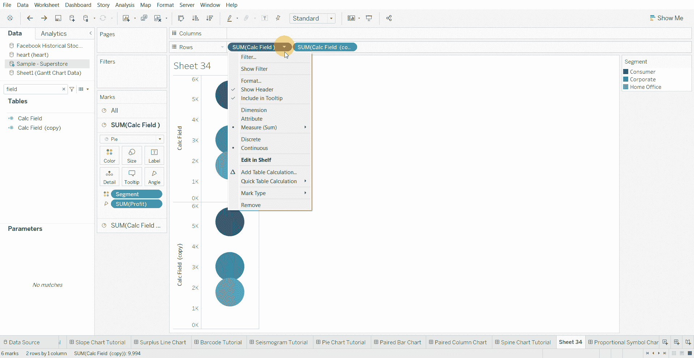

*   使成排货架成为双轴

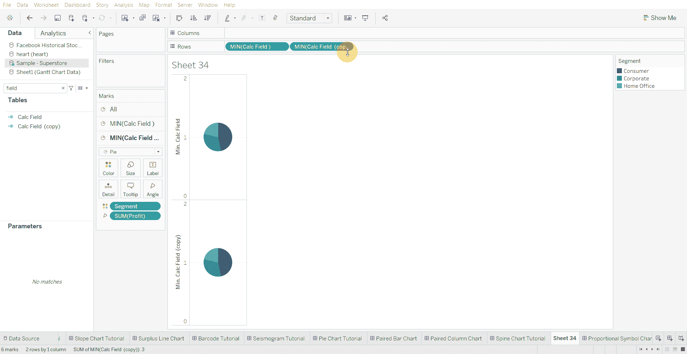

*   隐藏标题

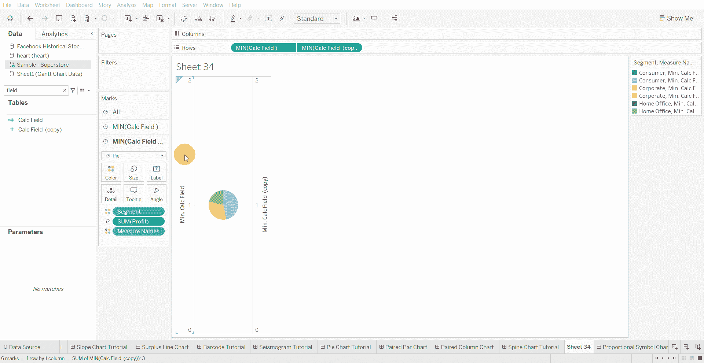

*   从第二个计算字段中删除度量名称和颜色

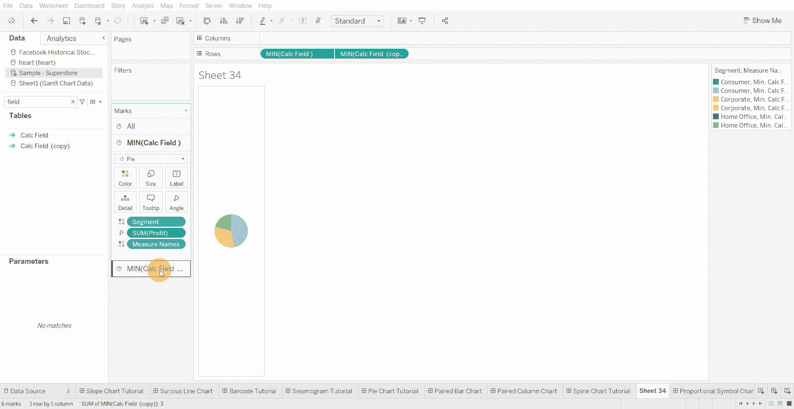

*   将第二个计算字段的背景色更改为白色

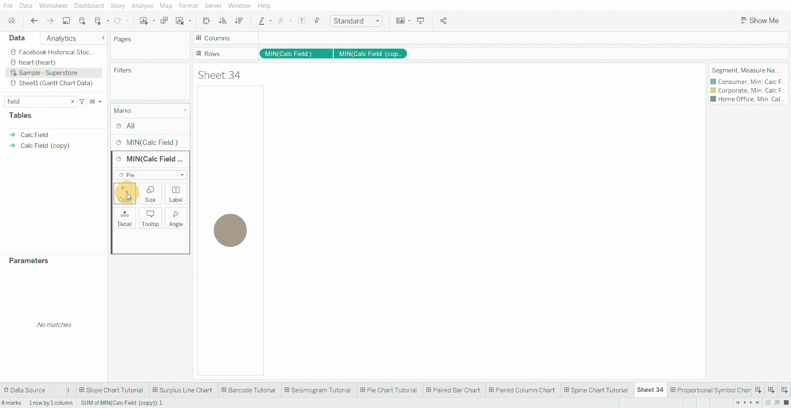

*   增加第一个计算字段的大小，并修改第二个计算字段的大小

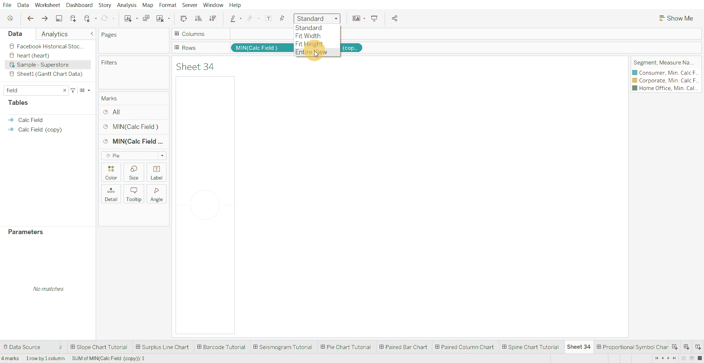

*   将分类变量和数值字段移动到第一个计算字段的标签中

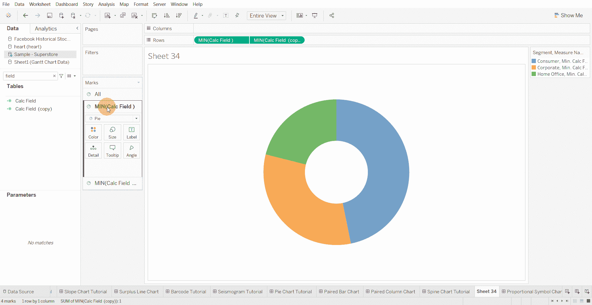

*   将总值移动到第二个计算字段的标签中，并增加文本的大小

*   更新工具提示以删除计算字段信息

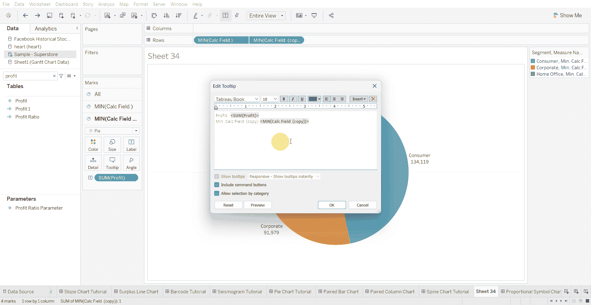

[1]:金融时报。(2021 年 3 月 7 日)。*管用的图表:FT 视觉词汇指南*[https://www . FT . com/content/c 7 bb 24 c 9-964d-479 f-ba24-03a 2 B2 df 6 e 85](https://www.ft.com/content/c7bb24c9-964d-479f-ba24-03a2b2df6e85)

 [## Mlearning.ai 提交建议

### 如何成为 Mlearning.ai 上的作家

medium.com](/mlearning-ai/mlearning-ai-submission-suggestions-b51e2b130bfb)