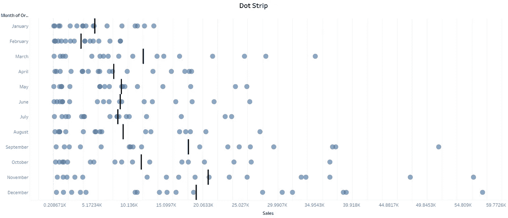
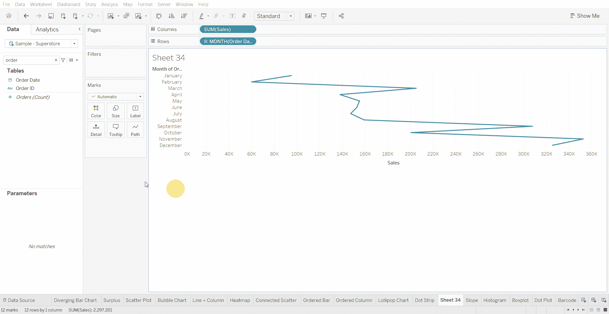
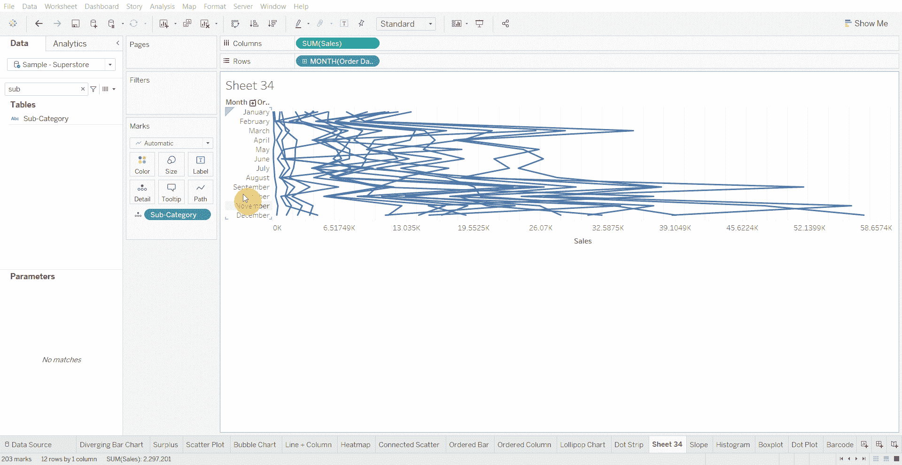
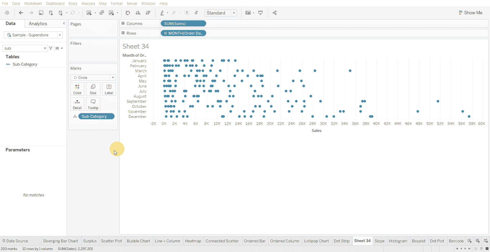
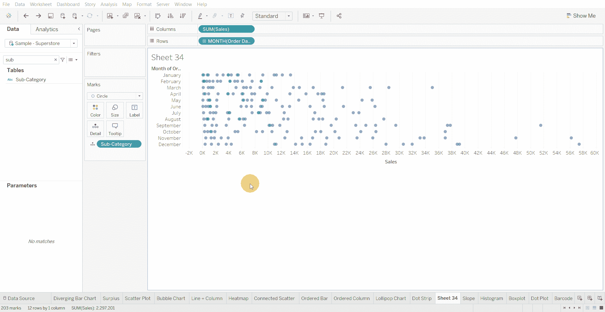

# Tableau 教程-如何创建点带状图

> 原文：<https://medium.com/mlearning-ai/tableau-tutorial-how-to-create-a-dot-strip-plot-53bdf1ad501c?source=collection_archive---------2----------------------->

点带图适用于显示分布中的单个值，但同时，当有太多相同值的点时，该图表可能会出现问题。

下面使用的数据集是在 [Tableau 社区](https://community.tableau.com/s/question/0D54T00000CWeX8SAL/sample-superstore-sales-excelxls)上提供的超级商店数据集。

创建点带图的步骤—

*   将数值变量放在列架上

*   在行架中添加类别或日期字段，并向下钻取到月份

*   为附加数据点向详细资料架添加变量

*   将标记改为圆形，并根据需要增加尺寸

*   降低圆的不透明度

*   从“分析”窗格向图中的单元格级别添加一条平均参考线，并将该线的格式设置为较暗的阴影

[1]:金融时报。(2021 年 3 月 7 日)。*管用的图表:FT 视觉词汇指南*[https://www . FT . com/content/c 7 bb 24 c 9-964d-479 f-ba24-03a 2 B2 df 6 e 85](https://www.ft.com/content/c7bb24c9-964d-479f-ba24-03a2b2df6e85)

 [## Mlearning.ai 提交建议

### 如何成为 Mlearning.ai 上的作家

medium.com](/mlearning-ai/mlearning-ai-submission-suggestions-b51e2b130bfb)