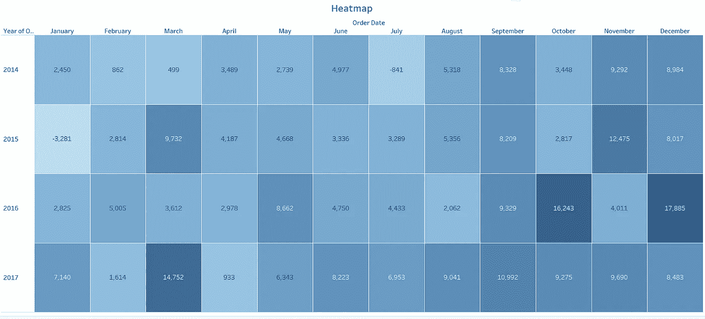
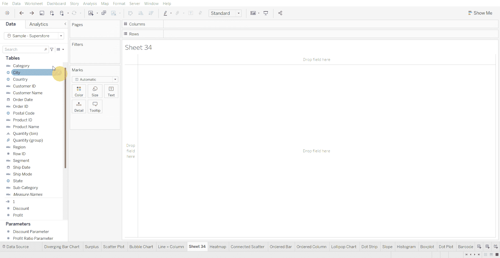
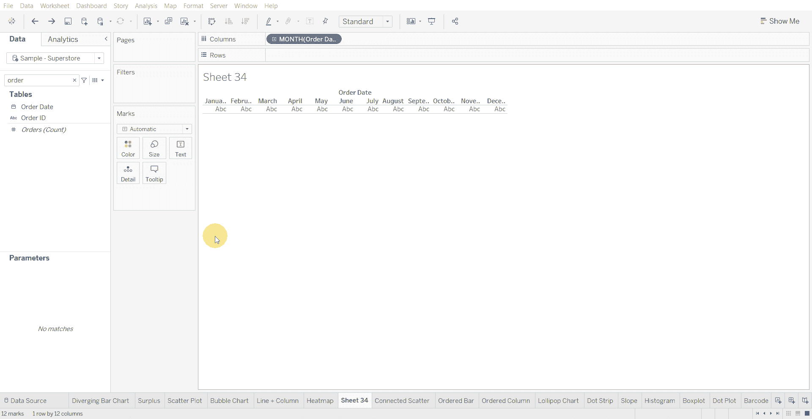
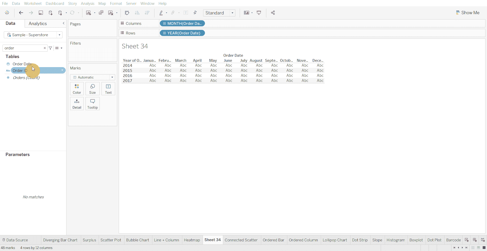
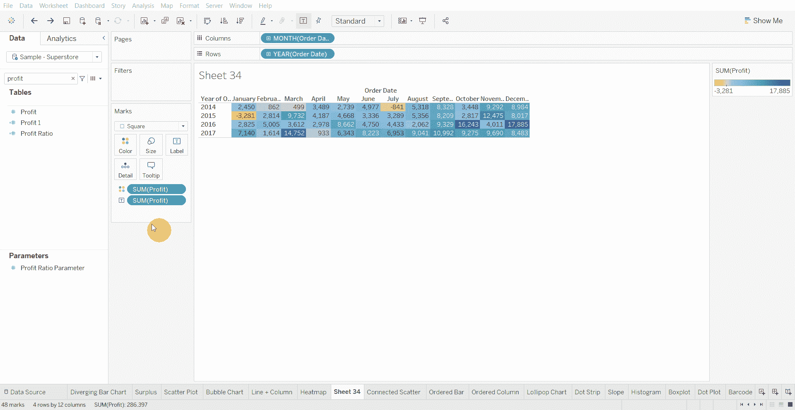

# Tableau 教程—如何创建热图

> 原文：<https://medium.com/mlearning-ai/tableau-tutorial-how-to-create-a-heatmap-2892f3263859?source=collection_archive---------9----------------------->

热图用于显示两个数据变量之间的模式，但它在显示数量的细微差异方面不太有效。

下面使用的数据集是在 [Tableau 社区](https://community.tableau.com/s/question/0D54T00000CWeX8SAL/sample-superstore-sales-excelxls)上提供的超级商店数据集。

创建热图的步骤—

*   将月份拖到列架中

*   将年份拖到行架中

*   将数值拖动到颜色标记和标签标记中

*   将图形标记类型更改为方形

*   选择白色边框作为热图方框周围的线条，并根据您的喜好更改热图的颜色

[1]:金融时报。(2021 年 3 月 7 日)。*管用的图表:FT 视觉词汇指南*[https://www . FT . com/content/c 7 bb 24 c 9-964d-479 f-ba24-03a 2 B2 df 6 e 85](https://www.ft.com/content/c7bb24c9-964d-479f-ba24-03a2b2df6e85)

 [## Mlearning.ai 提交建议

### 如何成为 Mlearning.ai 上的作家

medium.com](/mlearning-ai/mlearning-ai-submission-suggestions-b51e2b130bfb)